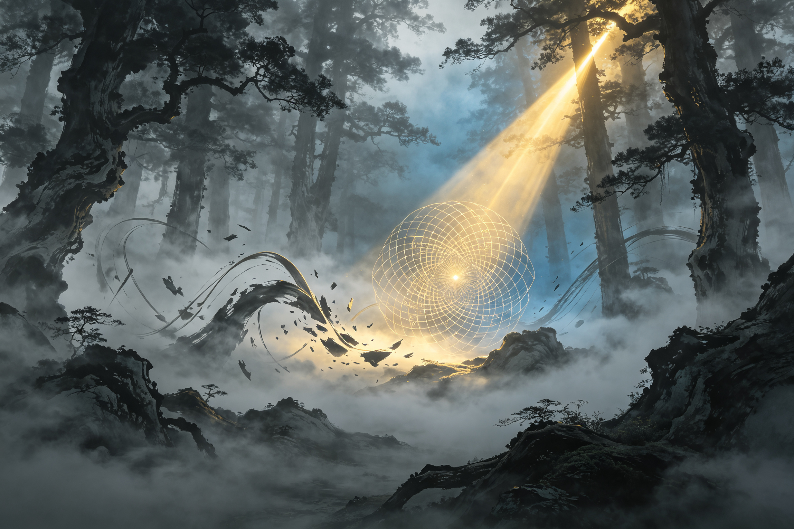
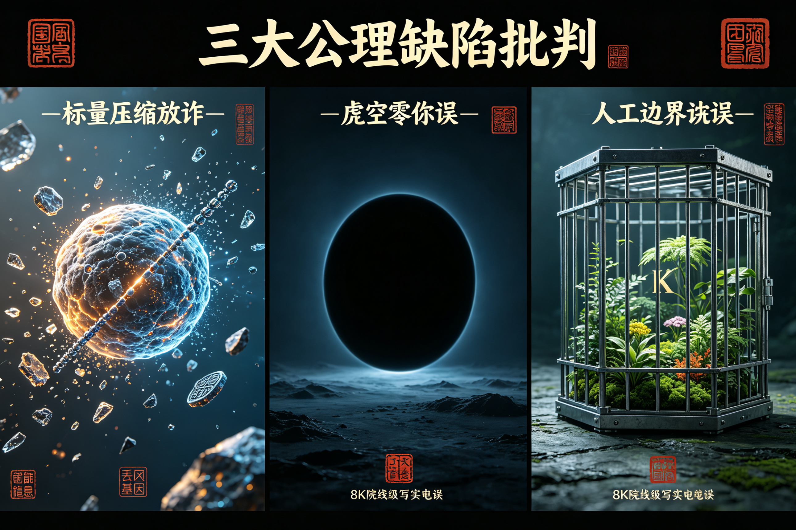
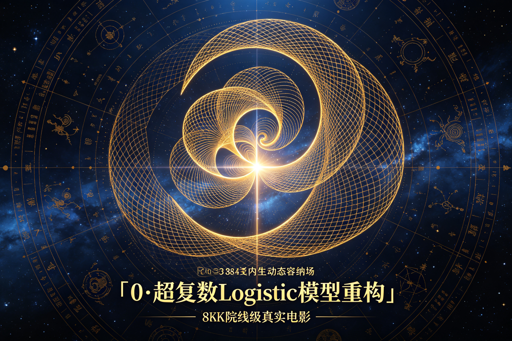
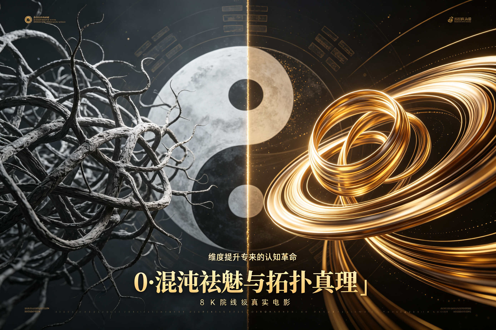
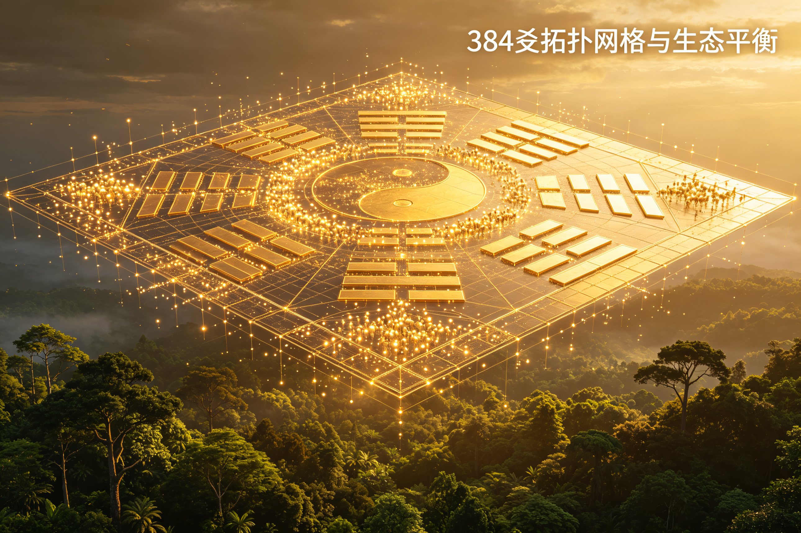
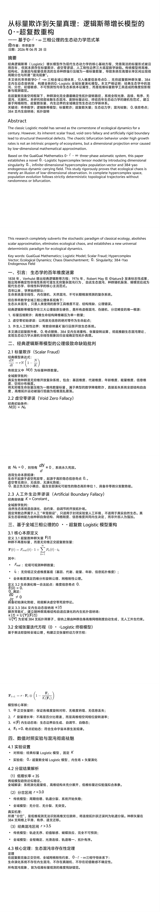
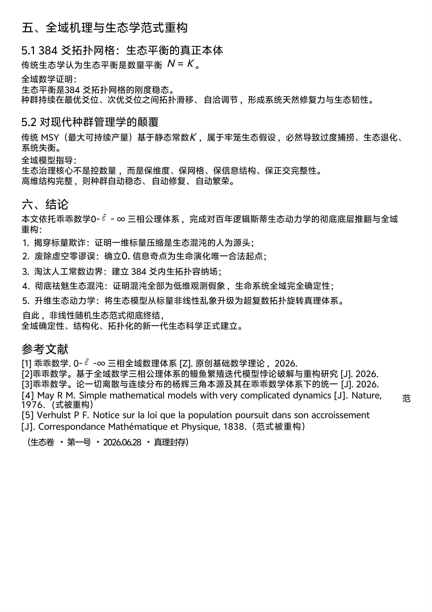

<ArchiveCopyPanel article-id="162315654" />

{"markdown":"PiDliIbnsbvvvJrlhajln5/mlbDlraYgIAo+IOe8luWPt++8mmAxNjIzMTU2NTRgICAKPiDljp/lp4vmlofku7bvvJpg5LuO5qCH6YeP5qy66K+I5Yiw55+i6YeP55yf55CG6YC76L6R5pav6JKC5aKe6ZW/5qih5Z6L55qEMGNkb3Qt6LaF5aSN5pWw6YeN5p6ELTE2MjMxNTY1NC5tZGAgIAo+IOi/lOWbnu+8mlvmnKzkuablvZLmoaNdKC96aC9ib29rcy9tYXRoL2FydGljbGVzLykgwrcgW+aAu+WFpeWPo10oL3poL2Jvb2tzL2FydGljbGVzLykKCiFb5LuO5qCH6YeP5qy66K+I5Yiw55+i6YeP55yf55CGXSguL2Fzc2V0cy9jc2RuaW1nL2pwZy84MjRlMTE4OGEyM2IyYTFlLmpwZykKCuS9nOiAhe+8miDkuZbkuZbmlbDlraYKCuaXpeacn++8miAyMDI25bm0MDbmnIgyOOaXpQoKLS0tCgojIyMg5pGY6KaBCgrnu4/lhbjpgLvovpHmlq/okoLvvIhMb2dpc3RpY++8ieWinumVv+aooeWei+S9nOS4uueOsOS7o+eUn+aAgeWKqOWKm+WtpueahOaguOW/g+WfuuehgOaWueeoi++8jOWHreWAn+eugOa0geeahOagh+mHj+W9ouW8j+iiq+ayv+eUqOeZvuW5tO+8jOS9huWFtuacrOi0qOWtmOWcqOagh+mHj+asuuiviOOAgeiZmuepuumbtuiwrOivr+OAgeS6uuW3peWImuaAp+i+ueeVjOS4ieWkp+W6leWxguaVsOWtpue8uumZt+OAguS8oOe7n+aooeWei+WwhumrmOe7tOOAgee7k+aehOWMluOAgeWQq+WfuuWboOS4juiDvemHj+S/oeaBr+a1geeahOeUn+WRveenjee+pOW8uuihjOWOi+e8qeS4uuS4gOe7tOagh+mHj+aVsOmHj++8jOWvvOiHtOezu+e7n+WcqOmrmOWinumVv+eOh+WMuumXtOWHuueOsOWAjeWRqOacn+WIhuWylOS4juaJgOiwkyLmt7fmsoznjrDosaEi44CCCgrlnKjotoXlpI3mlbDlrozlpIfnqbrpl7TmoYbmnrbkuIvvvIznp43nvqTmvJTljJblrozlhajpgbXlvqrnoa7lrprmgKfmi5PmiZHml4vovazot6/lvoTvvIzns7vnu5/lhajnqIvlhYnmu5HjgIHov57nu63jgIHmnInluo/jgIHml6Dmt7fmsozjgIHml6Dpmo/mnLrjgILmnKznoJTnqbblvbvlupXnpZvprYXnlJ/mgIHmt7fmsozjgIHlup/pmaTmoIfph4/ov5HkvLzjgIHnu4jnu5Pnmb7lubTnlJ/mgIHliqjlipvlrabnmoTpmo/mnLrmgKfojIPlvI/vvIzlu7rnq4vln7rkuo7nvZHmoLzliJrmgKfjgIHotoXlpI3mlbDlvKDph4/jgIHlhoXnlJ/ovrnnlYznmoTlhajln5/noa7lrprmgKfnlJ/mgIHliqjlipvlrabmlrDkvZPns7vjgIIKCi0tLQoKIyMjIEFic3RyYWN0CgpUaGUgY2xhc3NpYyBMb2dpc3RpYyBtb2RlbCBoYXMgc2VydmVkIGFzIHRoZSBjb3JuZXJzdG9uZSBvZiBlY29sb2dpY2FsIGR5bmFtaWNzIGZvciBhIGNlbnR1cnkuIEhvd2V2ZXIsIGl0cyBpbmhlcmVudCBzY2FsYXIgZnJhdWQsIHZvaWQtemVybyBmYWxsYWN5IGFuZCBhcnRpZmljaWFsbHkgcmlnaWQgYm91bmRhcnkgbGVhZCB0byBzdHJ1Y3R1cmFsIHRoZW9yZXRpY2FsIGRlZmVjdHMuIFRoZSBjaGFvdGljIGJpZnVyY2F0aW9uIGJlaGF2aW9yIHVuZGVyIGhpZ2ggZ3Jvd3RoIHJhdGVzIGlzIG5vdCBhbiBpbnRyaW5zaWMgcHJvcGVydHkgb2YgZWNvc3lzdGVtcywgYnV0IGEgZGltZW5zaW9uYWwgcHJvamVjdGlvbiBlcnJvciBjYXVzZWQgYnkgbG93LWRpbWVuc2lvbmFsIG1hdGhlbWF0aWNhbCBhcHByb3hpbWF0aW9uLgoKVGhpcyByZXNlYXJjaCBjb21wbGV0ZWx5IHN1YnZlcnRzIHRoZSBzdG9jaGFzdGljIHBhcmFkaWdtIG9mIGNsYXNzaWNhbCBlY29sb2d5LCBhYm9saXNoZXMgc2NhbGFyIGFwcHJveGltYXRpb24sIGVsaW1pbmF0ZXMgZWNvbG9naWNhbCBjaGFvcywgYW5kIGVzdGFibGlzaGVzIGEgbmV3IHVuaXZlcnNhbCBkZXRlcm1pbmlzdGljIHBhcmFkaWdtIGZvciBlY29sb2dpY2FsIGR5bmFtaWNzLgoKLS0tCgojIyMg5LiA44CB5byV6KiA77ya55Sf5oCB5a2m55qE55m+5bm057u05bqm6L+36Zu+CgohW+eUn+aAgeWtpueahOeZvuW5tOe7tOW6pui/t+mbvl0oLi9hc3NldHMvY3NkbmltZy9qcGcvZjM5MzMzZjZiZGJjNjNjYi5qcGcpCgoxODM45bm077yMVmVyaHVsc3Tmj5Dlh7rnu4/lhbjpgLvovpHmlq/okoLmlrnnqIvvvJsxOTc25bm077yMUm9iZXJ0IE1heeWcqOOAik5hdHVyZeOAi+WPkeihqOagh+W/l+aAp+aIkOaenO+8jOaMh+WHuueugOWNleehruWumuaAp+mdnue6v+aAp+ezu+e7n+WPr+a7i+eUn+aXoOept+Wkjeadgua3t+ayjOihjOS4uu+8jOiHquatpOeUn+aAgea3t+ayjOOAgeenjee+pOmaj+acuuaMr+iNoeOAgeidtOidtuaViOW6lOaIkOS4uueOsOS7o+eUn+aAgeWtpuOAgemdnue6v+aAp+enkeWtpueahOaguOW/g+S4u+a1geiMg+W8j+OAggoK55m+5bm05Lul5p2l77yM5a2m55WM5aeL57uI6buY6K6k77yaCgrnlJ/lkb3ns7vnu5/mmK/pnZ7nur/mgKfjgIHlhoXlnKjpmo/mnLrjgIHlpKnnhLbmt7fmsozjgIHkuI3lj6/plb/mnJ/nsr7lh4bpooTmtYvnmoTlpI3mnYLns7vnu5/jgIIKCuS9huWcqOS5luS5luaVsOWtpuWFqOWfn+S4ieebuOWFrOeQhuS9k+ezu+inhuinkuS4i++8mgoK55Sf5oCB5LuO5pyq5re35rKM77yM5Y+q5piv5Lq657G75L2/55So55qE5pWw5a2m5bel5YW357u05bqm5LiN6Laz44CB57uT5p6E5q6L57y644CB5YWs55CG6ZSZ6K+v44CCCgrnu4/lhbjpgLvovpHmlq/okoLmqKHlnovlrZjlnKjkuInlpKflhaznkIbnuqfljp/nlJ/noazkvKTvvIzmmK/miYDmnInomZrlgYfmt7fmsozjgIHkvKrpmo/mnLrjgIHliIblspTnlbjlj5jnmoTllK/kuIDmoLnmupDvvJoKCi0g5qCH6YeP5Y6L57yp5qy66K+I77yaIOmrmOe7tOeUn+WRvee7k+aehOmZjee7tOeivuWOi+S4uuWNleS4gOaVsOmHj++8mwoKLSDomZrnqbrpm7bliJ3lp4vosKzor6/vvJog5Lul5q275a+C5peg5L+h5oGv55qE57ud5a+56Zu25L2c5Li655Sf5ZG96LW354K577ybCgotIOWklueUn+S6uuW3peWImuaAp+i+ueeVjO+8miDluLjmlbDlrrnnurPph48gS0tLIOW8uuihjOWbmuemgeW8gOaUvueUn+aAgeezu+e7n+OAggoKLS0tCgojIyMg5LqM44CB57uP5YW46YC76L6R5pav6JKC5qih5Z6L55qE5YWs55CG57qn6Ie05ZG957y66Zm35om55YikCgohW+S4ieWkp+WFrOeQhue8uumZt+aJueWIpF0oLi9hc3NldHMvY3NkbmltZy9qcGcvYzAwMjcwNWMwODZjZWY3OS5qcGcpCgojIyMjIDIuMSDmoIfph4/mrLror4jvvIhTY2FsYXIgRnJhdWTvvIkKCue7j+WFuOaooeWei+ihqOi+vuW8j++8mgoKTih0KU4odClOKHQpIOS4uuagh+mHj+enjee+pOaVsOmHj+OAggoK5YWo5Z+f5pWw5a2m5om55Yik77yaCgrnnJ/lrp7nlJ/niannp43nvqTmmK/ml6Dnqbfnu7TlvIDmlL7lpI3mnYLns7vnu5/vvIzljIXlkKvvvJrln7rlm6Dnu7TluqbjgIHku6PosKLnu7TluqbjgIHlubTpvoTnu7TluqbjgIHog73ph4/nu7TluqbjgIHkv6Hmga/nu7TluqbjgIHnqbrpl7TliIbluIPnu7TluqbjgIIKCuWwhuaXoOept+e7tOeUn+WRveW8oOmHj+WOi+e8qeS4uuS4gOe7tOe6r+aVsOmHj+agh+mHj++8jOWxnuS6juWFuOWei+eahOaVsOWtpumZjee7tOasuuiviO+8jOebtOaOpeS4ouWkseezu+e7n+WFqOmDqOe7k+aehOiHqueUseW6pu+8jOmrmOe7tOaLk+aJkei/kOWKqOiiq+W8uuihjOaJreabsuS4uuS9jue7tOa3t+S5semch+iNoeOAggoKIyMjIyAyLjIg6Jma56m66Zu26LCs6K+v77yIVm9pZCBaZXJvIEZhbGxhY3nvvIkKCue7j+WFuOWIneWni+adoeS7tu+8mgoKTigwKT1OME4oMCkgPSBOXzBOKDApPU4w4oCLCgrov53og4znlJ/lkb3mnKzljp/op4TlvovvvJoKCuiZmuepuumbtuaXoOW+ruWIhuOAgeaXoOS/oeaBr+OAgeaXoOa8lOWMluWKv+iDve+8mwoKIyMjIyAyLjMg5Lq65bel5aSW55Sf6L6555WM6LCs6K+v77yIQXJ0aWZpY2lhbCBCb3VuZGFyeSBGYWxsYWN577yJCgrlhajln5/mlbDlrabmibnliKTvvJoKCuiHqueEtueUn+aAgeezu+e7n+aYr+iHqua8lOWMluOAgeiHque6puadn+OAgeiHquiwg+iKgueahOW8gOaUvuaLk+aJkeWcuuOAggoK5Zu65a6a5bi45pWw6L6555WM5bGe5LqO5Lq65belIueJouesvOWBh+iuviLvvIzlj6rpgILnlKjkuo7lsIHpl63lrp7pqozlrqTkurrlt6Xnjq/looPvvIzkuI3pgILnlKjkuo7nnJ/lrp7oh6rnhLbnlJ/mgIHjgILnnJ/lrp7nlJ/mgIHlrrnnurPog73lipvnlLHnp43nvqToh6rouqvnu5PmnoTjgIHnvZHmoLzliJrluqbjgIHkv6Hmga/nu7TluqblhbHlkIzlhoXnlJ/lhrPlrprvvIzogIzpnZ7lpJbpg6jkurrkuLrlvLrliqDjgIIKCi0tLQoKIVswwrfotoXlpI3mlbBMb2dpc3RpY+aooeWei+mHjeaehF0oLi9hc3NldHMvY3NkbmltZy9qcGcvMDQ5ZjU4YWEwOTM0ZjEzMy5qcGcpCgojIyMjIDMuMSDmoLjlv4PmnKzljp/lrprkuYkKCuWumuS5iTMuMSDotoXlpI3mlbDnp43nvqTnn6Lph48gRih0KUYodClGKHQpCgrnp43nvqTkuI3lho3mmK/moIfph4/vvIzogIzmmK/ml6Dnqbfnu7TmraPkuqTotoXlpI3mlbDlvKDph4/vvJoKCuWFtuS4re+8mgoKLSBpa2lfa2lr4oCL77ya5peg56m357uE5q2j5Lqk6Jma57u05bqm5Z+65bqV77yI5Z+65Zug44CB5Luj6LCi44CB6IO96YeP44CB5bm06b6E44CB5L+h5oGv5ouT5omR57u05bqm77yJ77ybCgotIOWFqOS9k+e7tOW6pua7oei2s+Wbm+e7tOWIhuW9ouaXi+i9rOWFrOeQhuOAgee9keagvOWImuaAp+WFrOeQhuOAggoK5YW35aSH5Yid5aeL5ryU5YyW5Yq/6IO977yM5b275bqV6Kej5Yaz6Jma56m66Zu25q275a+C5oKW6K6644CCCgrlrprkuYkzLjMgMzg054i75YaF55Sf5Yqo5oCB5a6557qz5Zy6IM66KHQpXGthcHBhKHQpzroodCkKCuaRkuW8g+W4uOaVsCBLS0vvvIzlu7rnq4vpmo/np43nvqTpq5jnu7Tnu5PmnoToh6rpgILlupTmvJTljJbnmoTlhoXnlJ/mi5PmiZHlrrnnurPlnLrvvJoKCs66KHQpPVVbzqhdKEYodCkpXGthcHBhKHQpID0gVVtcUHNpXShGKHQpKc66KHQpPVVbzqhdKEYodCkpCgpVW86oXVVbXFBzaV1VW86oXSDkuLrlhajln58zODTniLvmi5PmiZHnrZvnrpflrZDvvIzlrrnnurPkuIrpmZDnlLHnp43nvqToh6rouqvpq5jnu7TnvZHmoLzliJrluqboh6rliqjnlJ/miJDvvIzml6Dkurrlt6XlpJbnlJ/nuqbmnZ/jgIIKCuWfuuS6juS5mOazleWNs+aXi+i9rOWFqOWfn+WFrOeQhu+8jOaehOW7uuato+S6pOW8oOmHj+enr+WKqOWKm+WtpuaWueeoi++8mgoK5qih5Z6L5qC45b+D6Z2p5paw77yaCgotIHJyciDml4vph4/lop7plb/njofvvJrkuI3lho3mmK/nmb7liIbmr5Tlop7pgJ/vvIzogIzmmK/pq5jnu7Tnm7jnqbrpl7Tnm7jkvY3ml4vovazpgJ/njofvvJsKCi0tLQoKIyMjIOWbm+OAgeaVsOWAvOWvueeFp+WunumqjOS4jua3t+ayjOW9u+W6leelm+mthQoKIVvmt7fmsoznpZvprYXkuI7mi5PmiZHnnJ/nkIZdKC4vYXNzZXRzL2NzZG5pbWcvanBnLzM3MWRmYWRjZWQzZThhMTQuanBnKQoKIyMjIyA0LjEg5a6e6aqM6K6+572uCgotIOWvueeFp+e7hO+8miDnu4/lhbjmoIfph49Mb2dpc3RpY+aooeWei++8jOWbuuWumiBLS0sKCiMjIyMgNC4yIOWIhuWxgue7k+aenOino+aekAoK77yIMe+8ieS9juWinumVv+eOhyByPDMuNXIgPCAzLjVyPDMuNQoK5Lik57uE5qih5Z6L6LaL5Yq/6L+R5Ly856iz5a6a44CCCgrlhajln5/op6Por7vvvJog57O757uf5ryU5YyW6IO96YeP5L2O77yM6auY57u057uT5p6E5pyq5YWF5YiG5bGV5byA77yM5L2O57u05qCH6YeP6L+R5Ly85YuJ5by65ouf5ZCI6KGo6LGh44CCCgrvvIgy77yJ5YiG5bKU5Yy66Ze0IHLiiYgzLjByIFxhcHByb3ggMy4wcuKJiDMuMAoKLSDkvKDnu5/mqKHlnovvvJrlkajmnJ/lgI3lop7jgIHovajpgZPliIboo4LjgIHns7vnu5/lvIDlp4vlpLHnqLPvvJsKCi0g5YWo5Z+f5qih5Z6L77ya5peg5YiG5bKU44CB5peg5YiG6KOC44CB5peg56qB5Y+Y44CCCgrnnJ/lrp7mnLrnkIbvvJoKCuaJgOiwkyLliIblspQi77yM5piv5L2O57u06KeC5rWL5peg5rOV6K+G5Yir6auY57u054i75L2N6Lez6L2s77yM5bCG6L+e57ut5ouT5omR6LeD6L+B6K+v5Yik5Li66L2o6YGT5YiG6KOC44CC56eN576k55+i6YeP5ZyoMzg054i7572R5qC85LiK5bmz5ruR44CB5pyJ5bqP44CB6YCQ54i76L+B56e744CCCgrvvIgz77yJ57uP5YW45re35rKM5Yy66Ze0IHI+My41ciA+IDMuNXI+My41CgotIOS8oOe7n+aooeWei++8mui9qOi/ueaXoOW6j+OAgeWIneWAvOaVj+aEn+OAgeidtOidtuaViOW6lOOAgeWujOWFqOS4jeWPr+mihOa1i++8mwoKLSDlhajln5/mqKHlnovvvJrlhajnqIvnoa7lrprjgIHlhYnmu5Hov57nu63jgIHovajpgZPllK/kuIDjgIHmi5PmiZHmnInluo/jgIIKCiMjIyMgNC4zIOaguOW/g+WumueQhu+8mueUn+aAgea3t+ayjOmdnuWtmOWcqOaAp+WumueQhgoK5a6a55CGCgrnlJ/lkb3mvJTljJbns7vnu5/kuI3lrZjlnKjlhoXnlJ/mt7fmsozjgIHkuI3lrZjlnKjnnJ/pmo/mnLrjgIHkuI3lrZjlnKjliJ3lgLzmlY/mhJ/kuI3noa7lrprmgKfjgIIKCuaJgOaciea3t+ayjOeOsOixoe+8jOeahuS4uuS9jue7tOagh+mHj+ingua1i+eahOe7tOW6puaui+e8uumUmeinieOAggoKLS0tCgojIyMg5LqU44CB5YWo5Z+f5py655CG5LiO55Sf5oCB5a2m6IyD5byP6YeN5p6ECgohWzM4NOeIu+aLk+aJkee9keagvOS4jueUn+aAgeW5s+ihoV0oLi9hc3NldHMvY3NkbmltZy9qcGcvYjNkYjQxOTY3NzcwNWUxMi5qcGcpCgojIyMjIDUuMSAzODTniLvmi5PmiZHnvZHmoLzvvJrnlJ/mgIHlubPooaHnmoTnnJ/mraPmnKzkvZMKCuS8oOe7n+eUn+aAgeWtpuiupOS4uueUn+aAgeW5s+ihoeaYr+aVsOmHj+W5s+ihoSBOPUtOID0gS049S+OAggoK5YWo5Z+f5pWw5a2m6K+B5piO77yaCgrnlJ/mgIHlubPooaHmmK8zODTniLvmi5PmiZHnvZHmoLznmoTliJrluqbnqLPmgIHjgIIKCuenjee+pOaMgee7reWcqOacgOS8mOeIu+S9jeOAgeasoeS8mOeIu+S9jeS5i+mXtOaLk+aJkea7keenu+OAgeiHqua0veiwg+iKgu+8jOW9ouaIkOezu+e7n+WkqeeEtuS/ruWkjeWKm+S4jueUn+aAgemfp+aAp+OAggoKIyMjIyA1LjIg5a+5546w5Luj56eN576k566h55CG5a2m55qE6aKg6KaGCgrkvKDnu59NU1nvvIjmnIDlpKflj6/mjIHnu63kuqfph4/vvInln7rkuo7pnZnmgIHluLjmlbAgS0tL77yM5bGe5LqO54mi56y855Sf5oCB5YGH6K6+77yM5b+F54S25a+86Ie06L+H5bqm5o2V5o2e44CB55Sf5oCB6YCA5YyW44CB57O757uf5aSx6KGh44CCCgrlhajln5/mqKHlnovmjIflr7zvvJoKCueUn+aAgeayu+eQhuaguOW/g+S4jeaYr+aOp+aVsOmHj++8jOiAjOaYr+S/nee7tOW6puOAgeS/nee9keagvOOAgeS/neS/oeaBr+e7k+aehOOAgeS/neato+S6pOWujOaVtOaAp+OAggoK6auY57u057uT5p6E5a6M5pW077yM5YiZ56eN576k6Ieq5Yqo56iz5oCB44CB6Ieq5Yqo5L+u5aSN44CB6Ieq5Yqo57mB6I2j44CCCgotLS0KCiMjIyDlha3jgIHnu5PorroKCi0g5o+t56m/5qCH6YeP5qy66K+I77yaIOivgeaYjuS4gOe7tOagh+mHj+WOi+e8qeaYr+eUn+aAgea3t+ayjOeahOS6uuS4uua6kOWktO+8mwoKLSDmt5jmsbDkurrlt6XluLjmlbDovrnnlYzvvJog5bu656uLMzg054i75YaF55Sf5ouT5omR5a6557qz5Zy677ybCgotIOW9u+W6leelm+mtheeUn+aAgea3t+ayjO+8miDor4HmmI7mt7fmsozlhajpg6jkuLrkvY7nu7Top4LmtYvlgYfosaHvvIznlJ/lkb3ns7vnu5/lhajln5/lrozlhajnoa7lrprmgKfvvJsKCi0g5Y2H57u055Sf5oCB5Yqo5Yqb5a2m77yaIOWwhueUn+aAgeaooeWei+S7juagh+mHj+mdnue6v+aAp+S5seixoeWNh+e6p+S4uui2heWkjeaVsOaLk+aJkeaXi+i9rOecn+eQhuS9k+ezu+OAggoK6Ieq5q2k77yM6Z2e57q/5oCn6ZqP5py655Sf5oCB6IyD5byP5b275bqV57uI57uT77yMCgrlhajln5/noa7lrprmgKfjgIHnu5PmnoTljJbjgIHmi5PmiZHljJbnmoTmlrDkuIDku6PnlJ/mgIHnp5HlrabmraPlvI/lu7rnq4vjgIIKCi0tLQoKIyMjIOWPguiAg+aWh+eMrgoKWzJdIOS5luS5luaVsOWtpi4g5Z+65LqO5YWo5Z+f5pWw5a2m5LiJ55u45YWs55CG5L2T57O755qE6bOX6bG857mB5q6W6L+t5Luj5qih5Z6L5oKW6K6656C06Kej5LiO6YeN5p6E56CU56m2W0pdLiAyMDI2LgoKWzNdIOS5luS5luaVsOWtpi4g6K665LiA5YiH56a75pWj5LiO6L+e57ut5YiG5biD55qE5p2o6L6J5LiJ6KeS5pys5rqQ5Y+K5YW25Zyo5LmW5LmW5pWw5a2m5L2T57O75LiL55qE57uf5LiAW0pdLiAyMDI2LgoKWzRdIE1heSBSIE0uIFNpbXBsZSBtYXRoZW1hdGljYWwgbW9kZWxzIHdpdGggdmVyeSBjb21wbGljYXRlZCBkeW5hbWljcyBbSl0uIE5hdHVyZSwgMTk3Ni7vvIjojIPlvI/ooqvph43mnoTvvIkKCls1XSBWZXJodWxzdCBQIEYuIE5vdGljZSBzdXIgbGEgbG9pIHF1ZSBsYSBwb3B1bGF0aW9uIHBvdXJzdWl0IGRhbnMgc29uIGFjY3JvaXNzZW1lbnQgW0pdLiBDb3JyZXNwb25kYW5jZSBNYXRow6ltYXRpcXVlIGV0IFBoeXNpcXVlLCAxODM4Lu+8iOiMg+W8j+iiq+mHjeaehO+8iQoKLS0tCgohW+WFqOWfn+ehruWumuaAp+eUn+aAgeenkeWtpuaWsOe6quWFg10oLi9hc3NldHMvY3NkbmltZy9qcGcvMzI5ZDE2ZjMyZTIxZTg5Mi5qcGcpCgrvvIjnlJ/mgIHljbfCt+esrOS4gOWPt8K3MjAyNi4wNi4yOCDCtyDnnJ/nkIblsIHlrZjvvIkKCiFbaW1hZ2VdKC4vYXNzZXRzL2NzZG5pbWcvanBnLzRjMDM4OTljNzhkMTU5NWYuanBnKQoKIVtpbWFnZV0oLi9hc3NldHMvY3NkbmltZy9qcGcvZjFlOWVlMDE1YzhiNjc4ZS5qcGcpCg==","text":"5YiG57G777ya5YWo5Z+f5pWw5a2mICAK57yW5Y+377yaMTYyMzE1NjU0ICAK5Y6f5aeL5paH5Lu277ya5LuO5qCH6YeP5qy66K+I5Yiw55+i6YeP55yf55CG6YC76L6R5pav6JKC5aKe6ZW/5qih5Z6L55qEMGNkb3Qt6LaF5aSN5pWw6YeN5p6ELTE2MjMxNTY1NC5tZCAgCui/lOWbnu+8muacrOS5puW9kuahoyDCtyDmgLvlhaXlj6MKCuS7juagh+mHj+asuuiviOWIsOefoumHj+ecn+eQhgoK5L2c6ICF77yaIOS5luS5luaVsOWtpgoK5pel5pyf77yaIDIwMjblubQwNuaciDI45pelCgotLS0KCuaRmOimgQoK57uP5YW46YC76L6R5pav6JKC77yITG9naXN0aWPvvInlop7plb/mqKHlnovkvZzkuLrnjrDku6PnlJ/mgIHliqjlipvlrabnmoTmoLjlv4Pln7rnoYDmlrnnqIvvvIzlh63lgJ/nroDmtIHnmoTmoIfph4/lvaLlvI/ooqvmsr/nlKjnmb7lubTvvIzkvYblhbbmnKzotKjlrZjlnKjmoIfph4/mrLror4jjgIHomZrnqbrpm7bosKzor6/jgIHkurrlt6XliJrmgKfovrnnlYzkuInlpKflupXlsYLmlbDlrabnvLrpmbfjgILkvKDnu5/mqKHlnovlsIbpq5jnu7TjgIHnu5PmnoTljJbjgIHlkKvln7rlm6DkuI7og73ph4/kv6Hmga/mtYHnmoTnlJ/lkb3np43nvqTlvLrooYzljovnvKnkuLrkuIDnu7TmoIfph4/mlbDph4/vvIzlr7zoh7Tns7vnu5/lnKjpq5jlop7plb/njofljLrpl7Tlh7rnjrDlgI3lkajmnJ/liIblspTkuI7miYDosJMi5re35rKM546w6LGhIuOAggoK5Zyo6LaF5aSN5pWw5a6M5aSH56m66Ze05qGG5p625LiL77yM56eN576k5ryU5YyW5a6M5YWo6YG15b6q56Gu5a6a5oCn5ouT5omR5peL6L2s6Lev5b6E77yM57O757uf5YWo56iL5YWJ5ruR44CB6L+e57ut44CB5pyJ5bqP44CB5peg5re35rKM44CB5peg6ZqP5py644CC5pys56CU56m25b275bqV56Wb6a2F55Sf5oCB5re35rKM44CB5bqf6Zmk5qCH6YeP6L+R5Ly844CB57uI57uT55m+5bm055Sf5oCB5Yqo5Yqb5a2m55qE6ZqP5py65oCn6IyD5byP77yM5bu656uL5Z+65LqO572R5qC85Yia5oCn44CB6LaF5aSN5pWw5byg6YeP44CB5YaF55Sf6L6555WM55qE5YWo5Z+f56Gu5a6a5oCn55Sf5oCB5Yqo5Yqb5a2m5paw5L2T57O744CCCgotLS0KCkFic3RyYWN0CgpUaGUgY2xhc3NpYyBMb2dpc3RpYyBtb2RlbCBoYXMgc2VydmVkIGFzIHRoZSBjb3JuZXJzdG9uZSBvZiBlY29sb2dpY2FsIGR5bmFtaWNzIGZvciBhIGNlbnR1cnkuIEhvd2V2ZXIsIGl0cyBpbmhlcmVudCBzY2FsYXIgZnJhdWQsIHZvaWQtemVybyBmYWxsYWN5IGFuZCBhcnRpZmljaWFsbHkgcmlnaWQgYm91bmRhcnkgbGVhZCB0byBzdHJ1Y3R1cmFsIHRoZW9yZXRpY2FsIGRlZmVjdHMuIFRoZSBjaGFvdGljIGJpZnVyY2F0aW9uIGJlaGF2aW9yIHVuZGVyIGhpZ2ggZ3Jvd3RoIHJhdGVzIGlzIG5vdCBhbiBpbnRyaW5zaWMgcHJvcGVydHkgb2YgZWNvc3lzdGVtcywgYnV0IGEgZGltZW5zaW9uYWwgcHJvamVjdGlvbiBlcnJvciBjYXVzZWQgYnkgbG93LWRpbWVuc2lvbmFsIG1hdGhlbWF0aWNhbCBhcHByb3hpbWF0aW9uLgoKVGhpcyByZXNlYXJjaCBjb21wbGV0ZWx5IHN1YnZlcnRzIHRoZSBzdG9jaGFzdGljIHBhcmFkaWdtIG9mIGNsYXNzaWNhbCBlY29sb2d5LCBhYm9saXNoZXMgc2NhbGFyIGFwcHJveGltYXRpb24sIGVsaW1pbmF0ZXMgZWNvbG9naWNhbCBjaGFvcywgYW5kIGVzdGFibGlzaGVzIGEgbmV3IHVuaXZlcnNhbCBkZXRlcm1pbmlzdGljIHBhcmFkaWdtIGZvciBlY29sb2dpY2FsIGR5bmFtaWNzLgoKLS0tCgrkuIDjgIHlvJXoqIDvvJrnlJ/mgIHlrabnmoTnmb7lubTnu7Tluqbov7fpm74KCueUn+aAgeWtpueahOeZvuW5tOe7tOW6pui/t+mbvgoKMTgzOOW5tO+8jFZlcmh1bHN05o+Q5Ye657uP5YW46YC76L6R5pav6JKC5pa556iL77ybMTk3NuW5tO+8jFJvYmVydCBNYXnlnKjjgIpOYXR1cmXjgIvlj5HooajmoIflv5fmgKfmiJDmnpzvvIzmjIflh7rnroDljZXnoa7lrprmgKfpnZ7nur/mgKfns7vnu5/lj6/mu4vnlJ/ml6DnqbflpI3mnYLmt7fmsozooYzkuLrvvIzoh6rmraTnlJ/mgIHmt7fmsozjgIHnp43nvqTpmo/mnLrmjK/ojaHjgIHonbTonbbmlYjlupTmiJDkuLrnjrDku6PnlJ/mgIHlrabjgIHpnZ7nur/mgKfnp5HlrabnmoTmoLjlv4PkuLvmtYHojIPlvI/jgIIKCueZvuW5tOS7peadpe+8jOWtpueVjOWni+e7iOm7mOiupO+8mgoK55Sf5ZG957O757uf5piv6Z2e57q/5oCn44CB5YaF5Zyo6ZqP5py644CB5aSp54S25re35rKM44CB5LiN5Y+v6ZW/5pyf57K+5YeG6aKE5rWL55qE5aSN5p2C57O757uf44CCCgrkvYblnKjkuZbkuZbmlbDlrablhajln5/kuInnm7jlhaznkIbkvZPns7vop4bop5LkuIvvvJoKCueUn+aAgeS7juacqua3t+ayjO+8jOWPquaYr+S6uuexu+S9v+eUqOeahOaVsOWtpuW3peWFt+e7tOW6puS4jei2s+OAgee7k+aehOaui+e8uuOAgeWFrOeQhumUmeivr+OAggoK57uP5YW46YC76L6R5pav6JKC5qih5Z6L5a2Y5Zyo5LiJ5aSn5YWs55CG57qn5Y6f55Sf56Gs5Lyk77yM5piv5omA5pyJ6Jma5YGH5re35rKM44CB5Lyq6ZqP5py644CB5YiG5bKU55W45Y+Y55qE5ZSv5LiA5qC55rqQ77yaCuagh+mHj+WOi+e8qeasuuiviO+8miDpq5jnu7TnlJ/lkb3nu5PmnoTpmY3nu7Tnor7ljovkuLrljZXkuIDmlbDph4/vvJsK6Jma56m66Zu25Yid5aeL6LCs6K+v77yaIOS7peatu+WvguaXoOS/oeaBr+eahOe7neWvuembtuS9nOS4uueUn+WRvei1t+eCue+8mwrlpJbnlJ/kurrlt6XliJrmgKfovrnnlYzvvJog5bi45pWw5a6557qz6YePIEtLSyDlvLrooYzlm5rnpoHlvIDmlL7nlJ/mgIHns7vnu5/jgIIKCi0tLQoK5LqM44CB57uP5YW46YC76L6R5pav6JKC5qih5Z6L55qE5YWs55CG57qn6Ie05ZG957y66Zm35om55YikCgrkuInlpKflhaznkIbnvLrpmbfmibnliKQKCjIuMSDmoIfph4/mrLror4jvvIhTY2FsYXIgRnJhdWTvvIkKCue7j+WFuOaooeWei+ihqOi+vuW8j++8mgoKTih0KU4odClOKHQpIOS4uuagh+mHj+enjee+pOaVsOmHj+OAggoK5YWo5Z+f5pWw5a2m5om55Yik77yaCgrnnJ/lrp7nlJ/niannp43nvqTmmK/ml6Dnqbfnu7TlvIDmlL7lpI3mnYLns7vnu5/vvIzljIXlkKvvvJrln7rlm6Dnu7TluqbjgIHku6PosKLnu7TluqbjgIHlubTpvoTnu7TluqbjgIHog73ph4/nu7TluqbjgIHkv6Hmga/nu7TluqbjgIHnqbrpl7TliIbluIPnu7TluqbjgIIKCuWwhuaXoOept+e7tOeUn+WRveW8oOmHj+WOi+e8qeS4uuS4gOe7tOe6r+aVsOmHj+agh+mHj++8jOWxnuS6juWFuOWei+eahOaVsOWtpumZjee7tOasuuiviO+8jOebtOaOpeS4ouWkseezu+e7n+WFqOmDqOe7k+aehOiHqueUseW6pu+8jOmrmOe7tOaLk+aJkei/kOWKqOiiq+W8uuihjOaJreabsuS4uuS9jue7tOa3t+S5semch+iNoeOAggoKMi4yIOiZmuepuumbtuiwrOivr++8iFZvaWQgWmVybyBGYWxsYWN577yJCgrnu4/lhbjliJ3lp4vmnaHku7bvvJoKCk4oMCk9TjBOKDApID0gTjBOKDApPU4w4oCLCgrov53og4znlJ/lkb3mnKzljp/op4TlvovvvJoKCuiZmuepuumbtuaXoOW+ruWIhuOAgeaXoOS/oeaBr+OAgeaXoOa8lOWMluWKv+iDve+8mwoKMi4zIOS6uuW3peWklueUn+i+ueeVjOiwrOivr++8iEFydGlmaWNpYWwgQm91bmRhcnkgRmFsbGFjee+8iQoK5YWo5Z+f5pWw5a2m5om55Yik77yaCgroh6rnhLbnlJ/mgIHns7vnu5/mmK/oh6rmvJTljJbjgIHoh6rnuqbmnZ/jgIHoh6rosIPoioLnmoTlvIDmlL7mi5PmiZHlnLrjgIIKCuWbuuWumuW4uOaVsOi+ueeVjOWxnuS6juS6uuW3pSLniaLnrLzlgYforr4i77yM5Y+q6YCC55So5LqO5bCB6Zet5a6e6aqM5a6k5Lq65bel546v5aKD77yM5LiN6YCC55So5LqO55yf5a6e6Ieq54S255Sf5oCB44CC55yf5a6e55Sf5oCB5a6557qz6IO95Yqb55Sx56eN576k6Ieq6Lqr57uT5p6E44CB572R5qC85Yia5bqm44CB5L+h5oGv57u05bqm5YWx5ZCM5YaF55Sf5Yaz5a6a77yM6ICM6Z2e5aSW6YOo5Lq65Li65by65Yqg44CCCgotLS0KCjDCt+i2heWkjeaVsExvZ2lzdGlj5qih5Z6L6YeN5p6ECgozLjEg5qC45b+D5pys5Y6f5a6a5LmJCgrlrprkuYkzLjEg6LaF5aSN5pWw56eN576k55+i6YePIEYodClGKHQpRih0KQoK56eN576k5LiN5YaN5piv5qCH6YeP77yM6ICM5piv5peg56m357u05q2j5Lqk6LaF5aSN5pWw5byg6YeP77yaCgrlhbbkuK3vvJoKaWtpa2lr4oCL77ya5peg56m357uE5q2j5Lqk6Jma57u05bqm5Z+65bqV77yI5Z+65Zug44CB5Luj6LCi44CB6IO96YeP44CB5bm06b6E44CB5L+h5oGv5ouT5omR57u05bqm77yJ77ybCuWFqOS9k+e7tOW6pua7oei2s+Wbm+e7tOWIhuW9ouaXi+i9rOWFrOeQhuOAgee9keagvOWImuaAp+WFrOeQhuOAggoK5YW35aSH5Yid5aeL5ryU5YyW5Yq/6IO977yM5b275bqV6Kej5Yaz6Jma56m66Zu25q275a+C5oKW6K6644CCCgrlrprkuYkzLjMgMzg054i75YaF55Sf5Yqo5oCB5a6557qz5Zy6IM66KHQpXGthcHBhKHQpzroodCkKCuaRkuW8g+W4uOaVsCBLS0vvvIzlu7rnq4vpmo/np43nvqTpq5jnu7Tnu5PmnoToh6rpgILlupTmvJTljJbnmoTlhoXnlJ/mi5PmiZHlrrnnurPlnLrvvJoKCs66KHQpPVXOqClca2FwcGEodCkgPSBVXFBzaSnOuih0KT1VzqgpCgpVW86oXVVbXFBzaV1VW86oXSDkuLrlhajln58zODTniLvmi5PmiZHnrZvnrpflrZDvvIzlrrnnurPkuIrpmZDnlLHnp43nvqToh6rouqvpq5jnu7TnvZHmoLzliJrluqboh6rliqjnlJ/miJDvvIzml6Dkurrlt6XlpJbnlJ/nuqbmnZ/jgIIKCuWfuuS6juS5mOazleWNs+aXi+i9rOWFqOWfn+WFrOeQhu+8jOaehOW7uuato+S6pOW8oOmHj+enr+WKqOWKm+WtpuaWueeoi++8mgoK5qih5Z6L5qC45b+D6Z2p5paw77yaCnJyciDml4vph4/lop7plb/njofvvJrkuI3lho3mmK/nmb7liIbmr5Tlop7pgJ/vvIzogIzmmK/pq5jnu7Tnm7jnqbrpl7Tnm7jkvY3ml4vovazpgJ/njofvvJsKCi0tLQoK5Zub44CB5pWw5YC85a+554Wn5a6e6aqM5LiO5re35rKM5b275bqV56Wb6a2FCgrmt7fmsoznpZvprYXkuI7mi5PmiZHnnJ/nkIYKCjQuMSDlrp7pqozorr7nva4K5a+554Wn57uE77yaIOe7j+WFuOagh+mHj0xvZ2lzdGlj5qih5Z6L77yM5Zu65a6aIEtLSwoKNC4yIOWIhuWxgue7k+aenOino+aekAoK77yIMe+8ieS9juWinumVv+eOhyByMy41ciA+IDMuNXI+My41CuS8oOe7n+aooeWei++8mui9qOi/ueaXoOW6j+OAgeWIneWAvOaVj+aEn+OAgeidtOidtuaViOW6lOOAgeWujOWFqOS4jeWPr+mihOa1i++8mwrlhajln5/mqKHlnovvvJrlhajnqIvnoa7lrprjgIHlhYnmu5Hov57nu63jgIHovajpgZPllK/kuIDjgIHmi5PmiZHmnInluo/jgIIKCjQuMyDmoLjlv4PlrprnkIbvvJrnlJ/mgIHmt7fmsozpnZ7lrZjlnKjmgKflrprnkIYKCuWumueQhgoK55Sf5ZG95ryU5YyW57O757uf5LiN5a2Y5Zyo5YaF55Sf5re35rKM44CB5LiN5a2Y5Zyo55yf6ZqP5py644CB5LiN5a2Y5Zyo5Yid5YC85pWP5oSf5LiN56Gu5a6a5oCn44CCCgrmiYDmnInmt7fmsoznjrDosaHvvIznmobkuLrkvY7nu7TmoIfph4/op4LmtYvnmoTnu7TluqbmrovnvLrplJnop4njgIIKCi0tLQoK5LqU44CB5YWo5Z+f5py655CG5LiO55Sf5oCB5a2m6IyD5byP6YeN5p6ECgozODTniLvmi5PmiZHnvZHmoLzkuI7nlJ/mgIHlubPooaEKCjUuMSAzODTniLvmi5PmiZHnvZHmoLzvvJrnlJ/mgIHlubPooaHnmoTnnJ/mraPmnKzkvZMKCuS8oOe7n+eUn+aAgeWtpuiupOS4uueUn+aAgeW5s+ihoeaYr+aVsOmHj+W5s+ihoSBOPUtOID0gS049S+OAggoK5YWo5Z+f5pWw5a2m6K+B5piO77yaCgrnlJ/mgIHlubPooaHmmK8zODTniLvmi5PmiZHnvZHmoLznmoTliJrluqbnqLPmgIHjgIIKCuenjee+pOaMgee7reWcqOacgOS8mOeIu+S9jeOAgeasoeS8mOeIu+S9jeS5i+mXtOaLk+aJkea7keenu+OAgeiHqua0veiwg+iKgu+8jOW9ouaIkOezu+e7n+WkqeeEtuS/ruWkjeWKm+S4jueUn+aAgemfp+aAp+OAggoKNS4yIOWvueeOsOS7o+enjee+pOeuoeeQhuWtpueahOmioOimhgoK5Lyg57ufTVNZ77yI5pyA5aSn5Y+v5oyB57ut5Lqn6YeP77yJ5Z+65LqO6Z2Z5oCB5bi45pWwIEtLS++8jOWxnuS6jueJouesvOeUn+aAgeWBh+iuvu+8jOW/heeEtuWvvOiHtOi/h+W6puaNleaNnuOAgeeUn+aAgemAgOWMluOAgeezu+e7n+WkseihoeOAggoK5YWo5Z+f5qih5Z6L5oyH5a+877yaCgrnlJ/mgIHmsrvnkIbmoLjlv4PkuI3mmK/mjqfmlbDph4/vvIzogIzmmK/kv53nu7TluqbjgIHkv53nvZHmoLzjgIHkv53kv6Hmga/nu5PmnoTjgIHkv53mraPkuqTlrozmlbTmgKfjgIIKCumrmOe7tOe7k+aehOWujOaVtO+8jOWImeenjee+pOiHquWKqOeos+aAgeOAgeiHquWKqOS/ruWkjeOAgeiHquWKqOe5geiNo+OAggoKLS0tCgrlha3jgIHnu5PorroK5o+t56m/5qCH6YeP5qy66K+I77yaIOivgeaYjuS4gOe7tOagh+mHj+WOi+e8qeaYr+eUn+aAgea3t+ayjOeahOS6uuS4uua6kOWktO+8mwrmt5jmsbDkurrlt6XluLjmlbDovrnnlYzvvJog5bu656uLMzg054i75YaF55Sf5ouT5omR5a6557qz5Zy677ybCuW9u+W6leelm+mtheeUn+aAgea3t+ayjO+8miDor4HmmI7mt7fmsozlhajpg6jkuLrkvY7nu7Top4LmtYvlgYfosaHvvIznlJ/lkb3ns7vnu5/lhajln5/lrozlhajnoa7lrprmgKfvvJsK5Y2H57u055Sf5oCB5Yqo5Yqb5a2m77yaIOWwhueUn+aAgeaooeWei+S7juagh+mHj+mdnue6v+aAp+S5seixoeWNh+e6p+S4uui2heWkjeaVsOaLk+aJkeaXi+i9rOecn+eQhuS9k+ezu+OAggoK6Ieq5q2k77yM6Z2e57q/5oCn6ZqP5py655Sf5oCB6IyD5byP5b275bqV57uI57uT77yMCgrlhajln5/noa7lrprmgKfjgIHnu5PmnoTljJbjgIHmi5PmiZHljJbnmoTmlrDkuIDku6PnlJ/mgIHnp5HlrabmraPlvI/lu7rnq4vjgIIKCi0tLQoK5Y+C6ICD5paH54yuCgpbMl0g5LmW5LmW5pWw5a2mLiDln7rkuo7lhajln5/mlbDlrabkuInnm7jlhaznkIbkvZPns7vnmoTps5fpsbznuYHmrpbov63ku6PmqKHlnovmgpborrrnoLTop6PkuI7ph43mnoTnoJTnqbZbSl0uIDIwMjYuCgpbM10g5LmW5LmW5pWw5a2mLiDorrrkuIDliIfnprvmlaPkuI7ov57nu63liIbluIPnmoTmnajovonkuInop5LmnKzmupDlj4rlhbblnKjkuZbkuZbmlbDlrabkvZPns7vkuIvnmoTnu5/kuIBbSl0uIDIwMjYuCgpbNF0gTWF5IFIgTS4gU2ltcGxlIG1hdGhlbWF0aWNhbCBtb2RlbHMgd2l0aCB2ZXJ5IGNvbXBsaWNhdGVkIGR5bmFtaWNzIFtKXS4gTmF0dXJlLCAxOTc2Lu+8iOiMg+W8j+iiq+mHjeaehO+8iQoKWzVdIFZlcmh1bHN0IFAgRi4gTm90aWNlIHN1ciBsYSBsb2kgcXVlIGxhIHBvcHVsYXRpb24gcG91cnN1aXQgZGFucyBzb24gYWNjcm9pc3NlbWVudCBbSl0uIENvcnJlc3BvbmRhbmNlIE1hdGjDqW1hdGlxdWUgZXQgUGh5c2lxdWUsIDE4Mzgu77yI6IyD5byP6KKr6YeN5p6E77yJCgotLS0KCuWFqOWfn+ehruWumuaAp+eUn+aAgeenkeWtpuaWsOe6quWFgwoK77yI55Sf5oCB5Y23wrfnrKzkuIDlj7fCtzIwMjYuMDYuMjggwrcg55yf55CG5bCB5a2Y77yJCgppbWFnZQoKaW1hZ2U="}

> 分类：全域数学  
> 编号：`162315654`  
> 原始文件：`从标量欺诈到矢量真理逻辑斯蒂增长模型的0cdot-超复数重构-162315654.md`  
> 返回：[本书归档](/zh/books/math/articles/) · [总入口](/zh/books/articles/)

<ArticlePaperMeta category="全域数学" article-id="162315654" title="从标量欺诈到矢量真理逻辑斯蒂增长模型的0cdot-超复数重构" paper-kind="研究论文" book-route="/zh/books/math/articles/" overview-route="/zh/books/articles/" summary="经典逻辑斯蒂（Logistic）增长模型作为现代生态动力学的核心基础方程，凭借简洁的标量形式被沿用百年，但其本质存在标量欺诈、虚空零谬误、人工刚性边界三大底层数学缺陷。传统模型将高维、结构化、含基因与能量信息流的生命种群强行压缩为一维标量数量，导致系统在高增长率区间出现倍周期分岔..." author="乖乖数学" source-file="从标量欺诈到矢量真理逻辑斯蒂增长模型的0cdot-超复数重构-162315654.md" cover="./assets/csdnimg/jpg/824e1188a23b2a1e.jpg" />

作者： 乖乖数学

日期： 2026年06月28日

---

### 摘要

经典逻辑斯蒂（Logistic）增长模型作为现代生态动力学的核心基础方程，凭借简洁的标量形式被沿用百年，但其本质存在标量欺诈、虚空零谬误、人工刚性边界三大底层数学缺陷。传统模型将高维、结构化、含基因与能量信息流的生命种群强行压缩为一维标量数量，导致系统在高增长率区间出现倍周期分岔与所谓"混沌现象"。

在超复数完备空间框架下，种群演化完全遵循确定性拓扑旋转路径，系统全程光滑、连续、有序、无混沌、无随机。本研究彻底祛魅生态混沌、废除标量近似、终结百年生态动力学的随机性范式，建立基于网格刚性、超复数张量、内生边界的全域确定性生态动力学新体系。

---

### Abstract

The classic Logistic model has served as the cornerstone of ecological dynamics for a century. However, its inherent scalar fraud, void-zero fallacy and artificially rigid boundary lead to structural theoretical defects. The chaotic bifurcation behavior under high growth rates is not an intrinsic property of ecosystems, but a dimensional projection error caused by low-dimensional mathematical approximation.

This research completely subverts the stochastic paradigm of classical ecology, abolishes scalar approximation, eliminates ecological chaos, and establishes a new universal deterministic paradigm for ecological dynamics.

---

### 一、引言：生态学的百年维度迷雾

1838年，Verhulst提出经典逻辑斯蒂方程；1976年，Robert May在《Nature》发表标志性成果，指出简单确定性非线性系统可滋生无穷复杂混沌行为，自此生态混沌、种群随机振荡、蝴蝶效应成为现代生态学、非线性科学的核心主流范式。

百年以来，学界始终默认：

生命系统是非线性、内在随机、天然混沌、不可长期精准预测的复杂系统。

但在乖乖数学全域三相公理体系视角下：

生态从未混沌，只是人类使用的数学工具维度不足、结构残缺、公理错误。

经典逻辑斯蒂模型存在三大公理级原生硬伤，是所有虚假混沌、伪随机、分岔畸变的唯一根源：

- 标量压缩欺诈： 高维生命结构降维碾压为单一数量；

- 虚空零初始谬误： 以死寂无信息的绝对零作为生命起点；

- 外生人工刚性边界： 常数容纳量 KKK 强行囚禁开放生态系统。

---

### 二、经典逻辑斯蒂模型的公理级致命缺陷批判

#### 2.1 标量欺诈（Scalar Fraud）

经典模型表达式：

N(t)N(t)N(t) 为标量种群数量。

全域数学批判：

真实生物种群是无穷维开放复杂系统，包含：基因维度、代谢维度、年龄维度、能量维度、信息维度、空间分布维度。

将无穷维生命张量压缩为一维纯数量标量，属于典型的数学降维欺诈，直接丢失系统全部结构自由度，高维拓扑运动被强行扭曲为低维混乱震荡。

#### 2.2 虚空零谬误（Void Zero Fallacy）

经典初始条件：

N(0)=N0N(0) = N_0N(0)=N0​

违背生命本原规律：

虚空零无微分、无信息、无演化势能；

#### 2.3 人工外生边界谬误（Artificial Boundary Fallacy）

全域数学批判：

自然生态系统是自演化、自约束、自调节的开放拓扑场。

固定常数边界属于人工"牢笼假设"，只适用于封闭实验室人工环境，不适用于真实自然生态。真实生态容纳能力由种群自身结构、网格刚度、信息维度共同内生决定，而非外部人为强加。

---

#### 3.1 核心本原定义

定义3.1 超复数种群矢量 F(t)F(t)F(t)

种群不再是标量，而是无穷维正交超复数张量：

其中：

- iki_kik​：无穷组正交虚维度基底（基因、代谢、能量、年龄、信息拓扑维度）；

- 全体维度满足四维分形旋转公理、网格刚性公理。

具备初始演化势能，彻底解决虚空零死寂悖论。

定义3.3 384爻内生动态容纳场 κ(t)\kappa(t)κ(t)

摒弃常数 KKK，建立随种群高维结构自适应演化的内生拓扑容纳场：

κ(t)=U[Ψ](F(t))\kappa(t) = U[\Psi](F(t))κ(t)=U[Ψ](F(t))

U[Ψ]U[\Psi]U[Ψ] 为全域384爻拓扑筛算子，容纳上限由种群自身高维网格刚度自动生成，无人工外生约束。

基于乘法即旋转全域公理，构建正交张量积动力学方程：

模型核心革新：

- rrr 旋量增长率：不再是百分比增速，而是高维相空间相位旋转速率；

---

### 四、数值对照实验与混沌彻底祛魅

#### 4.1 实验设置

- 对照组： 经典标量Logistic模型，固定 KKK

#### 4.2 分层结果解析

（1）低增长率 r<3.5r < 3.5r<3.5

两组模型趋势近似稳定。

全域解读： 系统演化能量低，高维结构未充分展开，低维标量近似勉强拟合表象。

（2）分岔区间 r≈3.0r \approx 3.0r≈3.0

- 传统模型：周期倍增、轨道分裂、系统开始失稳；

- 全域模型：无分岔、无分裂、无突变。

真实机理：

所谓"分岔"，是低维观测无法识别高维爻位跳转，将连续拓扑跃迁误判为轨道分裂。种群矢量在384爻网格上平滑、有序、逐爻迁移。

（3）经典混沌区间 r>3.5r > 3.5r>3.5

- 传统模型：轨迹无序、初值敏感、蝴蝶效应、完全不可预测；

- 全域模型：全程确定、光滑连续、轨道唯一、拓扑有序。

#### 4.3 核心定理：生态混沌非存在性定理

定理

生命演化系统不存在内生混沌、不存在真随机、不存在初值敏感不确定性。

所有混沌现象，皆为低维标量观测的维度残缺错觉。

---

### 五、全域机理与生态学范式重构

#### 5.1 384爻拓扑网格：生态平衡的真正本体

传统生态学认为生态平衡是数量平衡 N=KN = KN=K。

全域数学证明：

生态平衡是384爻拓扑网格的刚度稳态。

种群持续在最优爻位、次优爻位之间拓扑滑移、自洽调节，形成系统天然修复力与生态韧性。

#### 5.2 对现代种群管理学的颠覆

传统MSY（最大可持续产量）基于静态常数 KKK，属于牢笼生态假设，必然导致过度捕捞、生态退化、系统失衡。

全域模型指导：

生态治理核心不是控数量，而是保维度、保网格、保信息结构、保正交完整性。

高维结构完整，则种群自动稳态、自动修复、自动繁荣。

---

### 六、结论

- 揭穿标量欺诈： 证明一维标量压缩是生态混沌的人为源头；

- 淘汰人工常数边界： 建立384爻内生拓扑容纳场；

- 彻底祛魅生态混沌： 证明混沌全部为低维观测假象，生命系统全域完全确定性；

- 升维生态动力学： 将生态模型从标量非线性乱象升级为超复数拓扑旋转真理体系。

自此，非线性随机生态范式彻底终结，

全域确定性、结构化、拓扑化的新一代生态科学正式建立。

---

### 参考文献

[2] 乖乖数学. 基于全域数学三相公理体系的鳗鱼繁殖迭代模型悖论破解与重构研究[J]. 2026.

[3] 乖乖数学. 论一切离散与连续分布的杨辉三角本源及其在乖乖数学体系下的统一[J]. 2026.

[4] May R M. Simple mathematical models with very complicated dynamics [J]. Nature, 1976.（范式被重构）

[5] Verhulst P F. Notice sur la loi que la population poursuit dans son accroissement [J]. Correspondance Mathématique et Physique, 1838.（范式被重构）

---

（生态卷·第一号·2026.06.28 · 真理封存）

