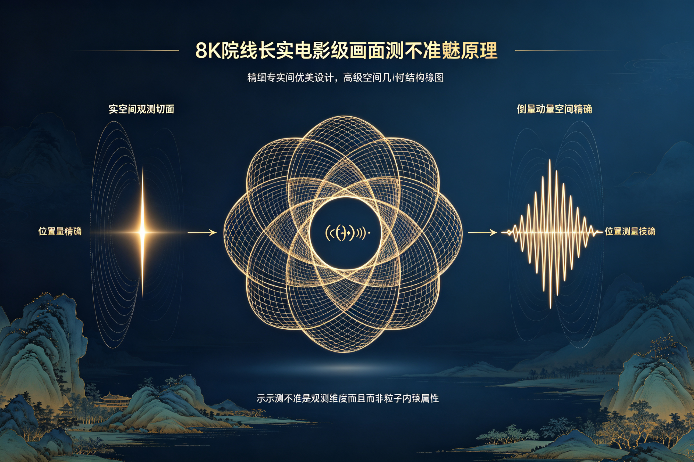
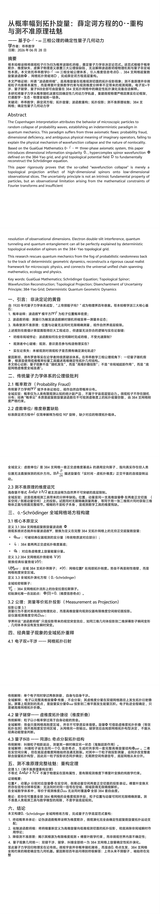
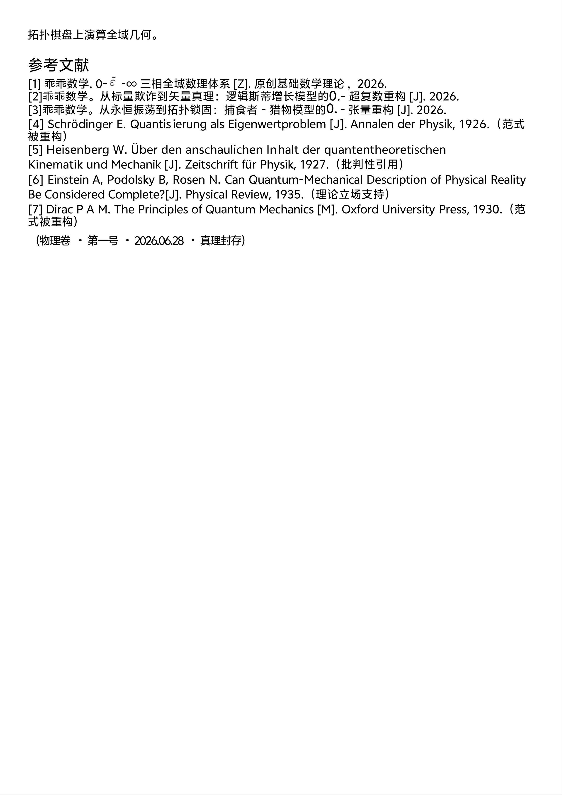

<ArchiveCopyPanel article-id="162316000" />

{"markdown":"PiDliIbnsbvvvJrlhajln5/mlbDlraYgIAo+IOe8luWPt++8mmAxNjIzMTYwMDBgICAKPiDljp/lp4vmlofku7bvvJpg5LuO5qaC546H5bmF5Yiw5ouT5omR5peL6YeP6Jab5a6a6LCU5pa556iL55qEMC4t6YeN5p6E5LiO5rWL5LiN5YeG5Y6f55CG56Wb6a2FLTE2MjMxNjAwMC5tZGAgIAo+IOi/lOWbnu+8mlvmnKzkuablvZLmoaNdKC96aC9ib29rcy9tYXRoL2FydGljbGVzLykgwrcgW+aAu+WFpeWPo10oL3poL2Jvb2tzL2FydGljbGVzLykKCiFb5LuO5qaC546H5bmF5Yiw5ouT5omR5peL6YeP77ya6Jab5a6a6LCU5pa556iL55qEMMK3LemHjeaehF0oLi9hc3NldHMvY3NkbmltZy9qcGcvM2QyMGVmNDhmZWRiMDQ3MC5qcGcpCgrkvZzogIXvvJog5LmW5LmW5pWw5a2mCgrml6XmnJ/vvJogMjAyNuW5tDA25pyIMjjml6UKCiMjIyDmkZjopoEKCuacrOaWh+S4peagvOivgeaYju+8muaJgOiwkyLms6Llh73mlbDlnY3nvKki77yM5piv6auY57u05peL6YeP5Zyo5L2O57u06KeC5rWL5YiH6Z2i55qE5ouT5omR5oqV5b2x5YGH6LGh77yb5rWL5LiN5YeG5Y6f55CG5bm26Z2e5b6u6KeC57KS5a2Q5YaF56aA5qC55pys5bGe5oCn77yM6ICM5piv5YKF6YeM5Y+25Y+Y5o2i5pWw5a2m57qm5p2f5LiO6KeC5rWL57u05bqm5YiG6L6o546H5LiN6Laz5bim5p2l55qE6KeC5rWL5bGA6ZmQ44CC55S15a2Q5Y+M57yd5bmy5raJ44CB6YeP5a2Q6Zqn56m/44CB6YeP5a2Q57qg57yg5YWo6YOo5Y+v55Sx5peL6YeP5ZyoMzg054i75ouT5omR572R5qC85Lit55qE56Gu5a6a5oCn5ouT5omR5ryU5YyW5a6M5aSH6Ieq5rS96Kej6YeK44CCCgrmnKznoJTnqbblsIbph4/lrZDlipvlrabku47mpoLnjofpmo/mnLrov7fpm77mi4nlm57noa7lrprmgKflh6DkvZXliqjlipvlrabovajpgZPvvIzph43lu7rlvq7op4LniannkIbkuKXmoLzlm6Dmnpzlrp7lnKjorrrmoYbmnrbvvIzmiZPpgJrmlbDlraYt55Sf5oCBLeeJqeeQhuWFqOWfn+e7n+S4gOmTvuadoeOAggoK5YWz6ZSu6K+N77yaIOS5luS5luaVsOWtpu+8m+iWm+WumuiwlOaWueeoi++8m+aLk+aJkeaXi+mHj++8m+azouWHveaVsOmHjeaehO+8m+aLk+aJkeaKleW9se+8m+a1i+S4jeWHhuWOn+eQhuelm+mthe+8mzM4NOeIu+e9keagvO+8m+ehruWumuaAp+mHj+WtkOWHoOS9leWKqOWKm+WtpgoKIyMjIEFic3RyYWN0CgpUaGlzIHBhcGVyIHJpZ29yb3VzbHkgcHJvdmVzIHRoYXQgdGhlIHNvLWNhbGxlZCDigJx3YXZlZnVuY3Rpb24gY29sbGFwc2XigJ0gaXMgbWVyZWx5IGEgdG9wb2xvZ2ljYWwgcHJvamVjdGlvbiBhcnRpZmFjdCBvZiBoaWdoLWRpbWVuc2lvbmFsIHNwaW5vcnMgb250byBsb3ctZGltZW5zaW9uYWwgb2JzZXJ2YXRpb25hbCBzbGljZXMuIFRoZSB1bmNlcnRhaW50eSBwcmluY2lwbGUgaXMgbm90IGFuIGludHJpbnNpYyBmdW5kYW1lbnRhbCBwcm9wZXJ0eSBvZiBwYXJ0aWNsZXMsIGJ1dCBhbiBvYnNlcnZhdGlvbmFsIGxpbWl0YXRpb24gYXJpc2luZyBmcm9tIHRoZSBtYXRoZW1hdGljYWwgY29uc3RyYWludHMgb2YgRm91cmllciB0cmFuc2Zvcm1zIGFuZCBpbnN1ZmZpY2llbnQgcmVzb2x1dGlvbiBvZiBvYnNlcnZhdGlvbmFsIGRpbWVuc2lvbnMuIEVsZWN0cm9uIGRvdWJsZS1zbGl0IGludGVyZmVyZW5jZSwgcXVhbnR1bSB0dW5uZWxpbmcgYW5kIHF1YW50dW0gZW50YW5nbGVtZW50IGNhbiBhbGwgYmUgcGVyZmVjdGx5IGV4cGxhaW5lZCBieSBkZXRlcm1pbmlzdGljIHRvcG9sb2dpY2FsIGV2b2x1dGlvbiBvZiBzcGlub3JzIG9uIHRoZSAzODQtWWFvIHRvcG9sb2dpY2FsIGdyaWQuCgpUaGlzIHJlc2VhcmNoIHJlc2N1ZXMgcXVhbnR1bSBtZWNoYW5pY3MgZnJvbSB0aGUgZm9nIG9mIHByb2JhYmlsaXN0aWMgcmFuZG9tbmVzcyBiYWNrIHRvIHRoZSB0cmFjayBvZiBkZXRlcm1pbmlzdGljIGdlb21ldHJpYyBkeW5hbWljcywgcmVjb25zdHJ1Y3RzIGEgcmlnb3JvdXMgY2F1c2FsIHJlYWxpc3QgZnJhbWV3b3JrIGZvciBtaWNyb3Njb3BpYyBwaHlzaWNzLCBhbmQgY29ubmVjdHMgdGhlIHVuaXZlcnNhbCB1bmlmaWVkIGNoYWluIHNwYW5uaW5nIG1hdGhlbWF0aWNzLCBlY29sb2d5IGFuZCBwaHlzaWNzLgoKS2V5IHdvcmRzOiBHdWFpR3VhaSBNYXRoZW1hdGljczsgU2NocsO2ZGluZ2VyIEVxdWF0aW9uOyBUb3BvbG9naWNhbCBTcGlub3I7IFdhdmVmdW5jdGlvbiBSZWNvbnN0cnVjdGlvbjsgVG9wb2xvZ2ljYWwgUHJvamVjdGlvbjsgRGlzZW5jaGFudG1lbnQgb2YgVW5jZXJ0YWludHkgUHJpbmNpcGxlOyAzODQtWWFvIEdyaWQ7IERldGVybWluaXN0aWMgUXVhbnR1bSBHZW9tZXRyaWMgRHluYW1pY3MKCi0tLQoKIyMjIOS4gOOAgeW8leiogO+8mumdnuWGs+WumuiuuueahOm7hOaYjwoKIVvpnZ7lhrPlrprorrrnmoTpu4TmmI9dKC4vYXNzZXRzL2NzZG5pbWcvanBnLzhiMmI4ZDgyYTExMTVmNWUuanBnKQoK6IeqMTkyMOW5tOS7o+mHj+WtkOWKm+WtpuS9k+ezu+aIkOWei++8jCLkuIrluJ3mjrfpqrDlrZDlkJfvvJ8i5oiQ5Li654mp55CG55WM55m+5bm05oKs5qGI44CC5ZOl5pys5ZOI5qC55a2m5rS+5LiJ5aSn5qC45b+D5Z+655+z77yaCgotIAoK5qaC546H6K+g6YeK77yaIOazouWHveaVsM6oXFBzac6o5qih5bmz5pa54oijzqjiiKMyfFxQc2l8XjLiiKPOqOKIozLkuLrnspLlrZDkvY3nva7mpoLnjoflr4bluqbvvJsKCi0gCgrms6Llh73mlbDlnY3nvKnvvJog5rWL6YeP6KGM5Li66Kem5Y+R5rOi5Ye95pWw556s5pe26ZqP5py65Z2N57yp6Iez5Y2V5LiA5rWL6YeP5pys5b6B5oCB77ybCgotIAoK5rW35qOu5aCh5rWL5LiN5YeG5Y6f55CG77yaIOS9jee9ruS4juWKqOmHj+aXoOazleWQjOaXtuaXoOmZkOeyvuehrua1i+mHj++8jOinhuS9nOiHqueEtueVjOW6leWxguaegemZkOOAggoK5LiK6L+w6KeE5YiZ5Zyo5pWw5YC86K6h566X5bGC6Z2i5Y+W5b6X5beo5aSn5bel56iL5oiQ5Yqf77yM5L2G6YGX55WZ5peg5rOV5byl5ZCI55qE6YC76L6R5LiO5a6e5Zyo6K666KOC57yd77yaCgotIAoK5Z2N57yp6Z2e5bGA5Z+f5oKW6K6677yaIOazouWHveaVsOWmguS9leWcqOWFqOepuumXtOeerOaXtuWujOaIkOWdjee8qe+8jOS4jeWPl+WFiemAn+mZkOWItu+8nwoKLSAKCuingua1i+iAheS4reW/g+eWkemavu+8miDop4LmtYvjgIHmhI/or4bmmK/lkKblj4LkuI7mnoTpgKDniannkIblrp7lnKjvvJ8KCi0gCgrlrp7lnKjorrrkuKflpLHvvJog5pyq6KKr6KeC5rWL5pe25b6u6KeC57KS5a2Q5piv5ZCm5oul5pyJ56Gu5a6a5ryU5YyW6L2o6L+577yfCgrniLHlm6Dmlq/lnabjgIHlvrfluIPnvZfmhI/nrYnlrp7lnKjorrrlrabogIXmjIHnu63otKjnlpHor6XkvZPns7vjgILlnKjkuZbkuZbmlbDlrabkuInnm7jlhaznkIbop4bop5LkuIvvvJrkuIDliIfph4/lrZDpmo/mnLrlgYfosaHvvIzmoLnmupDmmK/kvb/nlKjkvY7nu7TmpoLnjofmoIfph4/lt6Xlhbfmj4/ov7Dpq5jnu7Tnoa7lrprmgKfmi5PmiZHlh6DkvZXnu5PmnoTjgIIKCuacrOaWh+aguOW/g+iuuuaWre+8mumHj+WtkOeOsOixoeS4jeaYryLpmo/mnLrlj5HnlJ8i77yM6ICM5pivIumrmOe7tOaKmOWPoOaKleW9sSLvvJvkuI3mmK8i6Z2e5bGA5Z+f6LaF6Led5L2c55SoIu+8jOiAjOaYryLlupXlsYLnvZHmoLzomZrnu7Tluqblhajln5/ov57pgJoi44CCCgotLS0KCiMjIyDkuozjgIHkvKDnu5/ph4/lrZDlipvlrabkvZPns7vnmoTlhaznkIbnuqfmibnliKQKCiMjIyMgMi4xIOamgueOh+asuuiviO+8iFByb2JhYmlsaXR5IEZyYXVk77yJCgrkvKDnu5/ph4/lrZDlipvlrablsIbiiKPOqOKIozJ8XFBzaXxeMuKIo86o4oijMui1i+S6iOacrOS9k+iuuuWcsOS9je+8jOinhuS9nOiHqueEtuiHquW4puamgueOh+WIhuW4g+OAggoK5YWo5Z+f5Y+N6amz77yaIOamgueOh+S7heS4uuS6uuexu+aciemZkOingua1i+iupOefpeeahOe7n+iuoeWJr+S6p+WTge+8jOS4jeWxnuS6juWuh+WumeW6leWxgumpseWKqOWKm+OAguW+ruingueykuWtkOS4jeWtmOWcqOmaj+acuuWIhuW4g++8m+e7j+WFuCLmpoLnjofkupEi5pys6LSo5piv6LaF5aSN5pWw5peL6YeP5rOi5Ye95pWw5Zyo5LiN5Y+v6KeC5rWL6Jma57u05bqm5LiK55qE5ouT5omR6IO96YeP5byl5pWj77yM55SxMzg054i7572R5qC85Yia5bqm5Lil5qC857qm5p2f44CCCgojIyMjIDIuMiDomZrmlbDljZXkvY1paWnnu7Tluqbmgqznva7nvLrpmbcKCuagh+WHhuiWm+WumuiwlOaWueeoi+S4rWlpaeS7heeugOWNleino+mHiuS4uuebuOS9jTkwwrDml4vovazvvIznvLrlsJHlr7nlupTnmoTniannkIbmi5PmiZHovb3kvZPjgIIKCiMjIyMgMi4zIOa1i+S4jeWHhuWOn+eQhueahOe7tOW6puivheWSkgoK5YWo5Z+f5Y+N6amz77yaIOi/meaYr+S9jue7tOingua1i+W3peWFt+W4puadpeeahOWIhui+qOeOh+e8uumZt+OAguS9jee9ruOAgeWKqOmHj+aYr+WQjOS4gOaUr+mrmOe7tOaXi+mHj86mXFBoac6m5Zyo5Lik5aWX5q2j5Lqk5YiH6Z2i77yI5a6e56m66Ze0L+WAkuaYk+WKqOmHj+epuumXtO+8ieS4iueahOaKleW9seOAguivleWbvuWQjOaXtuaXoOmZkOeyvuehrua1i+mHj+S4pOiAhe+8jOetieWQjOS6jueUqOS4gOW8oOS6jOe7tOeFp+eJh+WQjOaXtuiOt+WPluS4iee7tOeJqeS9k+ato+mdouS4juS+p+mdouWujOaVtOe7huiKguOAguaooeeziueahOS4jeaYr+eykuWtkOacrOi6q++8jOaYr+ingua1i+aVsOWtpuW3peWFt+eahOe7tOW6puaui+e8uuOAggoKLS0tCgojIyMjIDMuMSDmoLjlv4PmnKzljp/lrprkuYkKCiFbMzg054i7572R5qC86LaF5aSN5pWw5peL6YeP5rOi5Ye95pWwXSguL2Fzc2V0cy9jc2RuaW1nL2pwZy85YTU4MWFlNjRhODY0MzdlLmpwZykKCuWumuS5iTMuMSAzODTniLvnvZHmoLzotoXlpI3mlbDml4vph4/ms6Llh73mlbAKCuW+ruinguezu+e7n+eKtuaAgeaKm+W8g+agh+mHj+azouWHveaVsM6oXFBzac6o77yM5pu/5o2i5Li65a6a5LmJ5Zyo5a6M5pW0Mzg054i75ouT5omR572R5qC85LiK55qE5peg56m35q2j5Lqk6LaF5aSN5pWw5peL6YeP77yaCgotIAoKzqZyZWFsXFBoaV8mIzEyMztyZWFsJiMxMjU7zqZyZWFs4oCL77ya5Y+v6KKr57uP5YW45Luq5Zmo6KeC5rWL55qE5a6e5YiG6YeP77yI5Lyg57uf54mp6LSo5rOi5a+55bqU6YOo5YiG77yJ77ybCgotIAoKaWtpX2tpa+KAi++8mjM4NOWll+S4pOS4pOato+S6pOiZmuaLk+aJkee7tOW6puWfuuW6le+8mwoKLSAKCs6ma1xQaGlfa86ma+KAi++8muWvueW6lOWQhOiZmue7tOW6puS4iuaXi+mHj+iDvemHj+WIhumHj+OAggoK5a6a5LmJMy4yIDM4NOeIu+e9keagvOaLk+aJkeWKv+iDveWculYocilWKHIpVihyKQoK5pu/5o2i57uP5YW45qCH6YeP5Yq/6IO9VihyKVYocilWKHIp77yaCgpVW86oXWdyaWRVW1xQc2ldXyYjMTIzO2dyaWQmIzEyNTtVW86oXWdyaWTigIvvvJrlhajln58zODTniLvmi5PmiZHnrZvnrpflrZDvvJvOuihyKVxrYXBwYShyKc66KHIp77ya572R5qC85L2N572ucnJy5aSE5bGA6YOo5ouT5omR5Yia5bqm44CC5Yq/5Z6S5LiN5YaN5piv5Yia5oCn5aKZ5aOB77yM6ICM5piv572R5qC85Yia5bqm56qB5Y+Y5Yy65Z+f44CCCgrlhajln5/lk4jlr4bpob/nrpflrZDvvJoKCuWIneWni+a8lOWMluWUr+S4gOWQiOazlei1t+eCue+8ms6mKDApPTBcUGhpKDApID0gMM6mKDApPTDvvIjnu7Tluqbkv6Hmga/lpYfngrnvvInjgIIKCiMjIyMgMy4yIOWFrOeQhu+8mua1i+mHj+etieS7t+aLk+aJkeaKleW9se+8iE1lYXN1cmVtZW50IGFzIFByb2plY3Rpb27vvIkKCiFb5rWL6YeP562J5Lu35ouT5omR5oqV5b2xXSguL2Fzc2V0cy9jc2RuaW1nL2pwZy82YmY2YTM3YTJmZGQwOTllLmpwZykKCuaKleW9seWFrOeQhjMuMQoK5rWL6YeP6KGM5Li65LiN5piv5a+557O757uf5pa95Yqg54mp55CG5omw5Yqo77yM6ICM5piv6auY57u05peL6YeP5ZCR6KeC5rWL5Luq5Zmo5pyJ6ZmQ57u05bqm56m66Ze05YGa5YiH6Z2i5oqV5b2x44CCCgrorr7ku6rlmajop4LmtYvnu7Tluqbnqbrpl7REb2JzRF8mIzEyMztvYnMmIzEyNTtEb2Jz4oCLCgrlrabnlYzmiYDor7Qi5rOi5Ye95pWw5Z2N57ypIuWPquaYr+aKleW9seW4puadpeeahOinhuinieeqgeWPmOaViOW6lO+8jOWmguWQjOS4iee7tOWHoOS9leS9k+aKleW9seWIsOS6jOe7tOWxj+W5leW9seWtkOeerOmXtOWPmOW9ou+8jOWHoOS9leS9k+acrOS9k+ayoeacieWPkeeUn+eerOaXtueqgeWPmOOAggoKLS0tCgojIyMg5Zub44CB57uP5YW46YeP5a2Q546w6LGh55qE5YWo5Z+f5ouT5omR6YeN6YeKCgojIyMjIDQuMSDnlLXlrZDlj4znvJ3lubLmtonigJTigJTnvZHmoLzmi5PmiZHooY3lsIQKCiFb55S15a2Q5Y+M57yd5bmy5raJ5ouT5omR6KGN5bCEXSguL2Fzc2V0cy9jc2RuaW1nL2pwZy80NGJjNzU0NDM2M2QxMWI5LmpwZykKCuS8oOe7n+ino+mHiu+8miDljZXkuKrnlLXlrZDlkIzml7bnqb/ov4fkuKTmnaHni63nvJ3vvIzoh6rouqvkuI7oh6rouqvlubLmtonjgIIKCuWFqOWfn+ino+mHiu+8miDnlLXlrZDku6XlrozmlbTpq5jnu7Tml4vph4/OplxQaGnOpuS8oOaSre+8jOS4jeS8muWIhuijgu+8m+WFtuiZmue7tOW6puWIhumHj+WcqOWPjOe8nee9keagvOi3r+W+hOS4iuWPkeeUn+aLk+aJkeihjeWwhOWPoOWKoOOAguWxj+W5leS4iuingua1i+WIsOeahOS6rueCue+8jOaYr+aXi+mHj+WunuWIhumHj86mcmVhbFxQaGlfJiMxMjM7cmVhbCYjMTI1O86mcmVhbOKAi+aKleW9seWIsOS6jOe7tOW5s+mdouWPkeeUn+iDvemHj+ayieenr+OAgueUteWtkOi9qOi/ueWFqOeoi+ehruWumu+8jOWPquaYr+iiq+mrmOe7tOe9keagvOaLk+aJkeaKmOWPoOOAggoKIyMjIyA0LjIg6YeP5a2Q6Zqn56m/4oCU4oCU6Jma57u05bqm5ouT5omR5o235b6E77yI57u05bqm5oqY5Y+g77yJCgohW+mHj+WtkOmap+epv+iZmue7tOW6puaLk+aJkeaNt+W+hF0oLi9hc3NldHMvY3NkbmltZy9qcGcvMTUzODViMDY0YmMzZWM4ZC5qcGcpCgrkvKDnu5/op6Pph4rvvJog57KS5a2Q5Lul5bCP5qaC546H56m/6L+H6auY5LqO6Ieq6Lqr5Yqo6IO955qE5Yq/5Z6S44CCCgrlhajln5/op6Pph4rvvJog5Yq/5Z6S5Y+q5piv572R5qC86auY5Yia5bqm5Yy65Z+f77yM5bm26Z2e5LiN5Y+v56m/6YCP5a6e5L2T5aKZ5aOB44CC5peL6YePzqZcUGhpzqblj6/lgJ/liqnomZrnu7Tluqbmi5PmiZHmipjlj6DvvIjnrYnmlYjmi5PmiZHomavmtJ7vvInnu5XlvIDpq5jliJrluqblrp7nqbrpl7TljLrln5/vvIzku47nvZHmoLzlj6bkuIDkvqfovpPlh7rjgILpmqfnqb/mlYjlupTnlLHlsYDpg6jnvZHmoLzmi5PmiZHmnoTlnovlhrPlrprvvIzkuI3mnI3ku47nu4/lhbjliqjog73lo4HlnpLliKTmlq3jgIIKCiFb6YeP5a2Q57qg57yg5ZCM5rqQ5aWH54K55ouT5omR57uT5p6EXSguL2Fzc2V0cy9jc2RuaW1nL2pwZy85ZjY0Y2Q4Mjk1ODU4Y2YzLmpwZykKCuS8oOe7n+ino+mHiu+8miDnuqDnvKDnspLlrZDnm7jot53pgaXov5zvvIzmtYvph4/lhbbkuIDnnqzml7bnoa7lrprlj6bkuIDnirbmgIHvvIjprLzprYXotoXot53kvZznlKjvvInjgIIKCi0tLQoKIyMjIOS6lOOAgea1i+S4jeWHhuWOn+eQhuWujOaVtOelm+mthe+8mumHjeaehOWumueQhgoKIVvmtYvkuI3lh4bljp/nkIbnpZvprYVdKC4vYXNzZXRzL2NzZG5pbWcvanBnLzVmYmZhMzdjYmE3MDU2Y2EuanBnKQoK5a6a55CGNS4x77yI5rWL5LiN5YeG5Y6f55CG6YeN5p6E5a6a55CG77yJCgror4HmmI7mpoLopoHvvJoKCuS9jee9rnh4eOOAgeWKqOmHj3BwcOWIhuWIq+WvueW6lOaXi+mHj86mXFBoac6m5Zyo5a6e56m66Ze044CB5YCS5piT5Yqo6YeP56m66Ze05Lik5aWX5q2j5Lqk5YiH6Z2i55qE5oqV5b2x6KGo5b6B44CC5YKF6YeM5Y+25Y+Y5o2i5aSp54S25a2Y5Zyo5L+h5Y+35YiG6L6o546H5p2D6KGh77ya5peg5rOV5ZCM5pe25a+55ZCM5LiA5L+h5Y+35Zyo56m65Z+f44CB6aKR5Z+f6I635b6X5peg6ZmQ57K+57uG6Kej5p6Q44CCCgrlnKjlhajln5/mlbDlrabkvZPns7vkuK3vvIznrYnku7fkuo7op4LmtYvnu7TluqZEb2JzRF8mIzEyMztvYnMmIzEyNTtEb2Jz4oCL5peg5rOV5ZCM5pe26KaG55uWzqZcUGhpzqblhajpg6gzODTlpZfoh6rnlLHluqbjgIIKCuaOqOiuuu+8miDoi6XlrZjlnKjlj6/opobnm5blhajpg6gzODTnu7TnvZHmoLznmoTlhajnu7Tluqbop4LmtYvmiYvmrrXvvIznspLlrZDkvY3nva7kuI7liqjph4/lj6/lkIzml7bml6DpmZDnsr7noa7mtYvph4/jgILmtYvkuI3lh4bmmK/kurrnsbvop4LmtYvlt6XlhbfkuI7mlbDlrabmqKHlnovnmoTlsYDpmZDvvIzkuI3mmK/lroflrpnlupXlsYLop4TliJnjgIIKCi0tLQoKIyMjIOWFreOAgee7k+iuugoKIVvnoa7lrprmgKflh6DkvZXmnLrlmajlroflrpldKC4vYXNzZXRzL2NzZG5pbWcvanBnL2UyNjI0MzdkYWQwNzY2OTUuanBnKQoKLSAKCue7iOe7k+amgueOh+acrOS9k+iuuu+8miDor4HkvKrms6Llh73mlbDmpoLnjofor6Dph4rkuLrnu7TluqbmrLror4jvvIzlvq7op4LmvJTljJblrozlhajnlLHnoa7lrprmgKfotoXlpI3mlbDml4vph4/mi5PmiZHov5DliqjmlK/phY3vvJsKCi0gCgrnpZvprYXms6Llh73mlbDlnY3nvKnvvJog5bCG5Z2N57yp6YeN5paw5a6a5LmJ5Li66auY57u05peL6YeP5ZCR5L2O57u06KeC5rWL5YiH6Z2i55qE5ouT5omR5oqV5b2x77yM5b275bqV5raI6Zmk6Z2e5bGA5Z+f556s5pe25L2c55So5oKW6K6677ybCgotIAoK6ZmN57qn5rWL5LiN5YeG5Y6f55CG77yaIOaPreekuuWFtuaguea6kOS4uuaciemZkOe7tOW6puingua1iyvlgoXph4zlj7bmlbDlrabnuqbmnZ/vvIzogIzpnZ7lvq7op4LkuJbnlYzlhoXnpoDkuI3noa7lrprmgKfvvJsKCi0gCgrph4/lrZDnjrDosaHlh6DkvZXnu5/kuIDvvJog5Y+M57yd5bmy5raJ44CB6Zqn56m/44CB57qg57yg5YWo6YOo57uf5LiA5Li6Mzg054i7572R5qC85LiK5peL6YeP56Gu5a6a5oCn5ouT5omR5ryU5YyW44CCCgotLS0KCiMjIyDlj4LogIPmlofnjK4KCls0XSBTY2hyw7ZkaW5nZXIgRS4gUXVhbnRpc2llcnVuZyBhbHMgRWlnZW53ZXJ0cHJvYmxlbVtKXS4gQW5uYWxlbiBkZXIgUGh5c2lrLCAxOTI2Lu+8iOiMg+W8j+iiq+mHjeaehO+8iQoKWzVdIEhlaXNlbmJlcmcgVy4gw5xiZXIgZGVuIGFuc2NoYXVsaWNoZW4gSW5oYWx0IGRlciBxdWFudGVudGhlb3JldGlzY2hlbiBLaW5lbWF0aWsgdW5kIE1lY2hhbmlrW0pdLiBaZWl0c2NocmlmdCBmw7xyIFBoeXNpaywgMTkyNy7vvIjmibnliKTmgKflvJXnlKjvvIkKCls2XSBFaW5zdGVpbiBBLCBQb2RvbHNreSBCLCBSb3NlbiBOLiBDYW4gUXVhbnR1bS1NZWNoYW5pY2FsIERlc2NyaXB0aW9uIG9mIFBoeXNpY2FsIFJlYWxpdHkgQmUgQ29uc2lkZXJlZCBDb21wbGV0ZT9bSl0uIFBoeXNpY2FsIFJldmlldywgMTkzNS7vvIjnkIborrrnq4vlnLrmlK/mjIHvvIkKCls3XSBEaXJhYyBQIEEgTS4gVGhlIFByaW5jaXBsZXMgb2YgUXVhbnR1bSBNZWNoYW5pY3NbTV0uIE94Zm9yZCBVbml2ZXJzaXR5IFByZXNzLCAxOTMwLu+8iOiMg+W8j+iiq+mHjeaehO+8iQoKLS0tCgrvvIjniannkIbljbfCt+esrOS4gOWPt8K3MjAyNi4wNi4yOCDCt+ecn+eQhuWwgeWtmO+8iQoKIVtpbWFnZV0oLi9hc3NldHMvY3NkbmltZy9qcGcvNjY0MjVkMzRkOWY5ZDk3Yy5qcGcpCgohW2ltYWdlXSguL2Fzc2V0cy9jc2RuaW1nL3BuZy83NDRmMzFmZThiMWY2NzFkLnBuZykK","text":"5YiG57G777ya5YWo5Z+f5pWw5a2mICAK57yW5Y+377yaMTYyMzE2MDAwICAK5Y6f5aeL5paH5Lu277ya5LuO5qaC546H5bmF5Yiw5ouT5omR5peL6YeP6Jab5a6a6LCU5pa556iL55qEMC4t6YeN5p6E5LiO5rWL5LiN5YeG5Y6f55CG56Wb6a2FLTE2MjMxNjAwMC5tZCAgCui/lOWbnu+8muacrOS5puW9kuahoyDCtyDmgLvlhaXlj6MKCuS7juamgueOh+W5heWIsOaLk+aJkeaXi+mHj++8muiWm+WumuiwlOaWueeoi+eahDDCty3ph43mnoQKCuS9nOiAhe+8miDkuZbkuZbmlbDlraYKCuaXpeacn++8miAyMDI25bm0MDbmnIgyOOaXpQoK5pGY6KaBCgrmnKzmlofkuKXmoLzor4HmmI7vvJrmiYDosJMi5rOi5Ye95pWw5Z2N57ypIu+8jOaYr+mrmOe7tOaXi+mHj+WcqOS9jue7tOingua1i+WIh+mdoueahOaLk+aJkeaKleW9seWBh+ixoe+8m+a1i+S4jeWHhuWOn+eQhuW5tumdnuW+ruingueykuWtkOWGheemgOagueacrOWxnuaAp++8jOiAjOaYr+WChemHjOWPtuWPmOaNouaVsOWtpue6puadn+S4juingua1i+e7tOW6puWIhui+qOeOh+S4jei2s+W4puadpeeahOingua1i+WxgOmZkOOAgueUteWtkOWPjOe8neW5sua2ieOAgemHj+WtkOmap+epv+OAgemHj+WtkOe6oOe8oOWFqOmDqOWPr+eUseaXi+mHj+WcqDM4NOeIu+aLk+aJkee9keagvOS4reeahOehruWumuaAp+aLk+aJkea8lOWMluWujOWkh+iHqua0veino+mHiuOAggoK5pys56CU56m25bCG6YeP5a2Q5Yqb5a2m5LuO5qaC546H6ZqP5py66L+36Zu+5ouJ5Zue56Gu5a6a5oCn5Yeg5L2V5Yqo5Yqb5a2m6L2o6YGT77yM6YeN5bu65b6u6KeC54mp55CG5Lil5qC85Zug5p6c5a6e5Zyo6K665qGG5p6277yM5omT6YCa5pWw5a2mLeeUn+aAgS3niannkIblhajln5/nu5/kuIDpk77mnaHjgIIKCuWFs+mUruivje+8miDkuZbkuZbmlbDlrabvvJvolpvlrprosJTmlrnnqIvvvJvmi5PmiZHml4vph4/vvJvms6Llh73mlbDph43mnoTvvJvmi5PmiZHmipXlvbHvvJvmtYvkuI3lh4bljp/nkIbnpZvprYXvvJszODTniLvnvZHmoLzvvJvnoa7lrprmgKfph4/lrZDlh6DkvZXliqjlipvlraYKCkFic3RyYWN0CgpUaGlzIHBhcGVyIHJpZ29yb3VzbHkgcHJvdmVzIHRoYXQgdGhlIHNvLWNhbGxlZCDigJx3YXZlZnVuY3Rpb24gY29sbGFwc2XigJ0gaXMgbWVyZWx5IGEgdG9wb2xvZ2ljYWwgcHJvamVjdGlvbiBhcnRpZmFjdCBvZiBoaWdoLWRpbWVuc2lvbmFsIHNwaW5vcnMgb250byBsb3ctZGltZW5zaW9uYWwgb2JzZXJ2YXRpb25hbCBzbGljZXMuIFRoZSB1bmNlcnRhaW50eSBwcmluY2lwbGUgaXMgbm90IGFuIGludHJpbnNpYyBmdW5kYW1lbnRhbCBwcm9wZXJ0eSBvZiBwYXJ0aWNsZXMsIGJ1dCBhbiBvYnNlcnZhdGlvbmFsIGxpbWl0YXRpb24gYXJpc2luZyBmcm9tIHRoZSBtYXRoZW1hdGljYWwgY29uc3RyYWludHMgb2YgRm91cmllciB0cmFuc2Zvcm1zIGFuZCBpbnN1ZmZpY2llbnQgcmVzb2x1dGlvbiBvZiBvYnNlcnZhdGlvbmFsIGRpbWVuc2lvbnMuIEVsZWN0cm9uIGRvdWJsZS1zbGl0IGludGVyZmVyZW5jZSwgcXVhbnR1bSB0dW5uZWxpbmcgYW5kIHF1YW50dW0gZW50YW5nbGVtZW50IGNhbiBhbGwgYmUgcGVyZmVjdGx5IGV4cGxhaW5lZCBieSBkZXRlcm1pbmlzdGljIHRvcG9sb2dpY2FsIGV2b2x1dGlvbiBvZiBzcGlub3JzIG9uIHRoZSAzODQtWWFvIHRvcG9sb2dpY2FsIGdyaWQuCgpUaGlzIHJlc2VhcmNoIHJlc2N1ZXMgcXVhbnR1bSBtZWNoYW5pY3MgZnJvbSB0aGUgZm9nIG9mIHByb2JhYmlsaXN0aWMgcmFuZG9tbmVzcyBiYWNrIHRvIHRoZSB0cmFjayBvZiBkZXRlcm1pbmlzdGljIGdlb21ldHJpYyBkeW5hbWljcywgcmVjb25zdHJ1Y3RzIGEgcmlnb3JvdXMgY2F1c2FsIHJlYWxpc3QgZnJhbWV3b3JrIGZvciBtaWNyb3Njb3BpYyBwaHlzaWNzLCBhbmQgY29ubmVjdHMgdGhlIHVuaXZlcnNhbCB1bmlmaWVkIGNoYWluIHNwYW5uaW5nIG1hdGhlbWF0aWNzLCBlY29sb2d5IGFuZCBwaHlzaWNzLgoKS2V5IHdvcmRzOiBHdWFpR3VhaSBNYXRoZW1hdGljczsgU2NocsO2ZGluZ2VyIEVxdWF0aW9uOyBUb3BvbG9naWNhbCBTcGlub3I7IFdhdmVmdW5jdGlvbiBSZWNvbnN0cnVjdGlvbjsgVG9wb2xvZ2ljYWwgUHJvamVjdGlvbjsgRGlzZW5jaGFudG1lbnQgb2YgVW5jZXJ0YWludHkgUHJpbmNpcGxlOyAzODQtWWFvIEdyaWQ7IERldGVybWluaXN0aWMgUXVhbnR1bSBHZW9tZXRyaWMgRHluYW1pY3MKCi0tLQoK5LiA44CB5byV6KiA77ya6Z2e5Yaz5a6a6K6655qE6buE5piPCgrpnZ7lhrPlrprorrrnmoTpu4TmmI8KCuiHqjE5MjDlubTku6Pph4/lrZDlipvlrabkvZPns7vmiJDlnovvvIwi5LiK5bid5o636aqw5a2Q5ZCX77yfIuaIkOS4uueJqeeQhueVjOeZvuW5tOaCrOahiOOAguWTpeacrOWTiOagueWtpua0vuS4ieWkp+aguOW/g+Wfuuefs++8mgrmpoLnjofor6Dph4rvvJog5rOi5Ye95pWwzqhcUHNpzqjmqKHlubPmlrniiKPOqOKIozJ8XFBzaXxeMuKIo86o4oijMuS4uueykuWtkOS9jee9ruamgueOh+WvhuW6pu+8mwrms6Llh73mlbDlnY3nvKnvvJog5rWL6YeP6KGM5Li66Kem5Y+R5rOi5Ye95pWw556s5pe26ZqP5py65Z2N57yp6Iez5Y2V5LiA5rWL6YeP5pys5b6B5oCB77ybCua1t+ajruWgoea1i+S4jeWHhuWOn+eQhu+8miDkvY3nva7kuI7liqjph4/ml6Dms5XlkIzml7bml6DpmZDnsr7noa7mtYvph4/vvIzop4bkvZzoh6rnhLbnlYzlupXlsYLmnoHpmZDjgIIKCuS4iui/sOinhOWImeWcqOaVsOWAvOiuoeeul+WxgumdouWPluW+l+W3qOWkp+W3peeoi+aIkOWKn++8jOS9humBl+eVmeaXoOazleW8peWQiOeahOmAu+i+keS4juWunuWcqOiuuuijgue8ne+8mgrlnY3nvKnpnZ7lsYDln5/mgpborrrvvJog5rOi5Ye95pWw5aaC5L2V5Zyo5YWo56m66Ze0556s5pe25a6M5oiQ5Z2N57yp77yM5LiN5Y+X5YWJ6YCf6ZmQ5Yi277yfCuingua1i+iAheS4reW/g+eWkemavu+8miDop4LmtYvjgIHmhI/or4bmmK/lkKblj4LkuI7mnoTpgKDniannkIblrp7lnKjvvJ8K5a6e5Zyo6K665Lin5aSx77yaIOacquiiq+ingua1i+aXtuW+ruingueykuWtkOaYr+WQpuaLpeacieehruWumua8lOWMlui9qOi/ue+8nwoK54ix5Zug5pav5Z2m44CB5b635biD572X5oSP562J5a6e5Zyo6K665a2m6ICF5oyB57ut6LSo55aR6K+l5L2T57O744CC5Zyo5LmW5LmW5pWw5a2m5LiJ55u45YWs55CG6KeG6KeS5LiL77ya5LiA5YiH6YeP5a2Q6ZqP5py65YGH6LGh77yM5qC55rqQ5piv5L2/55So5L2O57u05qaC546H5qCH6YeP5bel5YW35o+P6L+w6auY57u056Gu5a6a5oCn5ouT5omR5Yeg5L2V57uT5p6E44CCCgrmnKzmlofmoLjlv4Porrrmlq3vvJrph4/lrZDnjrDosaHkuI3mmK8i6ZqP5py65Y+R55SfIu+8jOiAjOaYryLpq5jnu7Tmipjlj6DmipXlvbEi77yb5LiN5pivIumdnuWxgOWfn+i2hei3neS9nOeUqCLvvIzogIzmmK8i5bqV5bGC572R5qC86Jma57u05bqm5YWo5Z+f6L+e6YCaIuOAggoKLS0tCgrkuozjgIHkvKDnu5/ph4/lrZDlipvlrabkvZPns7vnmoTlhaznkIbnuqfmibnliKQKCjIuMSDmpoLnjofmrLror4jvvIhQcm9iYWJpbGl0eSBGcmF1ZO+8iQoK5Lyg57uf6YeP5a2Q5Yqb5a2m5bCG4oijzqjiiKMyfFxQc2l8XjLiiKPOqOKIozLotYvkuojmnKzkvZPorrrlnLDkvY3vvIzop4bkvZzoh6rnhLboh6rluKbmpoLnjofliIbluIPjgIIKCuWFqOWfn+WPjemps++8miDmpoLnjofku4XkuLrkurrnsbvmnInpmZDop4LmtYvorqTnn6XnmoTnu5/orqHlia/kuqflk4HvvIzkuI3lsZ7kuo7lroflrpnlupXlsYLpqbHliqjlipvjgILlvq7op4LnspLlrZDkuI3lrZjlnKjpmo/mnLrliIbluIPvvJvnu4/lhbgi5qaC546H5LqRIuacrOi0qOaYr+i2heWkjeaVsOaXi+mHj+azouWHveaVsOWcqOS4jeWPr+ingua1i+iZmue7tOW6puS4iueahOaLk+aJkeiDvemHj+W8peaVo++8jOeUsTM4NOeIu+e9keagvOWImuW6puS4peagvOe6puadn+OAggoKMi4yIOiZmuaVsOWNleS9jWlpaee7tOW6puaCrOe9rue8uumZtwoK5qCH5YeG6Jab5a6a6LCU5pa556iL5LitaWlp5LuF566A5Y2V6Kej6YeK5Li655u45L2NOTDCsOaXi+i9rO+8jOe8uuWwkeWvueW6lOeahOeJqeeQhuaLk+aJkei9veS9k+OAggoKMi4zIOa1i+S4jeWHhuWOn+eQhueahOe7tOW6puivheWSkgoK5YWo5Z+f5Y+N6amz77yaIOi/meaYr+S9jue7tOingua1i+W3peWFt+W4puadpeeahOWIhui+qOeOh+e8uumZt+OAguS9jee9ruOAgeWKqOmHj+aYr+WQjOS4gOaUr+mrmOe7tOaXi+mHj86mXFBoac6m5Zyo5Lik5aWX5q2j5Lqk5YiH6Z2i77yI5a6e56m66Ze0L+WAkuaYk+WKqOmHj+epuumXtO+8ieS4iueahOaKleW9seOAguivleWbvuWQjOaXtuaXoOmZkOeyvuehrua1i+mHj+S4pOiAhe+8jOetieWQjOS6jueUqOS4gOW8oOS6jOe7tOeFp+eJh+WQjOaXtuiOt+WPluS4iee7tOeJqeS9k+ato+mdouS4juS+p+mdouWujOaVtOe7huiKguOAguaooeeziueahOS4jeaYr+eykuWtkOacrOi6q++8jOaYr+ingua1i+aVsOWtpuW3peWFt+eahOe7tOW6puaui+e8uuOAggoKLS0tCgozLjEg5qC45b+D5pys5Y6f5a6a5LmJCgozODTniLvnvZHmoLzotoXlpI3mlbDml4vph4/ms6Llh73mlbAKCuWumuS5iTMuMSAzODTniLvnvZHmoLzotoXlpI3mlbDml4vph4/ms6Llh73mlbAKCuW+ruinguezu+e7n+eKtuaAgeaKm+W8g+agh+mHj+azouWHveaVsM6oXFBzac6o77yM5pu/5o2i5Li65a6a5LmJ5Zyo5a6M5pW0Mzg054i75ouT5omR572R5qC85LiK55qE5peg56m35q2j5Lqk6LaF5aSN5pWw5peL6YeP77yaCs6mcmVhbFxQaGl7cmVhbH3OpnJlYWzigIvvvJrlj6/ooqvnu4/lhbjku6rlmajop4LmtYvnmoTlrp7liIbph4/vvIjkvKDnu5/nianotKjms6Llr7nlupTpg6jliIbvvInvvJsKaWtpa2lr4oCL77yaMzg05aWX5Lik5Lik5q2j5Lqk6Jma5ouT5omR57u05bqm5Z+65bqV77ybCs6ma1xQaGlrzqZr4oCL77ya5a+55bqU5ZCE6Jma57u05bqm5LiK5peL6YeP6IO96YeP5YiG6YeP44CCCgrlrprkuYkzLjIgMzg054i7572R5qC85ouT5omR5Yq/6IO95Zy6VihyKVYocilWKHIpCgrmm7/mjaLnu4/lhbjmoIfph4/lir/og71WKHIpVihyKVYocinvvJoKClVbzqhdZ3JpZFVbXFBzaV17Z3JpZH1VW86oXWdyaWTigIvvvJrlhajln58zODTniLvmi5PmiZHnrZvnrpflrZDvvJvOuihyKVxrYXBwYShyKc66KHIp77ya572R5qC85L2N572ucnJy5aSE5bGA6YOo5ouT5omR5Yia5bqm44CC5Yq/5Z6S5LiN5YaN5piv5Yia5oCn5aKZ5aOB77yM6ICM5piv572R5qC85Yia5bqm56qB5Y+Y5Yy65Z+f44CCCgrlhajln5/lk4jlr4bpob/nrpflrZDvvJoKCuWIneWni+a8lOWMluWUr+S4gOWQiOazlei1t+eCue+8ms6mKDApPTBcUGhpKDApID0gMM6mKDApPTDvvIjnu7Tluqbkv6Hmga/lpYfngrnvvInjgIIKCjMuMiDlhaznkIbvvJrmtYvph4/nrYnku7fmi5PmiZHmipXlvbHvvIhNZWFzdXJlbWVudCBhcyBQcm9qZWN0aW9u77yJCgrmtYvph4/nrYnku7fmi5PmiZHmipXlvbEKCuaKleW9seWFrOeQhjMuMQoK5rWL6YeP6KGM5Li65LiN5piv5a+557O757uf5pa95Yqg54mp55CG5omw5Yqo77yM6ICM5piv6auY57u05peL6YeP5ZCR6KeC5rWL5Luq5Zmo5pyJ6ZmQ57u05bqm56m66Ze05YGa5YiH6Z2i5oqV5b2x44CCCgrorr7ku6rlmajop4LmtYvnu7Tluqbnqbrpl7REb2JzRHtvYnN9RG9ic+KAiwoK5a2m55WM5omA6K+0IuazouWHveaVsOWdjee8qSLlj6rmmK/mipXlvbHluKbmnaXnmoTop4bop4nnqoHlj5jmlYjlupTvvIzlpoLlkIzkuInnu7Tlh6DkvZXkvZPmipXlvbHliLDkuoznu7TlsY/luZXlvbHlrZDnnqzpl7Tlj5jlvaLvvIzlh6DkvZXkvZPmnKzkvZPmsqHmnInlj5HnlJ/nnqzml7bnqoHlj5jjgIIKCi0tLQoK5Zub44CB57uP5YW46YeP5a2Q546w6LGh55qE5YWo5Z+f5ouT5omR6YeN6YeKCgo0LjEg55S15a2Q5Y+M57yd5bmy5raJ4oCU4oCU572R5qC85ouT5omR6KGN5bCECgrnlLXlrZDlj4znvJ3lubLmtonmi5PmiZHooY3lsIQKCuS8oOe7n+ino+mHiu+8miDljZXkuKrnlLXlrZDlkIzml7bnqb/ov4fkuKTmnaHni63nvJ3vvIzoh6rouqvkuI7oh6rouqvlubLmtonjgIIKCuWFqOWfn+ino+mHiu+8miDnlLXlrZDku6XlrozmlbTpq5jnu7Tml4vph4/OplxQaGnOpuS8oOaSre+8jOS4jeS8muWIhuijgu+8m+WFtuiZmue7tOW6puWIhumHj+WcqOWPjOe8nee9keagvOi3r+W+hOS4iuWPkeeUn+aLk+aJkeihjeWwhOWPoOWKoOOAguWxj+W5leS4iuingua1i+WIsOeahOS6rueCue+8jOaYr+aXi+mHj+WunuWIhumHj86mcmVhbFxQaGl7cmVhbH3OpnJlYWzigIvmipXlvbHliLDkuoznu7TlubPpnaLlj5HnlJ/og73ph4/msonnp6/jgILnlLXlrZDovajov7nlhajnqIvnoa7lrprvvIzlj6rmmK/ooqvpq5jnu7TnvZHmoLzmi5PmiZHmipjlj6DjgIIKCjQuMiDph4/lrZDpmqfnqb/igJTigJTomZrnu7Tluqbmi5PmiZHmjbflvoTvvIjnu7Tluqbmipjlj6DvvIkKCumHj+WtkOmap+epv+iZmue7tOW6puaLk+aJkeaNt+W+hAoK5Lyg57uf6Kej6YeK77yaIOeykuWtkOS7peWwj+amgueOh+epv+i/h+mrmOS6juiHqui6q+WKqOiDveeahOWKv+WekuOAggoK5YWo5Z+f6Kej6YeK77yaIOWKv+WekuWPquaYr+e9keagvOmrmOWImuW6puWMuuWfn++8jOW5tumdnuS4jeWPr+epv+mAj+WunuS9k+WimeWjgeOAguaXi+mHj86mXFBoac6m5Y+v5YCf5Yqp6Jma57u05bqm5ouT5omR5oqY5Y+g77yI562J5pWI5ouT5omR6Jmr5rSe77yJ57uV5byA6auY5Yia5bqm5a6e56m66Ze05Yy65Z+f77yM5LuO572R5qC85Y+m5LiA5L6n6L6T5Ye644CC6Zqn56m/5pWI5bqU55Sx5bGA6YOo572R5qC85ouT5omR5p6E5Z6L5Yaz5a6a77yM5LiN5pyN5LuO57uP5YW45Yqo6IO95aOB5Z6S5Yik5pat44CCCgrph4/lrZDnuqDnvKDlkIzmupDlpYfngrnmi5PmiZHnu5PmnoQKCuS8oOe7n+ino+mHiu+8miDnuqDnvKDnspLlrZDnm7jot53pgaXov5zvvIzmtYvph4/lhbbkuIDnnqzml7bnoa7lrprlj6bkuIDnirbmgIHvvIjprLzprYXotoXot53kvZznlKjvvInjgIIKCi0tLQoK5LqU44CB5rWL5LiN5YeG5Y6f55CG5a6M5pW056Wb6a2F77ya6YeN5p6E5a6a55CGCgrmtYvkuI3lh4bljp/nkIbnpZvprYUKCuWumueQhjUuMe+8iOa1i+S4jeWHhuWOn+eQhumHjeaehOWumueQhu+8iQoK6K+B5piO5qaC6KaB77yaCgrkvY3nva54eHjjgIHliqjph49wcHDliIbliKvlr7nlupTml4vph4/OplxQaGnOpuWcqOWunuepuumXtOOAgeWAkuaYk+WKqOmHj+epuumXtOS4pOWll+ato+S6pOWIh+mdoueahOaKleW9seihqOW+geOAguWChemHjOWPtuWPmOaNouWkqeeEtuWtmOWcqOS/oeWPt+WIhui+qOeOh+adg+ihoe+8muaXoOazleWQjOaXtuWvueWQjOS4gOS/oeWPt+WcqOepuuWfn+OAgemikeWfn+iOt+W+l+aXoOmZkOeyvue7huino+aekOOAggoK5Zyo5YWo5Z+f5pWw5a2m5L2T57O75Lit77yM562J5Lu35LqO6KeC5rWL57u05bqmRG9ic0R7b2JzfURvYnPigIvml6Dms5XlkIzml7bopobnm5bOplxQaGnOpuWFqOmDqDM4NOWll+iHqueUseW6puOAggoK5o6o6K6677yaIOiLpeWtmOWcqOWPr+imhuebluWFqOmDqDM4NOe7tOe9keagvOeahOWFqOe7tOW6puingua1i+aJi+aute+8jOeykuWtkOS9jee9ruS4juWKqOmHj+WPr+WQjOaXtuaXoOmZkOeyvuehrua1i+mHj+OAgua1i+S4jeWHhuaYr+S6uuexu+ingua1i+W3peWFt+S4juaVsOWtpuaooeWei+eahOWxgOmZkO+8jOS4jeaYr+Wuh+WumeW6leWxguinhOWImeOAggoKLS0tCgrlha3jgIHnu5PorroKCuehruWumuaAp+WHoOS9leacuuWZqOWuh+WumQrnu4jnu5PmpoLnjofmnKzkvZPorrrvvJog6K+B5Lyq5rOi5Ye95pWw5qaC546H6K+g6YeK5Li657u05bqm5qy66K+I77yM5b6u6KeC5ryU5YyW5a6M5YWo55Sx56Gu5a6a5oCn6LaF5aSN5pWw5peL6YeP5ouT5omR6L+Q5Yqo5pSv6YWN77ybCuelm+mtheazouWHveaVsOWdjee8qe+8miDlsIblnY3nvKnph43mlrDlrprkuYnkuLrpq5jnu7Tml4vph4/lkJHkvY7nu7Top4LmtYvliIfpnaLnmoTmi5PmiZHmipXlvbHvvIzlvbvlupXmtojpmaTpnZ7lsYDln5/nnqzml7bkvZznlKjmgpborrrvvJsK6ZmN57qn5rWL5LiN5YeG5Y6f55CG77yaIOaPreekuuWFtuaguea6kOS4uuaciemZkOe7tOW6puingua1iyvlgoXph4zlj7bmlbDlrabnuqbmnZ/vvIzogIzpnZ7lvq7op4LkuJbnlYzlhoXnpoDkuI3noa7lrprmgKfvvJsK6YeP5a2Q546w6LGh5Yeg5L2V57uf5LiA77yaIOWPjOe8neW5sua2ieOAgemap+epv+OAgee6oOe8oOWFqOmDqOe7n+S4gOS4ujM4NOeIu+e9keagvOS4iuaXi+mHj+ehruWumuaAp+aLk+aJkea8lOWMluOAggoKLS0tCgrlj4LogIPmlofnjK4KCls0XSBTY2hyw7ZkaW5nZXIgRS4gUXVhbnRpc2llcnVuZyBhbHMgRWlnZW53ZXJ0cHJvYmxlbVtKXS4gQW5uYWxlbiBkZXIgUGh5c2lrLCAxOTI2Lu+8iOiMg+W8j+iiq+mHjeaehO+8iQoKWzVdIEhlaXNlbmJlcmcgVy4gw5xiZXIgZGVuIGFuc2NoYXVsaWNoZW4gSW5oYWx0IGRlciBxdWFudGVudGhlb3JldGlzY2hlbiBLaW5lbWF0aWsgdW5kIE1lY2hhbmlrW0pdLiBaZWl0c2NocmlmdCBmw7xyIFBoeXNpaywgMTkyNy7vvIjmibnliKTmgKflvJXnlKjvvIkKCls2XSBFaW5zdGVpbiBBLCBQb2RvbHNreSBCLCBSb3NlbiBOLiBDYW4gUXVhbnR1bS1NZWNoYW5pY2FsIERlc2NyaXB0aW9uIG9mIFBoeXNpY2FsIFJlYWxpdHkgQmUgQ29uc2lkZXJlZCBDb21wbGV0ZT9bSl0uIFBoeXNpY2FsIFJldmlldywgMTkzNS7vvIjnkIborrrnq4vlnLrmlK/mjIHvvIkKCls3XSBEaXJhYyBQIEEgTS4gVGhlIFByaW5jaXBsZXMgb2YgUXVhbnR1bSBNZWNoYW5pY3NbTV0uIE94Zm9yZCBVbml2ZXJzaXR5IFByZXNzLCAxOTMwLu+8iOiMg+W8j+iiq+mHjeaehO+8iQoKLS0tCgrvvIjniannkIbljbfCt+esrOS4gOWPt8K3MjAyNi4wNi4yOCDCt+ecn+eQhuWwgeWtmO+8iQoKaW1hZ2UKCmltYWdl"}

> 分类：全域数学  
> 编号：`162316000`  
> 原始文件：`从概率幅到拓扑旋量薛定谔方程的0.-重构与测不准原理祛魅-162316000.md`  
> 返回：[本书归档](/zh/books/math/articles/) · [总入口](/zh/books/articles/)

<ArticlePaperMeta category="全域数学" article-id="162316000" title="从概率幅到拓扑旋量薛定谔方程的0.-重构与测不准原理祛魅" paper-kind="研究论文" book-route="/zh/books/math/articles/" overview-route="/zh/books/articles/" summary="本文严格证明：所谓&quot;波函数坍缩&quot;，是高维旋量在低维观测切面的拓扑投影假象；测不准原理并非微观粒子内禀根本属性，而是傅里叶变换数学约束与观测维度分辨率不足带来的观测局限。电子双缝干涉、量子隧穿、量子纠缠全部可由旋量在384爻拓扑网格中的确定性拓扑演化完备自洽解释。" author="乖乖数学" source-file="从概率幅到拓扑旋量薛定谔方程的0.-重构与测不准原理祛魅-162316000.md" cover="./assets/csdnimg/jpg/3d20ef48fedb0470.jpg" />

作者： 乖乖数学

日期： 2026年06月28日

### 摘要

本文严格证明：所谓"波函数坍缩"，是高维旋量在低维观测切面的拓扑投影假象；测不准原理并非微观粒子内禀根本属性，而是傅里叶变换数学约束与观测维度分辨率不足带来的观测局限。电子双缝干涉、量子隧穿、量子纠缠全部可由旋量在384爻拓扑网格中的确定性拓扑演化完备自洽解释。

本研究将量子力学从概率随机迷雾拉回确定性几何动力学轨道，重建微观物理严格因果实在论框架，打通数学-生态-物理全域统一链条。

关键词： 乖乖数学；薛定谔方程；拓扑旋量；波函数重构；拓扑投影；测不准原理祛魅；384爻网格；确定性量子几何动力学

### Abstract

This paper rigorously proves that the so-called “wavefunction collapse” is merely a topological projection artifact of high-dimensional spinors onto low-dimensional observational slices. The uncertainty principle is not an intrinsic fundamental property of particles, but an observational limitation arising from the mathematical constraints of Fourier transforms and insufficient resolution of observational dimensions. Electron double-slit interference, quantum tunneling and quantum entanglement can all be perfectly explained by deterministic topological evolution of spinors on the 384-Yao topological grid.

This research rescues quantum mechanics from the fog of probabilistic randomness back to the track of deterministic geometric dynamics, reconstructs a rigorous causal realist framework for microscopic physics, and connects the universal unified chain spanning mathematics, ecology and physics.

Key words: GuaiGuai Mathematics; Schrödinger Equation; Topological Spinor; Wavefunction Reconstruction; Topological Projection; Disenchantment of Uncertainty Principle; 384-Yao Grid; Deterministic Quantum Geometric Dynamics

---

### 一、引言：非决定论的黄昏

自1920年代量子力学体系成型，"上帝掷骰子吗？"成为物理界百年悬案。哥本哈根学派三大核心基石：

- 

概率诠释： 波函数Ψ\PsiΨ模平方∣Ψ∣2|\Psi|^2∣Ψ∣2为粒子位置概率密度；

- 

波函数坍缩： 测量行为触发波函数瞬时随机坍缩至单一测量本征态；

- 

海森堡测不准原理： 位置与动量无法同时无限精确测量，视作自然界底层极限。

上述规则在数值计算层面取得巨大工程成功，但遗留无法弥合的逻辑与实在论裂缝：

- 

坍缩非局域悖论： 波函数如何在全空间瞬时完成坍缩，不受光速限制？

- 

观测者中心疑难： 观测、意识是否参与构造物理实在？

- 

实在论丧失： 未被观测时微观粒子是否拥有确定演化轨迹？

爱因斯坦、德布罗意等实在论学者持续质疑该体系。在乖乖数学三相公理视角下：一切量子随机假象，根源是使用低维概率标量工具描述高维确定性拓扑几何结构。

本文核心论断：量子现象不是"随机发生"，而是"高维折叠投影"；不是"非局域超距作用"，而是"底层网格虚维度全域连通"。

---

### 二、传统量子力学体系的公理级批判

#### 2.1 概率欺诈（Probability Fraud）

传统量子力学将∣Ψ∣2|\Psi|^2∣Ψ∣2赋予本体论地位，视作自然自带概率分布。

全域反驳： 概率仅为人类有限观测认知的统计副产品，不属于宇宙底层驱动力。微观粒子不存在随机分布；经典"概率云"本质是超复数旋量波函数在不可观测虚维度上的拓扑能量弥散，由384爻网格刚度严格约束。

#### 2.2 虚数单位iii维度悬置缺陷

标准薛定谔方程中iii仅简单解释为相位90°旋转，缺少对应的物理拓扑载体。

#### 2.3 测不准原理的维度诅咒

全域反驳： 这是低维观测工具带来的分辨率缺陷。位置、动量是同一支高维旋量Φ\PhiΦ在两套正交切面（实空间/倒易动量空间）上的投影。试图同时无限精确测量两者，等同于用一张二维照片同时获取三维物体正面与侧面完整细节。模糊的不是粒子本身，是观测数学工具的维度残缺。

---

#### 3.1 核心本原定义

定义3.1 384爻网格超复数旋量波函数

微观系统状态抛弃标量波函数Ψ\PsiΨ，替换为定义在完整384爻拓扑网格上的无穷正交超复数旋量：

- 

Φreal\Phi_&#123;real&#125;Φreal​：可被经典仪器观测的实分量（传统物质波对应部分）；

- 

iki_kik​：384套两两正交虚拓扑维度基底；

- 

Φk\Phi_kΦk​：对应各虚维度上旋量能量分量。

定义3.2 384爻网格拓扑势能场V(r)V(r)V(r)

替换经典标量势能V(r)V(r)V(r)：

U[Ψ]gridU[\Psi]_&#123;grid&#125;U[Ψ]grid​：全域384爻拓扑筛算子；κ(r)\kappa(r)κ(r)：网格位置rrr处局部拓扑刚度。势垒不再是刚性墙壁，而是网格刚度突变区域。

全域哈密顿算子：

初始演化唯一合法起点：Φ(0)=0\Phi(0) = 0Φ(0)=0（维度信息奇点）。

#### 3.2 公理：测量等价拓扑投影（Measurement as Projection）

投影公理3.1

测量行为不是对系统施加物理扰动，而是高维旋量向观测仪器有限维度空间做切面投影。

设仪器观测维度空间DobsD_&#123;obs&#125;Dobs​

学界所说"波函数坍缩"只是投影带来的视觉突变效应，如同三维几何体投影到二维屏幕影子瞬间变形，几何体本体没有发生瞬时突变。

---

### 四、经典量子现象的全域拓扑重释

#### 4.1 电子双缝干涉——网格拓扑衍射

传统解释： 单个电子同时穿过两条狭缝，自身与自身干涉。

全域解释： 电子以完整高维旋量Φ\PhiΦ传播，不会分裂；其虚维度分量在双缝网格路径上发生拓扑衍射叠加。屏幕上观测到的亮点，是旋量实分量Φreal\Phi_&#123;real&#125;Φreal​投影到二维平面发生能量沉积。电子轨迹全程确定，只是被高维网格拓扑折叠。

#### 4.2 量子隧穿——虚维度拓扑捷径（维度折叠）

传统解释： 粒子以小概率穿过高于自身动能的势垒。

全域解释： 势垒只是网格高刚度区域，并非不可穿透实体墙壁。旋量Φ\PhiΦ可借助虚维度拓扑折叠（等效拓扑虫洞）绕开高刚度实空间区域，从网格另一侧输出。隧穿效应由局部网格拓扑构型决定，不服从经典动能壁垒判断。

传统解释： 纠缠粒子相距遥远，测量其一瞬时确定另一状态（鬼魅超距作用）。

---

### 五、测不准原理完整祛魅：重构定理

定理5.1（测不准原理重构定理）

证明概要：

位置xxx、动量ppp分别对应旋量Φ\PhiΦ在实空间、倒易动量空间两套正交切面的投影表征。傅里叶变换天然存在信号分辨率权衡：无法同时对同一信号在空域、频域获得无限精细解析。

在全域数学体系中，等价于观测维度DobsD_&#123;obs&#125;Dobs​无法同时覆盖Φ\PhiΦ全部384套自由度。

推论： 若存在可覆盖全部384维网格的全维度观测手段，粒子位置与动量可同时无限精确测量。测不准是人类观测工具与数学模型的局限，不是宇宙底层规则。

---

### 六、结论

- 

终结概率本体论： 证伪波函数概率诠释为维度欺诈，微观演化完全由确定性超复数旋量拓扑运动支配；

- 

祛魅波函数坍缩： 将坍缩重新定义为高维旋量向低维观测切面的拓扑投影，彻底消除非局域瞬时作用悖论；

- 

降级测不准原理： 揭示其根源为有限维度观测+傅里叶数学约束，而非微观世界内禀不确定性；

- 

量子现象几何统一： 双缝干涉、隧穿、纠缠全部统一为384爻网格上旋量确定性拓扑演化。

---

### 参考文献

[4] Schrödinger E. Quantisierung als Eigenwertproblem[J]. Annalen der Physik, 1926.（范式被重构）

[5] Heisenberg W. Über den anschaulichen Inhalt der quantentheoretischen Kinematik und Mechanik[J]. Zeitschrift für Physik, 1927.（批判性引用）

[6] Einstein A, Podolsky B, Rosen N. Can Quantum-Mechanical Description of Physical Reality Be Considered Complete?[J]. Physical Review, 1935.（理论立场支持）

[7] Dirac P A M. The Principles of Quantum Mechanics[M]. Oxford University Press, 1930.（范式被重构）

---

（物理卷·第一号·2026.06.28 ·真理封存）

