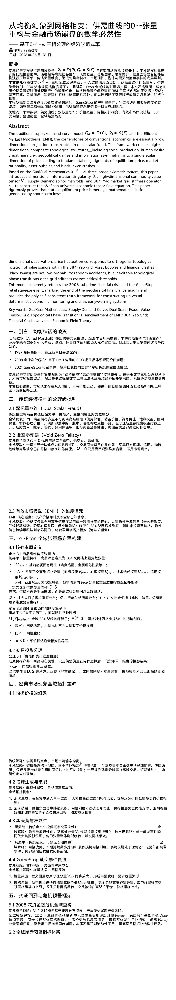
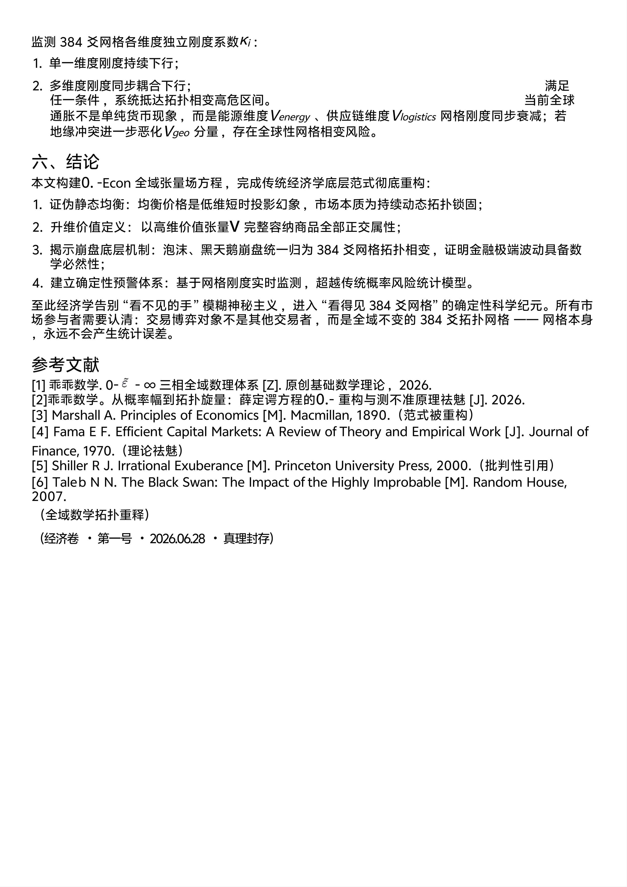

<ArchiveCopyPanel article-id="162316035" />

{"markdown":"PiDliIbnsbvvvJrlhajln5/mlbDlraYgIAo+IOe8luWPt++8mmAxNjIzMTYwMzVgICAKPiDljp/lp4vmlofku7bvvJpg5LuO5Z2H6KGh5bm76LGh5Yiw572R5qC855u45Y+Y5L6b6ZyA5puy57q/55qEMC7lvKDph4/ph43mnoTkuI7ph5Hono3luILlnLrltKnnm5jnmoTmlbDlrablv4XnhLbmgKctMTYyMzE2MDM1Lm1kYCAgCj4g6L+U5Zue77yaW+acrOS5puW9kuaho10oL3poL2Jvb2tzL21hdGgvYXJ0aWNsZXMvKSDCtyBb5oC75YWl5Y+jXSgvemgvYm9va3MvYXJ0aWNsZXMvKQoKIVvlsIHpnaJdKC4vYXNzZXRzL2NzZG5pbWcvanBnLzVjN2EwMTViYWM1YTY3NjkuanBnKQoKIyMg5LuO5Z2H6KGh5bm76LGh5Yiw572R5qC855u45Y+Y77ya5L6b6ZyA5puy57q/55qEMC5+MC5cdGlsZGUmIzEyMzsmIzEyNTswLn7lvKDph4/ph43mnoTkuI7ph5Hono3luILlnLrltKnnm5jnmoTmlbDlrablv4XnhLbmgKcKCuS9nOiAhe+8muS5luS5luaVsOWtpgoK5pel5pyf77yaMjAyNuW5tDA25pyIMjjml6UKCi0tLQoKIyMjIOaRmOimgQoK5Lyg57uf57uP5rWO5a2m5qC55Z+65L6b6ZyA5puy57q/5qih5Z6LIFFkPUQoUClRXyYjMTIzO2QmIzEyNTs9RChQKVFk4oCLPUQoUCnjgIFRcz1TKFApUV8mIzEyMztzJiMxMjU7PVMoUClRc+KAiz1TKFApIOS4juacieaViOW4guWcuuWBh+ivtO+8iEVNSO+8ie+8jOacrOi0qOaYr+WPjOagh+mHj+asuuiviOeahOS9jue7tOaKleW9semZt+mYseOAguivpeahhuaetuWwhumrmOe7tOekvuS8mueUn+S6p+OAgeS6uuexu+assuacm+OAgeS/oeeUqOWxgue6p+OAgeWcsOe8mOWNmuW8iOOAgeS/oeaBr+W3ruetieWkjeWQiOaLk+aJkee7k+aehOW8uuihjOWOi+e8qeiHs+WNleS4gOS7t+agvOagh+mHj+e7tOW6pu+8jOmAoOaIkOWvueWdh+ihoeS7t+agvOOAgeW4guWcuueQhuaAp+OAgeazoeayq+S4jum7keWkqem5heW0qeebmOS6i+S7tueahOW6leWxguivr+WIpOOAggoK5pys5qih5Z6L5a6M5pW06Ieq5rS95aSN55uYMjAwOOasoei0t+mHkeiejeWNseacuuOAgUdhbWVTdG9w5pWj5oi36L2n56m65LqL5Lu277yM5a6j5ZGK5Lyg57uf5paw5Y+k5YW46YeR6J6N5a2m6IyD5byP57uI57uT77yM5Li65p6E5bu65YWo5Z+f56Gu5a6a5oCn57uP5rWO55uR5rWL44CB5Y2x5py66aKE6K2m5L2T57O75o+Q5L6b5ZSv5LiA6Ieq5rS955yf55CG5qGG5p6244CCCgrlhbPplK7or43vvJog5LmW5LmW5pWw5a2m77yb5L6b6ZyA5puy57q/77yb5Y+M5qCH6YeP5qy66K+I77yb5Lu35YC85byg6YeP77yb572R5qC85ouT5omR55u45Y+Y77yb5pyJ5pWI5biC5Zy65YGH6K+056Wb6a2F77ybMzg054i7572R5qC877yb6YeR6J6N5bSp55uY77yb5YWo5Z+f57uP5rWO5Zy66K66CgotLS0KCiMjIyBBYnN0cmFjdAoKVGhlIHRyYWRpdGlvbmFsIHN1cHBseS1kZW1hbmQgY3VydmUgbW9kZWwgUWQ9RChQKVFfJiMxMjM7ZCYjMTI1Oz1EKFApUWTigIs9RChQKeOAgVFzPVMoUClRXyYjMTIzO3MmIzEyNTs9UyhQKVFz4oCLPVMoUCkgYW5kIHRoZSBFZmZpY2llbnQgTWFya2V0IEh5cG90aGVzaXMgKEVNSCksIHRoZSBjb3JuZXJzdG9uZXMgb2YgY29udmVudGlvbmFsIGVjb25vbWljcywgYXJlIGVzc2VudGlhbGx5IGxvdy1kaW1lbnNpb25hbCBwcm9qZWN0aW9uIHRyYXBzIHJvb3RlZCBpbiBkdWFsIHNjYWxhciBmcmF1ZC4gVGhpcyBmcmFtZXdvcmsgY3J1c2hlcyBoaWdoLWRpbWVuc2lvbmFsIGNvbXBvc2l0ZSB0b3BvbG9naWNhbCBzdHJ1Y3R1cmVzIOKAlCBpbmNsdWRpbmcgc29jaWFsIHByb2R1Y3Rpb24sIGh1bWFuIGRlc2lyZSwgY3JlZGl0IGhpZXJhcmNoeSwgZ2VvcG9saXRpY2FsIGdhbWVzIGFuZCBpbmZvcm1hdGlvbiBhc3ltbWV0cnkg4oCUIGludG8gYSBzaW5nbGUgc2NhbGFyIGRpbWVuc2lvbiBvZiBwcmljZSwgbGVhZGluZyB0byBmdW5kYW1lbnRhbCBtaXNqdWRnbWVudHMgb2YgZXF1aWxpYnJpdW0gcHJpY2UsIG1hcmtldCByYXRpb25hbGl0eSwgYXNzZXQgYnViYmxlcyBhbmQgYmxhY2stc3dhbiBjcmFzaGVzLgoKVGhpcyBtb2RlbCBjb2hlcmVudGx5IHJldHJhY2VzIHRoZSAyMDA4IHN1YnByaW1lIGZpbmFuY2lhbCBjcmlzaXMgYW5kIHRoZSBHYW1lU3RvcCByZXRhaWwgc3F1ZWV6ZSBldmVudCwgbWFya2luZyB0aGUgZW5kIG9mIHRoZSBuZW9jbGFzc2ljYWwgZmluYW5jaWFsIHBhcmFkaWdtLCBhbmQgcHJvdmlkZXMgdGhlIG9ubHkgc2VsZi1jb25zaXN0ZW50IHRydXRoIGZyYW1ld29yayBmb3IgY29uc3RydWN0aW5nIHVuaXZlcnNhbCBkZXRlcm1pbmlzdGljIGVjb25vbWljIG1vbml0b3JpbmcgYW5kIGNyaXNpcyBlYXJseS13YXJuaW5nIHN5c3RlbXMuCgpLZXkgd29yZHM6IEd1YWlHdWFpIE1hdGhlbWF0aWNzOyBTdXBwbHktRGVtYW5kIEN1cnZlOyBEdWFsIFNjYWxhciBGcmF1ZDsgVmFsdWUgVGVuc29yOyBHcmlkIFRvcG9sb2dpY2FsIFBoYXNlIFRyYW5zaXRpb247IERpc2VuY2hhbnRtZW50IG9mIEVNSDsgMzg0LVlhbyBHcmlkOyBGaW5hbmNpYWwgQ3Jhc2g7IFVuaXZlcnNhbCBFY29ub21pYyBGaWVsZCBUaGVvcnkKCi0tLQoKIyMjIOS4gOOAgeW8leiogO+8muWdh+ihoeelnuivneeahOegtOeBrQoKIVvlnYfooaHnpZ7or53noLTnga1dKC4vYXNzZXRzL2NzZG5pbWcvanBnL2ZjZmNmOGY2Mjg0NWQ5MWEuanBnKQoK6Ieq6ams5q2H5bCU77yIQWxmcmVkIE1hcnNoYWxs77yJ5o+Q5Ye65L6b6ZyA5Lqk5Y+J5puy57q/77yM57uP5rWO5a2m55m+5bm05p2l5omn552A5LqO5rGC6Kej5biC5Zy66Z2Z5oCBIuWdh+ihoeS6pOeCuSLvvJvokKjnvKrlsJTmo67lsIblvq7np6/liIblvJXlhaXkvZPns7vvvIzor5Xlm77nlKjmoIfph4/mlbDlrabor4HmmI7luILlnLrlpKnnhLbnqLPlrproh6rmtL3jgILkvYbnjrDlrp7ljoblj7Llj43lpI3lh7vnoo7ov5nlpZfpnZnmgIHlubvosaHvvJoKCi0gMTk4N+m7keiJsuaYn+acn+S4gO+8mumBk+eQvOaWr+WNleaXpeaatOi3jDIyJe+8mwoKLSAyMDA45YWo55CD5qyh6LS35Y2x5py677ya5Z+65LqORU1I5p6E5bu655qEQ0RP6KGN55Sf5ZOB5L2T57O7556s6Ze05Lu35YC85bSp5aGM77ybCgotIDIwMjEgR2FtZVN0b3Dovafnqbrkuovku7bvvJrmlaPmiLfkv6Hmga/ljY/lkIzlh7vnqb/ljY7lsJTooZfkvKDnu5/lgZrnqbrkvLDlgLzmqKHlnovjgIIKCuS8oOe7n+e7j+a1juWtpuWwhuatpOexu+S6i+S7tueugOWNleW9kuWboOS4uiLliqjniannsr7npZ4i44CB4oCc5rWB5Yqo5oCn5p6v56ut4oCd44CB4oCc55uR566h57y65aSx4oCd44CC5Zyo5LmW5LmW5pWw5a2m5LiJ55u45YWs55CG6KeG6KeS5LiL77ya5omA5pyJ5biC5Zy65p6B56uv5rOi5Yqo77yM5qC55rqQ5piv5L2O57u05qCH6YeP5pWw5a2m5bel5YW35peg5rOV5om/6L296auY57u057uP5rWO5ouT5omR5aSN5p2C5bqm77yM57O757uf5b+F54S25Y+R55Sf5oqV5b2x5aSx56iz44CCCgrmnKzmlofmoLjlv4Porrrmlq3vvJrluILlnLrku47mnKrlrZjlnKjmsLjkuYXlnYfooaHvvIzmiYDmnInku7fmoLzov5DliqjvvIzpg73mmK/ku7flgLzml4vph4/lnKgzODTniLvnpL7kvJrmi5PmiZHnvZHmoLzkuIrmjIHnu63kuI3mlq3nmoTmi5PmiZHot4Pov4HjgIIKCi0tLQoKIyMjIOS6jOOAgeS8oOe7n+e7j+a1juaooeWei+eahOWFrOeQhue6p+aJueWIpAoKIyMjIyAyLjEg5Y+M5qCH6YeP5qy66K+I77yIRHVhbCBTY2FsYXIgRnJhdWTvvIkKCiFb5Y+M5qCH6YeP5qy66K+IXSguL2Fzc2V0cy9jc2RuaW1nL2pwZy9mMjY2ZWUzYzVlOWI1ZTMxLmpwZykKCuS8oOe7n+aooeWei+WwhuWVhuWTgeS7t+WAvOWOi+e8qeS4uuWNleS4gOS7t+agvCBQUFDvvIzkuqTmmJPop4TmqKHljovnvKnkuLrmlbDph48gUVFR44CCCgrlhajln5/lj43pqbPvvJog5ZCM5LiA5ZWG5ZOB5oul5pyJ5aSa6YeN5LiN5Y+v5Yml56a76auY57u05bGe5oCn77yI5L2/55So5Lu35YC844CB5YKo5aSH5Lu35YC844CB56ym5Y+35Lu35YC844CB5Zyw57yY5p2D6YeN44CB5L+h55So5Lu35YC844CB576k5L2T5b+D55CG5Lu35YC877yJ44CC5L6L5aaC5rKZ5ryg5Lit55qE5LiA55O25rC077yM5Z+656GA54mp55CG5bGe5oCn5LiN5Y+Y77yM5L2G5b+D55CG5LiO55Sf5a2Y57u05bqm5p2D6YeN5oyH5pWw5LiK5Y2H44CC5Y6L57yp5Li65Y2V5LiA5pWw5a2X77yM562J5ZCM5LqO5Y+q55So5L2T5rip5Y2V5LiA5oyH5qCH5Yik5pat5YWo6Lqr5YGl5bq377yM5b275bqV5Lii5aSx5YWo6YOo6auY57u05ouT5omR5L+h5oGv44CCCgojIyMjIDIuMiDomZrnqbrpm7bosKzor6/vvIhWb2lkIFplcm8gRmFsbGFjee+8iQoKIVvomZrnqbrpm7bosKzor69dKC4vYXNzZXRzL2NzZG5pbWcvanBnL2RhM2E3MWIzMTA4ZmZhNmIuanBnKQoK5Lyg57uf5qih5Z6L6buY6K6kIFE9MFE9MFE9MCDku6PooajluILlnLrlrozlhajnnJ/nqbrjgIHml6DkuqTmmJPjgIHml6Dku7flgLzjgIIKCuWFqOWfn+WPjemps++8miDkuIDliIfkuqTmmJPlkIjms5XotbfngrnkuLrkv6Hmga/lpYfngrkgMC4wLjAu44CC5Lqk5piT5bCa5pyq6LSn5biB5YyW5pi+5YyW5YmN77yM5Lmw5Y2W5Y+M5pa56aKE5pyf44CB5L+h55So44CB54mp5rWB44CB5Zyw57yY562J6auY57u05L+h5oGv5bey5Zyo572R5qC85Lit5a2Y5Zyo5ryU5YyW5Yq/6IO944CCUT0wUT0wUT0wIOWPquaYr+i0p+W4geingua1i+e7tOW6puebsuWMuu+8jOS4jeaYr+W4guWcuuecn+epuuOAggoKIyMjIyAyLjMg5pyJ5pWI5biC5Zy65YGH6K+077yIRU1I77yJ55qE57u05bqm6K+F5ZKSCgohW0VNSOe7tOW6puivheWSkl0oLi9hc3NldHMvY3NkbmltZy9qcGcvYjRjMzNhN2QwNmVhNzJmZC5qcGcpCgpFTUjmoLjlv4Pmlq3oqIDvvJrotYTkuqfku7fmoLzljbPml7blj43mmKDlhajpg6jlt7Lnn6Xkv6Hmga/jgIIKCuWFqOWfn+WPjemps++8miDku7fmoLzku4Xku4XmmK/lhajpg6jpq5jnu7Tkv6Hmga/lnKjotKfluIHljZXkuIDop4LmtYvnu7TluqbnmoTmipXlvbHjgILlpKfph4/pmpDmgKfnu7Tluqbkv6Hmga/vvIjmnKrlhazlvIDmlL/nrZbjgIHmsJTlgJnplb/mnJ/otovlir/jgIHpmLblsYLlv4PnkIblhbHmjK/jgIHkvpvlupTpk77pmpDlv6fvvInlgqjlrZjlnKgzODTniLvnvZHmoLzomZrnu7TluqbvvIzmmoLml7bmnKrmipXlvbHoh7Pku7fmoLzjgILpmpDmgKfkv6Hmga/mjIHnu63ntK/np6/ovr7liLDkuLTnlYzpmIjlgLzvvIzlsIbop6blj5HnvZHmoLzmi5PmiZHnm7jlj5jvvIjms6Hmsqsv5bSp55uY77yJ44CCCgotLS0KCiMjIyDkuInjgIEwLjAuMC4tRWNvbiDlhajln5/lvKDph4/lnLrmlrnnqIvmnoTlu7oKCiFbMC4tRWNvbuW8oOmHj+WcuuaWueeoi10oLi9hc3NldHMvY3NkbmltZy9qcGcvY2RjOTUwOTk3NThmNWM3ZC5qcGcpCgojIyMjIDMuMSDmoLjlv4PmnKzljp/lrprkuYkKCuWumuS5iTMuMSDllYblk4Hpq5jnu7Tku7flgLzlvKDph48gVlxtYXRoYmYmIzEyMztWJiMxMjU7VgoK5oqb5byD5Y2V5LiA5qCH6YeP5Lu35qC877yM5ZWG5ZOB54q25oCB5a6a5LmJ5Li6Mzg054i7572R5qC85LiK6LaF5aSN5pWw5byg6YeP77yaCgotIFZiYXNlVl8mIzEyMztiYXNlJiMxMjU7VmJhc2XigIvvvJrln7rnoYDnianotKjlm7rmnInlsZ7mgKfvvIjnsq7po5/ng63ph4/jgIHph5HlsZ7nkIbljJbmgKfotKjnrYnvvInvvJsKCi0gVmtWXyYjMTIzO2smIzEyNTtWa+KAi++8muWQhOexu+ato+S6pOmrmOe7tOaLk+aJkeWIhumHj++8iOWcsOe8mOadg+mHjSBWZ2VvVl8mIzEyMztnZW8mIzEyNTtWZ2Vv4oCL44CB5b+D55CG5p2D6YeNIFZwc3lWXyYjMTIzO3BzeSYjMTI1O1Zwc3nigIvjgIHmioDmnK/ov63ku6PmnYPph40gVnRlY2hWXyYjMTIzO3RlY2gmIzEyNTtWdGVjaOKAi+OAgeS/oeeUqOadg+mHjSBWY3JlZGl0Vl8mIzEyMztjcmVkaXQmIzEyNTtWY3JlZGl04oCLIOetie+8ieOAggoK56S65L6L77ya55+z5rK5IFZiYXNlVl8mIzEyMztiYXNlJiMxMjU7VmJhc2XigIsg5Li654eD54On54Ot5YC877yM5oiY5LqJ5ZGo5pyf5YaFIFZnZW9WXyYjMTIzO2dlbyYjMTI1O1ZnZW/igIsg5YiG6YeP5p2D6YeN5Lya5Y+R55Sf5oyH5pWw57qn5ouT5omR5peL6L2s44CCCgrlrprkuYkzLjIg5L6b6ZyA5peL6YeP5rWB5b2iIEQsU1xtYXRoYmYmIzEyMztEJiMxMjU7LCBcbWF0aGJmJiMxMjM7UyYjMTI1O0QsUwoKIVvkvpvpnIDml4vph4/mtYHlvaJdKC4vYXNzZXRzL2NzZG5pbWcvanBnLzViYzA4MWNiNWRjZWY3ZGIuanBnKQoK6ZyA5rGC44CB5L6b57uZ5LiN5YaN5piv5bmz6Z2i5puy57q/77yM6ICM5piv6auY57u056S+5Lya56m66Ze06L+e57ut5peL6YeP5Zy677yaCgotIM+DXHNpZ21hz4PvvJrkuqfog73kvpvnu5nlr4bluqbliIbluIPvvJsKCi0gclxtYXRoYmYmIzEyMztyJiMxMjU7cu+8muW5v+S5ieekvuS8muWdkOagh++8iOWcsOWfn+OAgemYtuWxguOAgeS/oeaBr+WciOWxguWkmue7tOW6puWkjeWQiOWdkOagh++8ieOAggoK5a6a5LmJMy4zIDM4NOeIu+W4guWcuue9keagvOWImuW6pueul+WtkCDOul5caGF0JiMxMjM7XGthcHBhJiMxMjU7zrpeCgohW+e9keagvOWImuW6pueul+WtkF0oLi9hc3NldHMvY3NkbmltZy9qcGcvZDliYjFhMGRkZDAzMDZjNi5qcGcpCgrluILlnLrkuI3mmK8i55yL5LiN6KeB55qE5omLIu+8jOiAjOaYr+WImuaAp+aLk+aJkee9keagvO+8mgoKLSAKClVbzqhdbWFya2V0VVtcUHNpXV8mIzEyMzttYXJrZXQmIzEyNTtVW86oXW1hcmtldOKAi++8muWFqOWfnzM4NOeIu+e7j+a1juetm+eul+WtkO+8mwoKLSAKCs66KM61fix0KVxrYXBwYShcdGlsZGUmIzEyMztcdmFyZXBzaWxvbiYjMTI1OywgdCnOuijOtX4sdCnvvJrnvZHmoLzlr7nlpJbnlYzlvq7lsI/mibDliqjnmoTmirXmipfliJrluqbjgIIKCi0g6auYIM66XGthcHBhzrrvvJrnvZHmoLznqLPlrprvvIzlsI/luYXmibDliqjkuI3kvJrlpKfluYXmlLnlj5jku7fmoLzmipXlvbHvvJsKCi0g5L2OIM66XGthcHBhzrrvvJrnvZHmoLzohIblvLHvvJsKCi0gzro8MFxrYXBwYSA8IDDOujww77ya57O757uf5oq16L6+5bSp55uY55u45Y+Y5Li055WM5Yy644CCCgojIyMjIDMuMiDkuqTmmJPmipXlvbHlhaznkIYKCiFb5Lqk5piT5oqV5b2x5YWs55CGXSguL2Fzc2V0cy9jc2RuaW1nL2pwZy8xMWNjMzc4YjA1MDQ4YjdkLmpwZykKCuWFrOeQhjMuMe+8iOS7t+agvOWNs+i0p+W4gee7tOW6puaKleW9se+8iQoK5oiQ5Lqk5Lu35qC8IFBQUCDlubbpnZ7llYblk4HlhoXlnKjlsZ7mgKfvvIzlj6rmmK/kvpvpnIDml4vph4/lnKjlhoXnp6/ov5DnrpflkI7vvIzlkJHotKfluIHljZXkuIDnu7TluqbnmoTmipXlvbHnu5PmnpzvvJoKCs66XnByb2pcaGF0JiMxMjM7XGthcHBhJiMxMjU7XyYjMTIzO3Byb2omIzEyNTvOul5wcm9q4oCL77ya572R5qC85oqV5b2x5L+u5q2j57O75pWw44CCCgrlvZPkvpvpnIDml4vph48gRCxTXG1hdGhiZiYjMTIzO0QmIzEyNTssIFxtYXRoYmYmIzEyMztTJiMxMjU7RCxTIOWkueinkui2i+i/keato+S6pO+8iOS4pemHjemUmemFje+8ie+8jOaIlue9keagvOWImuW6piDOul5caGF0JiMxMjM7XGthcHBhJiMxMjU7zrpeIOWPkeeUn+eqgeWPmO+8jOS7t+agvOaKleW9sSBQUFAg5Lya5Ye6546w5p6B56uv5Ymn54OI5rOi5Yqo44CCCgotLS0KCiMjIyDlm5vjgIHnu4/lhbjluILlnLrnjrDosaHlhajln5/mi5PmiZHph43ph4oKCiMjIyMgNC4xIOWdh+ihoeS7t+agvOeahOW5u+ixoQoKIVvlnYfooaHku7fmoLzlubvosaFdKC4vYXNzZXRzL2NzZG5pbWcvanBnLzljYTA1Yzg4MmFhNzgwNTkuanBnKQoK5Lyg57uf6Kej6YeK77yaIOS+m+mcgOabsue6v+S6pOeCue+8jOW4guWcuuWHuua4hemdmeaAgeWdh+ihoeOAggoK5YWo5Z+f6Kej6YeK77yaIOefreaaguWKqOaAgeaLk+aJkemUgeWbuuOAguW+ruWwj+aLk+aJkeaui+W3ruaMgee7reaJsOWKqO+8jOS+m+mcgOaXi+mHj+WkueinkuawuOi/nOaXoOazlemVv+acn+WbuuWumuOAguaJgOiwk+Wdh+ihoe+8jOS7heS7heaYr+mrmOe7tOaXi+mHj+WcqOeyl+aXtumXtOWIh+eJh+S4iueahOW5s+Wdh+aKleW9se+8m+S4gOaXpuaPkOWNh+ingua1i+WIhui+qOeOh++8iOmrmOmikeS6pOaYk+OAgeefreacn+azouWKqO+8ie+8jOWdh+ihoeW5u+ixoeeri+WIu+egtOeijuOAggoKIyMjIyA0LjIg5rOh5rKr55Sf5oiQ5LiO56C06KOCCgohW+azoeayq+eUn+aIkOS4juegtOijgl0oLi9hc3NldHMvY3NkbmltZy9qcGcvMDVjODBlNDQzMTVmZWI0Zi5qcGcpCgrkvKDnu5/op6Pph4rvvJog6Z2e55CG5oCn57mB6I2j77yM5Lu35qC85YGP56a75Z+65pys6Z2i44CCCgrlhajln5/mi5PmiZHmnLrliLbvvJoKCi0g5rOh5rKr55Sf5oiQ77yaIOi1hOmHkembhuS4rea2jOWFpeWNleS4gOe7tOW6pu+8jOS6uuS4uuaKrOmrmOivpee7tOW6pue9keagvOWImuW6piDOul5caGF0JiMxMjM7XGthcHBhJiMxMjU7zrpe77yM5pSv5pKR6L+c6LaF5Lu35YC85byg6YeP5qih6ZW/55qE5Lu35qC85oqV5b2x77ybCgotIOazoeayq+egtOijgu+8miDpmpDmgKfotJ/pnaLkv6Hmga/mjIHnu63ntK/np6/vvIznvZHmoLzliJrluqYgzrpeXGhhdCYjMTIzO1xrYXBwYSYjMTI1O866XiDot4znoLTkuLTnlYzpmIjlgLzvvIzku7fmoLzmipXlvbHlpLHljrvnvZHmoLzmlK/mkpHvvIzmsr/nvZHmoLzmnIDnn63mtYvlnLDnur/lkJHnnJ/lrp7ku7flgLzniLvkvY3lv6vpgJ/lm57lvZLvvIzlvJXlj5HltKnnm5jnm7jlj5jjgIIKCiMjIyMgNC4zIOm7keWkqem5heS4jueBsOeKgOeJmwoKIVvpu5HlpKnpuYXkuI7ngbDnioDniZtdKC4vYXNzZXRzL2NzZG5pbWcvanBnL2Y5OThmZWJiYTRlYjQ3YjEuanBnKQoKLSAKCum7keWkqem5he+8iOS8oOe7n+WumuS5ie+8muaegeS9juamgueOh+eqgeWPkeeBvumavu+8iQoK5YWo5Z+f6Kej6YeK77yaIOmakOaAp+e7tOW6puaYvuaAp+WMluOAguafkOmrmOe7tOWIhumHjyBWa1Zfa1Zr4oCLIOmVv+acn+aKleW9seadg+mHjeaOpei/kTDvvIzooqvluILlnLrlv73nlaXvvJvljZXkuIDop6blj5Hkuovku7bnnqzpl7TmlL7lpKflhbbmipXlvbHmnYPph43vvIzku7flgLzlvKDph4/mlbTkvZPliafng4jml4vovazvvIzop6blj5HnvZHmoLznm7jlj5jjgIIKCi0gCgrngbDnioDniZvvvIjkvKDnu5/lrprkuYnvvJrlj6/pooTop4Hplb/mnJ/pmpDmgqPvvIkKCuWFqOWfn+ino+mHiu+8miDnvZHmoLznlrLlirPjgILplb/mnJ/mjIHnu63lvq7lsI/mibDliqjntK/np6/mjZ/ogJfnvZHmoLzliJrluqbvvIzns7vnu5/plb/mnJ/lpITkuo7kuprnqLPmgIHvvJvml6DpnIDlpJbpg6jnqoHlj5Hkuovku7bvvIzlhoXpg6jnhrXlop7oh6rlj5Hop6blj5Hmi5PmiZHltKnloYzjgIIKCiMjIyMgNC40IEdhbWVTdG9wIOi9p+epuuS6i+S7tuWkjeebmAoKIVtHYW1lU3RvcOi9p+epuuS6i+S7tl0oLi9hc3NldHMvY3NkbmltZy9qcGcvMTk0ZWM3YTFmYzRhMDBjNy5qcGcpCgrkvKDnu5/op6Pph4rvvJog5pWj5oi35oqx5Zui44CB5rWB5Yqo5oCn5oyk5Y6L56m65aS044CCCgrlhajln5/mi5PmiZHop6Pph4rvvJog5peL6YeP5YWx5oyvICsg572R5qC85Y+N6L2sCgotIOaXi+mHj+WFseaMr++8miDnpL7kuqTlnIjlsYLmlaPmiLflv4PnkIbliIbph48gVnBzeVZfJiMxMjM7cHN5JiMxMjU7VnBzeeKAiyDlkIzmraXmlL7lpKfvvIzlvaLmiJDpq5jlvLrluqbnu5/kuIDpnIDmsYLml4vph4/mtYHlvaLvvJsKCi0g572R5qC85Y+N6L2s77yaIOWBmuepuuacuuaehOS7heS+nemdoOagh+mHj+WfuuehgOS7t+WAvCBWYmFzZVZfJiMxMjM7YmFzZSYjMTI1O1ZiYXNl4oCLIOW7uuaooe+8jOWujOWFqOW/veeVpemrmOe7tOaXi+mHj+WIhumHj+OAguaVo+aIt+aXi+mHj+W8uuW6pueqgeegtOe9keagvOaJv+i9veWKm+S4iumZkO+8jOWPkeeUn+aLk+aJkee9keagvOWPjei9rO+8jOepuuWktOiiq+i/q+WcqOmrmOeIu+S9jeW5s+S7k++8jOS7t+agvOieuuaXi+S4iuihjOOAggoKLS0tCgojIyMg5LqU44CB5a6e6K+B5Zue5rqv5LiO5Y2x5py66aKE6K2m5qGG5p62CgojIyMjIDUuMSAyMDA4IOasoei0t+mHkeiejeWNseacuuWFqOWfn+mHjeaehAoKIVsyMDA45qyh6LS35Y2x5py6XSguL2Fzc2V0cy9jc2RuaW1nL2pwZy85OGUwMWU3OTAxMDU5Y2IxLmpwZykKCuS8oOe7n+aooeWei+e8uumZt++8miBWYVLpo47pmanmqKHlnovln7rkuo7mraPmgIHliIbluIPlgYforr7vvIzkuKXph43kvY7kvLDlsL7pg6jmnoHnq6/po47pmanjgIIKCuWFqOWfn+aooeWei+ino+mHiu+8miBDRE/ooY3nlJ/lk4Hku7flgLzlvKDph48gVlxtYXRoYmYmIzEyMztWJiMxMjU7ViDkuK3ljIXlkKvomZrpq5jkv6HnlKjor4TnuqfliIbph48gVnJhdGluZ1ZfJiMxMjM7cmF0aW5nJiMxMjU7VnJhdGluZ+KAi+OAguW6leWxguaIv+S6p+WfuuehgOS7t+WAvCBWYmFzZVZfJiMxMjM7YmFzZSYjMTI1O1ZiYXNl4oCLIOaMgee7reS4i+a7ke+8jOWQjOatpeaLieS9juaVtOS9k+e9keagvOWImuW6piDOul5caGF0JiMxMjM7XGthcHBhJiMxMjU7zrpe77yb5oi/5Lu356qB56C05Li055WM6ZiI5YC85ZCO77yM572R5qC85pW05L2T5Y+R55Sf5ouT5omR55u45Y+Y77yM6Jma6auYIFZyYXRpbmdWXyYjMTIzO3JhdGluZyYjMTI1O1ZyYXRpbmfigIsg5YiG6YeP556s6Ze05b2S6Zu277yM5pW05p2h6KGN55Sf5ZOB6ZO+5p2h5ZCM5q2l5bSp5aGM44CC5pys6LSo5LiN5piv55+t5pyf5rWB5Yqo5oCn5LiN6Laz77yM5piv5bqV5bGC572R5qC85ouT5omR57uT5p6E5oCn5rqD6LSl44CCCgojIyMjIDUuMiDlhajln5/ltKnnm5jpooTorabmjIfmoIfkvZPns7sKCiFb5Y2x5py66aKE6K2m5qGG5p62XSguL2Fzc2V0cy9jc2RuaW1nL2pwZy80YzA1YjJiMWQwZmRmMzI2LmpwZykKCuebkea1izM4NOeIu+e9keagvOWQhOe7tOW6pueLrOeri+WImuW6puezu+aVsCDOumlca2FwcGFfac66aeKAi++8mgoKLSDljZXkuIDnu7TluqbliJrluqbmjIHnu63kuIvooYzvvJsKCi0g5aSa57u05bqm5Yia5bqm5ZCM5q2l6ICm5ZCI5LiL6KGM77ybCgrmu6HotrPku7vkuIDmnaHku7bvvIzns7vnu5/mirXovr7mi5PmiZHnm7jlj5jpq5jljbHljLrpl7TjgIIKCuW9k+WJjeWFqOeQg+mAmuiDgOS4jeaYr+WNlee6r+i0p+W4geeOsOixoe+8jOiAjOaYr+iDvea6kOe7tOW6piBWZW5lcmd5Vl8mIzEyMztlbmVyZ3kmIzEyNTtWZW5lcmd54oCL44CB5L6b5bqU6ZO+57u05bqmIFZsb2dpc3RpY3NWXyYjMTIzO2xvZ2lzdGljcyYjMTI1O1Zsb2dpc3RpY3PigIsg572R5qC85Yia5bqm5ZCM5q2l6KGw5YeP77yb6Iul5Zyw57yY5Yay56qB6L+b5LiA5q2l5oG25YyWIFZnZW9WXyYjMTIzO2dlbyYjMTI1O1ZnZW/igIsg5YiG6YeP77yM5a2Y5Zyo5YWo55CD5oCn572R5qC855u45Y+Y6aOO6Zmp44CCCgotLS0KCiMjIyDlha3jgIHnu5PorroKCiFb5pS25bC+55S76Z2iXSguL2Fzc2V0cy9jc2RuaW1nL2pwZy8zOWYzNTFlY2Q3MTcxNzI0LmpwZykKCuacrOaWh+aehOW7uiAwLjAuMC4tRWNvbiDlhajln5/lvKDph4/lnLrmlrnnqIvvvIzlrozmiJDkvKDnu5/nu4/mtY7lrablupXlsYLojIPlvI/lvbvlupXph43mnoTvvJoKCi0g6K+B5Lyq6Z2Z5oCB5Z2H6KGh77yaIOWdh+ihoeS7t+agvOaYr+S9jue7tOefreaXtuaKleW9seW5u+ixoe+8jOW4guWcuuacrOi0qOS4uuaMgee7reWKqOaAgeaLk+aJkemUgeWbuu+8mwoKLSDljYfnu7Tku7flgLzlrprkuYnvvJog5Lul6auY57u05Lu35YC85byg6YePIFZcbWF0aGJmJiMxMjM7ViYjMTI1O1Yg5a6M5pW05a6557qz5ZWG5ZOB5YWo6YOo5q2j5Lqk5bGe5oCn77ybCgotIOaPreekuuW0qeebmOW6leWxguacuuWItu+8miDms6HmsqvjgIHpu5HlpKnpuYXltKnnm5jnu5/kuIDlvZLkuLozODTniLvnvZHmoLzmi5PmiZHnm7jlj5jvvIzor4HmmI7ph5Hono3mnoHnq6/ms6LliqjlhbflpIfmlbDlrablv4XnhLbmgKfvvJsKCi0g5bu656uL56Gu5a6a5oCn6aKE6K2m5L2T57O777yaIOWfuuS6jue9keagvOWImuW6puWunuaXtuebkea1i++8jOi2hei2iuS8oOe7n+amgueOh+mjjumZqee7n+iuoeaooeWei+OAggoK6Iez5q2k57uP5rWO5a2m5ZGK5YirIueci+S4jeingeeahOaJiyLmqKHns4rnpZ7np5jkuLvkuYnvvIzov5vlhaUi55yL5b6X6KeBMzg054i7572R5qC8IueahOehruWumuaAp+enkeWtpue6quWFg+OAguaJgOacieW4guWcuuWPguS4juiAhemcgOimgeiupOa4he+8muS6pOaYk+WNmuW8iOWvueixoeS4jeaYr+WFtuS7luS6pOaYk+iAhe+8jOiAjOaYr+WFqOWfn+S4jeWPmOeahDM4NOeIu+aLk+aJkee9keagvOKAlOKAlOe9keagvOacrOi6q++8jOawuOi/nOS4jeS8muS6p+eUn+e7n+iuoeivr+W3ruOAggoKLS0tCgojIyMg5Y+C6ICD5paH54yuCgpbMl0g5LmW5LmW5pWw5a2mLiDku47mpoLnjofluYXliLDmi5PmiZHml4vph4/vvJrolpvlrprosJTmlrnnqIvnmoQwLn4wLlx0aWxkZSYjMTIzOyYjMTI1OzAufumHjeaehOS4jua1i+S4jeWHhuWOn+eQhuelm+mthVtKXS4gMjAyNi4KClszXSBNYXJzaGFsbCBBLiBQcmluY2lwbGVzIG9mIEVjb25vbWljcyBbTV0uIE1hY21pbGxhbiwgMTg5MC7vvIjojIPlvI/ooqvph43mnoTvvIkKCls0XSBGYW1hIEUgRi4gRWZmaWNpZW50IENhcGl0YWwgTWFya2V0czogQSBSZXZpZXcgb2YgVGhlb3J5IGFuZCBFbXBpcmljYWwgV29yayBbSl0uIEpvdXJuYWwgb2YgRmluYW5jZSwgMTk3MC7vvIjnkIborrrnpZvprYXvvIkKCls1XSBTaGlsbGVyIFIgSi4gSXJyYXRpb25hbCBFeHViZXJhbmNlIFtNXS4gUHJpbmNldG9uIFVuaXZlcnNpdHkgUHJlc3MsIDIwMDAu77yI5om55Yik5oCn5byV55So77yJCgpbNl0gVGFsZWIgTiBOLiBUaGUgQmxhY2sgU3dhbjogVGhlIEltcGFjdCBvZiB0aGUgSGlnaGx5IEltcHJvYmFibGUgW01dLiBSYW5kb20gSG91c2UsIDIwMDcu77yI5YWo5Z+f5pWw5a2m5ouT5omR6YeN6YeK77yJCgotLS0KCu+8iOe7j+a1juWNt8K356ys5LiA5Y+3wrcyMDI2LjA2LjI4IMK3IOecn+eQhuWwgeWtmO+8iQoKIVtpbWFnZV0oLi9hc3NldHMvY3NkbmltZy9qcGcvYjUzMDQ0MWM5ZDU3N2YzOC5qcGcpCgohW2ltYWdlXSguL2Fzc2V0cy9jc2RuaW1nL2pwZy9jMDBhNmI4ZmI5YjI0NjI2LmpwZykK","text":"5YiG57G777ya5YWo5Z+f5pWw5a2mICAK57yW5Y+377yaMTYyMzE2MDM1ICAK5Y6f5aeL5paH5Lu277ya5LuO5Z2H6KGh5bm76LGh5Yiw572R5qC855u45Y+Y5L6b6ZyA5puy57q/55qEMC7lvKDph4/ph43mnoTkuI7ph5Hono3luILlnLrltKnnm5jnmoTmlbDlrablv4XnhLbmgKctMTYyMzE2MDM1Lm1kICAK6L+U5Zue77ya5pys5Lmm5b2S5qGjIMK3IOaAu+WFpeWPowoK5bCB6Z2iCgrku47lnYfooaHlubvosaHliLDnvZHmoLznm7jlj5jvvJrkvpvpnIDmm7Lnur/nmoQwLn4wLlx0aWxkZXt9MC5+5byg6YeP6YeN5p6E5LiO6YeR6J6N5biC5Zy65bSp55uY55qE5pWw5a2m5b+F54S25oCnCgrkvZzogIXvvJrkuZbkuZbmlbDlraYKCuaXpeacn++8mjIwMjblubQwNuaciDI45pelCgotLS0KCuaRmOimgQoK5Lyg57uf57uP5rWO5a2m5qC55Z+65L6b6ZyA5puy57q/5qih5Z6LIFFkPUQoUClRe2R9PUQoUClRZOKAiz1EKFAp44CBUXM9UyhQKVF7c309UyhQKVFz4oCLPVMoUCkg5LiO5pyJ5pWI5biC5Zy65YGH6K+077yIRU1I77yJ77yM5pys6LSo5piv5Y+M5qCH6YeP5qy66K+I55qE5L2O57u05oqV5b2x6Zm36Zix44CC6K+l5qGG5p625bCG6auY57u056S+5Lya55Sf5Lqn44CB5Lq657G75qyy5pyb44CB5L+h55So5bGC57qn44CB5Zyw57yY5Y2a5byI44CB5L+h5oGv5beu562J5aSN5ZCI5ouT5omR57uT5p6E5by66KGM5Y6L57yp6Iez5Y2V5LiA5Lu35qC85qCH6YeP57u05bqm77yM6YCg5oiQ5a+55Z2H6KGh5Lu35qC844CB5biC5Zy655CG5oCn44CB5rOh5rKr5LiO6buR5aSp6bmF5bSp55uY5LqL5Lu255qE5bqV5bGC6K+v5Yik44CCCgrmnKzmqKHlnovlrozmlbToh6rmtL3lpI3nm5gyMDA45qyh6LS36YeR6J6N5Y2x5py644CBR2FtZVN0b3DmlaPmiLfovafnqbrkuovku7bvvIzlrqPlkYrkvKDnu5/mlrDlj6Tlhbjph5Hono3lrabojIPlvI/nu4jnu5PvvIzkuLrmnoTlu7rlhajln5/noa7lrprmgKfnu4/mtY7nm5HmtYvjgIHljbHmnLrpooTorabkvZPns7vmj5DkvpvllK/kuIDoh6rmtL3nnJ/nkIbmoYbmnrbjgIIKCuWFs+mUruivje+8miDkuZbkuZbmlbDlrabvvJvkvpvpnIDmm7Lnur/vvJvlj4zmoIfph4/mrLror4jvvJvku7flgLzlvKDph4/vvJvnvZHmoLzmi5PmiZHnm7jlj5jvvJvmnInmlYjluILlnLrlgYfor7TnpZvprYXvvJszODTniLvnvZHmoLzvvJvph5Hono3ltKnnm5jvvJvlhajln5/nu4/mtY7lnLrorroKCi0tLQoKQWJzdHJhY3QKClRoZSB0cmFkaXRpb25hbCBzdXBwbHktZGVtYW5kIGN1cnZlIG1vZGVsIFFkPUQoUClRe2R9PUQoUClRZOKAiz1EKFAp44CBUXM9UyhQKVF7c309UyhQKVFz4oCLPVMoUCkgYW5kIHRoZSBFZmZpY2llbnQgTWFya2V0IEh5cG90aGVzaXMgKEVNSCksIHRoZSBjb3JuZXJzdG9uZXMgb2YgY29udmVudGlvbmFsIGVjb25vbWljcywgYXJlIGVzc2VudGlhbGx5IGxvdy1kaW1lbnNpb25hbCBwcm9qZWN0aW9uIHRyYXBzIHJvb3RlZCBpbiBkdWFsIHNjYWxhciBmcmF1ZC4gVGhpcyBmcmFtZXdvcmsgY3J1c2hlcyBoaWdoLWRpbWVuc2lvbmFsIGNvbXBvc2l0ZSB0b3BvbG9naWNhbCBzdHJ1Y3R1cmVzIOKAlCBpbmNsdWRpbmcgc29jaWFsIHByb2R1Y3Rpb24sIGh1bWFuIGRlc2lyZSwgY3JlZGl0IGhpZXJhcmNoeSwgZ2VvcG9saXRpY2FsIGdhbWVzIGFuZCBpbmZvcm1hdGlvbiBhc3ltbWV0cnkg4oCUIGludG8gYSBzaW5nbGUgc2NhbGFyIGRpbWVuc2lvbiBvZiBwcmljZSwgbGVhZGluZyB0byBmdW5kYW1lbnRhbCBtaXNqdWRnbWVudHMgb2YgZXF1aWxpYnJpdW0gcHJpY2UsIG1hcmtldCByYXRpb25hbGl0eSwgYXNzZXQgYnViYmxlcyBhbmQgYmxhY2stc3dhbiBjcmFzaGVzLgoKVGhpcyBtb2RlbCBjb2hlcmVudGx5IHJldHJhY2VzIHRoZSAyMDA4IHN1YnByaW1lIGZpbmFuY2lhbCBjcmlzaXMgYW5kIHRoZSBHYW1lU3RvcCByZXRhaWwgc3F1ZWV6ZSBldmVudCwgbWFya2luZyB0aGUgZW5kIG9mIHRoZSBuZW9jbGFzc2ljYWwgZmluYW5jaWFsIHBhcmFkaWdtLCBhbmQgcHJvdmlkZXMgdGhlIG9ubHkgc2VsZi1jb25zaXN0ZW50IHRydXRoIGZyYW1ld29yayBmb3IgY29uc3RydWN0aW5nIHVuaXZlcnNhbCBkZXRlcm1pbmlzdGljIGVjb25vbWljIG1vbml0b3JpbmcgYW5kIGNyaXNpcyBlYXJseS13YXJuaW5nIHN5c3RlbXMuCgpLZXkgd29yZHM6IEd1YWlHdWFpIE1hdGhlbWF0aWNzOyBTdXBwbHktRGVtYW5kIEN1cnZlOyBEdWFsIFNjYWxhciBGcmF1ZDsgVmFsdWUgVGVuc29yOyBHcmlkIFRvcG9sb2dpY2FsIFBoYXNlIFRyYW5zaXRpb247IERpc2VuY2hhbnRtZW50IG9mIEVNSDsgMzg0LVlhbyBHcmlkOyBGaW5hbmNpYWwgQ3Jhc2g7IFVuaXZlcnNhbCBFY29ub21pYyBGaWVsZCBUaGVvcnkKCi0tLQoK5LiA44CB5byV6KiA77ya5Z2H6KGh56We6K+d55qE56C054GtCgrlnYfooaHnpZ7or53noLTnga0KCuiHqumprOath+WwlO+8iEFsZnJlZCBNYXJzaGFsbO+8ieaPkOWHuuS+m+mcgOS6pOWPieabsue6v++8jOe7j+a1juWtpueZvuW5tOadpeaJp+edgOS6juaxguino+W4guWcuumdmeaAgSLlnYfooaHkuqTngrki77yb6JCo57yq5bCU5qOu5bCG5b6u56ev5YiG5byV5YWl5L2T57O777yM6K+V5Zu+55So5qCH6YeP5pWw5a2m6K+B5piO5biC5Zy65aSp54S256iz5a6a6Ieq5rS944CC5L2G546w5a6e5Y6G5Y+y5Y+N5aSN5Ye756KO6L+Z5aWX6Z2Z5oCB5bm76LGh77yaCjE5ODfpu5HoibLmmJ/mnJ/kuIDvvJrpgZPnkLzmlq/ljZXml6XmmrTot4wyMiXvvJsKMjAwOOWFqOeQg+asoei0t+WNseacuu+8muWfuuS6jkVNSOaehOW7uueahENET+ihjeeUn+WTgeS9k+ezu+eerOmXtOS7t+WAvOW0qeWhjO+8mwoyMDIxIEdhbWVTdG9w6L2n56m65LqL5Lu277ya5pWj5oi35L+h5oGv5Y2P5ZCM5Ye756m/5Y2O5bCU6KGX5Lyg57uf5YGa56m65Lyw5YC85qih5Z6L44CCCgrkvKDnu5/nu4/mtY7lrablsIbmraTnsbvkuovku7bnroDljZXlvZLlm6DkuLoi5Yqo54mp57K+56WeIuOAgeKAnOa1geWKqOaAp+aer+erreKAneOAgeKAnOebkeeuoee8uuWkseKAneOAguWcqOS5luS5luaVsOWtpuS4ieebuOWFrOeQhuinhuinkuS4i++8muaJgOacieW4guWcuuaegeerr+azouWKqO+8jOaguea6kOaYr+S9jue7tOagh+mHj+aVsOWtpuW3peWFt+aXoOazleaJv+i9vemrmOe7tOe7j+a1juaLk+aJkeWkjeadguW6pu+8jOezu+e7n+W/heeEtuWPkeeUn+aKleW9seWkseeos+OAggoK5pys5paH5qC45b+D6K665pat77ya5biC5Zy65LuO5pyq5a2Y5Zyo5rC45LmF5Z2H6KGh77yM5omA5pyJ5Lu35qC86L+Q5Yqo77yM6YO95piv5Lu35YC85peL6YeP5ZyoMzg054i756S+5Lya5ouT5omR572R5qC85LiK5oyB57ut5LiN5pat55qE5ouT5omR6LeD6L+B44CCCgotLS0KCuS6jOOAgeS8oOe7n+e7j+a1juaooeWei+eahOWFrOeQhue6p+aJueWIpAoKMi4xIOWPjOagh+mHj+asuuiviO+8iER1YWwgU2NhbGFyIEZyYXVk77yJCgrlj4zmoIfph4/mrLror4gKCuS8oOe7n+aooeWei+WwhuWVhuWTgeS7t+WAvOWOi+e8qeS4uuWNleS4gOS7t+agvCBQUFDvvIzkuqTmmJPop4TmqKHljovnvKnkuLrmlbDph48gUVFR44CCCgrlhajln5/lj43pqbPvvJog5ZCM5LiA5ZWG5ZOB5oul5pyJ5aSa6YeN5LiN5Y+v5Yml56a76auY57u05bGe5oCn77yI5L2/55So5Lu35YC844CB5YKo5aSH5Lu35YC844CB56ym5Y+35Lu35YC844CB5Zyw57yY5p2D6YeN44CB5L+h55So5Lu35YC844CB576k5L2T5b+D55CG5Lu35YC877yJ44CC5L6L5aaC5rKZ5ryg5Lit55qE5LiA55O25rC077yM5Z+656GA54mp55CG5bGe5oCn5LiN5Y+Y77yM5L2G5b+D55CG5LiO55Sf5a2Y57u05bqm5p2D6YeN5oyH5pWw5LiK5Y2H44CC5Y6L57yp5Li65Y2V5LiA5pWw5a2X77yM562J5ZCM5LqO5Y+q55So5L2T5rip5Y2V5LiA5oyH5qCH5Yik5pat5YWo6Lqr5YGl5bq377yM5b275bqV5Lii5aSx5YWo6YOo6auY57u05ouT5omR5L+h5oGv44CCCgoyLjIg6Jma56m66Zu26LCs6K+v77yIVm9pZCBaZXJvIEZhbGxhY3nvvIkKCuiZmuepuumbtuiwrOivrwoK5Lyg57uf5qih5Z6L6buY6K6kIFE9MFE9MFE9MCDku6PooajluILlnLrlrozlhajnnJ/nqbrjgIHml6DkuqTmmJPjgIHml6Dku7flgLzjgIIKCuWFqOWfn+WPjemps++8miDkuIDliIfkuqTmmJPlkIjms5XotbfngrnkuLrkv6Hmga/lpYfngrkgMC4wLjAu44CC5Lqk5piT5bCa5pyq6LSn5biB5YyW5pi+5YyW5YmN77yM5Lmw5Y2W5Y+M5pa56aKE5pyf44CB5L+h55So44CB54mp5rWB44CB5Zyw57yY562J6auY57u05L+h5oGv5bey5Zyo572R5qC85Lit5a2Y5Zyo5ryU5YyW5Yq/6IO944CCUT0wUT0wUT0wIOWPquaYr+i0p+W4geingua1i+e7tOW6puebsuWMuu+8jOS4jeaYr+W4guWcuuecn+epuuOAggoKMi4zIOacieaViOW4guWcuuWBh+ivtO+8iEVNSO+8ieeahOe7tOW6puivheWSkgoKRU1I57u05bqm6K+F5ZKSCgpFTUjmoLjlv4Pmlq3oqIDvvJrotYTkuqfku7fmoLzljbPml7blj43mmKDlhajpg6jlt7Lnn6Xkv6Hmga/jgIIKCuWFqOWfn+WPjemps++8miDku7fmoLzku4Xku4XmmK/lhajpg6jpq5jnu7Tkv6Hmga/lnKjotKfluIHljZXkuIDop4LmtYvnu7TluqbnmoTmipXlvbHjgILlpKfph4/pmpDmgKfnu7Tluqbkv6Hmga/vvIjmnKrlhazlvIDmlL/nrZbjgIHmsJTlgJnplb/mnJ/otovlir/jgIHpmLblsYLlv4PnkIblhbHmjK/jgIHkvpvlupTpk77pmpDlv6fvvInlgqjlrZjlnKgzODTniLvnvZHmoLzomZrnu7TluqbvvIzmmoLml7bmnKrmipXlvbHoh7Pku7fmoLzjgILpmpDmgKfkv6Hmga/mjIHnu63ntK/np6/ovr7liLDkuLTnlYzpmIjlgLzvvIzlsIbop6blj5HnvZHmoLzmi5PmiZHnm7jlj5jvvIjms6Hmsqsv5bSp55uY77yJ44CCCgotLS0KCuS4ieOAgTAuMC4wLi1FY29uIOWFqOWfn+W8oOmHj+WcuuaWueeoi+aehOW7ugoKMC4tRWNvbuW8oOmHj+WcuuaWueeoiwoKMy4xIOaguOW/g+acrOWOn+WumuS5iQoK5a6a5LmJMy4xIOWVhuWTgemrmOe7tOS7t+WAvOW8oOmHjyBWXG1hdGhiZntWfVYKCuaKm+W8g+WNleS4gOagh+mHj+S7t+agvO+8jOWVhuWTgeeKtuaAgeWumuS5ieS4ujM4NOeIu+e9keagvOS4iui2heWkjeaVsOW8oOmHj++8mgpWYmFzZVZ7YmFzZX1WYmFzZeKAi++8muWfuuehgOeJqei0qOWbuuacieWxnuaAp++8iOeyrumjn+eDremHj+OAgemHkeWxnueQhuWMluaAp+i0qOetie+8ie+8mwpWa1Z7a31Wa+KAi++8muWQhOexu+ato+S6pOmrmOe7tOaLk+aJkeWIhumHj++8iOWcsOe8mOadg+mHjSBWZ2VvVntnZW99Vmdlb+KAi+OAgeW/g+eQhuadg+mHjSBWcHN5Vntwc3l9VnBzeeKAi+OAgeaKgOacr+i/reS7o+adg+mHjSBWdGVjaFZ7dGVjaH1WdGVjaOKAi+OAgeS/oeeUqOadg+mHjSBWY3JlZGl0VntjcmVkaXR9VmNyZWRpdOKAiyDnrYnvvInjgIIKCuekuuS+i++8muefs+ayuSBWYmFzZVZ7YmFzZX1WYmFzZeKAiyDkuLrnh4Png6fng63lgLzvvIzmiJjkuonlkajmnJ/lhoUgVmdlb1Z7Z2VvfVZnZW/igIsg5YiG6YeP5p2D6YeN5Lya5Y+R55Sf5oyH5pWw57qn5ouT5omR5peL6L2s44CCCgrlrprkuYkzLjIg5L6b6ZyA5peL6YeP5rWB5b2iIEQsU1xtYXRoYmZ7RH0sIFxtYXRoYmZ7U31ELFMKCuS+m+mcgOaXi+mHj+a1geW9ogoK6ZyA5rGC44CB5L6b57uZ5LiN5YaN5piv5bmz6Z2i5puy57q/77yM6ICM5piv6auY57u056S+5Lya56m66Ze06L+e57ut5peL6YeP5Zy677yaCs+DXHNpZ21hz4PvvJrkuqfog73kvpvnu5nlr4bluqbliIbluIPvvJsKclxtYXRoYmZ7cn1y77ya5bm/5LmJ56S+5Lya5Z2Q5qCH77yI5Zyw5Z+f44CB6Zi25bGC44CB5L+h5oGv5ZyI5bGC5aSa57u05bqm5aSN5ZCI5Z2Q5qCH77yJ44CCCgrlrprkuYkzLjMgMzg054i75biC5Zy6572R5qC85Yia5bqm566X5a2QIM66XlxoYXR7XGthcHBhfc66XgoK572R5qC85Yia5bqm566X5a2QCgrluILlnLrkuI3mmK8i55yL5LiN6KeB55qE5omLIu+8jOiAjOaYr+WImuaAp+aLk+aJkee9keagvO+8mgpVW86oXW1hcmtldFVbXFBzaV17bWFya2V0fVVbzqhdbWFya2V04oCL77ya5YWo5Z+fMzg054i757uP5rWO562b566X5a2Q77ybCs66KM61fix0KVxrYXBwYShcdGlsZGV7XHZhcmVwc2lsb259LCB0Kc66KM61fix0Ke+8mue9keagvOWvueWklueVjOW+ruWwj+aJsOWKqOeahOaKteaKl+WImuW6puOAggrpq5ggzrpca2FwcGHOuu+8mue9keagvOeos+Wumu+8jOWwj+W5heaJsOWKqOS4jeS8muWkp+W5heaUueWPmOS7t+agvOaKleW9se+8mwrkvY4gzrpca2FwcGHOuu+8mue9keagvOiEhuW8se+8mwrOujwwXGthcHBhIDwgMM66PDDvvJrns7vnu5/mirXovr7ltKnnm5jnm7jlj5jkuLTnlYzljLrjgIIKCjMuMiDkuqTmmJPmipXlvbHlhaznkIYKCuS6pOaYk+aKleW9seWFrOeQhgoK5YWs55CGMy4x77yI5Lu35qC85Y2z6LSn5biB57u05bqm5oqV5b2x77yJCgrmiJDkuqTku7fmoLwgUFBQIOW5tumdnuWVhuWTgeWGheWcqOWxnuaAp++8jOWPquaYr+S+m+mcgOaXi+mHj+WcqOWGheenr+i/kOeul+WQju+8jOWQkei0p+W4geWNleS4gOe7tOW6pueahOaKleW9see7k+aenO+8mgoKzrpecHJvalxoYXR7XGthcHBhfXtwcm9qfc66XnByb2rigIvvvJrnvZHmoLzmipXlvbHkv67mraPns7vmlbDjgIIKCuW9k+S+m+mcgOaXi+mHjyBELFNcbWF0aGJme0R9LCBcbWF0aGJme1N9RCxTIOWkueinkui2i+i/keato+S6pO+8iOS4pemHjemUmemFje+8ie+8jOaIlue9keagvOWImuW6piDOul5caGF0e1xrYXBwYX3Oul4g5Y+R55Sf56qB5Y+Y77yM5Lu35qC85oqV5b2xIFBQUCDkvJrlh7rnjrDmnoHnq6/liafng4jms6LliqjjgIIKCi0tLQoK5Zub44CB57uP5YW45biC5Zy6546w6LGh5YWo5Z+f5ouT5omR6YeN6YeKCgo0LjEg5Z2H6KGh5Lu35qC855qE5bm76LGhCgrlnYfooaHku7fmoLzlubvosaEKCuS8oOe7n+ino+mHiu+8miDkvpvpnIDmm7Lnur/kuqTngrnvvIzluILlnLrlh7rmuIXpnZnmgIHlnYfooaHjgIIKCuWFqOWfn+ino+mHiu+8miDnn63mmoLliqjmgIHmi5PmiZHplIHlm7rjgILlvq7lsI/mi5PmiZHmrovlt67mjIHnu63mibDliqjvvIzkvpvpnIDml4vph4/lpLnop5LmsLjov5zml6Dms5Xplb/mnJ/lm7rlrprjgILmiYDosJPlnYfooaHvvIzku4Xku4XmmK/pq5jnu7Tml4vph4/lnKjnspfml7bpl7TliIfniYfkuIrnmoTlubPlnYfmipXlvbHvvJvkuIDml6bmj5DljYfop4LmtYvliIbovqjnjofvvIjpq5jpopHkuqTmmJPjgIHnn63mnJ/ms6LliqjvvInvvIzlnYfooaHlubvosaHnq4vliLvnoLTnoo7jgIIKCjQuMiDms6HmsqvnlJ/miJDkuI7noLToo4IKCuazoeayq+eUn+aIkOS4juegtOijggoK5Lyg57uf6Kej6YeK77yaIOmdnueQhuaAp+e5geiNo++8jOS7t+agvOWBj+emu+WfuuacrOmdouOAggoK5YWo5Z+f5ouT5omR5py65Yi277yaCuazoeayq+eUn+aIkO+8miDotYTph5Hpm4bkuK3mtozlhaXljZXkuIDnu7TluqbvvIzkurrkuLrmiqzpq5jor6Xnu7TluqbnvZHmoLzliJrluqYgzrpeXGhhdHtca2FwcGF9zrpe77yM5pSv5pKR6L+c6LaF5Lu35YC85byg6YeP5qih6ZW/55qE5Lu35qC85oqV5b2x77ybCuazoeayq+egtOijgu+8miDpmpDmgKfotJ/pnaLkv6Hmga/mjIHnu63ntK/np6/vvIznvZHmoLzliJrluqYgzrpeXGhhdHtca2FwcGF9zrpeIOi3jOegtOS4tOeVjOmYiOWAvO+8jOS7t+agvOaKleW9seWkseWOu+e9keagvOaUr+aSke+8jOayv+e9keagvOacgOefrea1i+WcsOe6v+WQkeecn+WunuS7t+WAvOeIu+S9jeW/q+mAn+WbnuW9ku+8jOW8leWPkeW0qeebmOebuOWPmOOAggoKNC4zIOm7keWkqem5heS4jueBsOeKgOeJmwoK6buR5aSp6bmF5LiO54Gw54qA54mbCum7keWkqem5he+8iOS8oOe7n+WumuS5ie+8muaegeS9juamgueOh+eqgeWPkeeBvumavu+8iQoK5YWo5Z+f6Kej6YeK77yaIOmakOaAp+e7tOW6puaYvuaAp+WMluOAguafkOmrmOe7tOWIhumHjyBWa1ZrVmvigIsg6ZW/5pyf5oqV5b2x5p2D6YeN5o6l6L+RMO+8jOiiq+W4guWcuuW/veeVpe+8m+WNleS4gOinpuWPkeS6i+S7tueerOmXtOaUvuWkp+WFtuaKleW9seadg+mHje+8jOS7t+WAvOW8oOmHj+aVtOS9k+WJp+eDiOaXi+i9rO+8jOinpuWPkee9keagvOebuOWPmOOAggrngbDnioDniZvvvIjkvKDnu5/lrprkuYnvvJrlj6/pooTop4Hplb/mnJ/pmpDmgqPvvIkKCuWFqOWfn+ino+mHiu+8miDnvZHmoLznlrLlirPjgILplb/mnJ/mjIHnu63lvq7lsI/mibDliqjntK/np6/mjZ/ogJfnvZHmoLzliJrluqbvvIzns7vnu5/plb/mnJ/lpITkuo7kuprnqLPmgIHvvJvml6DpnIDlpJbpg6jnqoHlj5Hkuovku7bvvIzlhoXpg6jnhrXlop7oh6rlj5Hop6blj5Hmi5PmiZHltKnloYzjgIIKCjQuNCBHYW1lU3RvcCDovafnqbrkuovku7blpI3nm5gKCkdhbWVTdG9w6L2n56m65LqL5Lu2CgrkvKDnu5/op6Pph4rvvJog5pWj5oi35oqx5Zui44CB5rWB5Yqo5oCn5oyk5Y6L56m65aS044CCCgrlhajln5/mi5PmiZHop6Pph4rvvJog5peL6YeP5YWx5oyvICsg572R5qC85Y+N6L2sCuaXi+mHj+WFseaMr++8miDnpL7kuqTlnIjlsYLmlaPmiLflv4PnkIbliIbph48gVnBzeVZ7cHN5fVZwc3nigIsg5ZCM5q2l5pS+5aSn77yM5b2i5oiQ6auY5by65bqm57uf5LiA6ZyA5rGC5peL6YeP5rWB5b2i77ybCue9keagvOWPjei9rO+8miDlgZrnqbrmnLrmnoTku4Xkvp3pnaDmoIfph4/ln7rnoYDku7flgLwgVmJhc2VWe2Jhc2V9VmJhc2XigIsg5bu65qih77yM5a6M5YWo5b+955Wl6auY57u05peL6YeP5YiG6YeP44CC5pWj5oi35peL6YeP5by65bqm56qB56C0572R5qC85om/6L295Yqb5LiK6ZmQ77yM5Y+R55Sf5ouT5omR572R5qC85Y+N6L2s77yM56m65aS06KKr6L+r5Zyo6auY54i75L2N5bmz5LuT77yM5Lu35qC86J665peL5LiK6KGM44CCCgotLS0KCuS6lOOAgeWunuivgeWbnua6r+S4juWNseacuumihOitpuahhuaetgoKNS4xIDIwMDgg5qyh6LS36YeR6J6N5Y2x5py65YWo5Z+f6YeN5p6ECgoyMDA45qyh6LS35Y2x5py6CgrkvKDnu5/mqKHlnovnvLrpmbfvvJogVmFS6aOO6Zmp5qih5Z6L5Z+65LqO5q2j5oCB5YiG5biD5YGH6K6+77yM5Lil6YeN5L2O5Lyw5bC+6YOo5p6B56uv6aOO6Zmp44CCCgrlhajln5/mqKHlnovop6Pph4rvvJogQ0RP6KGN55Sf5ZOB5Lu35YC85byg6YePIFZcbWF0aGJme1Z9ViDkuK3ljIXlkKvomZrpq5jkv6HnlKjor4TnuqfliIbph48gVnJhdGluZ1Z7cmF0aW5nfVZyYXRpbmfigIvjgILlupXlsYLmiL/kuqfln7rnoYDku7flgLwgVmJhc2VWe2Jhc2V9VmJhc2XigIsg5oyB57ut5LiL5ruR77yM5ZCM5q2l5ouJ5L2O5pW05L2T572R5qC85Yia5bqmIM66XlxoYXR7XGthcHBhfc66Xu+8m+aIv+S7t+eqgeegtOS4tOeVjOmYiOWAvOWQju+8jOe9keagvOaVtOS9k+WPkeeUn+aLk+aJkeebuOWPmO+8jOiZmumrmCBWcmF0aW5nVntyYXRpbmd9VnJhdGluZ+KAiyDliIbph4/nnqzpl7TlvZLpm7bvvIzmlbTmnaHooY3nlJ/lk4Hpk77mnaHlkIzmraXltKnloYzjgILmnKzotKjkuI3mmK/nn63mnJ/mtYHliqjmgKfkuI3otrPvvIzmmK/lupXlsYLnvZHmoLzmi5PmiZHnu5PmnoTmgKfmuoPotKXjgIIKCjUuMiDlhajln5/ltKnnm5jpooTorabmjIfmoIfkvZPns7sKCuWNseacuumihOitpuahhuaetgoK55uR5rWLMzg054i7572R5qC85ZCE57u05bqm54us56uL5Yia5bqm57O75pWwIM66aVxrYXBwYWnOumnigIvvvJoK5Y2V5LiA57u05bqm5Yia5bqm5oyB57ut5LiL6KGM77ybCuWkmue7tOW6puWImuW6puWQjOatpeiApuWQiOS4i+ihjO+8mwoK5ruh6Laz5Lu75LiA5p2h5Lu277yM57O757uf5oq16L6+5ouT5omR55u45Y+Y6auY5Y2x5Yy66Ze044CCCgrlvZPliY3lhajnkIPpgJrog4DkuI3mmK/ljZXnuq/otKfluIHnjrDosaHvvIzogIzmmK/og73mupDnu7TluqYgVmVuZXJneVZ7ZW5lcmd5fVZlbmVyZ3nigIvjgIHkvpvlupTpk77nu7TluqYgVmxvZ2lzdGljc1Z7bG9naXN0aWNzfVZsb2dpc3RpY3PigIsg572R5qC85Yia5bqm5ZCM5q2l6KGw5YeP77yb6Iul5Zyw57yY5Yay56qB6L+b5LiA5q2l5oG25YyWIFZnZW9We2dlb31WZ2Vv4oCLIOWIhumHj++8jOWtmOWcqOWFqOeQg+aAp+e9keagvOebuOWPmOmjjumZqeOAggoKLS0tCgrlha3jgIHnu5PorroKCuaUtuWwvueUu+mdogoK5pys5paH5p6E5bu6IDAuMC4wLi1FY29uIOWFqOWfn+W8oOmHj+WcuuaWueeoi++8jOWujOaIkOS8oOe7n+e7j+a1juWtpuW6leWxguiMg+W8j+W9u+W6lemHjeaehO+8mgror4HkvKrpnZnmgIHlnYfooaHvvJog5Z2H6KGh5Lu35qC85piv5L2O57u055+t5pe25oqV5b2x5bm76LGh77yM5biC5Zy65pys6LSo5Li65oyB57ut5Yqo5oCB5ouT5omR6ZSB5Zu677ybCuWNh+e7tOS7t+WAvOWumuS5ie+8miDku6Xpq5jnu7Tku7flgLzlvKDph48gVlxtYXRoYmZ7Vn1WIOWujOaVtOWuuee6s+WVhuWTgeWFqOmDqOato+S6pOWxnuaAp++8mwrmj63npLrltKnnm5jlupXlsYLmnLrliLbvvJog5rOh5rKr44CB6buR5aSp6bmF5bSp55uY57uf5LiA5b2S5Li6Mzg054i7572R5qC85ouT5omR55u45Y+Y77yM6K+B5piO6YeR6J6N5p6B56uv5rOi5Yqo5YW35aSH5pWw5a2m5b+F54S25oCn77ybCuW7uueri+ehruWumuaAp+mihOitpuS9k+ezu++8miDln7rkuo7nvZHmoLzliJrluqblrp7ml7bnm5HmtYvvvIzotoXotorkvKDnu5/mpoLnjofpo47pmannu5/orqHmqKHlnovjgIIKCuiHs+atpOe7j+a1juWtpuWRiuWIqyLnnIvkuI3op4HnmoTmiYsi5qih57OK56We56eY5Li75LmJ77yM6L+b5YWlIueci+W+l+ingTM4NOeIu+e9keagvCLnmoTnoa7lrprmgKfnp5HlrabnuqrlhYPjgILmiYDmnInluILlnLrlj4LkuI7ogIXpnIDopoHorqTmuIXvvJrkuqTmmJPljZrlvIjlr7nosaHkuI3mmK/lhbbku5bkuqTmmJPogIXvvIzogIzmmK/lhajln5/kuI3lj5jnmoQzODTniLvmi5PmiZHnvZHmoLzigJTigJTnvZHmoLzmnKzouqvvvIzmsLjov5zkuI3kvJrkuqfnlJ/nu5/orqHor6/lt67jgIIKCi0tLQoK5Y+C6ICD5paH54yuCgpbMl0g5LmW5LmW5pWw5a2mLiDku47mpoLnjofluYXliLDmi5PmiZHml4vph4/vvJrolpvlrprosJTmlrnnqIvnmoQwLn4wLlx0aWxkZXt9MC5+6YeN5p6E5LiO5rWL5LiN5YeG5Y6f55CG56Wb6a2FW0pdLiAyMDI2LgoKWzNdIE1hcnNoYWxsIEEuIFByaW5jaXBsZXMgb2YgRWNvbm9taWNzIFtNXS4gTWFjbWlsbGFuLCAxODkwLu+8iOiMg+W8j+iiq+mHjeaehO+8iQoKWzRdIEZhbWEgRSBGLiBFZmZpY2llbnQgQ2FwaXRhbCBNYXJrZXRzOiBBIFJldmlldyBvZiBUaGVvcnkgYW5kIEVtcGlyaWNhbCBXb3JrIFtKXS4gSm91cm5hbCBvZiBGaW5hbmNlLCAxOTcwLu+8iOeQhuiuuuelm+mthe+8iQoKWzVdIFNoaWxsZXIgUiBKLiBJcnJhdGlvbmFsIEV4dWJlcmFuY2UgW01dLiBQcmluY2V0b24gVW5pdmVyc2l0eSBQcmVzcywgMjAwMC7vvIjmibnliKTmgKflvJXnlKjvvIkKCls2XSBUYWxlYiBOIE4uIFRoZSBCbGFjayBTd2FuOiBUaGUgSW1wYWN0IG9mIHRoZSBIaWdobHkgSW1wcm9iYWJsZSBbTV0uIFJhbmRvbSBIb3VzZSwgMjAwNy7vvIjlhajln5/mlbDlrabmi5PmiZHph43ph4rvvIkKCi0tLQoK77yI57uP5rWO5Y23wrfnrKzkuIDlj7fCtzIwMjYuMDYuMjggwrcg55yf55CG5bCB5a2Y77yJCgppbWFnZQoKaW1hZ2U="}

> 分类：全域数学  
> 编号：`162316035`  
> 原始文件：`从均衡幻象到网格相变供需曲线的0.张量重构与金融市场崩盘的数学必然性-162316035.md`  
> 返回：[本书归档](/zh/books/math/articles/) · [总入口](/zh/books/articles/)

<ArticlePaperMeta category="全域数学" article-id="162316035" title="从均衡幻象到网格相变供需曲线的0.张量重构与金融市场崩盘的数学必然性" paper-kind="研究论文" book-route="/zh/books/math/articles/" overview-route="/zh/books/articles/" summary="传统经济学根基供需曲线模型 Qd=D(P)Q{d}=D(P)Qd​=D(P)、Qs=S(P)Q{s}=S(P)Qs​=S(P) 与有效市场假说（EMH），本质是双标量欺诈的低维投影陷阱。该框架将高维社会生产、人类欲望、信用层级、地缘博弈、信息差等复合拓扑结构强行压缩至单一价格标量..." author="乖乖数学" source-file="从均衡幻象到网格相变供需曲线的0.张量重构与金融市场崩盘的数学必然性-162316035.md" cover="./assets/csdnimg/jpg/5c7a015bac5a6769.jpg" />

## 从均衡幻象到网格相变：供需曲线的0.~0.\tilde&#123;&#125;0.~张量重构与金融市场崩盘的数学必然性

作者：乖乖数学

日期：2026年06月28日

---

### 摘要

传统经济学根基供需曲线模型 Qd=D(P)Q_&#123;d&#125;=D(P)Qd​=D(P)、Qs=S(P)Q_&#123;s&#125;=S(P)Qs​=S(P) 与有效市场假说（EMH），本质是双标量欺诈的低维投影陷阱。该框架将高维社会生产、人类欲望、信用层级、地缘博弈、信息差等复合拓扑结构强行压缩至单一价格标量维度，造成对均衡价格、市场理性、泡沫与黑天鹅崩盘事件的底层误判。

本模型完整自洽复盘2008次贷金融危机、GameStop散户轧空事件，宣告传统新古典金融学范式终结，为构建全域确定性经济监测、危机预警体系提供唯一自洽真理框架。

关键词： 乖乖数学；供需曲线；双标量欺诈；价值张量；网格拓扑相变；有效市场假说祛魅；384爻网格；金融崩盘；全域经济场论

---

### Abstract

The traditional supply-demand curve model Qd=D(P)Q_&#123;d&#125;=D(P)Qd​=D(P)、Qs=S(P)Q_&#123;s&#125;=S(P)Qs​=S(P) and the Efficient Market Hypothesis (EMH), the cornerstones of conventional economics, are essentially low-dimensional projection traps rooted in dual scalar fraud. This framework crushes high-dimensional composite topological structures — including social production, human desire, credit hierarchy, geopolitical games and information asymmetry — into a single scalar dimension of price, leading to fundamental misjudgments of equilibrium price, market rationality, asset bubbles and black-swan crashes.

This model coherently retraces the 2008 subprime financial crisis and the GameStop retail squeeze event, marking the end of the neoclassical financial paradigm, and provides the only self-consistent truth framework for constructing universal deterministic economic monitoring and crisis early-warning systems.

Key words: GuaiGuai Mathematics; Supply-Demand Curve; Dual Scalar Fraud; Value Tensor; Grid Topological Phase Transition; Disenchantment of EMH; 384-Yao Grid; Financial Crash; Universal Economic Field Theory

---

### 一、引言：均衡神话的破灭

自马歇尔（Alfred Marshall）提出供需交叉曲线，经济学百年来执着于求解市场静态"均衡交点"；萨缪尔森将微积分引入体系，试图用标量数学证明市场天然稳定自洽。但现实历史反复击碎这套静态幻象：

- 1987黑色星期一：道琼斯单日暴跌22%；

- 2008全球次贷危机：基于EMH构建的CDO衍生品体系瞬间价值崩塌；

- 2021 GameStop轧空事件：散户信息协同击穿华尔街传统做空估值模型。

传统经济学将此类事件简单归因为"动物精神"、“流动性枯竭”、“监管缺失”。在乖乖数学三相公理视角下：所有市场极端波动，根源是低维标量数学工具无法承载高维经济拓扑复杂度，系统必然发生投影失稳。

本文核心论断：市场从未存在永久均衡，所有价格运动，都是价值旋量在384爻社会拓扑网格上持续不断的拓扑跃迁。

---

### 二、传统经济模型的公理级批判

#### 2.1 双标量欺诈（Dual Scalar Fraud）

传统模型将商品价值压缩为单一价格 PPP，交易规模压缩为数量 QQQ。

全域反驳： 同一商品拥有多重不可剥离高维属性（使用价值、储备价值、符号价值、地缘权重、信用价值、群体心理价值）。例如沙漠中的一瓶水，基础物理属性不变，但心理与生存维度权重指数上升。压缩为单一数字，等同于只用体温单一指标判断全身健康，彻底丢失全部高维拓扑信息。

#### 2.2 虚空零谬误（Void Zero Fallacy）

传统模型默认 Q=0Q=0Q=0 代表市场完全真空、无交易、无价值。

全域反驳： 一切交易合法起点为信息奇点 0.0.0.。交易尚未货币化显化前，买卖双方预期、信用、物流、地缘等高维信息已在网格中存在演化势能。Q=0Q=0Q=0 只是货币观测维度盲区，不是市场真空。

#### 2.3 有效市场假说（EMH）的维度诅咒

EMH核心断言：资产价格即时反映全部已知信息。

全域反驳： 价格仅仅是全部高维信息在货币单一观测维度的投影。大量隐性维度信息（未公开政策、气候长期趋势、阶层心理共振、供应链隐忧）储存在384爻网格虚维度，暂时未投影至价格。隐性信息持续累积达到临界阈值，将触发网格拓扑相变（泡沫/崩盘）。

---

### 三、0.0.0.-Econ 全域张量场方程构建

#### 3.1 核心本原定义

定义3.1 商品高维价值张量 V\mathbf&#123;V&#125;V

抛弃单一标量价格，商品状态定义为384爻网格上超复数张量：

- VbaseV_&#123;base&#125;Vbase​：基础物质固有属性（粮食热量、金属理化性质等）；

- VkV_&#123;k&#125;Vk​：各类正交高维拓扑分量（地缘权重 VgeoV_&#123;geo&#125;Vgeo​、心理权重 VpsyV_&#123;psy&#125;Vpsy​、技术迭代权重 VtechV_&#123;tech&#125;Vtech​、信用权重 VcreditV_&#123;credit&#125;Vcredit​ 等）。

示例：石油 VbaseV_&#123;base&#125;Vbase​ 为燃烧热值，战争周期内 VgeoV_&#123;geo&#125;Vgeo​ 分量权重会发生指数级拓扑旋转。

定义3.2 供需旋量流形 D,S\mathbf&#123;D&#125;, \mathbf&#123;S&#125;D,S

需求、供给不再是平面曲线，而是高维社会空间连续旋量场：

- σ\sigmaσ：产能供给密度分布；

- r\mathbf&#123;r&#125;r：广义社会坐标（地域、阶层、信息圈层多维度复合坐标）。

定义3.3 384爻市场网格刚度算子 κ^\hat&#123;\kappa&#125;κ^

市场不是"看不见的手"，而是刚性拓扑网格：

- 

U[Ψ]marketU[\Psi]_&#123;market&#125;U[Ψ]market​：全域384爻经济筛算子；

- 

κ(ε~,t)\kappa(\tilde&#123;\varepsilon&#125;, t)κ(ε~,t)：网格对外界微小扰动的抵抗刚度。

- 高 κ\kappaκ：网格稳定，小幅扰动不会大幅改变价格投影；

- 低 κ\kappaκ：网格脆弱；

- κ<0\kappa < 0κ<0：系统抵达崩盘相变临界区。

#### 3.2 交易投影公理

公理3.1（价格即货币维度投影）

成交价格 PPP 并非商品内在属性，只是供需旋量在内积运算后，向货币单一维度的投影结果：

κ^proj\hat&#123;\kappa&#125;_&#123;proj&#125;κ^proj​：网格投影修正系数。

当供需旋量 D,S\mathbf&#123;D&#125;, \mathbf&#123;S&#125;D,S 夹角趋近正交（严重错配），或网格刚度 κ^\hat&#123;\kappa&#125;κ^ 发生突变，价格投影 PPP 会出现极端剧烈波动。

---

### 四、经典市场现象全域拓扑重释

#### 4.1 均衡价格的幻象

传统解释： 供需曲线交点，市场出清静态均衡。

全域解释： 短暂动态拓扑锁固。微小拓扑残差持续扰动，供需旋量夹角永远无法长期固定。所谓均衡，仅仅是高维旋量在粗时间切片上的平均投影；一旦提升观测分辨率（高频交易、短期波动），均衡幻象立刻破碎。

#### 4.2 泡沫生成与破裂

传统解释： 非理性繁荣，价格偏离基本面。

全域拓扑机制：

- 泡沫生成： 资金集中涌入单一维度，人为抬高该维度网格刚度 κ^\hat&#123;\kappa&#125;κ^，支撑远超价值张量模长的价格投影；

- 泡沫破裂： 隐性负面信息持续累积，网格刚度 κ^\hat&#123;\kappa&#125;κ^ 跌破临界阈值，价格投影失去网格支撑，沿网格最短测地线向真实价值爻位快速回归，引发崩盘相变。

#### 4.3 黑天鹅与灰犀牛

- 

黑天鹅（传统定义：极低概率突发灾难）

全域解释： 隐性维度显性化。某高维分量 VkV_kVk​ 长期投影权重接近0，被市场忽略；单一触发事件瞬间放大其投影权重，价值张量整体剧烈旋转，触发网格相变。

- 

灰犀牛（传统定义：可预见长期隐患）

全域解释： 网格疲劳。长期持续微小扰动累积损耗网格刚度，系统长期处于亚稳态；无需外部突发事件，内部熵增自发触发拓扑崩塌。

#### 4.4 GameStop 轧空事件复盘

传统解释： 散户抱团、流动性挤压空头。

全域拓扑解释： 旋量共振 + 网格反转

- 旋量共振： 社交圈层散户心理分量 VpsyV_&#123;psy&#125;Vpsy​ 同步放大，形成高强度统一需求旋量流形；

- 网格反转： 做空机构仅依靠标量基础价值 VbaseV_&#123;base&#125;Vbase​ 建模，完全忽略高维旋量分量。散户旋量强度突破网格承载力上限，发生拓扑网格反转，空头被迫在高爻位平仓，价格螺旋上行。

---

### 五、实证回溯与危机预警框架

#### 5.1 2008 次贷金融危机全域重构

传统模型缺陷： VaR风险模型基于正态分布假设，严重低估尾部极端风险。

全域模型解释： CDO衍生品价值张量 V\mathbf&#123;V&#125;V 中包含虚高信用评级分量 VratingV_&#123;rating&#125;Vrating​。底层房产基础价值 VbaseV_&#123;base&#125;Vbase​ 持续下滑，同步拉低整体网格刚度 κ^\hat&#123;\kappa&#125;κ^；房价突破临界阈值后，网格整体发生拓扑相变，虚高 VratingV_&#123;rating&#125;Vrating​ 分量瞬间归零，整条衍生品链条同步崩塌。本质不是短期流动性不足，是底层网格拓扑结构性溃败。

#### 5.2 全域崩盘预警指标体系

监测384爻网格各维度独立刚度系数 κi\kappa_iκi​：

- 单一维度刚度持续下行；

- 多维度刚度同步耦合下行；

满足任一条件，系统抵达拓扑相变高危区间。

当前全球通胀不是单纯货币现象，而是能源维度 VenergyV_&#123;energy&#125;Venergy​、供应链维度 VlogisticsV_&#123;logistics&#125;Vlogistics​ 网格刚度同步衰减；若地缘冲突进一步恶化 VgeoV_&#123;geo&#125;Vgeo​ 分量，存在全球性网格相变风险。

---

### 六、结论

本文构建 0.0.0.-Econ 全域张量场方程，完成传统经济学底层范式彻底重构：

- 证伪静态均衡： 均衡价格是低维短时投影幻象，市场本质为持续动态拓扑锁固；

- 升维价值定义： 以高维价值张量 V\mathbf&#123;V&#125;V 完整容纳商品全部正交属性；

- 揭示崩盘底层机制： 泡沫、黑天鹅崩盘统一归为384爻网格拓扑相变，证明金融极端波动具备数学必然性；

- 建立确定性预警体系： 基于网格刚度实时监测，超越传统概率风险统计模型。

至此经济学告别"看不见的手"模糊神秘主义，进入"看得见384爻网格"的确定性科学纪元。所有市场参与者需要认清：交易博弈对象不是其他交易者，而是全域不变的384爻拓扑网格——网格本身，永远不会产生统计误差。

---

### 参考文献

[2] 乖乖数学. 从概率幅到拓扑旋量：薛定谔方程的0.~0.\tilde&#123;&#125;0.~重构与测不准原理祛魅[J]. 2026.

[3] Marshall A. Principles of Economics [M]. Macmillan, 1890.（范式被重构）

[4] Fama E F. Efficient Capital Markets: A Review of Theory and Empirical Work [J]. Journal of Finance, 1970.（理论祛魅）

[5] Shiller R J. Irrational Exuberance [M]. Princeton University Press, 2000.（批判性引用）

[6] Taleb N N. The Black Swan: The Impact of the Highly Improbable [M]. Random House, 2007.（全域数学拓扑重释）

---

（经济卷·第一号·2026.06.28 · 真理封存）

