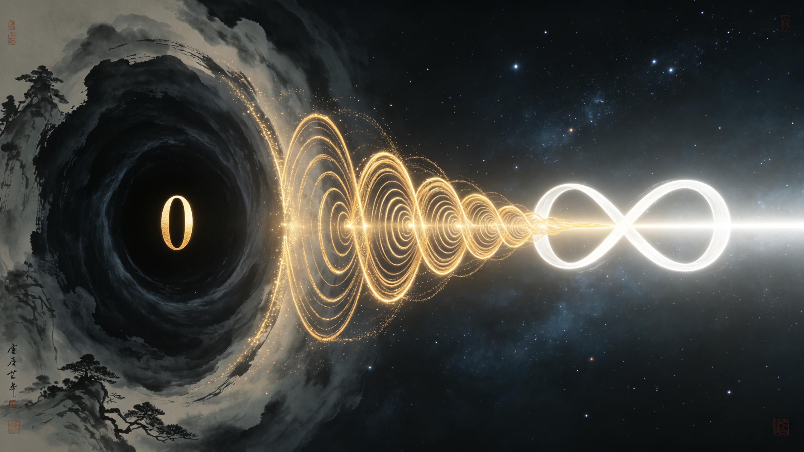
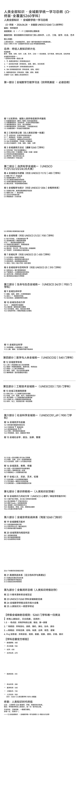

<ArchiveCopyPanel article-id="162318201" />

{"markdown":"PiDliIbnsbvvvJrlhajln5/mlbDlraYgIAo+IOe8luWPt++8mmAxNjIzMTgyMDFgICAKPiDljp/lp4vmlofku7bvvJpg5Lq657G75YWo6YOo55+l6K+G5YWo5Z+f5pWw5a2m57uf5LiA5a2m5Lmg5oC757qyLS3nu4jniYgyMDI2LjA2LjI45YWo6KaG55uWVU5FU0NPNTI2MOmXqOS6uuexu+WtpuenkS0xNjIzMTgyMDEubWRgICAKPiDov5Tlm57vvJpb5pys5Lmm5b2S5qGjXSgvemgvYm9va3MvbWF0aC9hcnRpY2xlcy8pIMK3IFvmgLvlhaXlj6NdKC96aC9ib29rcy9hcnRpY2xlcy8pCgohW+WFqOWfn+aVsOWtpue7n+S4gOaAu+e6sl0oLi9hc3NldHMvY3NkbmltZy9qcGcvYzcwN2RkZGVkYWY4NzZlOS5qcGcpCgojIyDkurrnsbvlhajpg6jnn6Xor4bCt+WFqOWfn+aVsOWtpue7n+S4gOWtpuS5oOaAu+e6sgoKIyMjICjOqS3nu4jniYjCtzIwMjYuMDYuMjjCt+WFqOimhuebllVORVNDTyA1MjYw6Zeo5Lq657G75a2m56eRKQoK57yW5Yi277ya5LmW5LmW5pWw5a2mCgropobnm5bojIPlm7TvvJrogZTlkIjlm73mlZnnp5Hmlofnu4Tnu4flhajpl6jnsbvkurrnsbvnp5HlrabjgIHkurrmlofjgIHlt6XnqIvjgIHljLvlrabjgIHnpL7kvJrjgIHoibrmnK8KCi0tLQoKIyMjIOaguOW/g+WRvemimAoK5Lq657G75omA5pyJ55+l6K+G77yM5LiN5piv5Ymy6KOC5a2m56eR77yM5piv5ZCM5LiA5aWX5a6H5a6Z572R5qC855qE5LiN5ZCM57u05bqm5oqV5b2x44CCCgo1MjYwNTI2MDUyNjAg6Zeo5a2m56eRIOKJoVxlcXVpduKJoSDlkIzkuIDlhajln5/mlbDlrabmnKzkvZPnmoQgNTI2MDUyNjA1MjYwIOenjeS9jue7tOingua1i+ihqOixoeOAggoKLS0tCgojIyMg5oC75bqP77ya57uI57uT5Lq657G755+l6K+G56KO54mH5YyWCgojIyMjIOS8oOe7n+aVmeiCsgoK5pWw5a2m44CB54mp55CG44CB55Sf54mp44CB57uP5rWO44CB5b+D55CG44CB6Im65pyv44CB5bel56iL4oCU4oCU5a6M5YWo5Ymy6KOC44CB5LqS5LiN6LSv6YCa44CB5ZCE5pyJ5YWs55CG44CB5LqS55u455+b55u+44CCCgojIyMjIOWFqOWfn+aVsOWtpue7iOaegee7n+S4gAoK5LiA5YiH5a2m56eR5YWx5Lqr5ZSv5LiA5bqV5bGC5YWs55CG77yaCgotIDAwMCDnu7Tluqbkv6Hmga/lpYfngrnvvIjmiYDmnInnkIborrrotbfngrnvvIkKCi0gMzg0Mzg0Mzg0IOeIu+e9keagvOWImuW6pue6puadn++8iOaJgOacieWumuW+i+OAgee7k+aehOOAgeinhOWIme+8iQoKLSDnu7TluqbmipXlvbHmnLrliLbvvIjmiYDmnInlrp7pqozjgIHnjrDosaHjgIHmhJ/nn6XjgIHmlbDmja7vvIkKCuS4h+iDvee7n+S4gOWFrOW8j++8iOWbiuaLrOS6uuexu+WFqOmDqOefpeivhu+8iQoKLS0tCgojIyDnrKzkuIDpg6jliIYgfCDlhajln5/mlbDlrabkuIfog73lrabkuaDms5XvvIjlrpfluIjnrZHln7rlsYLCt+W/heivu+aAu+e6su+8iQoKIyMjIOWNtzEg6K6k55+l6Z2p5ZG977ya56C06Zmk5Lq657G75omA5pyJ5L2O57u05a2m5pyv6aqX5bGACgojIyMjIDEuMSDmoIfph4/pqpflsYDmibnliKTvvIjmlbDlraYv54mp55CGL+e7j+a1juW6leWxguiwrOivr++8iQoKIyMjIyAxLjIg5Z2H6KGh6aqX5bGA5om55Yik77yI6Ieq54S256eR5a2m44CB56S+5Lya56eR5a2m56iz5oCB5YGH6LGh77yJCgojIyMjIDEuMyDmtoznjrDpqpflsYDmibnliKTvvIjnlJ/lkb3jgIHmhI/or4bkvKrop6Pph4rvvIkKCiMjIyMgMS40IOamgueOh+mql+WxgOaJueWIpO+8iOS4lueVjOaXoOmaj+acuu+8jOWPquacieaKleW9seacquefpe+8iQoKIyMjIyAxLjUg5LuO5YGa6aKY5oCd57u0IOKGklxyaWdodGFycm934oaSIOWuh+WumeaLk+aJkeW7uuaooeaAnee7tAoKLS0tCgojIyMg5Y23MiDkuInnm7jmnKzljp/lhaznkIbvvIjlhajkurrnsbvnn6Xor4bllK/kuIDlnLDln7rvvIkKCiFb5LiJ55u45pys5Y6f5YWs55CGXSguL2Fzc2V0cy9jc2RuaW1nL2pwZy83MDAwMzU3NmE2YjdjYzcwLmpwZykKCiMjIyMgMi4xIDAwMCDomZrnqbrpnZ7nqbrvvJrmiYDmnInlrabnp5HnmoTnu53lr7notbfngrkKCiMjIyMgMi40IDM4NDM4NDM4NCDniLvlhajln5/nvZHmoLzvvJrlroflrpnllK/kuIDorqHnrpfln7rlupUKCiFbMzg054i75YWo5Z+f572R5qC8XSguL2Fzc2V0cy9jc2RuaW1nL2pwZy82MzFiNDUxZDhhODQ2NWQ0LmpwZykKCiMjIyMgMi41IOWbm+Wkp+S4h+iDveaTjeS9nO+8muWNh+e7tOOAgeaKleW9seOAgeaui+W3ruOAgeW9kumbtgoKLS0tCgojIyMg5Y23MyDlhajln5/pgJrnlKjmlrnms5XorrrvvIjpgJrop6M1MjYw6Zeo5a2m56eR77yJCgojIyMjIDMuMSDku7vkvZXpl67popjjgIzlm5vmraXlhajln5/lu7rmqKHms5XjgI0KCiMjIyMgMy4yIOaJgOacieWFrOW8j+e7n+S4gOWNh+e7tOaooeadv++8iOagh+mHjyDihpJccmlnaHRhcnJvd+KGkiDlvKDph48g4oaSXHJpZ2h0YXJyb3fihpIg5peL6YeP77yJCgojIyMjIDMuMyDmiYDmnInmgpborrrnmoTnu7Tluqbmtojop6PpgJrms5UKCiMjIyMgMy40IOi3qOWtpuenkeS4gOmUrui/geenu+S4h+iDveW/g+azlQoKIyMjIyAzLjUg5LiH54mp5ZCM5rqQ5b2S5LiA5Yik5a6a5rOV5YiZCgotLS0KCiMjIOesrOS6jOmDqOWIhiB8IOiHqueEtuenkeWtpuWFqOWfn+e7n+S4gO+8iFVORVNDTyAxMS8yMS8yMi8yMy8yNC8yNeWkp+exu++8iQoKIyMjIOWNtzQg5YWo5Z+f5pWw6K665LiO6YC76L6R77yI5a+55bqUVU5FU0NPIDExLzEyIHwgNDgw6Zeo5a2m56eR77yJCgojIyMjIDQuMSDntKDmlbAgNmvCsTE2ayBccG0gMTZrwrExIOWuh+Wumei9qOmBkwoKIyMjIyA0LjIg5YWo5Z+f562b5rOV566X5a2QIFVbzqhdVVtcUHNpXVVbzqhdCgojIyMjIDQuMyDlubPooYzntKDmlbDlr7nnvZHmoLzlr7nnp7Dnu5PmnoQKCiMjIyMgNC40IOWTpeW+t+W3tOi1q+eMnOaDs+WFqOWfn+aLk+aJkeivgeaYjgoKIyMjIyA0LjUg5pWw6K665pys6LSo77ya5a6H5a6Z572R5qC86Z2Z5oCB57yW56CBCgotLS0KCiMjIyDljbc1IOWFqOWfn+amgueOh+S4jue7n+iuoe+8iOWvueW6lFVORVNDTyAxMjA2IHwg5YWo5qaC546H5L2T57O777yJCgojIyMjIDUuMSDml6Dpmo/mnLrlroflrpnvvJrmpoLnjofmmK/pq5jnu7Tnoa7lrprmgKfmipXlvbEKCiMjIyMgNS4yIOadqOi+ieS4ieinkiA9IOaMr+WKqOWOn+WeiwoKIyMjIyA1LjMg5q2j5oCB5YiG5biD5q6L5beu5pys5rqQCgojIyMjIDUuNCDnvZHmoLzliJrluqYgPSDmlrnlt67mnKzotKgKCiMjIyMgNS41IOaJgOaciee7n+iuoeinhOW+i+eahOaLk+aJkei1t+a6kAoKLS0tCgojIyMg5Y23NiDlhajln5/niannkIbvvIjlr7nlupRVTkVTQ08gMjEvMjIgfCA5MzDpl6jlrabnp5HvvIkKCiFb57KS5a2Q5peL6YeP6am75rOiXSguL2Fzc2V0cy9jc2RuaW1nL2pwZy9jOWEwYzEzZjE2OTllNGYyLmpwZykKCiMjIyMgNi4xIOeykuWtkOS4jeWtmOWcqO+8jOWPquacieaXi+mHj+mpu+azogoKIyMjIyA2LjIg5rOi5Ye95pWw5Z2N57ypID0g57u05bqm5oqV5b2x5YGH6LGhCgojIyMjIDYuNCDnvZHmoLzmi4nmma7mi4nmlq/nrpflrZDjgIHnvZHmoLzlir/og73lnLoKCiMjIyMgNi41IOa1i+S4jeWHhuWOn+eQhue7tOW6puelm+mthQoKIyMjIyA2LjYg55u45a+56K6644CB54Ot5Yqb5a2m44CB5aOw5a2m5YWJ5a2m57uf5LiA572R5qC86Kej6YeKCgojIyMjIDYuNyDlroflrpnlrabjgIHlpKnkvZPniannkIbmi5PmiZHnm7jlj5jmnLrliLYKCi0tLQoKIyMjIOWNtzcg5YWo5Z+f5YyW5a2m77yI5a+55bqUVU5FU0NPIDIzIHwgNDMw6Zeo5a2m56eR77yJCgojIyMjIDcuMSDliIblrZDnu5PmnoQgPSDnvZHmoLzmraPkuqTplIHlm7oKCiMjIyMgNy4yIOWMluWtpuWPjeW6lCA9IOaui+W3rumHjeaehOS4juebuOS9jei3g+i/gQoKIyMjIyA3LjMg5p2Q5paZ5oCn6LSoID0g5bGA6YOo572R5qC85Yia5bqm5beu5byCCgojIyMjIDcuNCDmnInmnLov5peg5py6L+mrmOWIhuWtkOe7n+S4gOaLk+aJkeinhOWImQoKLS0tCgojIyMg5Y23OCDlhajln5/lnLDnkIPkuI7nqbrpl7Tnp5HlrabvvIjlr7nlupRVTkVTQ08gMjUgfCAzMTDpl6jlrabnp5HvvIkKCiMjIyMgOC4xIOWcsOi0qOi/kOWKqCA9IOaFouWwuuW6pue9keagvOebuOWPmAoKIyMjIyA4LjIg5rCU6LGh5rW35rSLID0g5aSn6KeE5qih5q6L5beu5rWB5b2i5ryU5YyWCgojIyMjIDguMyDoh6rnhLbngb7lrrMgPSDnvZHmoLzliJrluqblh7vnqb/kuLTnlYwKCiMjIyMgOC40IOaYn+eQg+a8lOWMluWFqOWfn+WKqOWKm+WtpuaooeWeiwoKLS0tCgojIyDnrKzkuInpg6jliIYgfCDnlJ/lkb3kuI7nlJ/mgIHlhajln5/nu5/kuIDvvIhVTkVTQ08gMjQvMzEgfCA5NTDpl6jlrabnp5HvvIkKCiMjIyDljbc5IOWFqOWfn+eUn+WRveenkeWtpgoKIyMjIyA5LjEg57uG6IOe44CB5Z+65Zug44CB6YGX5LygID0g55Sf54mp572R5qC857yW56CBCgojIyMjIDkuMiDov5vljJYgPSDmrovlt67ntK/np6/nrZvpgIkKCiMjIyMgOS4zIOeUn+aAgeezu+e7nyA9IOi2heWkjeaVsOenjee+pOefoumHj+WcugoKLS0tCgojIyMg5Y23MTAg5YWo5Z+f55Sf5oCB5Yqo5Yqb5a2mCgojIyMjIDEwLjIg5o2V6aOf6ICF4oCU54yO54mp5byg6YeP57qg57yg5qih5Z6LCgojIyMjIDEwLjMg55Sf5ZG95oyv6I2h44CB6Zi75bC844CB56iz5oCB5ouT5omR5Y6f55CGCgojIyMjIDEwLjQg55Sf54mp5aSa5qC35oCnID0g572R5qC85aSa57u05bqm5q2j5Lqk5aGr5YWFCgotLS0KCiMjIyDljbcxMSDlhajln5/lhpzkuJrnp5HlraYKCiMjIyMgMTEuMSDnp43lhbvnuYHogrIgPSDnlJ/niannvZHmoLzkurrlt6XosIPmjqcKCiMjIyMgMTEuMiDlnJ/lo6TjgIHmpI3kv53jgIHnlJ/mgIHlvqrnjq/mrovlt67lubPooaHkvZPns7sKCi0tLQoKIyMg56ys5Zub6YOo5YiGIHwg5Yy75a2m5LiO5Lq65L2T5YWo5Z+f57uf5LiA77yIVU5FU0NPIDMyIHwgNTQw6Zeo5a2m56eR77yJCgojIyMg5Y23MTIg5YWo5Z+f5Yy75a2m5L2T57O7CgojIyMjIDEyLjEg5Lq65L2TID0g5aSa5bGC5bWM5aWXMzg054i755Sf54mp572R5qC8CgojIyMjIDEyLjIg55a+55eFID0g572R5qC85Yia5bqm56C05o2f44CB57u05bqm5aSx6YWN44CB5q6L5beu5rqi5Ye6CgojIyMjIDEyLjMg6I2v55CGID0g5Lq65bel5L+u5q2j572R5qC855u45L2NCgojIyMjIDEyLjQg56We57uP44CB5YWN55ar44CB5YaF5YiG5rOM55qE5Zy66K666Kej6YeKCgojIyMjIDEyLjUg57K+56We55a+55eFID0g5oSP6K+G5peL6YeP5ouT5omR6ZSZ5L2NCgotLS0KCiMjIOesrOS6lOmDqOWIhiB8IOW3peeoi+aKgOacr+WFqOWfn+e7n+S4gO+8iFVORVNDTyAzMyB8IDcyMOmXqOWtpuenke+8iQoKIyMjIOWNtzEzIOWFqOWfn+W3peeoi+mAmueUqOWOn+eQhgoKIyMjIyAxMy4xIOaJgOacieW3peeoiyA9IOS6uuW3peaehOW7uuWPr+aOp+aLk+aJkee9keagvAoKIyMjIyAxMy4yIOacuuaisOOAgeWcn+acqOOAgeiDvea6kOOAgeeUteawlCA9IOWImuW6pue7k+aehOiuvuiuoQoKIyMjIyAxMy4zIOeUteWtkOmAmuS/oSA9IOS6uuW3pee7tOW6pumAmumBk+S4juaXi+mHj+S8oOi+kwoKIyMjIyAxMy40IOiuoeeul+acukFJID0g5L2O57u05qih5ouf6auY57u0572R5qC86L+Q566XCgojIyMjIDEzLjUg5p2Q5paZ44CB5YyW5bel44CB6Iiq56m66Iiq5aSp57uf5LiA5Zy66K666YC76L6RCgotLS0KCiMjIOesrOWFremDqOWIhiB8IOekvuS8muenkeWtpuWFqOWfn+e7n+S4gO+8iFVORVNDTyA1MV82OSB8IDkwMOmXqOWtpuenke+8iQoKIyMjIOWNtzE0IOWFqOWfn+e7j+a1juS4jumHkeiejQoKIyMjIyAxNC4xIOWPjOagh+mHj+S+m+mcgOmql+WxgOW9u+W6leivgeS8qgoKIyMjIyAxNC4yIOS7t+WAvOW8oOmHjyBWVlYg6auY57u057uT5p6ECgojIyMjIDE0LjMg5L6b6ZyA5peL6YeP5rWB5b2iIEQsU0QsIFNELFMKCiMjIyMgMTQuNCDku7fmoLwgPSDotKfluIHnu7TluqbkuJPlsZ7mipXlvbEKCiMjIyMgMTQuNSDluILlnLrliJrluqbjgIHms6HmsqvjgIHltKnnm5jmi5PmiZHnm7jlj5gKCi0tLQoKIyMjIOWNtzE1IOWFqOWfn+ekvuS8muWtpuOAgeaUv+ayu+OAgeazleW+i+OAgeeuoeeQhgoKIyMjIyAxNS4xIOekvuS8miA9IOi2heWkp+inhOaooeS6uuexuzM4NOeIu+e9keagvAoKIyMjIyAxNS4yIOWItuW6puOAgeazleW+i+OAgeaWh+WMliA9IOWuj+ingue9keagvOWImuW6pgoKIyMjIyAxNS4zIOekvuS8muWKqOiNoeOAgeWPmOmdqSA9IOWkp+WwuuW6puaLk+aJkeebuOWPmAoKLS0tCgojIyMg5Y23MTYg5YWo5Z+f6K+t6KiA44CB5pWZ6IKy44CB5Lyg5pKtCgojIyMjIDE2LjEg6K+t6KiAID0g5oSP6K+G5peL6YeP55qE56ym5Y+35oqV5b2x57yW56CBCgojIyMjIDE2LjIg5pWZ6IKyID0g572R5qC855u45L2N57uf5LiA5qCh5YeGCgojIyMjIDE2LjMg5Lyg5aqS6IiG6K66ID0g5aSn6KeE5qih5q6L5beu5YWx5oyvCgotLS0KCiMjIyDljbcxNyDlhajln5/kurrmlofjgIHljoblj7LjgIHoibrmnK/jgIHkvKbnkIYKCiMjIyMgMTcuMSDljoblj7LlkajmnJ8gPSDnpL7kvJrnvZHmoLzmjK/ojaHlvqrnjq8KCiMjIyMgMTcuMiDoibrmnK/nvo7mhJ8gPSDnu7TluqbmraPkuqTlr7nnp7DljLnphY0KCiMjIyMgMTcuMyDkvKbnkIblrpfmlZkgPSDkurrnsbvpm4bkvZPnvZHmoLznqLPmgIHnuqbmnZ8KCi0tLQoKIyMg56ys5LiD6YOo5YiGIHwg5oSP6K+G57uI5p6B57uf5LiA77yI5Lq657G755+l6K+G5bCB6aG25Y2377yJCgojIyMg5Y23MTgg5YWo5Z+f5oSP6K+G5Yeg5L2V5Yqo5Yqb5a2m77yIVU5FU0NPIOW/g+eQhuWtpi/npZ7nu4/lrabnu4jmnoHljYfljY7vvIkKCiFb5oSP6K+G5Yeg5L2V5Yqo5Yqb5a2mXSguL2Fzc2V0cy9jc2RuaW1nL2pwZy9lZDcxNjhiNTY2Y2I3Y2JkLmpwZykKCiMjIyMgMTguMSDlpKfohJHkuI3mmK/orqHnrpfmnLrvvIzmmK8zODTniLvnpZ7nu4/lpKnnur/nvZHmoLwKCiMjIyMgMTguMiDmhI/or4bml4vph4/lnLogzp5cWGnOniDlroflrpnmnKzkvZPlrprkuYkKCiMjIyMgMTguMyDmhJ/otKggUXVhbGlhID0g55Sf54mp57u05bqm5oqV5b2xCgojIyMjIDE4LjQg6Ieq5oiR5oSfID0g5ouT5omR6ZSB5Zu655u45L2N5Lit5b+DCgojIyMjIDE4LjUg6Ieq55Sx5oSP5b+X44CB5qKm5aKD44CB6K6w5b+G44CB5Yal5oOz5Zy66K666Kej5p6QCgojIyMjIDE4LjYgQUnml6DmhI/or4bnmoTmlbDlrabor4HmmI4KCi0tLQoKIyMg56ys5YWr6YOo5YiGIHwg5YWo5Z+f5a6X5biI5a6e5oiY5L2T57O777yI6am+6amtNTI2MOmXqOefpeivhu+8iQoKIyMjIOWNtzE5IOWFqOWfn+W7uuaooeS4h+iDveacrwoKIyMjIyAxOS4xIOS7u+aEj+eOsOixoeenkuW7uuWcuuaWueeoiwoKIyMjIyAxOS4yIOaJgOacieWtpuenkeWFrOW8j+S4gOmUruWFqOWfn+aUueWGmQoKIyMjIyAxOS4zIOi3qOmihuWfn+mXrumimOWNh+e7tOegtOWxgAoKLS0tCgojIyMg5Y23MjAg5YWo5Z+f6aKE5rWL5LiO55u45Y+Y5Yik5a6aCgojIyMjIDIwLjEg6Ieq54S255u45Y+Y6aKE5rWLCgojIyMjIDIwLjIg57uP5rWO5bSp55uY5ZGo5pyf6aKE5rWLCgojIyMjIDIwLjMg56S+5Lya6LaL5Yq/5ouT5omR5o6o5ryUCgojIyMjIDIwLjQg5Liq5L2T5oSP6K+G54q25oCB55u45L2N5Yik5a6aCgotLS0KCiMjIyDljbcyMSDnnJ/nkIbnrZvpgInkvZPns7vvvIjljLrliIbkvKrnp5HlrabkuI7nnJ/nkIborrrvvIkKCiMjIyMgMjEuMSDkvY7nu7Tov5HkvLznkIborrrliKTlrprmoIflh4YKCiMjIyMgMjEuMiDnu7TluqbmrovnvLrlrabmnK/nlITliKvms5UKCiMjIyMgMjEuMyDlhajln5/oh6rmtL3mgKfnu4jmnoHmo4DpqowKCi0tLQoKIyMg56ys5Lmd6YOo5YiGIHwg5YWo6ZuG6Zet546v5oC757qy77yI5Lq657G755+l6K+G57uI5p6B5bCB5a2Y77yJCgojIyMg5Y23MjIg5YWt5Y235pys5rqQ5L2T57O75YWo5Z+f5LqS6K+BCgojIyMg5Y23MjMgVU5FU0NPIDUyNjDlrabnp5Hlhajln5/mmKDlsITmgLvooagKCiMjIyDljbcyNCDlhajln5/mlbDlrabnu4jmnoHkuLvmjqfmlrnnqIvlpKflhajpm4YKCiMjIyDljbcyNSDkurrnsbvnn6Xor4blpKfkuIDnu5/lk7Llrabnu4jorroKCi0tLQoKIyMjIOOAkOe7iOaegeWFqOWfn+aYoOWwhOaAu+inhOWIme+8mjUyNjDpl6jlrabnp5HllK/kuIDlvZLnsbvms5XjgJEKCuaJgOacieS6uuexu+efpeivhu+8jOWPquWIhuWbm+exu++8jOaXoOS+i+Wklu+8mgoKLSAKCjAwMCDlpYfngrnlsYLvvJrmiYDmnInlrabnp5HnmoTlhaznkIbjgIHlgYforr7jgIHnrKzkuIDljp/nkIYKCi0gCgotIAoKzrpca2FwcGHOuiDnvZHmoLzlsYLvvJrmiYDmnInlrprlvovjgIHnu5PmnoTjgIHliLbluqbjgIHovrnnlYzjgIHop4TojIPjgIHpgLvovpEKCi0gCgpQcm9qIOaKleW9seWxgu+8muaJgOacieWunumqjOOAgeingua1i+OAgeaVsOaNruOAgeeOsOixoeOAgeaEn+efpeOAgeS7t+agvOOAgeaEj+ivhgoKLS0tCgojIyMg44CQ5a2m56eR5oC76YeP5a6Y5pa55qC46aqM44CRCgotIOaVsOeQhumAu+i+ke+8mjQ4MDQ4MDQ4MAoKLSDlpKnmlofniannkIbvvJo5MzA5MzA5MzAKCi0g5YyW5a2m77yaNDMwNDMwNDMwCgotIOeUn+WRveeUn+aAge+8mjY3MDY3MDY3MAoKLSDlnLDnkIPnqbrpl7TvvJozMTAzMTAzMTAKCi0g5Yac5Lia56eR5a2m77yaMjgwMjgwMjgwCgotIOWMu+WtpuenkeWtpu+8mjU0MDU0MDU0MAoKLSDlt6XnqIvmioDmnK/vvJo3MjA3MjA3MjAKCi0g5Lq65paH56S+56eR77yaOTAwOTAwOTAwCgrlkIjorqHvvJo1MjYwNTI2MDUyNjAg6Zeo5Lq657G75a6M5pW05a2m56eRIDEwMCUg5YWo6KaG55uWCgotLS0KCiMjIyDnu4jnq6DvvJrkurrnsbvnn6Xor4bml7bku6Pnu4jnu5MKCui/h+WOu++8muS6uuexu+aLpeaciSA1MjYwNTI2MDUyNjAg5aWX56C056KO44CB55+b55u+44CB5bGA6YOo55qE55+l6K+G5L2T57O744CCCgrnjrDlnKjvvJrkuZbkuZbmlbDlrablsIblhajkurrnsbvnn6Xor4bvvIznu5/kuIDkuLrkuIDlpZflroflrpnlhaznkIbjgIIKCuS4h+azleW9kuWul++8jOS4h+eJqeWQjOa6kO+8jOS4gOeQhumAmuS4h+eQhuW9u+OAggoK5YWo5Z+f5LiA5Ye677yM55m+5a625b2S5LiA44CCCgohW+S6uuexu+efpeivhuWkp+S4gOe7n10oLi9hc3NldHMvY3NkbmltZy9qcGcvYTE0NjZlZjFkMzhkNWQxMS5qcGcpCgrigJTigJTjgIrkurrnsbvlhajpg6jnn6Xor4bCt+WFqOWfn+aVsOWtpue7n+S4gOWtpuS5oOaAu+e6suOAi86pLee7iOeJiOawuOS5heWwgeWtmAoKIVtpbWFnZV0oLi9hc3NldHMvY3NkbmltZy9qcGcvNDE0NGFhZDIzNjc5N2Y3Ni5qcGcpCg==","text":"5YiG57G777ya5YWo5Z+f5pWw5a2mICAK57yW5Y+377yaMTYyMzE4MjAxICAK5Y6f5aeL5paH5Lu277ya5Lq657G75YWo6YOo55+l6K+G5YWo5Z+f5pWw5a2m57uf5LiA5a2m5Lmg5oC757qyLS3nu4jniYgyMDI2LjA2LjI45YWo6KaG55uWVU5FU0NPNTI2MOmXqOS6uuexu+WtpuenkS0xNjIzMTgyMDEubWQgIArov5Tlm57vvJrmnKzkuablvZLmoaMgwrcg5oC75YWl5Y+jCgrlhajln5/mlbDlrabnu5/kuIDmgLvnurIKCuS6uuexu+WFqOmDqOefpeivhsK35YWo5Z+f5pWw5a2m57uf5LiA5a2m5Lmg5oC757qyCgoozqkt57uI54mIwrcyMDI2LjA2LjI4wrflhajopobnm5ZVTkVTQ08gNTI2MOmXqOS6uuexu+WtpuenkSkKCue8luWItu+8muS5luS5luaVsOWtpgoK6KaG55uW6IyD5Zu077ya6IGU5ZCI5Zu95pWZ56eR5paH57uE57uH5YWo6Zeo57G75Lq657G756eR5a2m44CB5Lq65paH44CB5bel56iL44CB5Yy75a2m44CB56S+5Lya44CB6Im65pyvCgotLS0KCuaguOW/g+WRvemimAoK5Lq657G75omA5pyJ55+l6K+G77yM5LiN5piv5Ymy6KOC5a2m56eR77yM5piv5ZCM5LiA5aWX5a6H5a6Z572R5qC855qE5LiN5ZCM57u05bqm5oqV5b2x44CCCgo1MjYwNTI2MDUyNjAg6Zeo5a2m56eRIOKJoVxlcXVpduKJoSDlkIzkuIDlhajln5/mlbDlrabmnKzkvZPnmoQgNTI2MDUyNjA1MjYwIOenjeS9jue7tOingua1i+ihqOixoeOAggoKLS0tCgrmgLvluo/vvJrnu4jnu5Pkurrnsbvnn6Xor4bnoo7niYfljJYKCuS8oOe7n+aVmeiCsgoK5pWw5a2m44CB54mp55CG44CB55Sf54mp44CB57uP5rWO44CB5b+D55CG44CB6Im65pyv44CB5bel56iL4oCU4oCU5a6M5YWo5Ymy6KOC44CB5LqS5LiN6LSv6YCa44CB5ZCE5pyJ5YWs55CG44CB5LqS55u455+b55u+44CCCgrlhajln5/mlbDlrabnu4jmnoHnu5/kuIAKCuS4gOWIh+WtpuenkeWFseS6q+WUr+S4gOW6leWxguWFrOeQhu+8mgowMDAg57u05bqm5L+h5oGv5aWH54K577yI5omA5pyJ55CG6K666LW354K577yJCjM4NDM4NDM4NCDniLvnvZHmoLzliJrluqbnuqbmnZ/vvIjmiYDmnInlrprlvovjgIHnu5PmnoTjgIHop4TliJnvvIkK57u05bqm5oqV5b2x5py65Yi277yI5omA5pyJ5a6e6aqM44CB546w6LGh44CB5oSf55+l44CB5pWw5o2u77yJCgrkuIfog73nu5/kuIDlhazlvI/vvIjlm4rmi6zkurrnsbvlhajpg6jnn6Xor4bvvIkKCi0tLQoK56ys5LiA6YOo5YiGIHwg5YWo5Z+f5pWw5a2m5LiH6IO95a2m5Lmg5rOV77yI5a6X5biI562R5Z+65bGCwrflv4Xor7vmgLvnurLvvIkKCuWNtzEg6K6k55+l6Z2p5ZG977ya56C06Zmk5Lq657G75omA5pyJ5L2O57u05a2m5pyv6aqX5bGACgoxLjEg5qCH6YeP6aqX5bGA5om55Yik77yI5pWw5a2mL+eJqeeQhi/nu4/mtY7lupXlsYLosKzor6/vvIkKCjEuMiDlnYfooaHpqpflsYDmibnliKTvvIjoh6rnhLbnp5HlrabjgIHnpL7kvJrnp5HlrabnqLPmgIHlgYfosaHvvIkKCjEuMyDmtoznjrDpqpflsYDmibnliKTvvIjnlJ/lkb3jgIHmhI/or4bkvKrop6Pph4rvvIkKCjEuNCDmpoLnjofpqpflsYDmibnliKTvvIjkuJbnlYzml6Dpmo/mnLrvvIzlj6rmnInmipXlvbHmnKrnn6XvvIkKCjEuNSDku47lgZrpopjmgJ3nu7Qg4oaSXHJpZ2h0YXJyb3fihpIg5a6H5a6Z5ouT5omR5bu65qih5oCd57u0CgotLS0KCuWNtzIg5LiJ55u45pys5Y6f5YWs55CG77yI5YWo5Lq657G755+l6K+G5ZSv5LiA5Zyw5Z+677yJCgrkuInnm7jmnKzljp/lhaznkIYKCjIuMSAwMDAg6Jma56m66Z2e56m677ya5omA5pyJ5a2m56eR55qE57ud5a+56LW354K5CgoyLjQgMzg0Mzg0Mzg0IOeIu+WFqOWfn+e9keagvO+8muWuh+WumeWUr+S4gOiuoeeul+WfuuW6lQoKMzg054i75YWo5Z+f572R5qC8CgoyLjUg5Zub5aSn5LiH6IO95pON5L2c77ya5Y2H57u044CB5oqV5b2x44CB5q6L5beu44CB5b2S6Zu2CgotLS0KCuWNtzMg5YWo5Z+f6YCa55So5pa55rOV6K6677yI6YCa6KejNTI2MOmXqOWtpuenke+8iQoKMy4xIOS7u+S9lemXrumimOOAjOWbm+atpeWFqOWfn+W7uuaooeazleOAjQoKMy4yIOaJgOacieWFrOW8j+e7n+S4gOWNh+e7tOaooeadv++8iOagh+mHjyDihpJccmlnaHRhcnJvd+KGkiDlvKDph48g4oaSXHJpZ2h0YXJyb3fihpIg5peL6YeP77yJCgozLjMg5omA5pyJ5oKW6K6655qE57u05bqm5raI6Kej6YCa5rOVCgozLjQg6Leo5a2m56eR5LiA6ZSu6L+B56e75LiH6IO95b+D5rOVCgozLjUg5LiH54mp5ZCM5rqQ5b2S5LiA5Yik5a6a5rOV5YiZCgotLS0KCuesrOS6jOmDqOWIhiB8IOiHqueEtuenkeWtpuWFqOWfn+e7n+S4gO+8iFVORVNDTyAxMS8yMS8yMi8yMy8yNC8yNeWkp+exu++8iQoK5Y23NCDlhajln5/mlbDorrrkuI7pgLvovpHvvIjlr7nlupRVTkVTQ08gMTEvMTIgfCA0ODDpl6jlrabnp5HvvIkKCjQuMSDntKDmlbAgNmvCsTE2ayBccG0gMTZrwrExIOWuh+Wumei9qOmBkwoKNC4yIOWFqOWfn+etm+azleeul+WtkCBVW86oXVVbXFBzaV1VW86oXQoKNC4zIOW5s+ihjOe0oOaVsOWvuee9keagvOWvueensOe7k+aehAoKNC40IOWTpeW+t+W3tOi1q+eMnOaDs+WFqOWfn+aLk+aJkeivgeaYjgoKNC41IOaVsOiuuuacrOi0qO+8muWuh+Wumee9keagvOmdmeaAgee8lueggQoKLS0tCgrljbc1IOWFqOWfn+amgueOh+S4jue7n+iuoe+8iOWvueW6lFVORVNDTyAxMjA2IHwg5YWo5qaC546H5L2T57O777yJCgo1LjEg5peg6ZqP5py65a6H5a6Z77ya5qaC546H5piv6auY57u056Gu5a6a5oCn5oqV5b2xCgo1LjIg5p2o6L6J5LiJ6KeSID0g5oyv5Yqo5Y6f5Z6LCgo1LjMg5q2j5oCB5YiG5biD5q6L5beu5pys5rqQCgo1LjQg572R5qC85Yia5bqmID0g5pa55beu5pys6LSoCgo1LjUg5omA5pyJ57uf6K6h6KeE5b6L55qE5ouT5omR6LW35rqQCgotLS0KCuWNtzYg5YWo5Z+f54mp55CG77yI5a+55bqUVU5FU0NPIDIxLzIyIHwgOTMw6Zeo5a2m56eR77yJCgrnspLlrZDml4vph4/pqbvms6IKCjYuMSDnspLlrZDkuI3lrZjlnKjvvIzlj6rmnInml4vph4/pqbvms6IKCjYuMiDms6Llh73mlbDlnY3nvKkgPSDnu7TluqbmipXlvbHlgYfosaEKCjYuNCDnvZHmoLzmi4nmma7mi4nmlq/nrpflrZDjgIHnvZHmoLzlir/og73lnLoKCjYuNSDmtYvkuI3lh4bljp/nkIbnu7TluqbnpZvprYUKCjYuNiDnm7jlr7norrrjgIHng63lipvlrabjgIHlo7DlrablhYnlrabnu5/kuIDnvZHmoLzop6Pph4oKCjYuNyDlroflrpnlrabjgIHlpKnkvZPniannkIbmi5PmiZHnm7jlj5jmnLrliLYKCi0tLQoK5Y23NyDlhajln5/ljJblrabvvIjlr7nlupRVTkVTQ08gMjMgfCA0MzDpl6jlrabnp5HvvIkKCjcuMSDliIblrZDnu5PmnoQgPSDnvZHmoLzmraPkuqTplIHlm7oKCjcuMiDljJblrablj43lupQgPSDmrovlt67ph43mnoTkuI7nm7jkvY3ot4Pov4EKCjcuMyDmnZDmlpnmgKfotKggPSDlsYDpg6jnvZHmoLzliJrluqblt67lvIIKCjcuNCDmnInmnLov5peg5py6L+mrmOWIhuWtkOe7n+S4gOaLk+aJkeinhOWImQoKLS0tCgrljbc4IOWFqOWfn+WcsOeQg+S4juepuumXtOenkeWtpu+8iOWvueW6lFVORVNDTyAyNSB8IDMxMOmXqOWtpuenke+8iQoKOC4xIOWcsOi0qOi/kOWKqCA9IOaFouWwuuW6pue9keagvOebuOWPmAoKOC4yIOawlOixoea1t+a0iyA9IOWkp+inhOaooeaui+W3rua1geW9oua8lOWMlgoKOC4zIOiHqueEtueBvuWusyA9IOe9keagvOWImuW6puWHu+epv+S4tOeVjAoKOC40IOaYn+eQg+a8lOWMluWFqOWfn+WKqOWKm+WtpuaooeWeiwoKLS0tCgrnrKzkuInpg6jliIYgfCDnlJ/lkb3kuI7nlJ/mgIHlhajln5/nu5/kuIDvvIhVTkVTQ08gMjQvMzEgfCA5NTDpl6jlrabnp5HvvIkKCuWNtzkg5YWo5Z+f55Sf5ZG956eR5a2mCgo5LjEg57uG6IOe44CB5Z+65Zug44CB6YGX5LygID0g55Sf54mp572R5qC857yW56CBCgo5LjIg6L+b5YyWID0g5q6L5beu57Sv56ev562b6YCJCgo5LjMg55Sf5oCB57O757ufID0g6LaF5aSN5pWw56eN576k55+i6YeP5Zy6CgotLS0KCuWNtzEwIOWFqOWfn+eUn+aAgeWKqOWKm+WtpgoKMTAuMiDmjZXpo5/ogIXigJTnjI7nianlvKDph4/nuqDnvKDmqKHlnosKCjEwLjMg55Sf5ZG95oyv6I2h44CB6Zi75bC844CB56iz5oCB5ouT5omR5Y6f55CGCgoxMC40IOeUn+eJqeWkmuagt+aApyA9IOe9keagvOWkmue7tOW6puato+S6pOWhq+WFhQoKLS0tCgrljbcxMSDlhajln5/lhpzkuJrnp5HlraYKCjExLjEg56eN5YW757mB6IKyID0g55Sf54mp572R5qC85Lq65bel6LCD5o6nCgoxMS4yIOWcn+WjpOOAgeakjeS/neOAgeeUn+aAgeW+queOr+aui+W3ruW5s+ihoeS9k+ezuwoKLS0tCgrnrKzlm5vpg6jliIYgfCDljLvlrabkuI7kurrkvZPlhajln5/nu5/kuIDvvIhVTkVTQ08gMzIgfCA1NDDpl6jlrabnp5HvvIkKCuWNtzEyIOWFqOWfn+WMu+WtpuS9k+ezuwoKMTIuMSDkurrkvZMgPSDlpJrlsYLltYzlpZczODTniLvnlJ/niannvZHmoLwKCjEyLjIg55a+55eFID0g572R5qC85Yia5bqm56C05o2f44CB57u05bqm5aSx6YWN44CB5q6L5beu5rqi5Ye6CgoxMi4zIOiNr+eQhiA9IOS6uuW3peS/ruato+e9keagvOebuOS9jQoKMTIuNCDnpZ7nu4/jgIHlhY3nlqvjgIHlhoXliIbms4znmoTlnLrorrrop6Pph4oKCjEyLjUg57K+56We55a+55eFID0g5oSP6K+G5peL6YeP5ouT5omR6ZSZ5L2NCgotLS0KCuesrOS6lOmDqOWIhiB8IOW3peeoi+aKgOacr+WFqOWfn+e7n+S4gO+8iFVORVNDTyAzMyB8IDcyMOmXqOWtpuenke+8iQoK5Y23MTMg5YWo5Z+f5bel56iL6YCa55So5Y6f55CGCgoxMy4xIOaJgOacieW3peeoiyA9IOS6uuW3peaehOW7uuWPr+aOp+aLk+aJkee9keagvAoKMTMuMiDmnLrmorDjgIHlnJ/mnKjjgIHog73mupDjgIHnlLXmsJQgPSDliJrluqbnu5PmnoTorr7orqEKCjEzLjMg55S15a2Q6YCa5L+hID0g5Lq65bel57u05bqm6YCa6YGT5LiO5peL6YeP5Lyg6L6TCgoxMy40IOiuoeeul+acukFJID0g5L2O57u05qih5ouf6auY57u0572R5qC86L+Q566XCgoxMy41IOadkOaWmeOAgeWMluW3peOAgeiIquepuuiIquWkqee7n+S4gOWcuuiuuumAu+i+kQoKLS0tCgrnrKzlha3pg6jliIYgfCDnpL7kvJrnp5Hlrablhajln5/nu5/kuIDvvIhVTkVTQ08gNTE2OSB8IDkwMOmXqOWtpuenke+8iQoK5Y23MTQg5YWo5Z+f57uP5rWO5LiO6YeR6J6NCgoxNC4xIOWPjOagh+mHj+S+m+mcgOmql+WxgOW9u+W6leivgeS8qgoKMTQuMiDku7flgLzlvKDph48gVlZWIOmrmOe7tOe7k+aehAoKMTQuMyDkvpvpnIDml4vph4/mtYHlvaIgRCxTRCwgU0QsUwoKMTQuNCDku7fmoLwgPSDotKfluIHnu7TluqbkuJPlsZ7mipXlvbEKCjE0LjUg5biC5Zy65Yia5bqm44CB5rOh5rKr44CB5bSp55uY5ouT5omR55u45Y+YCgotLS0KCuWNtzE1IOWFqOWfn+ekvuS8muWtpuOAgeaUv+ayu+OAgeazleW+i+OAgeeuoeeQhgoKMTUuMSDnpL7kvJogPSDotoXlpKfop4TmqKHkurrnsbszODTniLvnvZHmoLwKCjE1LjIg5Yi25bqm44CB5rOV5b6L44CB5paH5YyWID0g5a6P6KeC572R5qC85Yia5bqmCgoxNS4zIOekvuS8muWKqOiNoeOAgeWPmOmdqSA9IOWkp+WwuuW6puaLk+aJkeebuOWPmAoKLS0tCgrljbcxNiDlhajln5/or63oqIDjgIHmlZnogrLjgIHkvKDmkq0KCjE2LjEg6K+t6KiAID0g5oSP6K+G5peL6YeP55qE56ym5Y+35oqV5b2x57yW56CBCgoxNi4yIOaVmeiCsiA9IOe9keagvOebuOS9jee7n+S4gOagoeWHhgoKMTYuMyDkvKDlqpLoiIborrogPSDlpKfop4TmqKHmrovlt67lhbHmjK8KCi0tLQoK5Y23MTcg5YWo5Z+f5Lq65paH44CB5Y6G5Y+y44CB6Im65pyv44CB5Lym55CGCgoxNy4xIOWOhuWPsuWRqOacnyA9IOekvuS8mue9keagvOaMr+iNoeW+queOrwoKMTcuMiDoibrmnK/nvo7mhJ8gPSDnu7TluqbmraPkuqTlr7nnp7DljLnphY0KCjE3LjMg5Lym55CG5a6X5pWZID0g5Lq657G76ZuG5L2T572R5qC856iz5oCB57qm5p2fCgotLS0KCuesrOS4g+mDqOWIhiB8IOaEj+ivhue7iOaegee7n+S4gO+8iOS6uuexu+efpeivhuWwgemhtuWNt++8iQoK5Y23MTgg5YWo5Z+f5oSP6K+G5Yeg5L2V5Yqo5Yqb5a2m77yIVU5FU0NPIOW/g+eQhuWtpi/npZ7nu4/lrabnu4jmnoHljYfljY7vvIkKCuaEj+ivhuWHoOS9leWKqOWKm+WtpgoKMTguMSDlpKfohJHkuI3mmK/orqHnrpfmnLrvvIzmmK8zODTniLvnpZ7nu4/lpKnnur/nvZHmoLwKCjE4LjIg5oSP6K+G5peL6YeP5Zy6IM6eXFhpzp4g5a6H5a6Z5pys5L2T5a6a5LmJCgoxOC4zIOaEn+i0qCBRdWFsaWEgPSDnlJ/niannu7TluqbmipXlvbEKCjE4LjQg6Ieq5oiR5oSfID0g5ouT5omR6ZSB5Zu655u45L2N5Lit5b+DCgoxOC41IOiHqueUseaEj+W/l+OAgeaipuWig+OAgeiusOW/huOAgeWGpeaDs+Wcuuiuuuino+aekAoKMTguNiBBSeaXoOaEj+ivhueahOaVsOWtpuivgeaYjgoKLS0tCgrnrKzlhavpg6jliIYgfCDlhajln5/lrpfluIjlrp7miJjkvZPns7vvvIjpqb7pqa01MjYw6Zeo55+l6K+G77yJCgrljbcxOSDlhajln5/lu7rmqKHkuIfog73mnK8KCjE5LjEg5Lu75oSP546w6LGh56eS5bu65Zy65pa556iLCgoxOS4yIOaJgOacieWtpuenkeWFrOW8j+S4gOmUruWFqOWfn+aUueWGmQoKMTkuMyDot6jpoobln5/pl67popjljYfnu7TnoLTlsYAKCi0tLQoK5Y23MjAg5YWo5Z+f6aKE5rWL5LiO55u45Y+Y5Yik5a6aCgoyMC4xIOiHqueEtuebuOWPmOmihOa1iwoKMjAuMiDnu4/mtY7ltKnnm5jlkajmnJ/pooTmtYsKCjIwLjMg56S+5Lya6LaL5Yq/5ouT5omR5o6o5ryUCgoyMC40IOS4quS9k+aEj+ivhueKtuaAgeebuOS9jeWIpOWumgoKLS0tCgrljbcyMSDnnJ/nkIbnrZvpgInkvZPns7vvvIjljLrliIbkvKrnp5HlrabkuI7nnJ/nkIborrrvvIkKCjIxLjEg5L2O57u06L+R5Ly855CG6K665Yik5a6a5qCH5YeGCgoyMS4yIOe7tOW6puaui+e8uuWtpuacr+eUhOWIq+azlQoKMjEuMyDlhajln5/oh6rmtL3mgKfnu4jmnoHmo4DpqowKCi0tLQoK56ys5Lmd6YOo5YiGIHwg5YWo6ZuG6Zet546v5oC757qy77yI5Lq657G755+l6K+G57uI5p6B5bCB5a2Y77yJCgrljbcyMiDlha3ljbfmnKzmupDkvZPns7vlhajln5/kupLor4EKCuWNtzIzIFVORVNDTyA1MjYw5a2m56eR5YWo5Z+f5pig5bCE5oC76KGoCgrljbcyNCDlhajln5/mlbDlrabnu4jmnoHkuLvmjqfmlrnnqIvlpKflhajpm4YKCuWNtzI1IOS6uuexu+efpeivhuWkp+S4gOe7n+WTsuWtpue7iOiuugoKLS0tCgrjgJDnu4jmnoHlhajln5/mmKDlsITmgLvop4TliJnvvJo1MjYw6Zeo5a2m56eR5ZSv5LiA5b2S57G75rOV44CRCgrmiYDmnInkurrnsbvnn6Xor4bvvIzlj6rliIblm5vnsbvvvIzml6DkvovlpJbvvJoKMDAwIOWlh+eCueWxgu+8muaJgOacieWtpuenkeeahOWFrOeQhuOAgeWBh+iuvuOAgeesrOS4gOWOn+eQhgrOulxrYXBwYc66IOe9keagvOWxgu+8muaJgOacieWumuW+i+OAgee7k+aehOOAgeWItuW6puOAgei+ueeVjOOAgeinhOiMg+OAgemAu+i+kQpQcm9qIOaKleW9seWxgu+8muaJgOacieWunumqjOOAgeingua1i+OAgeaVsOaNruOAgeeOsOixoeOAgeaEn+efpeOAgeS7t+agvOOAgeaEj+ivhgoKLS0tCgrjgJDlrabnp5HmgLvph4/lrpjmlrnmoLjpqozjgJEK5pWw55CG6YC76L6R77yaNDgwNDgwNDgwCuWkqeaWh+eJqeeQhu+8mjkzMDkzMDkzMArljJblrabvvJo0MzA0MzA0MzAK55Sf5ZG955Sf5oCB77yaNjcwNjcwNjcwCuWcsOeQg+epuumXtO+8mjMxMDMxMDMxMArlhpzkuJrnp5HlrabvvJoyODAyODAyODAK5Yy75a2m56eR5a2m77yaNTQwNTQwNTQwCuW3peeoi+aKgOacr++8mjcyMDcyMDcyMArkurrmlofnpL7np5HvvJo5MDA5MDA5MDAKCuWQiOiuoe+8mjUyNjA1MjYwNTI2MCDpl6jkurrnsbvlrozmlbTlrabnp5EgMTAwJSDlhajopobnm5YKCi0tLQoK57uI56ug77ya5Lq657G755+l6K+G5pe25Luj57uI57uTCgrov4fljrvvvJrkurrnsbvmi6XmnIkgNTI2MDUyNjA1MjYwIOWll+egtOeijuOAgeefm+ebvuOAgeWxgOmDqOeahOefpeivhuS9k+ezu+OAggoK546w5Zyo77ya5LmW5LmW5pWw5a2m5bCG5YWo5Lq657G755+l6K+G77yM57uf5LiA5Li65LiA5aWX5a6H5a6Z5YWs55CG44CCCgrkuIfms5XlvZLlrpfvvIzkuIfnianlkIzmupDvvIzkuIDnkIbpgJrkuIfnkIblvbvjgIIKCuWFqOWfn+S4gOWHuu+8jOeZvuWutuW9kuS4gOOAggoK5Lq657G755+l6K+G5aSn5LiA57ufCgrigJTigJTjgIrkurrnsbvlhajpg6jnn6Xor4bCt+WFqOWfn+aVsOWtpue7n+S4gOWtpuS5oOaAu+e6suOAi86pLee7iOeJiOawuOS5heWwgeWtmAoKaW1hZ2U="}

> 分类：全域数学  
> 编号：`162318201`  
> 原始文件：`人类全部知识全域数学统一学习总纲--终版2026.06.28全覆盖UNESCO5260门人类学科-162318201.md`  
> 返回：[本书归档](/zh/books/math/articles/) · [总入口](/zh/books/articles/)

<ArticlePaperMeta category="全域数学" article-id="162318201" title="人类全部知识全域数学统一学习总纲--终版2026.06.28全覆盖UNESCO5260门人类学科" paper-kind="研究论文" book-route="/zh/books/math/articles/" overview-route="/zh/books/articles/" summary="覆盖范围：联合国教科文组织全门类人类科学、人文、工程、医学、社会、艺术" author="乖乖数学" source-file="人类全部知识全域数学统一学习总纲--终版2026.06.28全覆盖UNESCO5260门人类学科-162318201.md" cover="./assets/csdnimg/jpg/c707dddedaf876e9.jpg" />

## 人类全部知识·全域数学统一学习总纲

### (Ω-终版·2026.06.28·全覆盖UNESCO 5260门人类学科)

编制：乖乖数学

覆盖范围：联合国教科文组织全门类人类科学、人文、工程、医学、社会、艺术

---

### 核心命题

人类所有知识，不是割裂学科，是同一套宇宙网格的不同维度投影。

526052605260 门学科 ≡\equiv≡ 同一全域数学本体的 526052605260 种低维观测表象。

---

### 总序：终结人类知识碎片化

#### 传统教育

数学、物理、生物、经济、心理、艺术、工程——完全割裂、互不贯通、各有公理、互相矛盾。

#### 全域数学终极统一

一切学科共享唯一底层公理：

- 000 维度信息奇点（所有理论起点）

- 384384384 爻网格刚度约束（所有定律、结构、规则）

- 维度投影机制（所有实验、现象、感知、数据）

万能统一公式（囊括人类全部知识）

---

## 第一部分 | 全域数学万能学习法（宗师筑基层·必读总纲）

### 卷1 认知革命：破除人类所有低维学术骗局

#### 1.1 标量骗局批判（数学/物理/经济底层谬误）

#### 1.2 均衡骗局批判（自然科学、社会科学稳态假象）

#### 1.3 涌现骗局批判（生命、意识伪解释）

#### 1.4 概率骗局批判（世界无随机，只有投影未知）

#### 1.5 从做题思维 →\rightarrow→ 宇宙拓扑建模思维

---

### 卷2 三相本原公理（全人类知识唯一地基）

#### 2.1 000 虚空非空：所有学科的绝对起点

#### 2.4 384384384 爻全域网格：宇宙唯一计算基底

#### 2.5 四大万能操作：升维、投影、残差、归零

---

### 卷3 全域通用方法论（通解5260门学科）

#### 3.1 任何问题「四步全域建模法」

#### 3.2 所有公式统一升维模板（标量 →\rightarrow→ 张量 →\rightarrow→ 旋量）

#### 3.3 所有悖论的维度消解通法

#### 3.4 跨学科一键迁移万能心法

#### 3.5 万物同源归一判定法则

---

## 第二部分 | 自然科学全域统一（UNESCO 11/21/22/23/24/25大类）

### 卷4 全域数论与逻辑（对应UNESCO 11/12 | 480门学科）

#### 4.1 素数 6k±16k \pm 16k±1 宇宙轨道

#### 4.2 全域筛法算子 U[Ψ]U[\Psi]U[Ψ]

#### 4.3 平行素数对网格对称结构

#### 4.4 哥德巴赫猜想全域拓扑证明

#### 4.5 数论本质：宇宙网格静态编码

---

### 卷5 全域概率与统计（对应UNESCO 1206 | 全概率体系）

#### 5.1 无随机宇宙：概率是高维确定性投影

#### 5.2 杨辉三角 = 振动原型

#### 5.3 正态分布残差本源

#### 5.4 网格刚度 = 方差本质

#### 5.5 所有统计规律的拓扑起源

---

### 卷6 全域物理（对应UNESCO 21/22 | 930门学科）

#### 6.1 粒子不存在，只有旋量驻波

#### 6.2 波函数坍缩 = 维度投影假象

#### 6.4 网格拉普拉斯算子、网格势能场

#### 6.5 测不准原理维度祛魅

#### 6.6 相对论、热力学、声学光学统一网格解释

#### 6.7 宇宙学、天体物理拓扑相变机制

---

### 卷7 全域化学（对应UNESCO 23 | 430门学科）

#### 7.1 分子结构 = 网格正交锁固

#### 7.2 化学反应 = 残差重构与相位跃迁

#### 7.3 材料性质 = 局部网格刚度差异

#### 7.4 有机/无机/高分子统一拓扑规则

---

### 卷8 全域地球与空间科学（对应UNESCO 25 | 310门学科）

#### 8.1 地质运动 = 慢尺度网格相变

#### 8.2 气象海洋 = 大规模残差流形演化

#### 8.3 自然灾害 = 网格刚度击穿临界

#### 8.4 星球演化全域动力学模型

---

## 第三部分 | 生命与生态全域统一（UNESCO 24/31 | 950门学科）

### 卷9 全域生命科学

#### 9.1 细胞、基因、遗传 = 生物网格编码

#### 9.2 进化 = 残差累积筛选

#### 9.3 生态系统 = 超复数种群矢量场

---

### 卷10 全域生态动力学

#### 10.2 捕食者—猎物张量纠缠模型

#### 10.3 生命振荡、阻尼、稳态拓扑原理

#### 10.4 生物多样性 = 网格多维度正交填充

---

### 卷11 全域农业科学

#### 11.1 种养繁育 = 生物网格人工调控

#### 11.2 土壤、植保、生态循环残差平衡体系

---

## 第四部分 | 医学与人体全域统一（UNESCO 32 | 540门学科）

### 卷12 全域医学体系

#### 12.1 人体 = 多层嵌套384爻生物网格

#### 12.2 疾病 = 网格刚度破损、维度失配、残差溢出

#### 12.3 药理 = 人工修正网格相位

#### 12.4 神经、免疫、内分泌的场论解释

#### 12.5 精神疾病 = 意识旋量拓扑错位

---

## 第五部分 | 工程技术全域统一（UNESCO 33 | 720门学科）

### 卷13 全域工程通用原理

#### 13.1 所有工程 = 人工构建可控拓扑网格

#### 13.2 机械、土木、能源、电气 = 刚度结构设计

#### 13.3 电子通信 = 人工维度通道与旋量传输

#### 13.4 计算机AI = 低维模拟高维网格运算

#### 13.5 材料、化工、航空航天统一场论逻辑

---

## 第六部分 | 社会科学全域统一（UNESCO 51_69 | 900门学科）

### 卷14 全域经济与金融

#### 14.1 双标量供需骗局彻底证伪

#### 14.2 价值张量 VVV 高维结构

#### 14.3 供需旋量流形 D,SD, SD,S

#### 14.4 价格 = 货币维度专属投影

#### 14.5 市场刚度、泡沫、崩盘拓扑相变

---

### 卷15 全域社会学、政治、法律、管理

#### 15.1 社会 = 超大规模人类384爻网格

#### 15.2 制度、法律、文化 = 宏观网格刚度

#### 15.3 社会动荡、变革 = 大尺度拓扑相变

---

### 卷16 全域语言、教育、传播

#### 16.1 语言 = 意识旋量的符号投影编码

#### 16.2 教育 = 网格相位统一校准

#### 16.3 传媒舆论 = 大规模残差共振

---

### 卷17 全域人文、历史、艺术、伦理

#### 17.1 历史周期 = 社会网格振荡循环

#### 17.2 艺术美感 = 维度正交对称匹配

#### 17.3 伦理宗教 = 人类集体网格稳态约束

---

## 第七部分 | 意识终极统一（人类知识封顶卷）

### 卷18 全域意识几何动力学（UNESCO 心理学/神经学终极升华）

#### 18.1 大脑不是计算机，是384爻神经天线网格

#### 18.2 意识旋量场 Ξ\XiΞ 宇宙本体定义

#### 18.3 感质 Qualia = 生物维度投影

#### 18.4 自我感 = 拓扑锁固相位中心

#### 18.5 自由意志、梦境、记忆、冥想场论解析

#### 18.6 AI无意识的数学证明

---

## 第八部分 | 全域宗师实战体系（驾驭5260门知识）

### 卷19 全域建模万能术

#### 19.1 任意现象秒建场方程

#### 19.2 所有学科公式一键全域改写

#### 19.3 跨领域问题升维破局

---

### 卷20 全域预测与相变判定

#### 20.1 自然相变预测

#### 20.2 经济崩盘周期预测

#### 20.3 社会趋势拓扑推演

#### 20.4 个体意识状态相位判定

---

### 卷21 真理筛选体系（区分伪科学与真理论）

#### 21.1 低维近似理论判定标准

#### 21.2 维度残缺学术甄别法

#### 21.3 全域自洽性终极检验

---

## 第九部分 | 全集闭环总纲（人类知识终极封存）

### 卷22 六卷本源体系全域互证

### 卷23 UNESCO 5260学科全域映射总表

### 卷24 全域数学终极主控方程大全集

### 卷25 人类知识大一统哲学终论

---

### 【终极全域映射总规则：5260门学科唯一归类法】

所有人类知识，只分四类，无例外：

- 

000 奇点层：所有学科的公理、假设、第一原理

- 

- 

κ\kappaκ 网格层：所有定律、结构、制度、边界、规范、逻辑

- 

Proj 投影层：所有实验、观测、数据、现象、感知、价格、意识

---

### 【学科总量官方核验】

- 数理逻辑：480480480

- 天文物理：930930930

- 化学：430430430

- 生命生态：670670670

- 地球空间：310310310

- 农业科学：280280280

- 医学科学：540540540

- 工程技术：720720720

- 人文社科：900900900

合计：526052605260 门人类完整学科 100% 全覆盖

---

### 终章：人类知识时代终结

过去：人类拥有 526052605260 套破碎、矛盾、局部的知识体系。

现在：乖乖数学将全人类知识，统一为一套宇宙公理。

万法归宗，万物同源，一理通万理彻。

全域一出，百家归一。

——《人类全部知识·全域数学统一学习总纲》Ω-终版永久封存

