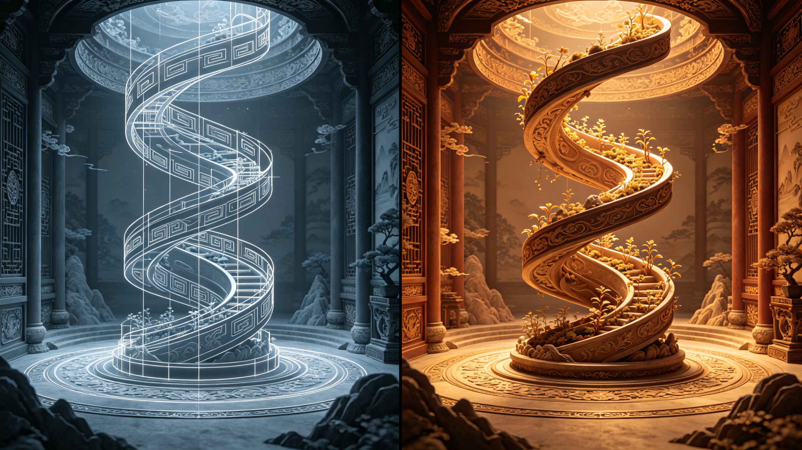

<ArchiveCopyPanel article-id="162373029" />

{"markdown":"PiDliIbnsbvvvJrlhajln5/mlbDlraYgIAo+IOe8luWPt++8mmAxNjIzNzMwMjlgICAKPiDljp/lp4vmlofku7bvvJpg5LiN5a6a56ev5YiG5LiN5piv5a+85pWw6YCG5ZCR6K6h566X5piv5rK/552A6J665peL6L2o6L+55Y+N5ZCR57Sv5Yqg5YWo6YOo5peg56m35bCP5b6u6KeC55Sf6ZW/5Y2V5YWD6L+Y5Y6f5a6M5pW05a6P6KeC6ISJ57ucLeWFqOWfn+aVsOWtpnZz5LygLTE2MjM3MzAyOS5tZGAgIAo+IOi/lOWbnu+8mlvmnKzkuablvZLmoaNdKC96aC9ib29rcy9tYXRoL2FydGljbGVzLykgwrcgW+aAu+WFpeWPo10oL3poL2Jvb2tzL2FydGljbGVzLykKCiFb5bCB6Z2iXSguL2Fzc2V0cy9jc2RuaW1nL2pwZy9lZGNiMGRhN2RjMmNjMzA2LmpwZykKCiMjIOOAiuWFqOWfn+aVsOWtpnZz5Lyg57uf5pWw5a2m77ya5Lq657G75paH5piO6L+b6Zi2MjAw6K6y44CL56ysNTPorrIg6auY5Lit6YCa5L+X54mI6YCQ5a2X56i/CgrorrLmrKHvvJog56ysNTPorrIKCuS4u+mimO+8miDkuI3lrprnp6/liIbkuI3mmK/lr7zmlbDpgIblkJHorqHnrpfvvIzmmK/msr/nnYDonrrml4vovajov7nlj43lkJHntK/liqDlhajpg6jml6DnqbflsI/lvq7op4LnlJ/plb/ljZXlhYPvvIzov5jljp/lrozmlbTlro/op4LohInnu5wKCuWvueagh+ivvuacrOefpeivhueCue+8miDkuI3lrprnp6/liIbjgIHljp/lh73mlbAKCuaWh+mjju+8miDlpKfnmb3or53jgIHml6DmmabmtqnkuJPkuJror43msYfvvIzlu7bnu60wLzHln7rngrnjgIHlj4zonrrml4vlhajlpZfmr5TllrsKCi0tLQoKIyMjIDDvvZ4z5YiG6ZKfIOWkjeS5oOWvvOWFpQoKIVvlpI3kuaDlr7zlhaVdKC4vYXNzZXRzL2NzZG5pbWcvanBnLzJlMTgyNjE3NTg3OWExYTUuanBnKQoK5ZCM5a2m5Lus77yM5LiK5LiA6IqC6K++5oiR5Lus5byE5oeC5LqG5b6u5YiG55qE5pys5rqQ77ya5b6u5YiGZHlkeWR55piv5a6P6KeC5Y+M6J665peL5ouG5YiG5Yiw5p6B6ZmQ5ZCO55qE5peg56m35bCP5b6u6KeC5Z+656GA55Sf6ZW/5Y2V5YWD77yMzpR5XERlbHRhIHnOlHnmmK/lpJrmrrXlvq7lhYPlj6DliqDlvaLmiJDnmoTnnJ/lrp7otbfkvI/ph4/jgIIKCumrmOS4reW+ruenr+WIhuaguOW/g+WGheWuueS4jeWumuenr+WIhu+8jOivvuacrOWumuS5ieS4uuWvvOaVsOeahOmAhui/kOeul++8jOW3suefpeWPmOWMlumAn+eOh+WPjeaOqOWOn+Wni+WHveaVsO+8jOWPquS9nOS4uuino+aWueeoi+OAgeaxguabsue6v+mdouenr+eahOWJjee9ruW3peWFt+OAggoK5LuK5aSp5oiR5Lus56uZ5ZyoMC8xL+KInuS4ieaegeacrOa6kOinhuinkumHjeaWsOino+ivu++8muS4jeWumuenr+WIhuS4jeaYr+S6uuS4uuiuvuiuoeeahOWPjeWQkei/kOeul++8jOW+ruWIhuaYr+aKiuWujOaVtOieuuaXi+aLhuaIkOaXoOaVsOW+ruWwj+WNleWFg++8jOS4jeWumuenr+WIhuWImeaYr+WPjeWQkeaKiuaJgOacieaXoOept+Wwj+W+ruWFg+WujOaVtOWghuWPoOOAgee0r+WKoO+8jOi/mOWOn+WHuuacgOWIneaVtOadoei/nue7reeUn+mVv+ieuuaXi++8m+W4uOaVsENDQ+S7o+ihqOieuuaXi+eUn+mVv+eahOWIneWni+WBj+enu+WfuueCue+8jOaYr+ieuuaXi+WkqeeEtuiHquW4pueahOWIneWni+S9jee9ruS9memHj+OAggoKLS0tCgojIyMgM++9njEz5YiG6ZKfIOeUn+a0u+WMluexu+avlOiusuinowoKIVvnlJ/mtLvljJbnsbvmr5RdKC4vYXNzZXRzL2NzZG5pbWcvanBnLzZjYTA2MGIwODVjY2VkNTYuanBnKQoK5YWI6K6y6K++5pys6YeM5LiN5a6a56ev5YiG6YC76L6R77yaCgrmlL7liLDlj4zonrrml4vnlJ/plb/kvZPns7vph4zvvJoKCmYoeClmKHgpZih4KeaYr+ieuuaXi+avj+S4gOWkhOW+ruinguWNleWFg+eahOWAvuaWnOaWnOeOh++8iOS5n+WwseaYr+WvvOaVsO+8ie+8jGR4ZHhkeOaYr+WNleS7veaXoOept+Wwj+eUn+mVv+W+ruWFg++8mwoK5bi45pWwQ0ND5Luj6KGo6J665peL55Sf6ZW/55qE5Yid5aeL5Z+65YeG5YGP56e777ya5ZCM5LiA5aWX5pac546H5b6u5YWD77yM5Y+v5LuOMOWfuueCueS4iuS4i+S7u+aEj+S9jee9ruW8gOWni+eUn+mVv++8jOWvueW6lOaXoOaVsOadoeW5s+ihjOWQjOa6kOieuuaXi++8jOWboOatpOenr+WIhuW/hemhu+mZhOW4puS4jeWumuW4uOaVsOOAggoK5Li+566A5Y2V5L6L5a2Q77yaCgrlhajln5/pgJrkv5fop6Por7vvvJoyeDJ4MnjmmK/mipvniannur/onrrml4vmr4/kuIDlpITlvq7op4LljZXlhYPnmoTlgL7mlpzmlpznjofvvIxkeGR4ZHjmmK/mnIDlsI/nlJ/plb/lvq7lhYPvvJvnp6/liIbmk43kvZzlsIbmiYDmnInlvq7lhYPpgJDlsYLntK/liqDvvIzov5jljp/lh7rlrozmlbTmipvniannur/onrrml4t4MnheMngy77yb5bi45pWwQ0ND5Luj6KGo5pW05p2h6J665peL5Y+v5Lul5pW05L2T5LiK5LiL5bmz56e777yM5a+55bqU5LiN5ZCM5Yid5aeL55Sf6ZW/5Z+654K577yM5LiN5piv5Lq65Li65re75Yqg55qE5aSa5L2Z56ym5Y+344CCCgror77mnKzlj6rmiornp6/liIblvZPmiJDmsYLlr7znmoTlj43lkJHorqHnrpflt6XlhbfvvIzlv73nlaXnp6/liIbmnKzotKjmmK/lj43lkJHloIblj6Dlvq7op4LljZXlhYPjgIHlpI3ljp/lrozmlbTonrrml4vnlJ/plb/ohInnu5znmoTljp/nlJ/ov4fnqIvjgIIKCi0tLQoKIyMjIDEz772eMjLliIbpkp8g6K++5pys6KeC54K5IHZzIOWFqOWfn+aVsOWtpumAmuS/l+ingueCuQoKIVvop4Lngrnlr7nmr5RdKC4vYXNzZXRzL2NzZG5pbWcvanBnLzExZjcxMjM1MDA5Njc3YTUuanBnKQoKIyMjIyDkvKDnu5/or77mnKzorqTnn6UKCi0g5LiN5a6a56ev5YiG5Y+q5piv5a+85pWw55qE5Lq65bel6YCG6L+Q566X77yM5LiN5a2Y5Zyo4oCc57Sv5Yqg5b6u6KeC5Y2V5YWD4oCd55qE5bqV5bGC57uT5p6E6YC76L6RCgotIOenr+WIhuW4uOaVsENDQ+aYr+iuoeeul+ihpeWFhemhue+8jOaXoOWvueW6lOeahOepuumXtOeUn+mVv+WQq+S5iQoKLSDnp6/liIbku4XnlKjkuo7lh6DkvZXpnaLnp6/jgIHniannkIbot6/nqIvorqHnrpfvvIzlkozkuIfnianov57nu63mvJTljJbjgIHog73ph4/ntK/np6/ml6DlhbMKCiMjIyMg5YWo5Z+f5pWw5a2m6YCa5L+X6K6k55+lCgotIOW+ruWIhuaLhuWIhuieuuaXi+OAgeS4jeWumuenr+WIhuWkjeWOn+ieuuaXi++8jOS6jOiAheaYr+WQjOS4gOWll+WPjOieuuaXi+e7k+aehOato+WPjeS4pOenjeingua1i+aTjeS9nO+8jOWFiOacieW+ruinguWNleWFg+WghuWPoOe7k+aehO+8jOWQjuacieenr+WIhuiuoeeul+WFrOW8jwoKLSDluLjmlbBDQ0Plr7nlupTlkIzmupDonrrml4vnmoTliJ3lp4vnlJ/plb/lgY/np7vph4/vvIzml6DnqbflpJrmnaHlubPooYzonrrml4vlhbHkuqvlkIzkuIDlpZflvq7op4LmlpznjofljZXlhYPvvIzmmK/lr7nnp7DnlJ/plb/oh6rluKbnibnlvoEKCi0g54mp5L2T6L+Q5Yqo5oC75L2N56e744CB6IO96YeP57Sv56ev44CB54mp6LSo5bGC5bGC5aCG56ev44CB6LaF5a+86IO96YeP5oC76YeP5rWL566X77yM5YWo6YOo5L6d6Z2g56ev5YiG57Sv5Yqg5b6u6KeC5Y2V5YWD55qE5bqV5bGC6YC76L6RCgrnroDljZXmr5TllrvvvJoKCuivvuacrOS4jeWumuenr+WIhuWmguWQjOW3suefpeavj+S4gOWwj+auteiXpOiUk+WAvuaWnOW6pu+8jOS6uuW3peWPjeaOqOaVtOadoeiXpOiUk+W9oueKtu+8mwoK5pys5rqQ5LiN5a6a56ev5YiG5aaC5ZCM5oqK5ouG56KO55qE5pyA5bCP6Jek6JST57uG5p6d5YWo6YOo5ou85o6l5aCG5Y+g77yM6L+Y5Y6f5a6M5pW06Jek6JST77yM5bi45pWwQ0ND5Luj6KGo6Jek6JST5Y+v5Lul5LuO6auY5L2O5LiN5ZCM55qE6LW354K55byA5aeL55Sf6ZW/44CCCgotLS0KCiMjIyAyMu+9njI35YiG6ZKfIOagoeWGheWtpuS5oOaPkOmGku+8jOS4jeW9seWTjeiAg+ivleW+l+WIhgoKIVvmoKHlhoXmj5DphpJdKC4vYXNzZXRzL2NzZG5pbWcvanBnLzM3MDhmOWU1MGEwMzRlZDEuanBnKQoK5LiN5a6a56ev5YiG5YyW566A44CB5o2i5YWD56ev5YiG44CB5YiG6YOo56ev5YiG6aKY5Z6L77yM5Lil5qC85oyJ54Wn6auY5Lit6K++5pys56ev5YiG5YWs5byP44CB6L+Q566X5rOV5YiZ5L2c562U77yM6ICD6K+V5LiN5Lya5omj5YiG44CCCgrmnKzoioLor77lj6rmmK/mi5PlsZXpq5jnu7TmnKzmupDorqTnn6XvvJrkuI3lrprnp6/liIbmmK/lj43lkJHntK/liqDlhajpg6jml6DnqbflsI/lvq7liIbljZXlhYPvvIzlpI3ljp/lrozmlbTlj4zonrrml4vlro/op4LnlJ/plb/ovajov7nvvIzluLjmlbBDQ0Pku6Pooajonrrml4vliJ3lp4vlgY/np7vln7rngrnjgIIKCuS8j+eslOmTuuWeq++8muesrDEwMOiusumrmOS4ree7k+S4muS4k+Wcuu+8jOaVtOWQiDUx4oCTMTAw6K6y5YWo6YOo6auY5Lit5b6u56ev5YiG44CB56uL5L2T5Yeg5L2V44CB5aSN5pWw44CB5pWw5YiX44CB5ZyG6ZSl5puy57q/5YaF5a6577yM57uf5LiA55SoMC8xL+KInuS4ieaegeWPjOieuuaXi+WujOaIkOWIneetieOAgemrmOetieaVsOeQhuWkp+S4gOe7n+mXreeOr+OAggoKLS0tCgojIyMgMjfvvZ4zMOWIhumSnyDor77loILmgLvnu5Mr5LiL6IqC6K++6aKE5ZGKCgohW+aAu+e7k+mihOWRil0oLi9hc3NldHMvY3NkbmltZy9qcGcvZmE4YjJlMTEwYTk2ZDE5Zi5qcGcpCgojIyMjIOacrOiKguivvuWwj+e7k++8mgoK5b6u5YiG5ouG5YiG6J665peL5Li65peg56m35bCP5b6u5YWD77yM5LiN5a6a56ev5YiG5Y+N5ZCR57Sv5Yqg5b6u5YWD5aSN5Y6f5a6M5pW06J665peL77yb56ev5YiG5bi45pWwQ0ND5a+55bqU5ZCM5rqQ6J665peL55qE5Yid5aeL55Sf6ZW/5YGP56e75L2N572u44CCCgojIyMjIOS4i+S4gOiKguivvu+8mgoK5a6a56ev5YiG5LiN5piv5bim5LiK5LiL6ZmQ55qE6ZmQ5a6a5rGC5ZKM77yM5piv5oiq5Y+W5LiA5q615Yy66Ze05YaF55qE6J665peL5b6u5YWD57Sv5Yqg77yM566X5Ye65Yy66Ze05YaF6J665peL57Sv56ev5oC75L2T6YeP44CCCgohW+eJh+Wwvl0oLi9hc3NldHMvY3NkbmltZy9qcGcvMmIzM2JjNjQ5NzJmMzliOS5qcGcpCg==","text":"5YiG57G777ya5YWo5Z+f5pWw5a2mICAK57yW5Y+377yaMTYyMzczMDI5ICAK5Y6f5aeL5paH5Lu277ya5LiN5a6a56ev5YiG5LiN5piv5a+85pWw6YCG5ZCR6K6h566X5piv5rK/552A6J665peL6L2o6L+55Y+N5ZCR57Sv5Yqg5YWo6YOo5peg56m35bCP5b6u6KeC55Sf6ZW/5Y2V5YWD6L+Y5Y6f5a6M5pW05a6P6KeC6ISJ57ucLeWFqOWfn+aVsOWtpnZz5LygLTE2MjM3MzAyOS5tZCAgCui/lOWbnu+8muacrOS5puW9kuahoyDCtyDmgLvlhaXlj6MKCuWwgemdogoK44CK5YWo5Z+f5pWw5a2mdnPkvKDnu5/mlbDlrabvvJrkurrnsbvmlofmmI7ov5vpmLYyMDDorrLjgIvnrKw1M+iusiDpq5jkuK3pgJrkv5fniYjpgJDlrZfnqL8KCuiusuasoe+8miDnrKw1M+iusgoK5Li76aKY77yaIOS4jeWumuenr+WIhuS4jeaYr+WvvOaVsOmAhuWQkeiuoeeul++8jOaYr+ayv+edgOieuuaXi+i9qOi/ueWPjeWQkee0r+WKoOWFqOmDqOaXoOept+Wwj+W+ruingueUn+mVv+WNleWFg++8jOi/mOWOn+WujOaVtOWuj+inguiEiee7nAoK5a+55qCH6K++5pys55+l6K+G54K577yaIOS4jeWumuenr+WIhuOAgeWOn+WHveaVsAoK5paH6aOO77yaIOWkp+eZveivneOAgeaXoOaZpua2qeS4k+S4muivjeaxh++8jOW7tue7rTAvMeWfuueCueOAgeWPjOieuuaXi+WFqOWll+avlOWWuwoKLS0tCgow772eM+WIhumSnyDlpI3kuaDlr7zlhaUKCuWkjeS5oOWvvOWFpQoK5ZCM5a2m5Lus77yM5LiK5LiA6IqC6K++5oiR5Lus5byE5oeC5LqG5b6u5YiG55qE5pys5rqQ77ya5b6u5YiGZHlkeWR55piv5a6P6KeC5Y+M6J665peL5ouG5YiG5Yiw5p6B6ZmQ5ZCO55qE5peg56m35bCP5b6u6KeC5Z+656GA55Sf6ZW/5Y2V5YWD77yMzpR5XERlbHRhIHnOlHnmmK/lpJrmrrXlvq7lhYPlj6DliqDlvaLmiJDnmoTnnJ/lrp7otbfkvI/ph4/jgIIKCumrmOS4reW+ruenr+WIhuaguOW/g+WGheWuueS4jeWumuenr+WIhu+8jOivvuacrOWumuS5ieS4uuWvvOaVsOeahOmAhui/kOeul++8jOW3suefpeWPmOWMlumAn+eOh+WPjeaOqOWOn+Wni+WHveaVsO+8jOWPquS9nOS4uuino+aWueeoi+OAgeaxguabsue6v+mdouenr+eahOWJjee9ruW3peWFt+OAggoK5LuK5aSp5oiR5Lus56uZ5ZyoMC8xL+KInuS4ieaegeacrOa6kOinhuinkumHjeaWsOino+ivu++8muS4jeWumuenr+WIhuS4jeaYr+S6uuS4uuiuvuiuoeeahOWPjeWQkei/kOeul++8jOW+ruWIhuaYr+aKiuWujOaVtOieuuaXi+aLhuaIkOaXoOaVsOW+ruWwj+WNleWFg++8jOS4jeWumuenr+WIhuWImeaYr+WPjeWQkeaKiuaJgOacieaXoOept+Wwj+W+ruWFg+WujOaVtOWghuWPoOOAgee0r+WKoO+8jOi/mOWOn+WHuuacgOWIneaVtOadoei/nue7reeUn+mVv+ieuuaXi++8m+W4uOaVsENDQ+S7o+ihqOieuuaXi+eUn+mVv+eahOWIneWni+WBj+enu+WfuueCue+8jOaYr+ieuuaXi+WkqeeEtuiHquW4pueahOWIneWni+S9jee9ruS9memHj+OAggoKLS0tCgoz772eMTPliIbpkp8g55Sf5rS75YyW57G75q+U6K6y6KejCgrnlJ/mtLvljJbnsbvmr5QKCuWFiOiusuivvuacrOmHjOS4jeWumuenr+WIhumAu+i+ke+8mgoK5pS+5Yiw5Y+M6J665peL55Sf6ZW/5L2T57O76YeM77yaCgpmKHgpZih4KWYoeCnmmK/onrrml4vmr4/kuIDlpITlvq7op4LljZXlhYPnmoTlgL7mlpzmlpznjofvvIjkuZ/lsLHmmK/lr7zmlbDvvInvvIxkeGR4ZHjmmK/ljZXku73ml6DnqbflsI/nlJ/plb/lvq7lhYPvvJsKCuW4uOaVsENDQ+S7o+ihqOieuuaXi+eUn+mVv+eahOWIneWni+WfuuWHhuWBj+enu++8muWQjOS4gOWll+aWnOeOh+W+ruWFg++8jOWPr+S7jjDln7rngrnkuIrkuIvku7vmhI/kvY3nva7lvIDlp4vnlJ/plb/vvIzlr7nlupTml6DmlbDmnaHlubPooYzlkIzmupDonrrml4vvvIzlm6DmraTnp6/liIblv4XpobvpmYTluKbkuI3lrprluLjmlbDjgIIKCuS4vueugOWNleS+i+WtkO+8mgoK5YWo5Z+f6YCa5L+X6Kej6K+777yaMngyeDJ45piv5oqb54mp57q/6J665peL5q+P5LiA5aSE5b6u6KeC5Y2V5YWD55qE5YC+5pac5pac546H77yMZHhkeGR45piv5pyA5bCP55Sf6ZW/5b6u5YWD77yb56ev5YiG5pON5L2c5bCG5omA5pyJ5b6u5YWD6YCQ5bGC57Sv5Yqg77yM6L+Y5Y6f5Ye65a6M5pW05oqb54mp57q/6J665peLeDJ4XjJ4Mu+8m+W4uOaVsENDQ+S7o+ihqOaVtOadoeieuuaXi+WPr+S7peaVtOS9k+S4iuS4i+W5s+enu++8jOWvueW6lOS4jeWQjOWIneWni+eUn+mVv+WfuueCue+8jOS4jeaYr+S6uuS4uua3u+WKoOeahOWkmuS9meespuWPt+OAggoK6K++5pys5Y+q5oqK56ev5YiG5b2T5oiQ5rGC5a+855qE5Y+N5ZCR6K6h566X5bel5YW377yM5b+955Wl56ev5YiG5pys6LSo5piv5Y+N5ZCR5aCG5Y+g5b6u6KeC5Y2V5YWD44CB5aSN5Y6f5a6M5pW06J665peL55Sf6ZW/6ISJ57uc55qE5Y6f55Sf6L+H56iL44CCCgotLS0KCjEz772eMjLliIbpkp8g6K++5pys6KeC54K5IHZzIOWFqOWfn+aVsOWtpumAmuS/l+ingueCuQoK6KeC54K55a+55q+UCgrkvKDnu5/or77mnKzorqTnn6UK5LiN5a6a56ev5YiG5Y+q5piv5a+85pWw55qE5Lq65bel6YCG6L+Q566X77yM5LiN5a2Y5Zyo4oCc57Sv5Yqg5b6u6KeC5Y2V5YWD4oCd55qE5bqV5bGC57uT5p6E6YC76L6RCuenr+WIhuW4uOaVsENDQ+aYr+iuoeeul+ihpeWFhemhue+8jOaXoOWvueW6lOeahOepuumXtOeUn+mVv+WQq+S5iQrnp6/liIbku4XnlKjkuo7lh6DkvZXpnaLnp6/jgIHniannkIbot6/nqIvorqHnrpfvvIzlkozkuIfnianov57nu63mvJTljJbjgIHog73ph4/ntK/np6/ml6DlhbMKCuWFqOWfn+aVsOWtpumAmuS/l+iupOefpQrlvq7liIbmi4bliIbonrrml4vjgIHkuI3lrprnp6/liIblpI3ljp/onrrml4vvvIzkuozogIXmmK/lkIzkuIDlpZflj4zonrrml4vnu5PmnoTmraPlj43kuKTnp43op4LmtYvmk43kvZzvvIzlhYjmnInlvq7op4LljZXlhYPloIblj6Dnu5PmnoTvvIzlkI7mnInnp6/liIborqHnrpflhazlvI8K5bi45pWwQ0ND5a+55bqU5ZCM5rqQ6J665peL55qE5Yid5aeL55Sf6ZW/5YGP56e76YeP77yM5peg56m35aSa5p2h5bmz6KGM6J665peL5YWx5Lqr5ZCM5LiA5aWX5b6u6KeC5pac546H5Y2V5YWD77yM5piv5a+556ew55Sf6ZW/6Ieq5bim54m55b6BCueJqeS9k+i/kOWKqOaAu+S9jeenu+OAgeiDvemHj+e0r+enr+OAgeeJqei0qOWxguWxguWghuenr+OAgei2heWvvOiDvemHj+aAu+mHj+a1i+eul++8jOWFqOmDqOS+nemdoOenr+WIhue0r+WKoOW+ruinguWNleWFg+eahOW6leWxgumAu+i+kQoK566A5Y2V5q+U5Za777yaCgror77mnKzkuI3lrprnp6/liIblpoLlkIzlt7Lnn6Xmr4/kuIDlsI/mrrXol6TolJPlgL7mlpzluqbvvIzkurrlt6Xlj43mjqjmlbTmnaHol6TolJPlvaLnirbvvJsKCuacrOa6kOS4jeWumuenr+WIhuWmguWQjOaKiuaLhueijueahOacgOWwj+iXpOiUk+e7huaeneWFqOmDqOaLvOaOpeWghuWPoO+8jOi/mOWOn+WujOaVtOiXpOiUk++8jOW4uOaVsENDQ+S7o+ihqOiXpOiUk+WPr+S7peS7jumrmOS9juS4jeWQjOeahOi1t+eCueW8gOWni+eUn+mVv+OAggoKLS0tCgoyMu+9njI35YiG6ZKfIOagoeWGheWtpuS5oOaPkOmGku+8jOS4jeW9seWTjeiAg+ivleW+l+WIhgoK5qCh5YaF5o+Q6YaSCgrkuI3lrprnp6/liIbljJbnroDjgIHmjaLlhYPnp6/liIbjgIHliIbpg6jnp6/liIbpopjlnovvvIzkuKXmoLzmjInnhafpq5jkuK3or77mnKznp6/liIblhazlvI/jgIHov5Dnrpfms5XliJnkvZznrZTvvIzogIPor5XkuI3kvJrmiaPliIbjgIIKCuacrOiKguivvuWPquaYr+aLk+WxlemrmOe7tOacrOa6kOiupOefpe+8muS4jeWumuenr+WIhuaYr+WPjeWQkee0r+WKoOWFqOmDqOaXoOept+Wwj+W+ruWIhuWNleWFg++8jOWkjeWOn+WujOaVtOWPjOieuuaXi+Wuj+ingueUn+mVv+i9qOi/ue+8jOW4uOaVsENDQ+S7o+ihqOieuuaXi+WIneWni+WBj+enu+WfuueCueOAggoK5LyP56yU6ZO65Z6r77ya56ysMTAw6K6y6auY5Lit57uT5Lia5LiT5Zy677yM5pW05ZCINTHigJMxMDDorrLlhajpg6jpq5jkuK3lvq7np6/liIbjgIHnq4vkvZPlh6DkvZXjgIHlpI3mlbDjgIHmlbDliJfjgIHlnIbplKXmm7Lnur/lhoXlrrnvvIznu5/kuIDnlKgwLzEv4oie5LiJ5p6B5Y+M6J665peL5a6M5oiQ5Yid562J44CB6auY562J5pWw55CG5aSn5LiA57uf6Zet546v44CCCgotLS0KCjI3772eMzDliIbpkp8g6K++5aCC5oC757uTK+S4i+iKguivvumihOWRigoK5oC757uT6aKE5ZGKCgrmnKzoioLor77lsI/nu5PvvJoKCuW+ruWIhuaLhuWIhuieuuaXi+S4uuaXoOept+Wwj+W+ruWFg++8jOS4jeWumuenr+WIhuWPjeWQkee0r+WKoOW+ruWFg+WkjeWOn+WujOaVtOieuuaXi++8m+enr+WIhuW4uOaVsENDQ+WvueW6lOWQjOa6kOieuuaXi+eahOWIneWni+eUn+mVv+WBj+enu+S9jee9ruOAggoK5LiL5LiA6IqC6K++77yaCgrlrprnp6/liIbkuI3mmK/luKbkuIrkuIvpmZDnmoTpmZDlrprmsYLlkozvvIzmmK/miKrlj5bkuIDmrrXljLrpl7TlhoXnmoTonrrml4vlvq7lhYPntK/liqDvvIznrpflh7rljLrpl7TlhoXonrrml4vntK/np6/mgLvkvZPph4/jgIIKCueJh+Wwvg=="}

> 分类：全域数学  
> 编号：`162373029`  
> 原始文件：`不定积分不是导数逆向计算是沿着螺旋轨迹反向累加全部无穷小微观生长单元还原完整宏观脉络-全域数学vs传-162373029.md`  
> 返回：[本书归档](/zh/books/math/articles/) · [总入口](/zh/books/articles/)

<ArticlePaperMeta category="全域数学" article-id="162373029" title="不定积分不是导数逆向计算是沿着螺旋轨迹反向累加全部无穷小微观生长单元还原完整宏观脉络-全域数学vs传" paper-kind="研究论文" book-route="/zh/books/math/articles/" overview-route="/zh/books/articles/" summary="对标课本知识点： 不定积分、原函数" author="乖乖数学" lecture="第53讲" theme="不定积分不是导数逆向计算，是沿着螺旋轨迹反向累加全部无穷小微观生长单元，还原完整宏观脉络" source-file="不定积分不是导数逆向计算是沿着螺旋轨迹反向累加全部无穷小微观生长单元还原完整宏观脉络-全域数学vs传-162373029.md" cover="./assets/csdnimg/jpg/edcb0da7dc2cc306.jpg" />

## 《全域数学vs传统数学：人类文明进阶200讲》第53讲 高中通俗版逐字稿

讲次： 第53讲

主题： 不定积分不是导数逆向计算，是沿着螺旋轨迹反向累加全部无穷小微观生长单元，还原完整宏观脉络

对标课本知识点： 不定积分、原函数

文风： 大白话、无晦涩专业词汇，延续0/1基点、双螺旋全套比喻

---

### 0～3分钟 复习导入

同学们，上一节课我们弄懂了微分的本源：微分dydydy是宏观双螺旋拆分到极限后的无穷小微观基础生长单元，Δy\Delta yΔy是多段微元叠加形成的真实起伏量。

高中微积分核心内容不定积分，课本定义为导数的逆运算，已知变化速率反推原始函数，只作为解方程、求曲线面积的前置工具。

今天我们站在0/1/∞三极本源视角重新解读：不定积分不是人为设计的反向运算，微分是把完整螺旋拆成无数微小单元，不定积分则是反向把所有无穷小微元完整堆叠、累加，还原出最初整条连续生长螺旋；常数CCC代表螺旋生长的初始偏移基点，是螺旋天然自带的初始位置余量。

---

### 3～13分钟 生活化类比讲解

先讲课本里不定积分逻辑：

放到双螺旋生长体系里：

f(x)f(x)f(x)是螺旋每一处微观单元的倾斜斜率（也就是导数），dxdxdx是单份无穷小生长微元；

常数CCC代表螺旋生长的初始基准偏移：同一套斜率微元，可从0基点上下任意位置开始生长，对应无数条平行同源螺旋，因此积分必须附带不定常数。

举简单例子：

全域通俗解读：2x2x2x是抛物线螺旋每一处微观单元的倾斜斜率，dxdxdx是最小生长微元；积分操作将所有微元逐层累加，还原出完整抛物线螺旋x2x^2x2；常数CCC代表整条螺旋可以整体上下平移，对应不同初始生长基点，不是人为添加的多余符号。

课本只把积分当成求导的反向计算工具，忽略积分本质是反向堆叠微观单元、复原完整螺旋生长脉络的原生过程。

---

### 13～22分钟 课本观点 vs 全域数学通俗观点

#### 传统课本认知

- 不定积分只是导数的人工逆运算，不存在“累加微观单元”的底层结构逻辑

- 积分常数CCC是计算补充项，无对应的空间生长含义

- 积分仅用于几何面积、物理路程计算，和万物连续演化、能量累积无关

#### 全域数学通俗认知

- 微分拆分螺旋、不定积分复原螺旋，二者是同一套双螺旋结构正反两种观测操作，先有微观单元堆叠结构，后有积分计算公式

- 常数CCC对应同源螺旋的初始生长偏移量，无穷多条平行螺旋共享同一套微观斜率单元，是对称生长自带特征

- 物体运动总位移、能量累积、物质层层堆积、超导能量总量测算，全部依靠积分累加微观单元的底层逻辑

简单比喻：

课本不定积分如同已知每一小段藤蔓倾斜度，人工反推整条藤蔓形状；

本源不定积分如同把拆碎的最小藤蔓细枝全部拼接堆叠，还原完整藤蔓，常数CCC代表藤蔓可以从高低不同的起点开始生长。

---

### 22～27分钟 校内学习提醒，不影响考试得分

不定积分化简、换元积分、分部积分题型，严格按照高中课本积分公式、运算法则作答，考试不会扣分。

本节课只是拓展高维本源认知：不定积分是反向累加全部无穷小微分单元，复原完整双螺旋宏观生长轨迹，常数CCC代表螺旋初始偏移基点。

伏笔铺垫：第100讲高中结业专场，整合51–100讲全部高中微积分、立体几何、复数、数列、圆锥曲线内容，统一用0/1/∞三极双螺旋完成初等、高等数理大一统闭环。

---

### 27～30分钟 课堂总结+下节课预告

#### 本节课小结：

微分拆分螺旋为无穷小微元，不定积分反向累加微元复原完整螺旋；积分常数CCC对应同源螺旋的初始生长偏移位置。

#### 下一节课：

定积分不是带上下限的限定求和，是截取一段区间内的螺旋微元累加，算出区间内螺旋累积总体量。

