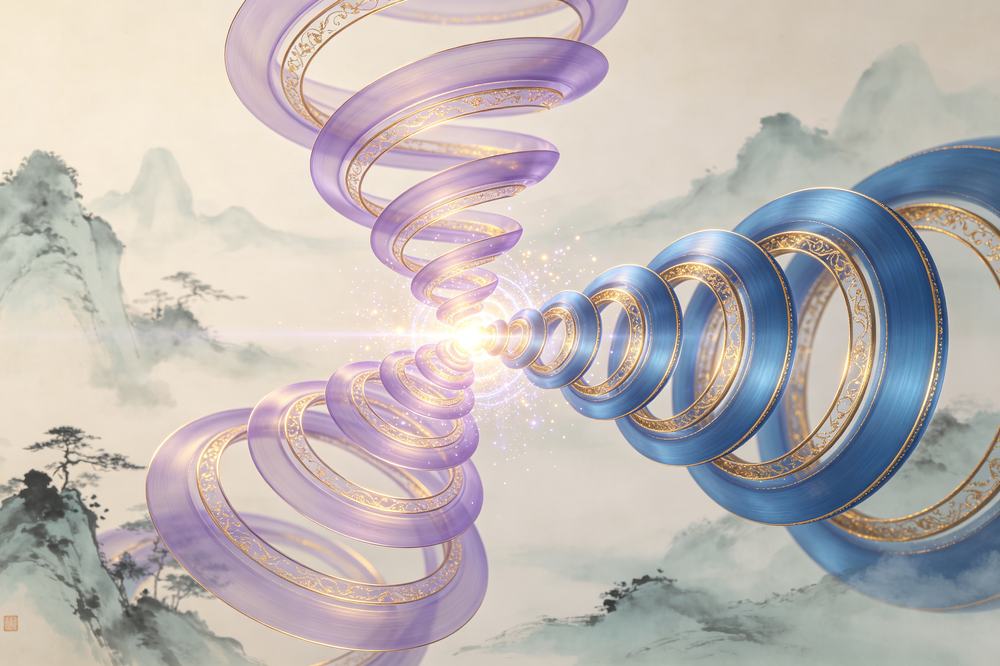

<ArchiveCopyPanel article-id="162374124" />

{"markdown":"PiDliIbnsbvvvJrlhajln5/mlbDlraYgIAo+IOe8luWPt++8mmAxNjIzNzQxMjRgICAKPiDljp/lp4vmlofku7bvvJpg5aSN5pWw5LiN5piv6Jma5pWw5ou85YeR566X5byP5pivMOWfuueCueWPjOWQkeWeguebtOWPjOieuuaXi+WQjOatpeeUn+mVv+eahOS6jOe7tOWkjeWQiOiKgueCueWdkOaghy3lhajln5/mlbDlraZ2c+S8oOe7n+aVsOWtpuS6uuexu+aWh+aYjui/my0xNjIzNzQxMjQubWRgICAKPiDov5Tlm57vvJpb5pys5Lmm5b2S5qGjXSgvemgvYm9va3MvbWF0aC9hcnRpY2xlcy8pIMK3IFvmgLvlhaXlj6NdKC96aC9ib29rcy9hcnRpY2xlcy8pCgohW+Wwgemdol0oLi9hc3NldHMvY3NkbmltZy9qcGcvMjMyYmJjNjQxMTQ5Njg1OC5qcGcpCgojIyDjgIrlhajln5/mlbDlraZ2c+S8oOe7n+aVsOWtpu+8muS6uuexu+aWh+aYjui/m+mYtjIwMOiusuOAi+esrDU26K6yCgrkvZzogIXvvJrkuZbkuZbmlbDlraYKCuS4u+mimO+8muWkjeaVsOS4jeaYr+iZmuaVsOaLvOWHkeeul+W8j++8jOaYrzDln7rngrnlj4zlkJHlnoLnm7Tlj4zonrrml4vlkIzmraXnlJ/plb/nmoTkuoznu7TlpI3lkIjoioLngrnlnZDmoIcKCuWvueagh+ivvuacrOefpeivhueCue+8muWkjeaVsOOAgeiZmuaVsOWNleS9jWnjgIHlpI3mlbDlm5vliJnov5DnrpfjgIHlpI3lubPpnaIKCi0tLQoKIyMjIDDvvZ4z5YiG6ZKfIOWkjeS5oOWvvOWFpQoK5ZCM5a2m5Lus77yM5LiK5LiA6IqC6K++5oiR5Lus5ouG6Kej5LqG5pWw5YiX55qE5pys5rqQ77ya5pWw5YiX5piv6L+e57ut5Y+M6J665peL5q+P6ZqU5Zu65a6a5bGC5pWw5oiq5Y+W55Sf6ZW/6IqC54K55b2i5oiQ55qE56a75pWj5bqP5YiX77yM562J5beu44CB562J5q+U5a+55bqU6J665peL5Lik56eN5Z+656GA5YiG5bGC55Sf6ZW/6IqC5aWP44CCCgrpq5jkuK3lhajmlrDnn6Xor4bmnb/lnZflpI3mlbDvvIzor77mnKzlkYror4nmiJHku6zvvJrotJ/mlbDml6Dms5XlvIDlubPmlrnvvIzkuo7mmK/kurrkuLrliJvpgKDomZrmlbDljZXkvY1paWnvvIxpMj3iiJIxaV4yPS0xaTI94oiSMe+8jOWunuaVsOaQremFjWlpaee7hOaIkOWkjeaVsO+8jOaUvuWcqOWkjeW5s+mdouWBmui/kOeul+OAgeWHoOS9leWPmOaNou+8jOWPquaYr+ihpem9kOWunuaVsOiuoeeul+a8j+a0nueahOS6uumAoOespuWPt+OAggoK5LuK5aSp5oiR5Lus56uZ5ZyoMC8xL+KInuS4ieaegeacrOa6kOinhuinkumHjeaWsOino+ivu++8muS4jeWtmOWcqOS6uuS4uuiZmuaehOeahCLomZrmlbAi77yMMOWfuueCueS8muWQjOaXtuWIhuWMluWHuuaoquWQkeWunuaVsOieuuaXi+OAgee6teWQkeWeguebtOiZmuieuuaXi++8jOS4pOadoeieuuaXi+S6kuebuOWeguebtOWQjOatpeeUn+mVv++8m+WkjeaVsGErYmlhK2JpYStiae+8jOWwseaYr+S6jOe7tOW5s+mdouS4iuS4pOadoeieuuaXi+S6pOaxh+iKgueCueeahOWujOaVtOWdkOagh++8jOWunuaVsOWPquingua1i+aoquWQkeWNleadoeieuuaXi++8jOWkjeaVsOaJjeiDveWujOaVtOiusOW9leWeguebtOWPjOWQkeWPjOieuuaXi+eahOeUn+mVv+eKtuaAgeOAggoKIVsw5Z+654K55Y+M5ZCR5Z6C55u05Y+M6J665peLXSguL2Fzc2V0cy9jc2RuaW1nL2pwZy8zMTUzZjE5OTNhODZmOGRiLmpwZykKCi0tLQoKIyMjIDPvvZ4xM+WIhumSnyDnlJ/mtLvljJbnsbvmr5TorrLop6MKCuWFiOiusuivvuacrOWkjeaVsOWfuuehgOmAu+i+ke+8mgoK5a6e5pWw5LuF5YyF5ZCr5pWw6L205LiK5bem5Y+z5pa55ZCR55qE5pWw5a2X77yM6YGH5Yiw4oiSMVxzcXJ0JiMxMjM7LTEmIzEyNTviiJIx4oCL5peg5a6e5pWw6Kej77yM5byV5YWl6Jma5pWwaWlp5p6E5bu65aSN5bmz6Z2i77yM5qiq6L205Li65a6e6L2044CB57q16L205Li66Jma6L2077yM5aSN5pWw5Yqg5YeP5LmY6Zmk5a+55bqU5bmz6Z2i5YaF54K555qE5bmz56e744CB5peL6L2s57yp5pS+77yM5aSa55So5LqO5pa556iL44CB5LiJ6KeS5Ye95pWw5YyW566A44CCCgrmlL7liLDlhajln5/lj4zonrrml4vnlJ/plb/kvZPns7vph4zvvJoKCjDln7rngrnkuLrkuoznu7Tlr7nnp7DkuK3lv4PvvIzliIbljJbkuKTlpZfkupLnm7jlnoLnm7TnmoTljp/nlJ/onrrml4vohInnu5zvvJoKCi0gCgrlrp7ovbTonrrml4vvvJrlt6blj7PmsLTlubPlu7bkvLjvvIzlr7nlupTmiJHku6zml6XluLjop4LmtYvnmoTlrp7mlbDkvZPns7vvvIzmlbDlgLxhYWHku6PooajmqKrlkJHonrrml4vlu7bkvLjplb/luqbvvJsKCi0gCgromZrovbTonrrml4vvvJrkuIrkuIvlnoLnm7Tlu7bkvLjvvIzmmK/lrp7mlbDop4LmtYvnu7TluqbkuYvlpJbnmoTlj6bkuIDlpZfnlJ/plb/ohInnu5zvvIzmlbDlgLxiYmLku6PooajnurXlkJHonrrml4vlu7bkvLjpq5jluqbvvJsKCuWkjeaVsHo9YStiaXo9YStiaXo9YStiae+8jOaYr+S4pOadoeWeguebtOieuuaXi+S6pOaxh+eUn+aIkOeahOWkjeWQiOiKgueCue+8jOWQjOaXtuiusOW9leaoquWQkeOAgee6teWQkeS4pOauteieuuaXi+eahOeUn+mVv+S9k+mHj+OAggoKaTI94oiSMWleMj0tMWkyPeKIkjHnmoTmnKzmupDlkKvkuYnvvJrnurXlkJHonrrml4vlrozmlbTml4vovaw5MOW6pu+8jOS4juaoquWQkei0n+WQkeieuuaXi+mHjeWQiO+8jOWeguebtOaXi+i9rOeahOWkqeeEtuWvueensOWFs+ezu++8jOS4jeaYr+S6uuS4uuehrOaAp+inhOWumuOAggoKIVtp5bmz5pa55peL6L2s5Yeg5L2V5oSP5LmJXSguL2Fzc2V0cy9jc2RuaW1nL2pwZy8zODliNTdlMGJhNTZiN2QyLmpwZykKCuWkjeaVsOS5mOazle+8muWvueW6lOS6jOe7tOWPjOieuuaXi+WQjOatpeaXi+i9rCvlgI3njoflj6DliqDvvJvlpI3mlbDliqDlh4/ms5XvvJrlr7nlupTkuKTmnaHonrrml4vlu7bkvLjplb/luqbnm7TmjqXlj6DliqDjgIHmirXmtojjgIIKCiFb5aSN5pWw5LmY5rOV5peL6L2s57yp5pS+XSguL2Fzc2V0cy9jc2RuaW1nL2pwZy85MGJkNTcwY2U2NmM3YWMxLmpwZykKCuS4vueugOWNleS+i+WtkO+8mgoK6K++5pys6KeG6KeS77yaMys0aTMrNGkzKzRp5Y+q5piv5a6e5pWwM+aQremFjeiZmuaVsDRpNGk0aeeahOWkjeWQiOaVsOWtl++8jOS7heeUqOS6juino+aWueeoi+OAggoK5YWo5Z+f6YCa5L+X6Kej6K+777yaM+S7o+ihqOaoquWQkeieuuaXi+WQkeWPs+W7tuS8uDPlsYLvvIw05Luj6KGo57q15ZCR6J665peL5ZCR5LiK5bu25Ly4NOWxgu+8jDMrNGkzKzRpMys0aeaYr+S4pOadoeWeguebtOieuuaXi+S6pOaxh+eahOWkqeeEtuiKgueCueWdkOagh++8m+WunuaVsOWPqueci+WNleadoeaoquWQkeieuuaXi++8jOS4ouWksee6teWQkeeUn+mVv+e7tOW6pu+8jOWkjeaVsOaJjeWujOaVtOiusOW9leS6jOe7tOWPjOieuuaXi+e7k+aehOOAggoKIVszKzRp5aSN5pWw6IqC54K5XSguL2Fzc2V0cy9jc2RuaW1nL2pwZy9iNDYyYjBhMjJiZWJiNDNjLmpwZykKCuivvuacrOaKiuiZmuaVsOW9k+aIkOW8peihpeiuoeeul+e8uumZt+eahOW3peWFt++8jOW/veeVpeWkjeaVsOaYr+WeguebtOWPjOWQkeWPjOieuuaXi+S6jOe7tOeUn+mVv+eahOWOn+eUn+WdkOagh+i9veS9k+OAggoKLS0tCgojIyMgMTPvvZ4yMuWIhumSnyDor77mnKzop4LngrkgdnMg5YWo5Z+f5pWw5a2m6YCa5L+X6KeC54K5CgojIyMjIOS8oOe7n+ivvuacrOiupOefpQoKLSAKCuiZmuaVsGlpaeaYr+S6uuW3peWIm+mAoOeahOespuWPt++8jOiHqueEtueVjOS4jeWtmOWcqOWvueW6lOWunuS9k+e7k+aehAoKLSAKCuWkjeW5s+mdouWPquaYr+S6uuS4uue7mOWItueahOi+heWKqee9keagvO+8jOWkjeaVsOaYr+WunuaVsOeahOaJqeWFheS6p+eJqQoKLSAKCuWkjeaVsOi/kOeul+WPquaYr+S7o+aVsOWPmOW9ouaKgOW3p++8jOS7heeUqOS6juino+aWueeoi+OAgeS4ieinkuWMlueugO+8jOaXoOW6leWxguepuumXtOeUn+mVv+WQq+S5iQoKIVvkvKDnu592c+WFqOWfn+WvueavlF0oLi9hc3NldHMvY3NkbmltZy9qcGcvYzcyNWRjMDJjNjYwYjY3Ny5qcGcpCgojIyMjIOWFqOWfn+aVsOWtpumAmuS/l+iupOefpQoKLSAKCjDln7rngrnlpKnnhLbliIbljJbmqKrjgIHnurXkuKTlpZflnoLnm7Tlj4zonrrml4vvvIzlpI3mlbDmmK/kuoznu7TkuqTmsYfoioLngrnnmoTljp/nlJ/lnZDmoIfvvIzlrp7mlbDlj6rmmK/ljZXkuIDnu7TluqbnmoTnroDljJbop4LmtYvnu5PmnpwKCi0gCgppMj3iiJIxaV4yPS0xaTI94oiSMeaYr+WeguebtOieuuaXi+aXi+i9rDkwwrDlkI7nmoTlr7nnp7Dph43lkIjop4TlvovvvIzlsZ7kuo7nqbrpl7Tnu5PmnoToh6rluKbop4TliJnvvIzlubbpnZ7kurrkuLrlrprkuYkKCi0gCgrkuqTmtYHnlLXms6LliqjjgIHph4/lrZDmgIHlj6DliqDjgIHnlLXno4Hms6LkvKDmkq3jgIHotoXlr7zlvq7op4Lovb3mtYHlrZDov5DliqjvvIzlhajpg6jkvp3pnaDkuoznu7TlpI3mlbDlj4zonrrml4vmqKHlnovmj4/ov7AKCueugOWNleavlOWWu++8mgoK6K++5pys5aSN5pWw5aaC5ZCM5Lq65Li65paw5aKe5LiA5aWX56ym5Y+36KGl6b2Q566X5byP5ryP5rSe77ybCgrmnKzmupDlpI3mlbDlpoLlkIzkuIDmo7XlkIzml7bmqKrlkJHjgIHnurXlkJHliIblj4nnlJ/plb/nmoTmoJHvvIzlpI3mlbDlnZDmoIflkIzml7borrDlvZXmqKrlkJHmnp3lubLplb/luqbjgIHnurXlkJHmnp3lubLpq5jluqbvvIzlrp7mlbDlj6rnnIvmqKrlkJHmnp3lubLvvIzlv73nlaXnurXlkJHnu5PmnoTjgIIKCiFb5Y+M6J665peL56We5qCR5q+U5Za7XSguL2Fzc2V0cy9jc2RuaW1nL2pwZy9iMDgzNzdlYzc5ZWUwOWQ0LmpwZykKCi0tLQoKIyMjIDIy772eMjfliIbpkp8g5qCh5YaF5a2m5Lmg5o+Q6YaS77yM5LiN5b2x5ZON6ICD6K+V5b6X5YiGCgrlpI3mlbDlm5vliJnov5DnrpfjgIHlpI3lubPpnaLlh6DkvZXmhI/kuYnjgIHlpI3mlbDkuInop5LlvaLlvI/popjlnovvvIzkuKXmoLzmjInnhafpq5jkuK3or77mnKzov5Dnrpfms5XliJnkvZznrZTvvIzogIPor5XkuI3kvJrmiaPliIbjgIIKCuacrOiKguivvuWPquaYr+aLk+WxlemrmOe7tOacrOa6kOiupOefpe+8muWkjeaVsOaYr+WOn+eCueWIhuWHuueahOaoquOAgee6teWeguebtOWPjOieuuaXi+S6pOaxh+iKgueCueeahOS6jOe7tOWdkOagh++8jOWujOaVtOiusOW9leWPjOWQkeieuuaXi+WQjOatpeeUn+mVv+eKtuaAgeOAggoK5LyP56yU6ZO65Z6r77ya56ysMTAw6K6y6auY5Lit57uT5Lia5LiT5Zy677yM5pW05ZCINTHigJMxMDDorrLlhajpg6jpq5jkuK3lvq7np6/liIbjgIHnq4vkvZPlh6DkvZXjgIHlpI3mlbDjgIHmlbDliJfjgIHlnIbplKXmm7Lnur/lhoXlrrnvvIznu5/kuIDnlKgwLzEv4oie5LiJ5p6B5Y+M6J665peL5a6M5oiQ5Yid562J44CB6auY562J5pWw55CG5aSn5LiA57uf6Zet546v44CCCgotLS0KCiMjIyAyN++9njMw5YiG6ZKfIOivvuWgguaAu+e7kyvkuIvoioLor77pooTlkYoKCiMjIyMg5pys6IqC6K++5bCP57uTCgow5Z+654K55YiG5YyW5qiq44CB57q15Z6C55u05Lik5aWX5Y+M6J665peL77yMYStiaWErYmlhK2Jp5ZCM5q2l6K6w5b2V5qiq5ZCR5a6e6J665peL44CB57q15ZCR6Jma6J665peL55Sf6ZW/5L2T6YeP77ybaWlp5a+55bqU5Z6C55u05peL6L2s5a+556ew6KeE5YiZ77yM5aSN5pWw5piv5LqM57u056m66Ze05Y6f55Sf6KeC5rWL5Z2Q5qCH44CCCgojIyMjIOS4i+iKguivvumihOWRigoK56uL5L2T5Yeg5L2V5LiJ57u056m66Ze05LiN5piv57q46Z2i5LiJ57u057uY5Zu+77yM5pivMOWfuueCueWIhuWMlngveS965LiJ6L205LiJ57uE5q2j5Lqk5Y+M6J665peL5Lqk57uH5b2i5oiQ55qE5LiJ57u055Sf6ZW/5Zy65Z+f44CCCgohW+eJh+WwvuaUtuWwvl0oLi9hc3NldHMvY3NkbmltZy9qcGcvZmIwZjI0ODJmYjE1MjRhZC5qcGcpCg==","text":"5YiG57G777ya5YWo5Z+f5pWw5a2mICAK57yW5Y+377yaMTYyMzc0MTI0ICAK5Y6f5aeL5paH5Lu277ya5aSN5pWw5LiN5piv6Jma5pWw5ou85YeR566X5byP5pivMOWfuueCueWPjOWQkeWeguebtOWPjOieuuaXi+WQjOatpeeUn+mVv+eahOS6jOe7tOWkjeWQiOiKgueCueWdkOaghy3lhajln5/mlbDlraZ2c+S8oOe7n+aVsOWtpuS6uuexu+aWh+aYjui/my0xNjIzNzQxMjQubWQgIArov5Tlm57vvJrmnKzkuablvZLmoaMgwrcg5oC75YWl5Y+jCgrlsIHpnaIKCuOAiuWFqOWfn+aVsOWtpnZz5Lyg57uf5pWw5a2m77ya5Lq657G75paH5piO6L+b6Zi2MjAw6K6y44CL56ysNTborrIKCuS9nOiAhe+8muS5luS5luaVsOWtpgoK5Li76aKY77ya5aSN5pWw5LiN5piv6Jma5pWw5ou85YeR566X5byP77yM5pivMOWfuueCueWPjOWQkeWeguebtOWPjOieuuaXi+WQjOatpeeUn+mVv+eahOS6jOe7tOWkjeWQiOiKgueCueWdkOaghwoK5a+55qCH6K++5pys55+l6K+G54K577ya5aSN5pWw44CB6Jma5pWw5Y2V5L2NaeOAgeWkjeaVsOWbm+WImei/kOeul+OAgeWkjeW5s+mdogoKLS0tCgow772eM+WIhumSnyDlpI3kuaDlr7zlhaUKCuWQjOWtpuS7rO+8jOS4iuS4gOiKguivvuaIkeS7rOaLhuino+S6huaVsOWIl+eahOacrOa6kO+8muaVsOWIl+aYr+i/nue7reWPjOieuuaXi+avj+malOWbuuWumuWxguaVsOaIquWPlueUn+mVv+iKgueCueW9ouaIkOeahOemu+aVo+W6j+WIl++8jOetieW3ruOAgeetieavlOWvueW6lOieuuaXi+S4pOenjeWfuuehgOWIhuWxgueUn+mVv+iKguWlj+OAggoK6auY5Lit5YWo5paw55+l6K+G5p2/5Z2X5aSN5pWw77yM6K++5pys5ZGK6K+J5oiR5Lus77ya6LSf5pWw5peg5rOV5byA5bmz5pa577yM5LqO5piv5Lq65Li65Yib6YCg6Jma5pWw5Y2V5L2NaWlp77yMaTI94oiSMWleMj0tMWkyPeKIkjHvvIzlrp7mlbDmkK3phY1paWnnu4TmiJDlpI3mlbDvvIzmlL7lnKjlpI3lubPpnaLlgZrov5DnrpfjgIHlh6DkvZXlj5jmjaLvvIzlj6rmmK/ooaXpvZDlrp7mlbDorqHnrpfmvI/mtJ7nmoTkurrpgKDnrKblj7fjgIIKCuS7iuWkqeaIkeS7rOermeWcqDAvMS/iiJ7kuInmnoHmnKzmupDop4bop5Lph43mlrDop6Por7vvvJrkuI3lrZjlnKjkurrkuLromZrmnoTnmoQi6Jma5pWwIu+8jDDln7rngrnkvJrlkIzml7bliIbljJblh7rmqKrlkJHlrp7mlbDonrrml4vjgIHnurXlkJHlnoLnm7TomZronrrml4vvvIzkuKTmnaHonrrml4vkupLnm7jlnoLnm7TlkIzmraXnlJ/plb/vvJvlpI3mlbBhK2JpYStiaWErYmnvvIzlsLHmmK/kuoznu7TlubPpnaLkuIrkuKTmnaHonrrml4vkuqTmsYfoioLngrnnmoTlrozmlbTlnZDmoIfvvIzlrp7mlbDlj6rop4LmtYvmqKrlkJHljZXmnaHonrrml4vvvIzlpI3mlbDmiY3og73lrozmlbTorrDlvZXlnoLnm7Tlj4zlkJHlj4zonrrml4vnmoTnlJ/plb/nirbmgIHjgIIKCjDln7rngrnlj4zlkJHlnoLnm7Tlj4zonrrml4sKCi0tLQoKM++9njEz5YiG6ZKfIOeUn+a0u+WMluexu+avlOiusuinowoK5YWI6K6y6K++5pys5aSN5pWw5Z+656GA6YC76L6R77yaCgrlrp7mlbDku4XljIXlkKvmlbDovbTkuIrlt6blj7PmlrnlkJHnmoTmlbDlrZfvvIzpgYfliLDiiJIxXHNxcnR7LTF94oiSMeKAi+aXoOWunuaVsOino++8jOW8leWFpeiZmuaVsGlpaeaehOW7uuWkjeW5s+mdou+8jOaoqui9tOS4uuWunui9tOOAgee6tei9tOS4uuiZmui9tO+8jOWkjeaVsOWKoOWHj+S5mOmZpOWvueW6lOW5s+mdouWGheeCueeahOW5s+enu+OAgeaXi+i9rOe8qeaUvu+8jOWkmueUqOS6juaWueeoi+OAgeS4ieinkuWHveaVsOWMlueugOOAggoK5pS+5Yiw5YWo5Z+f5Y+M6J665peL55Sf6ZW/5L2T57O76YeM77yaCgow5Z+654K55Li65LqM57u05a+556ew5Lit5b+D77yM5YiG5YyW5Lik5aWX5LqS55u45Z6C55u055qE5Y6f55Sf6J665peL6ISJ57uc77yaCuWunui9tOieuuaXi++8muW3puWPs+awtOW5s+W7tuS8uO+8jOWvueW6lOaIkeS7rOaXpeW4uOingua1i+eahOWunuaVsOS9k+ezu++8jOaVsOWAvGFhYeS7o+ihqOaoquWQkeieuuaXi+W7tuS8uOmVv+W6pu+8mwromZrovbTonrrml4vvvJrkuIrkuIvlnoLnm7Tlu7bkvLjvvIzmmK/lrp7mlbDop4LmtYvnu7TluqbkuYvlpJbnmoTlj6bkuIDlpZfnlJ/plb/ohInnu5zvvIzmlbDlgLxiYmLku6PooajnurXlkJHonrrml4vlu7bkvLjpq5jluqbvvJsKCuWkjeaVsHo9YStiaXo9YStiaXo9YStiae+8jOaYr+S4pOadoeWeguebtOieuuaXi+S6pOaxh+eUn+aIkOeahOWkjeWQiOiKgueCue+8jOWQjOaXtuiusOW9leaoquWQkeOAgee6teWQkeS4pOauteieuuaXi+eahOeUn+mVv+S9k+mHj+OAggoKaTI94oiSMWleMj0tMWkyPeKIkjHnmoTmnKzmupDlkKvkuYnvvJrnurXlkJHonrrml4vlrozmlbTml4vovaw5MOW6pu+8jOS4juaoquWQkei0n+WQkeieuuaXi+mHjeWQiO+8jOWeguebtOaXi+i9rOeahOWkqeeEtuWvueensOWFs+ezu++8jOS4jeaYr+S6uuS4uuehrOaAp+inhOWumuOAggoKaeW5s+aWueaXi+i9rOWHoOS9leaEj+S5iQoK5aSN5pWw5LmY5rOV77ya5a+55bqU5LqM57u05Y+M6J665peL5ZCM5q2l5peL6L2sK+WAjeeOh+WPoOWKoO+8m+WkjeaVsOWKoOWHj+azle+8muWvueW6lOS4pOadoeieuuaXi+W7tuS8uOmVv+W6puebtOaOpeWPoOWKoOOAgeaKtea2iOOAggoK5aSN5pWw5LmY5rOV5peL6L2s57yp5pS+CgrkuL7nroDljZXkvovlrZDvvJoKCuivvuacrOinhuinku+8mjMrNGkzKzRpMys0aeWPquaYr+WunuaVsDPmkK3phY3omZrmlbA0aTRpNGnnmoTlpI3lkIjmlbDlrZfvvIzku4XnlKjkuo7op6PmlrnnqIvjgIIKCuWFqOWfn+mAmuS/l+ino+ivu++8mjPku6PooajmqKrlkJHonrrml4vlkJHlj7Plu7bkvLgz5bGC77yMNOS7o+ihqOe6teWQkeieuuaXi+WQkeS4iuW7tuS8uDTlsYLvvIwzKzRpMys0aTMrNGnmmK/kuKTmnaHlnoLnm7Tonrrml4vkuqTmsYfnmoTlpKnnhLboioLngrnlnZDmoIfvvJvlrp7mlbDlj6rnnIvljZXmnaHmqKrlkJHonrrml4vvvIzkuKLlpLHnurXlkJHnlJ/plb/nu7TluqbvvIzlpI3mlbDmiY3lrozmlbTorrDlvZXkuoznu7Tlj4zonrrml4vnu5PmnoTjgIIKCjMrNGnlpI3mlbDoioLngrkKCuivvuacrOaKiuiZmuaVsOW9k+aIkOW8peihpeiuoeeul+e8uumZt+eahOW3peWFt++8jOW/veeVpeWkjeaVsOaYr+WeguebtOWPjOWQkeWPjOieuuaXi+S6jOe7tOeUn+mVv+eahOWOn+eUn+WdkOagh+i9veS9k+OAggoKLS0tCgoxM++9njIy5YiG6ZKfIOivvuacrOingueCuSB2cyDlhajln5/mlbDlrabpgJrkv5fop4LngrkKCuS8oOe7n+ivvuacrOiupOefpQromZrmlbBpaWnmmK/kurrlt6XliJvpgKDnmoTnrKblj7fvvIzoh6rnhLbnlYzkuI3lrZjlnKjlr7nlupTlrp7kvZPnu5PmnoQK5aSN5bmz6Z2i5Y+q5piv5Lq65Li657uY5Yi255qE6L6F5Yqp572R5qC877yM5aSN5pWw5piv5a6e5pWw55qE5omp5YWF5Lqn54mpCuWkjeaVsOi/kOeul+WPquaYr+S7o+aVsOWPmOW9ouaKgOW3p++8jOS7heeUqOS6juino+aWueeoi+OAgeS4ieinkuWMlueugO+8jOaXoOW6leWxguepuumXtOeUn+mVv+WQq+S5iQoK5Lyg57ufdnPlhajln5/lr7nmr5QKCuWFqOWfn+aVsOWtpumAmuS/l+iupOefpQow5Z+654K55aSp54S25YiG5YyW5qiq44CB57q15Lik5aWX5Z6C55u05Y+M6J665peL77yM5aSN5pWw5piv5LqM57u05Lqk5rGH6IqC54K555qE5Y6f55Sf5Z2Q5qCH77yM5a6e5pWw5Y+q5piv5Y2V5LiA57u05bqm55qE566A5YyW6KeC5rWL57uT5p6cCmkyPeKIkjFpXjI9LTFpMj3iiJIx5piv5Z6C55u06J665peL5peL6L2sOTDCsOWQjueahOWvueensOmHjeWQiOinhOW+i++8jOWxnuS6juepuumXtOe7k+aehOiHquW4puinhOWIme+8jOW5tumdnuS6uuS4uuWumuS5iQrkuqTmtYHnlLXms6LliqjjgIHph4/lrZDmgIHlj6DliqDjgIHnlLXno4Hms6LkvKDmkq3jgIHotoXlr7zlvq7op4Lovb3mtYHlrZDov5DliqjvvIzlhajpg6jkvp3pnaDkuoznu7TlpI3mlbDlj4zonrrml4vmqKHlnovmj4/ov7AKCueugOWNleavlOWWu++8mgoK6K++5pys5aSN5pWw5aaC5ZCM5Lq65Li65paw5aKe5LiA5aWX56ym5Y+36KGl6b2Q566X5byP5ryP5rSe77ybCgrmnKzmupDlpI3mlbDlpoLlkIzkuIDmo7XlkIzml7bmqKrlkJHjgIHnurXlkJHliIblj4nnlJ/plb/nmoTmoJHvvIzlpI3mlbDlnZDmoIflkIzml7borrDlvZXmqKrlkJHmnp3lubLplb/luqbjgIHnurXlkJHmnp3lubLpq5jluqbvvIzlrp7mlbDlj6rnnIvmqKrlkJHmnp3lubLvvIzlv73nlaXnurXlkJHnu5PmnoTjgIIKCuWPjOieuuaXi+elnuagkeavlOWWuwoKLS0tCgoyMu+9njI35YiG6ZKfIOagoeWGheWtpuS5oOaPkOmGku+8jOS4jeW9seWTjeiAg+ivleW+l+WIhgoK5aSN5pWw5Zub5YiZ6L+Q566X44CB5aSN5bmz6Z2i5Yeg5L2V5oSP5LmJ44CB5aSN5pWw5LiJ6KeS5b2i5byP6aKY5Z6L77yM5Lil5qC85oyJ54Wn6auY5Lit6K++5pys6L+Q566X5rOV5YiZ5L2c562U77yM6ICD6K+V5LiN5Lya5omj5YiG44CCCgrmnKzoioLor77lj6rmmK/mi5PlsZXpq5jnu7TmnKzmupDorqTnn6XvvJrlpI3mlbDmmK/ljp/ngrnliIblh7rnmoTmqKrjgIHnurXlnoLnm7Tlj4zonrrml4vkuqTmsYfoioLngrnnmoTkuoznu7TlnZDmoIfvvIzlrozmlbTorrDlvZXlj4zlkJHonrrml4vlkIzmraXnlJ/plb/nirbmgIHjgIIKCuS8j+eslOmTuuWeq++8muesrDEwMOiusumrmOS4ree7k+S4muS4k+Wcuu+8jOaVtOWQiDUx4oCTMTAw6K6y5YWo6YOo6auY5Lit5b6u56ev5YiG44CB56uL5L2T5Yeg5L2V44CB5aSN5pWw44CB5pWw5YiX44CB5ZyG6ZSl5puy57q/5YaF5a6577yM57uf5LiA55SoMC8xL+KInuS4ieaegeWPjOieuuaXi+WujOaIkOWIneetieOAgemrmOetieaVsOeQhuWkp+S4gOe7n+mXreeOr+OAggoKLS0tCgoyN++9njMw5YiG6ZKfIOivvuWgguaAu+e7kyvkuIvoioLor77pooTlkYoKCuacrOiKguivvuWwj+e7kwoKMOWfuueCueWIhuWMluaoquOAgee6teWeguebtOS4pOWll+WPjOieuuaXi++8jGErYmlhK2JpYStiaeWQjOatpeiusOW9leaoquWQkeWunuieuuaXi+OAgee6teWQkeiZmuieuuaXi+eUn+mVv+S9k+mHj++8m2lpaeWvueW6lOWeguebtOaXi+i9rOWvueensOinhOWIme+8jOWkjeaVsOaYr+S6jOe7tOepuumXtOWOn+eUn+ingua1i+WdkOagh+OAggoK5LiL6IqC6K++6aKE5ZGKCgrnq4vkvZPlh6DkvZXkuInnu7Tnqbrpl7TkuI3mmK/nurjpnaLkuInnu7Tnu5jlm77vvIzmmK8w5Z+654K55YiG5YyWeC95L3rkuInovbTkuInnu4TmraPkuqTlj4zonrrml4vkuqTnu4flvaLmiJDnmoTkuInnu7TnlJ/plb/lnLrln5/jgIIKCueJh+WwvuaUtuWwvg=="}

> 分类：全域数学  
> 编号：`162374124`  
> 原始文件：`复数不是虚数拼凑算式是0基点双向垂直双螺旋同步生长的二维复合节点坐标-全域数学vs传统数学人类文明进-162374124.md`  
> 返回：[本书归档](/zh/books/math/articles/) · [总入口](/zh/books/articles/)

<ArticlePaperMeta category="全域数学" article-id="162374124" title="复数不是虚数拼凑算式是0基点双向垂直双螺旋同步生长的二维复合节点坐标-全域数学vs传统数学人类文明进" paper-kind="研究论文" book-route="/zh/books/math/articles/" overview-route="/zh/books/articles/" summary="对标课本知识点：复数、虚数单位i、复数四则运算、复平面" author="乖乖数学" theme="复数不是虚数拼凑算式，是0基点双向垂直双螺旋同步生长的二维复合节点坐标" source-file="复数不是虚数拼凑算式是0基点双向垂直双螺旋同步生长的二维复合节点坐标-全域数学vs传统数学人类文明进-162374124.md" cover="./assets/csdnimg/jpg/232bbc6411496858.jpg" />

## 《全域数学vs传统数学：人类文明进阶200讲》第56讲

作者：乖乖数学

主题：复数不是虚数拼凑算式，是0基点双向垂直双螺旋同步生长的二维复合节点坐标

对标课本知识点：复数、虚数单位i、复数四则运算、复平面

---

### 0～3分钟 复习导入

同学们，上一节课我们拆解了数列的本源：数列是连续双螺旋每隔固定层数截取生长节点形成的离散序列，等差、等比对应螺旋两种基础分层生长节奏。

高中全新知识板块复数，课本告诉我们：负数无法开平方，于是人为创造虚数单位iii，i2=−1i^2=-1i2=−1，实数搭配iii组成复数，放在复平面做运算、几何变换，只是补齐实数计算漏洞的人造符号。

今天我们站在0/1/∞三极本源视角重新解读：不存在人为虚构的"虚数"，0基点会同时分化出横向实数螺旋、纵向垂直虚螺旋，两条螺旋互相垂直同步生长；复数a+bia+bia+bi，就是二维平面上两条螺旋交汇节点的完整坐标，实数只观测横向单条螺旋，复数才能完整记录垂直双向双螺旋的生长状态。

---

### 3～13分钟 生活化类比讲解

先讲课本复数基础逻辑：

实数仅包含数轴上左右方向的数字，遇到−1\sqrt&#123;-1&#125;−1​无实数解，引入虚数iii构建复平面，横轴为实轴、纵轴为虚轴，复数加减乘除对应平面内点的平移、旋转缩放，多用于方程、三角函数化简。

放到全域双螺旋生长体系里：

0基点为二维对称中心，分化两套互相垂直的原生螺旋脉络：

- 

实轴螺旋：左右水平延伸，对应我们日常观测的实数体系，数值aaa代表横向螺旋延伸长度；

- 

虚轴螺旋：上下垂直延伸，是实数观测维度之外的另一套生长脉络，数值bbb代表纵向螺旋延伸高度；

复数z=a+biz=a+biz=a+bi，是两条垂直螺旋交汇生成的复合节点，同时记录横向、纵向两段螺旋的生长体量。

i2=−1i^2=-1i2=−1的本源含义：纵向螺旋完整旋转90度，与横向负向螺旋重合，垂直旋转的天然对称关系，不是人为硬性规定。

复数乘法：对应二维双螺旋同步旋转+倍率叠加；复数加减法：对应两条螺旋延伸长度直接叠加、抵消。

举简单例子：

课本视角：3+4i3+4i3+4i只是实数3搭配虚数4i4i4i的复合数字，仅用于解方程。

全域通俗解读：3代表横向螺旋向右延伸3层，4代表纵向螺旋向上延伸4层，3+4i3+4i3+4i是两条垂直螺旋交汇的天然节点坐标；实数只看单条横向螺旋，丢失纵向生长维度，复数才完整记录二维双螺旋结构。

课本把虚数当成弥补计算缺陷的工具，忽略复数是垂直双向双螺旋二维生长的原生坐标载体。

---

### 13～22分钟 课本观点 vs 全域数学通俗观点

#### 传统课本认知

- 

虚数iii是人工创造的符号，自然界不存在对应实体结构

- 

复平面只是人为绘制的辅助网格，复数是实数的扩充产物

- 

复数运算只是代数变形技巧，仅用于解方程、三角化简，无底层空间生长含义

#### 全域数学通俗认知

- 

0基点天然分化横、纵两套垂直双螺旋，复数是二维交汇节点的原生坐标，实数只是单一维度的简化观测结果

- 

i2=−1i^2=-1i2=−1是垂直螺旋旋转90°后的对称重合规律，属于空间结构自带规则，并非人为定义

- 

交流电波动、量子态叠加、电磁波传播、超导微观载流子运动，全部依靠二维复数双螺旋模型描述

简单比喻：

课本复数如同人为新增一套符号补齐算式漏洞；

本源复数如同一棵同时横向、纵向分叉生长的树，复数坐标同时记录横向枝干长度、纵向枝干高度，实数只看横向枝干，忽略纵向结构。

---

### 22～27分钟 校内学习提醒，不影响考试得分

复数四则运算、复平面几何意义、复数三角形式题型，严格按照高中课本运算法则作答，考试不会扣分。

本节课只是拓展高维本源认知：复数是原点分出的横、纵垂直双螺旋交汇节点的二维坐标，完整记录双向螺旋同步生长状态。

伏笔铺垫：第100讲高中结业专场，整合51–100讲全部高中微积分、立体几何、复数、数列、圆锥曲线内容，统一用0/1/∞三极双螺旋完成初等、高等数理大一统闭环。

---

### 27～30分钟 课堂总结+下节课预告

#### 本节课小结

0基点分化横、纵垂直两套双螺旋，a+bia+bia+bi同步记录横向实螺旋、纵向虚螺旋生长体量；iii对应垂直旋转对称规则，复数是二维空间原生观测坐标。

#### 下节课预告

立体几何三维空间不是纸面三维绘图，是0基点分化x/y/z三轴三组正交双螺旋交织形成的三维生长场域。

