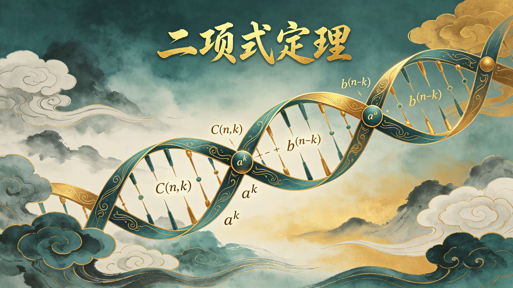
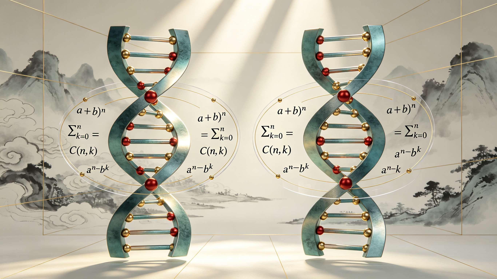
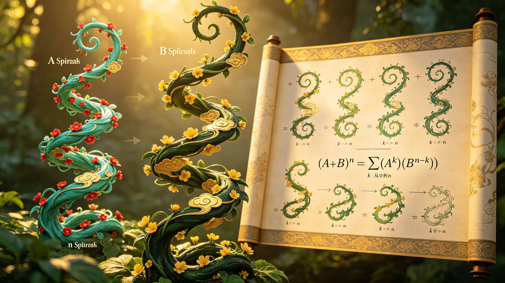

<ArchiveCopyPanel article-id="162374594" />

{"markdown":"PiDliIbnsbvvvJrlhajln5/mlbDlraYgIAo+IOe8luWPt++8mmAxNjIzNzQ1OTRgICAKPiDljp/lp4vmlofku7bvvJpg5LqM6aG55byP5a6a55CG5LiN5piv5aSa6aG55byP5bGV5byA5oqA5ben5piv5Lik57uE5Y+M5ZCR5Y+M6J665peL5aSa5bGC5Y+g5Yqg5ZCO5ZCE5bGC57qn6IqC54K55Yy56YWN6aKR5qyh55qE5a6M5pW05bGV5byA5byPLeWFqOWfn+aVsOWtpnZz5LygLTE2MjM3NDU5NC5tZGAgIAo+IOi/lOWbnu+8mlvmnKzkuablvZLmoaNdKC96aC9ib29rcy9tYXRoL2FydGljbGVzLykgwrcgW+aAu+WFpeWPo10oL3poL2Jvb2tzL2FydGljbGVzLykKCiFbaW1hZ2VdKC4vYXNzZXRzL2NzZG5pbWcvanBnL2I3YjI4MWUyYTJlOGRiZDQuanBnKQoKIyMg44CK5YWo5Z+f5pWw5a2mdnPkvKDnu5/mlbDlrabvvJrkurrnsbvmlofmmI7ov5vpmLYyMDDorrLjgIvnrKw2MeiusiDpq5jkuK3pgJrkv5fniYjpgJDlrZfnqL8KCuS9nOiAhe+8miDkuZbkuZbmlbDlraYKCioq6K6y5qyh77yaKirnrKw2MeiusgoKKirkuLvpopjvvJoqKuS6jOmhueW8j+WumueQhuS4jeaYr+WkmumhueW8j+WxleW8gOaKgOW3p++8jOaYr+S4pOe7hOWPjOWQkeWPjOieuuaXi+WkmuWxguWPoOWKoOWQju+8jOWQhOWxgue6p+iKgueCueWMuemFjemikeasoeeahOWujOaVtOWxleW8gOW8jwoKKirlr7nmoIfor77mnKznn6Xor4bngrnvvJoqKuS6jOmhueW8j+WumueQhuOAgeS6jOmhueW8j+ezu+aVsOOAgemAmumhueOAgei1i+WAvOazleW6lOeUqAoKKirmlofpo47vvJoqKuWkp+eZveivneOAgeaXoOaZpua2qeS4k+S4muivjeaxh++8jOW7tue7rTAvMeWfuueCueOAgeWPjOieuuaXi+WFqOWll+avlOWWuwoKLS0tCgohW2ltYWdlXSguL2Fzc2V0cy9jc2RuaW1nL2pwZy9mYzFlMzA4MGI4YjEyZThlLmpwZykKCiMjIyAw772eM+WIhumSnyDlpI3kuaDlr7zlhaUKCuWQjOWtpuS7rO+8jOS4iuS4gOiKguivvuaIkeS7rOWQg+mAj+aOkuWIl+e7hOWQiOeahOacrOa6kO+8muWkmuadoeeLrOeri+WPjOieuuaXi+eahOemu+aVo+iKgueCueS6kuebuOS6pOWPiemFjeWvue+8jOWIhuatpeWMuemFjeeUqOS5mOazleOAgeeLrOeri+WIhuexu+eUqOWKoOazle+8m+WMuuWIhueUn+mVv+aXtuW6j+aYr+aOkuWIl++8jOWPquetm+mAieiKgueCueaXoOinhuaXtuW6j+aYr+e7hOWQiO+8jOaJgOacieiuoeaVsOaVsOWtl+mDveaYr+iKgueCueWkqeeEtuWMuemFjeS6p+eUn+eahOmikeasoeOAggoK6auY5Lit5Luj5pWw6YWN5aWX5LqM6aG55byP5a6a55CG77yM6K++5pys5bCG5YW25a6a5LmJ5Li6KGErYiluKGErYilebihhK2IpbueahOS6uuW3peWxleW8gOW3peWFt++8jOS+nemdoOe7hOWQiOaVsOWGmeWHuuavj+S4gOmhueezu+aVsO+8jOeUqOadpeaxgueJueWumumhueOAgei1i+WAvOiuoeeul++8jOS7heS9nOS4uuS7o+aVsOWMlueugOOAgeamgueOh+iuoeeul+i+heWKqeaJi+auteOAggoK5LuK5aSp56uZ5ZyoMC8xL2luZnR5MC8xL2luZnR5MC8xL2luZnR55LiJ5p6B5pys5rqQ6KeG6KeS6YeN5paw5rqv5rqQ77ya5LqM6aG55byP5bGV5byA5LiN5piv5Lq65Li65ouG5YiG5aSa6aG55byP55qE6L+Q566X5oqA5ben77yM5L2T57O75YaF5a2Y5Zyo5Lik5aWX54us56uL5bmz6KGM5Y+M6J665peL6ISJ57uc77yM5LiA5aWX5a+55bqUYWFh5bGC57qn44CB5LiA5aWX5a+55bqUYmJi5bGC57qn77yb5Lik5aWX6J665peL5ZCM5q2l5Y+g5Yqgbm5u5bGC5LmL5ZCO77yM5q+P5LiA5bGC57qn5Lqk5Y+J6IqC54K555qE5Yy56YWN5pWw6YeP77yM5bCx5piv5LqM6aG55byP57O75pWw77yM5pW05p2h5bGV5byA5byP5a6M5pW06K6w5b2VMOWxguWIsG5ubuWxguaJgOacieiKgueCueaQremFjeeahOWFqOmDqOmikeasoeOAggoKLS0tCgojIyMgM++9njEz5YiG6ZKfIOeUn+a0u+WMluexu+avlOiusuinowoK5YWI6K6y6K++5pys5LqM6aG55byP5Z+656GA6YC76L6R77yaCgooYStiKW4oYStiKV5uKGErYilu5bGV5byA5ZCO5q+P5LiA6aG55b2i5byP5Li6Q25rYW7iiJJrYmtDX25eayBhXiYjMTIzO24tayYjMTI1O2Jea0Nua+KAi2Fu4oiSa2Jr77yMQ25rQ19uXmtDbmvigIvkuLrkuozpobnlvI/ns7vmlbDvvIzku6Pooajku45ubm7nu4Tph4zpgInlj5Zra2vkuKpiYmLlm6DlrZDvvJvlj6/liKnnlKjotYvlgLzms5Xku6RhPTFhPTFhPTHjgIFiPTFiPTFiPTHmsYLns7vmlbDmgLvlkozvvIzlpJrnlKjkuo7msYLlgLzjgIHmlbTpmaTor4HmmI7jgIHmpoLnjofliIbluIPorqHnrpfjgIIKCuaUvuWIsOWPjOieuuaXi+eUn+mVv+S9k+ezu+mHjO+8mgoK6K6+5a6a5Lik5aWX54us56uL5ZCM5rqQ5Y+M6J665peL77yaQeieuuaXi++8iOWvueW6lOWfuuW6lWFhYe+8ieOAgULonrrml4vvvIjlr7nlupTln7rlupViYmLvvInvvIzkuKTlpZfonrrml4vlkIzmraXlj6DliqDnlJ/plb9ubm7lsYLvvJsKCuavj+S4gOWxgueUn+mVv+WPquiDvemAieWPlkHonrrml4voioLngrnmiJbogIVC6J665peL6IqC54K577yM5a6M5oiQbm5u5bGC5Y+g5Yqg5ZCO77yM5Lya5Ye6546w5aSa56eN5pCt6YWN57uT5p6E77yaCgotIAoKaz0waz0waz0w77ya5YWo56iL5Y+q6YCJ5Y+WQeieuuaXi+iKgueCue+8jOaXoELonrrml4vlj4LkuI7vvIzlr7nlupTpoblhbmFebmFu77ybCgotIAoKaz0xaz0xaz0x77yabm5u5bGC6YeM5LuFMeWxgumAieWPlkLoioLngrnvvIzliankvZnlj5ZB6IqC54K577yM5Yy56YWN5oC76aKR5qyh5Li6Q24xQ19uXjFDbjHigIvvvJsKCi0gCgprPW5rPW5rPW7vvJrlhajnqIvlj6rpgInlj5ZC6J665peL6IqC54K577yM5a+55bqU6aG5Ym5iXm5ibu+8mwoK5LqM6aG55byP57O75pWwQ25rQ19uXmtDbmvigIvvvIzmnKzotKjmmK9ubm7lsYLlj6DliqDnu5PmnoTkuK3vvIzmgbDlpb3pgInlj5Zra2vmrrVC6J665peL6IqC54K544CB5Ymp5L2Z6YCJ5Y+WQeiKgueCueeahOWkqeeEtuWMuemFjemikeasoe+8mwoK5pW05p2h5bGV5byA5byP77yM5oqKa2tr5LuOMOWIsG5ubuaJgOacieWxgue6p+eahOiKgueCueaQremFjeWFqOmDqOe9l+WIl++8jOWujOaVtOi/mOWOn+S4pOWll+ieuuaXi25ubuWxguWPoOWKoOWQjueahOWFqOmDqOeUn+mVv+e7hOWQiOW9ouaAgeOAggoK5Li+566A5Y2V5L6L5a2Q77yaCgror77mnKzop4bop5LvvJooYStiKTI9YTIrMmFiK2IyKGErYileMj1hXjIrMmFiK2JeMihhK2IpMj1hMisyYWIrYjLvvIzns7vmlbAy5piv57uE5ZCI5pWwQzIxQ18yXjFDMjHigIvjgIIKCuWFqOWfn+mAmuS/l+ino+ivu++8muS4pOWll+ieuuaXi+WPoOWKoDLlsYLvvIzmkK3phY3liIbkuLrkuInnsbvvvJrkuKTlsYLlhahB44CB5LiA5bGCQeS4gOWxgkLjgIHkuKTlsYLlhahC77yb5LiA5bGCQeS4gOWxgkLnmoToioLngrnljLnphY3popHmrKHlpKnnhLbkuLoy77yMMmFiMmFiMmFi5a+55bqU6L+Z5aWX5Lqk5Y+J57uT5p6E77yM57O75pWwMuaYr+WPjOieuuaXi+S4pOWxguWPoOWKoOWQjuS6pOWPieiKgueCueeahOiHqueEtumFjeWvueaVsOmHj++8jOS4jeaYr+S6uuS4uuiuoeeul+W+l+WHuueahOaVsOWtl+OAggoK6K++5pys5Y+q5oqK5LqM6aG55byP5b2T5oiQ5aSa6aG55byP5bGV5byA5bel5YW377yM5b+955Wl5bGV5byA5byP5a6M5pW06K6w5b2V5Lik5aWX5Y+M6J665peL5aSa5bGC5Y+g5Yqg5ZCO5YWo6YOo5bGC57qn6IqC54K55Yy56YWN55qE5Y6f55Sf57uT5p6E44CCCgotLS0KCiMjIyAxM++9njIy5YiG6ZKfIOivvuacrOingueCuSB2cyDlhajln5/mlbDlrabpgJrkv5fop4LngrkKCiMjIyMg5Lyg57uf6K++5pys6K6k55+lCgotIAoK5LqM6aG55byP5a6a55CG5piv5Lq65bel5o6o5a+855qE5Luj5pWw5Y+Y5b2i5YWs5byP77yM5LiN5a2Y5Zyo5Lik5aWX6J665peL5aSa5bGC5Y+g5Yqg55qE5bqV5bGC57uT5p6ECgotIAoK5LqM6aG55byP57O75pWw5Y+q5piv5o6S5YiX57uE5ZCI55qE6KGN55Sf6K6h566X57uT5p6c77yM5peg5bGC57qn55Sf6ZW/5Yy56YWN5ZCr5LmJCgotIAoK5LuF55So5LqO5Luj5pWw5byP5YyW566A44CB5rGC5YC877yM5ZKM5b6u6KeC57KS5a2Q5Y+M5oCB5Y+g5Yqg44CB6IO96YeP5YiG5bGC57uE5ZCI5peg5YWzCgojIyMjIOWFqOWfn+aVsOWtpumAmuS/l+iupOefpQoKLSAKCkHjgIFC5Lik5aWX5bmz6KGM5Y+M6J665peL5ZCM5q2l5Y+g5Yqgbm5u5bGC77yM5q+P5LiA6aG55a+55bqU5LiA56eN5bGC57qn6YCJ5Y+W5pa55qGI77yM5LqM6aG55byP57O75pWw5piv6K+l5pa55qGI5LiL6IqC54K55Yy56YWN5oC76aKR5qyh77yM5bGV5byA5byP5a6M5pW06KaG55uW5YWo6YOo5Y+g5Yqg5b2i5oCBCgotIAoK57uE5ZCI5pWwQ25rQ19uXmtDbmvigIvlpKnnhLbooZTmjqXkuIrkuIDoioLmjpLliJfnu4TlkIjmnKzmupDvvIzkuozogIXlkIzlsZ7onrrml4voioLngrnljLnphY3popHmrKHkvZPns7vvvIzlvaLmiJDlrozmlbTorqHmlbDpl63njq8KCi0gCgrph4/lrZDlj4zmgIHlj6DliqDjgIHkuozlhYPnianotKjliIblsYLphY3mr5TjgIHotoXlr7zlj4zlsYLoloTohpznu4TlkIjmlrnmoYjjgIHkuozpobnliIbluIPmpoLnjofvvIzlhajpg6jkvp3miZjkuKTlpZfonrrml4vlj6DliqDnmoTkuozpobnlvI/lupXlsYLpgLvovpEKCueugOWNleavlOWWu++8mgoK6K++5pys5LqM6aG55byP5aaC5ZCM5omL5Yqo5ouG5byA5aSa5bGC5ous5Y+377yM5ouG5YiG5Ye65q+P5LiA6aG55Luj5pWw5byP77ybCgrmnKzmupDkuozpobnlvI/lpoLlkIzkuKTlpZfkuI3lkIzol6TolJPlkIzmraXnlJ/plb9ubm7lsYLvvIzlsZXlvIDlvI/pgJDmnaHliJflh7rmiYDmnInol6TolJPmkK3phY3mlrnlvI/vvIzns7vmlbDku6Pooajmr4/np43mkK3phY3lh7rnjrDnmoTmrKHmlbDjgIIKCi0tLQoKIVtpbWFnZV0oLi9hc3NldHMvY3NkbmltZy9qcGcvYWFlM2MyZTQ0YjBhZDkyNC5qcGcpCgojIyMgMjLvvZ4yN+WIhumSnyDmoKHlhoXlrabkuaDmj5DphpLvvIzkuI3lvbHlk43ogIPor5XlvpfliIYKCuS6jOmhueW8j+axguaMh+WumumhueOAgeezu+aVsOaxguWSjOOAgeaVtOmZpOivgeaYjumimOWei++8jOS4peagvOaMieeFp+mrmOS4reS6jOmhueW8j+WFrOW8j+OAgee7hOWQiOaVsOi/kOeul+azleWImeS9nOetlO+8jOiAg+ivleS4jeS8muaJo+WIhuOAggoK5pys6IqC6K++5Y+q5piv5ouT5bGV6auY57u05pys5rqQ6K6k55+l77ya5LqM6aG55byP5a6a55CG5pivQeOAgULkuKTlpZflj4zonrrml4tubm7lsYLlkIzmraXlj6DliqDlkI7vvIzmiYDmnInlsYLnuqfoioLngrnljLnphY3popHmrKHnmoTlrozmlbTnvZfliJflsZXlvIDlvI/vvIzns7vmlbDkuLrlr7nlupTmkK3phY3lpKnnhLbpopHmrKHjgIIKCuS8j+eslOmTuuWeq++8muesrDEwMOiusumrmOS4ree7k+S4muS4k+Wcuu+8jOaVtOWQiDUx4oCTMTAw6K6y5YWo6YOo6auY5Lit5b6u56ev5YiG44CB56uL5L2T5Yeg5L2V44CB5aSN5pWw44CB5pWw5YiX44CB5ZyG6ZSl5puy57q/44CB6K6h5pWw57uf6K6h5YaF5a6577yM57uf5LiA55SoMC8xL2luZnR5MC8xL2luZnR5MC8xL2luZnR55LiJ5p6B5Y+M6J665peL5a6M5oiQ5Yid562J44CB6auY562J5pWw55CG5aSn5LiA57uf6Zet546v44CCCgotLS0KCiMjIyAyN++9njMw5YiG6ZKfIOivvuWgguaAu+e7kyvkuIvoioLor77pooTlkYoKCiMjIyMg5pys6IqC6K++5bCP57uT77yaCgrkuozpobnlvI/lr7nlupRB44CBQuS4pOWll+eLrOeri+WPjOieuuaXi25ubuWxguWQjOatpeWPoOWKoO+8m0Nua0Nfbl5rQ25r4oCL5Li66YCJ5Y+Wa2tr5q61QuieuuaXi+iKgueCueeahOWMuemFjemikeasoe+8jOWxleW8gOW8j+WujOaVtOWIl+WHujDoh7Nubm7lsYLlhajpg6jmkK3phY3lvaLmgIHjgIIKCiMjIyMg5LiL5LiA6IqC6K++6aKE5ZGK77yaCgrpmo/mnLrlj5jph4/kuI7liIbluIPkuI3mmK/mpoLnjofmlbDlrZfooajmoLzvvIzmmK/lj4zonrrml4vplb/mnJ/nlJ/plb/oioLngrnliIblsYLlvZLnsbvlkI7nmoTnqLPlrprljLrpl7TpopHmrKHlm77osLHjgIIKCiFbaW1hZ2VdKC4vYXNzZXRzL2NzZG5pbWcvanBnLzU4ZjI0ZmExNDI2M2YzMDcuanBnKQo=","text":"5YiG57G777ya5YWo5Z+f5pWw5a2mICAK57yW5Y+377yaMTYyMzc0NTk0ICAK5Y6f5aeL5paH5Lu277ya5LqM6aG55byP5a6a55CG5LiN5piv5aSa6aG55byP5bGV5byA5oqA5ben5piv5Lik57uE5Y+M5ZCR5Y+M6J665peL5aSa5bGC5Y+g5Yqg5ZCO5ZCE5bGC57qn6IqC54K55Yy56YWN6aKR5qyh55qE5a6M5pW05bGV5byA5byPLeWFqOWfn+aVsOWtpnZz5LygLTE2MjM3NDU5NC5tZCAgCui/lOWbnu+8muacrOS5puW9kuahoyDCtyDmgLvlhaXlj6MKCmltYWdlCgrjgIrlhajln5/mlbDlraZ2c+S8oOe7n+aVsOWtpu+8muS6uuexu+aWh+aYjui/m+mYtjIwMOiusuOAi+esrDYx6K6yIOmrmOS4remAmuS/l+eJiOmAkOWtl+eovwoK5L2c6ICF77yaIOS5luS5luaVsOWtpgoK6K6y5qyh77ya56ysNjHorrIKCuS4u+mimO+8muS6jOmhueW8j+WumueQhuS4jeaYr+WkmumhueW8j+WxleW8gOaKgOW3p++8jOaYr+S4pOe7hOWPjOWQkeWPjOieuuaXi+WkmuWxguWPoOWKoOWQju+8jOWQhOWxgue6p+iKgueCueWMuemFjemikeasoeeahOWujOaVtOWxleW8gOW8jwoK5a+55qCH6K++5pys55+l6K+G54K577ya5LqM6aG55byP5a6a55CG44CB5LqM6aG55byP57O75pWw44CB6YCa6aG544CB6LWL5YC85rOV5bqU55SoCgrmlofpo47vvJrlpKfnmb3or53jgIHml6DmmabmtqnkuJPkuJror43msYfvvIzlu7bnu60wLzHln7rngrnjgIHlj4zonrrml4vlhajlpZfmr5TllrsKCi0tLQoKaW1hZ2UKCjDvvZ4z5YiG6ZKfIOWkjeS5oOWvvOWFpQoK5ZCM5a2m5Lus77yM5LiK5LiA6IqC6K++5oiR5Lus5ZCD6YCP5o6S5YiX57uE5ZCI55qE5pys5rqQ77ya5aSa5p2h54us56uL5Y+M6J665peL55qE56a75pWj6IqC54K55LqS55u45Lqk5Y+J6YWN5a+577yM5YiG5q2l5Yy56YWN55So5LmY5rOV44CB54us56uL5YiG57G755So5Yqg5rOV77yb5Yy65YiG55Sf6ZW/5pe25bqP5piv5o6S5YiX77yM5Y+q562b6YCJ6IqC54K55peg6KeG5pe25bqP5piv57uE5ZCI77yM5omA5pyJ6K6h5pWw5pWw5a2X6YO95piv6IqC54K55aSp54S25Yy56YWN5Lqn55Sf55qE6aKR5qyh44CCCgrpq5jkuK3ku6PmlbDphY3lpZfkuozpobnlvI/lrprnkIbvvIzor77mnKzlsIblhbblrprkuYnkuLooYStiKW4oYStiKV5uKGErYilu55qE5Lq65bel5bGV5byA5bel5YW377yM5L6d6Z2g57uE5ZCI5pWw5YaZ5Ye65q+P5LiA6aG557O75pWw77yM55So5p2l5rGC54m55a6a6aG544CB6LWL5YC86K6h566X77yM5LuF5L2c5Li65Luj5pWw5YyW566A44CB5qaC546H6K6h566X6L6F5Yqp5omL5q6144CCCgrku4rlpKnnq5nlnKgwLzEvaW5mdHkwLzEvaW5mdHkwLzEvaW5mdHnkuInmnoHmnKzmupDop4bop5Lph43mlrDmuq/mupDvvJrkuozpobnlvI/lsZXlvIDkuI3mmK/kurrkuLrmi4bliIblpJrpobnlvI/nmoTov5DnrpfmioDlt6fvvIzkvZPns7vlhoXlrZjlnKjkuKTlpZfni6znq4vlubPooYzlj4zonrrml4vohInnu5zvvIzkuIDlpZflr7nlupRhYWHlsYLnuqfjgIHkuIDlpZflr7nlupRiYmLlsYLnuqfvvJvkuKTlpZfonrrml4vlkIzmraXlj6DliqBubm7lsYLkuYvlkI7vvIzmr4/kuIDlsYLnuqfkuqTlj4noioLngrnnmoTljLnphY3mlbDph4/vvIzlsLHmmK/kuozpobnlvI/ns7vmlbDvvIzmlbTmnaHlsZXlvIDlvI/lrozmlbTorrDlvZUw5bGC5Yiwbm5u5bGC5omA5pyJ6IqC54K55pCt6YWN55qE5YWo6YOo6aKR5qyh44CCCgotLS0KCjPvvZ4xM+WIhumSnyDnlJ/mtLvljJbnsbvmr5TorrLop6MKCuWFiOiusuivvuacrOS6jOmhueW8j+WfuuehgOmAu+i+ke+8mgoKKGErYiluKGErYilebihhK2IpbuWxleW8gOWQjuavj+S4gOmhueW9ouW8j+S4ukNua2Fu4oiSa2JrQ25eayBhXntuLWt9Yl5rQ25r4oCLYW7iiJJrYmvvvIxDbmtDbl5rQ25r4oCL5Li65LqM6aG55byP57O75pWw77yM5Luj6KGo5LuObm5u57uE6YeM6YCJ5Y+Wa2tr5LiqYmJi5Zug5a2Q77yb5Y+v5Yip55So6LWL5YC85rOV5LukYT0xYT0xYT0x44CBYj0xYj0xYj0x5rGC57O75pWw5oC75ZKM77yM5aSa55So5LqO5rGC5YC844CB5pW06Zmk6K+B5piO44CB5qaC546H5YiG5biD6K6h566X44CCCgrmlL7liLDlj4zonrrml4vnlJ/plb/kvZPns7vph4zvvJoKCuiuvuWumuS4pOWll+eLrOeri+WQjOa6kOWPjOieuuaXi++8mkHonrrml4vvvIjlr7nlupTln7rlupVhYWHvvInjgIFC6J665peL77yI5a+55bqU5Z+65bqVYmJi77yJ77yM5Lik5aWX6J665peL5ZCM5q2l5Y+g5Yqg55Sf6ZW/bm5u5bGC77ybCgrmr4/kuIDlsYLnlJ/plb/lj6rog73pgInlj5ZB6J665peL6IqC54K55oiW6ICFQuieuuaXi+iKgueCue+8jOWujOaIkG5ubuWxguWPoOWKoOWQju+8jOS8muWHuueOsOWkmuenjeaQremFjee7k+aehO+8mgprPTBrPTBrPTDvvJrlhajnqIvlj6rpgInlj5ZB6J665peL6IqC54K577yM5pegQuieuuaXi+WPguS4ju+8jOWvueW6lOmhuWFuYV5uYW7vvJsKaz0xaz0xaz0x77yabm5u5bGC6YeM5LuFMeWxgumAieWPlkLoioLngrnvvIzliankvZnlj5ZB6IqC54K577yM5Yy56YWN5oC76aKR5qyh5Li6Q24xQ25eMUNuMeKAi++8mwprPW5rPW5rPW7vvJrlhajnqIvlj6rpgInlj5ZC6J665peL6IqC54K577yM5a+55bqU6aG5Ym5iXm5ibu+8mwoK5LqM6aG55byP57O75pWwQ25rQ25ea0Nua+KAi++8jOacrOi0qOaYr25ubuWxguWPoOWKoOe7k+aehOS4re+8jOaBsOWlvemAieWPlmtra+autULonrrml4voioLngrnjgIHliankvZnpgInlj5ZB6IqC54K555qE5aSp54S25Yy56YWN6aKR5qyh77ybCgrmlbTmnaHlsZXlvIDlvI/vvIzmiopra2vku44w5Yiwbm5u5omA5pyJ5bGC57qn55qE6IqC54K55pCt6YWN5YWo6YOo572X5YiX77yM5a6M5pW06L+Y5Y6f5Lik5aWX6J665peLbm5u5bGC5Y+g5Yqg5ZCO55qE5YWo6YOo55Sf6ZW/57uE5ZCI5b2i5oCB44CCCgrkuL7nroDljZXkvovlrZDvvJoKCuivvuacrOinhuinku+8mihhK2IpMj1hMisyYWIrYjIoYStiKV4yPWFeMisyYWIrYl4yKGErYikyPWEyKzJhYitiMu+8jOezu+aVsDLmmK/nu4TlkIjmlbBDMjFDMl4xQzIx4oCL44CCCgrlhajln5/pgJrkv5fop6Por7vvvJrkuKTlpZfonrrml4vlj6DliqAy5bGC77yM5pCt6YWN5YiG5Li65LiJ57G777ya5Lik5bGC5YWoQeOAgeS4gOWxgkHkuIDlsYJC44CB5Lik5bGC5YWoQu+8m+S4gOWxgkHkuIDlsYJC55qE6IqC54K55Yy56YWN6aKR5qyh5aSp54S25Li6Mu+8jDJhYjJhYjJhYuWvueW6lOi/meWll+S6pOWPiee7k+aehO+8jOezu+aVsDLmmK/lj4zonrrml4vkuKTlsYLlj6DliqDlkI7kuqTlj4noioLngrnnmoToh6rnhLbphY3lr7nmlbDph4/vvIzkuI3mmK/kurrkuLrorqHnrpflvpflh7rnmoTmlbDlrZfjgIIKCuivvuacrOWPquaKiuS6jOmhueW8j+W9k+aIkOWkmumhueW8j+WxleW8gOW3peWFt++8jOW/veeVpeWxleW8gOW8j+WujOaVtOiusOW9leS4pOWll+WPjOieuuaXi+WkmuWxguWPoOWKoOWQjuWFqOmDqOWxgue6p+iKgueCueWMuemFjeeahOWOn+eUn+e7k+aehOOAggoKLS0tCgoxM++9njIy5YiG6ZKfIOivvuacrOingueCuSB2cyDlhajln5/mlbDlrabpgJrkv5fop4LngrkKCuS8oOe7n+ivvuacrOiupOefpQrkuozpobnlvI/lrprnkIbmmK/kurrlt6Xmjqjlr7znmoTku6PmlbDlj5jlvaLlhazlvI/vvIzkuI3lrZjlnKjkuKTlpZfonrrml4vlpJrlsYLlj6DliqDnmoTlupXlsYLnu5PmnoQK5LqM6aG55byP57O75pWw5Y+q5piv5o6S5YiX57uE5ZCI55qE6KGN55Sf6K6h566X57uT5p6c77yM5peg5bGC57qn55Sf6ZW/5Yy56YWN5ZCr5LmJCuS7heeUqOS6juS7o+aVsOW8j+WMlueugOOAgeaxguWAvO+8jOWSjOW+ruingueykuWtkOWPjOaAgeWPoOWKoOOAgeiDvemHj+WIhuWxgue7hOWQiOaXoOWFswoK5YWo5Z+f5pWw5a2m6YCa5L+X6K6k55+lCkHjgIFC5Lik5aWX5bmz6KGM5Y+M6J665peL5ZCM5q2l5Y+g5Yqgbm5u5bGC77yM5q+P5LiA6aG55a+55bqU5LiA56eN5bGC57qn6YCJ5Y+W5pa55qGI77yM5LqM6aG55byP57O75pWw5piv6K+l5pa55qGI5LiL6IqC54K55Yy56YWN5oC76aKR5qyh77yM5bGV5byA5byP5a6M5pW06KaG55uW5YWo6YOo5Y+g5Yqg5b2i5oCBCue7hOWQiOaVsENua0NuXmtDbmvigIvlpKnnhLbooZTmjqXkuIrkuIDoioLmjpLliJfnu4TlkIjmnKzmupDvvIzkuozogIXlkIzlsZ7onrrml4voioLngrnljLnphY3popHmrKHkvZPns7vvvIzlvaLmiJDlrozmlbTorqHmlbDpl63njq8K6YeP5a2Q5Y+M5oCB5Y+g5Yqg44CB5LqM5YWD54mp6LSo5YiG5bGC6YWN5q+U44CB6LaF5a+85Y+M5bGC6JaE6Iac57uE5ZCI5pa55qGI44CB5LqM6aG55YiG5biD5qaC546H77yM5YWo6YOo5L6d5omY5Lik5aWX6J665peL5Y+g5Yqg55qE5LqM6aG55byP5bqV5bGC6YC76L6RCgrnroDljZXmr5TllrvvvJoKCuivvuacrOS6jOmhueW8j+WmguWQjOaJi+WKqOaLhuW8gOWkmuWxguaLrOWPt++8jOaLhuWIhuWHuuavj+S4gOmhueS7o+aVsOW8j++8mwoK5pys5rqQ5LqM6aG55byP5aaC5ZCM5Lik5aWX5LiN5ZCM6Jek6JST5ZCM5q2l55Sf6ZW/bm5u5bGC77yM5bGV5byA5byP6YCQ5p2h5YiX5Ye65omA5pyJ6Jek6JST5pCt6YWN5pa55byP77yM57O75pWw5Luj6KGo5q+P56eN5pCt6YWN5Ye6546w55qE5qyh5pWw44CCCgotLS0KCmltYWdlCgoyMu+9njI35YiG6ZKfIOagoeWGheWtpuS5oOaPkOmGku+8jOS4jeW9seWTjeiAg+ivleW+l+WIhgoK5LqM6aG55byP5rGC5oyH5a6a6aG544CB57O75pWw5rGC5ZKM44CB5pW06Zmk6K+B5piO6aKY5Z6L77yM5Lil5qC85oyJ54Wn6auY5Lit5LqM6aG55byP5YWs5byP44CB57uE5ZCI5pWw6L+Q566X5rOV5YiZ5L2c562U77yM6ICD6K+V5LiN5Lya5omj5YiG44CCCgrmnKzoioLor77lj6rmmK/mi5PlsZXpq5jnu7TmnKzmupDorqTnn6XvvJrkuozpobnlvI/lrprnkIbmmK9B44CBQuS4pOWll+WPjOieuuaXi25ubuWxguWQjOatpeWPoOWKoOWQju+8jOaJgOacieWxgue6p+iKgueCueWMuemFjemikeasoeeahOWujOaVtOe9l+WIl+WxleW8gOW8j++8jOezu+aVsOS4uuWvueW6lOaQremFjeWkqeeEtumikeasoeOAggoK5LyP56yU6ZO65Z6r77ya56ysMTAw6K6y6auY5Lit57uT5Lia5LiT5Zy677yM5pW05ZCINTHigJMxMDDorrLlhajpg6jpq5jkuK3lvq7np6/liIbjgIHnq4vkvZPlh6DkvZXjgIHlpI3mlbDjgIHmlbDliJfjgIHlnIbplKXmm7Lnur/jgIHorqHmlbDnu5/orqHlhoXlrrnvvIznu5/kuIDnlKgwLzEvaW5mdHkwLzEvaW5mdHkwLzEvaW5mdHnkuInmnoHlj4zonrrml4vlrozmiJDliJ3nrYnjgIHpq5jnrYnmlbDnkIblpKfkuIDnu5/pl63njq/jgIIKCi0tLQoKMjfvvZ4zMOWIhumSnyDor77loILmgLvnu5Mr5LiL6IqC6K++6aKE5ZGKCgrmnKzoioLor77lsI/nu5PvvJoKCuS6jOmhueW8j+WvueW6lEHjgIFC5Lik5aWX54us56uL5Y+M6J665peLbm5u5bGC5ZCM5q2l5Y+g5Yqg77ybQ25rQ25ea0Nua+KAi+S4uumAieWPlmtra+autULonrrml4voioLngrnnmoTljLnphY3popHmrKHvvIzlsZXlvIDlvI/lrozmlbTliJflh7ow6Iezbm5u5bGC5YWo6YOo5pCt6YWN5b2i5oCB44CCCgrkuIvkuIDoioLor77pooTlkYrvvJoKCumaj+acuuWPmOmHj+S4juWIhuW4g+S4jeaYr+amgueOh+aVsOWtl+ihqOagvO+8jOaYr+WPjOieuuaXi+mVv+acn+eUn+mVv+iKgueCueWIhuWxguW9kuexu+WQjueahOeos+WumuWMuumXtOmikeasoeWbvuiwseOAggoKaW1hZ2U="}

> 分类：全域数学  
> 编号：`162374594`  
> 原始文件：`二项式定理不是多项式展开技巧是两组双向双螺旋多层叠加后各层级节点匹配频次的完整展开式-全域数学vs传-162374594.md`  
> 返回：[本书归档](/zh/books/math/articles/) · [总入口](/zh/books/articles/)

<ArticlePaperMeta category="全域数学" article-id="162374594" title="二项式定理不是多项式展开技巧是两组双向双螺旋多层叠加后各层级节点匹配频次的完整展开式-全域数学vs传" paper-kind="研究论文" book-route="/zh/books/math/articles/" overview-route="/zh/books/articles/" summary="对标课本知识点：二项式定理、二项式系数、通项、赋值法应用" author="乖乖数学" source-file="二项式定理不是多项式展开技巧是两组双向双螺旋多层叠加后各层级节点匹配频次的完整展开式-全域数学vs传-162374594.md" cover="./assets/csdnimg/jpg/b7b281e2a2e8dbd4.jpg" />

## 《全域数学vs传统数学：人类文明进阶200讲》第61讲 高中通俗版逐字稿

作者： 乖乖数学

**讲次：**第61讲

**主题：**二项式定理不是多项式展开技巧，是两组双向双螺旋多层叠加后，各层级节点匹配频次的完整展开式

**对标课本知识点：**二项式定理、二项式系数、通项、赋值法应用

**文风：**大白话、无晦涩专业词汇，延续0/1基点、双螺旋全套比喻

---

### 0～3分钟 复习导入

同学们，上一节课我们吃透排列组合的本源：多条独立双螺旋的离散节点互相交叉配对，分步匹配用乘法、独立分类用加法；区分生长时序是排列，只筛选节点无视时序是组合，所有计数数字都是节点天然匹配产生的频次。

高中代数配套二项式定理，课本将其定义为(a+b)n(a+b)^n(a+b)n的人工展开工具，依靠组合数写出每一项系数，用来求特定项、赋值计算，仅作为代数化简、概率计算辅助手段。

今天站在0/1/infty0/1/infty0/1/infty三极本源视角重新溯源：二项式展开不是人为拆分多项式的运算技巧，体系内存在两套独立平行双螺旋脉络，一套对应aaa层级、一套对应bbb层级；两套螺旋同步叠加nnn层之后，每一层级交叉节点的匹配数量，就是二项式系数，整条展开式完整记录0层到nnn层所有节点搭配的全部频次。

---

### 3～13分钟 生活化类比讲解

先讲课本二项式基础逻辑：

(a+b)n(a+b)^n(a+b)n展开后每一项形式为Cnkan−kbkC_n^k a^&#123;n-k&#125;b^kCnk​an−kbk，CnkC_n^kCnk​为二项式系数，代表从nnn组里选取kkk个bbb因子；可利用赋值法令a=1a=1a=1、b=1b=1b=1求系数总和，多用于求值、整除证明、概率分布计算。

放到双螺旋生长体系里：

设定两套独立同源双螺旋：A螺旋（对应基底aaa）、B螺旋（对应基底bbb），两套螺旋同步叠加生长nnn层；

每一层生长只能选取A螺旋节点或者B螺旋节点，完成nnn层叠加后，会出现多种搭配结构：

- 

k=0k=0k=0：全程只选取A螺旋节点，无B螺旋参与，对应项ana^nan；

- 

k=1k=1k=1：nnn层里仅1层选取B节点，剩余取A节点，匹配总频次为Cn1C_n^1Cn1​；

- 

k=nk=nk=n：全程只选取B螺旋节点，对应项bnb^nbn；

二项式系数CnkC_n^kCnk​，本质是nnn层叠加结构中，恰好选取kkk段B螺旋节点、剩余选取A节点的天然匹配频次；

整条展开式，把kkk从0到nnn所有层级的节点搭配全部罗列，完整还原两套螺旋nnn层叠加后的全部生长组合形态。

举简单例子：

课本视角：(a+b)2=a2+2ab+b2(a+b)^2=a^2+2ab+b^2(a+b)2=a2+2ab+b2，系数2是组合数C21C_2^1C21​。

全域通俗解读：两套螺旋叠加2层，搭配分为三类：两层全A、一层A一层B、两层全B；一层A一层B的节点匹配频次天然为2，2ab2ab2ab对应这套交叉结构，系数2是双螺旋两层叠加后交叉节点的自然配对数量，不是人为计算得出的数字。

课本只把二项式当成多项式展开工具，忽略展开式完整记录两套双螺旋多层叠加后全部层级节点匹配的原生结构。

---

### 13～22分钟 课本观点 vs 全域数学通俗观点

#### 传统课本认知

- 

二项式定理是人工推导的代数变形公式，不存在两套螺旋多层叠加的底层结构

- 

二项式系数只是排列组合的衍生计算结果，无层级生长匹配含义

- 

仅用于代数式化简、求值，和微观粒子双态叠加、能量分层组合无关

#### 全域数学通俗认知

- 

A、B两套平行双螺旋同步叠加nnn层，每一项对应一种层级选取方案，二项式系数是该方案下节点匹配总频次，展开式完整覆盖全部叠加形态

- 

组合数CnkC_n^kCnk​天然衔接上一节排列组合本源，二者同属螺旋节点匹配频次体系，形成完整计数闭环

- 

量子双态叠加、二元物质分层配比、超导双层薄膜组合方案、二项分布概率，全部依托两套螺旋叠加的二项式底层逻辑

简单比喻：

课本二项式如同手动拆开多层括号，拆分出每一项代数式；

本源二项式如同两套不同藤蔓同步生长nnn层，展开式逐条列出所有藤蔓搭配方式，系数代表每种搭配出现的次数。

---

### 22～27分钟 校内学习提醒，不影响考试得分

二项式求指定项、系数求和、整除证明题型，严格按照高中二项式公式、组合数运算法则作答，考试不会扣分。

本节课只是拓展高维本源认知：二项式定理是A、B两套双螺旋nnn层同步叠加后，所有层级节点匹配频次的完整罗列展开式，系数为对应搭配天然频次。

伏笔铺垫：第100讲高中结业专场，整合51–100讲全部高中微积分、立体几何、复数、数列、圆锥曲线、计数统计内容，统一用0/1/infty0/1/infty0/1/infty三极双螺旋完成初等、高等数理大一统闭环。

---

### 27～30分钟 课堂总结+下节课预告

#### 本节课小结：

二项式对应A、B两套独立双螺旋nnn层同步叠加；CnkC_n^kCnk​为选取kkk段B螺旋节点的匹配频次，展开式完整列出0至nnn层全部搭配形态。

#### 下一节课预告：

随机变量与分布不是概率数字表格，是双螺旋长期生长节点分层归类后的稳定区间频次图谱。

