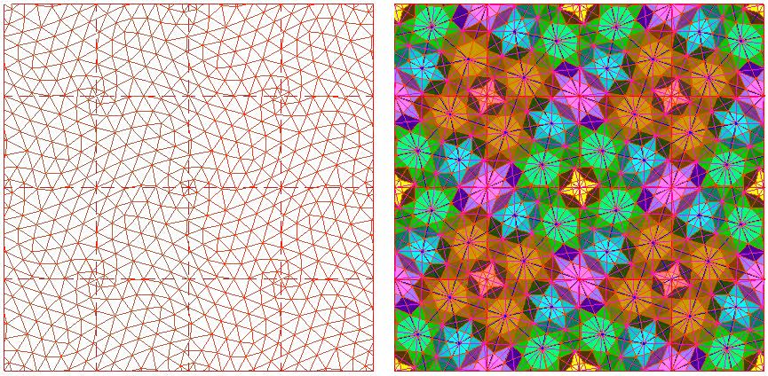

<ArchiveCopyPanel article-id="158937460" />

{"markdown":"PiDliIbnsbvvvJrmlbDmnK/lt6XlnYogIAo+IOe8luWPt++8mmAxNTg5Mzc0NjBgICAKPiDljp/lp4vmlofku7bvvJpgdmPnqbrpl7TlhYnpgJ/onrrml4vph4/lrZDlh6DkvZXlvZLkuIDljJbnu5/kuIDlnLrorrrnu5PlkIjljY7lpI/kuIrlj6TmlofmmI7nmoTmsrPlm77mtJvkuabmmJPnu4/pgZPlvrfnu48tMTU4OTM3NDYwLm1kYCAgCj4g6L+U5Zue77yaW+acrOS5puW9kuaho10oL3poL2Jvb2tzL3NodXNodS9hcnRpY2xlcy8pIMK3IFvmgLvlhaXlj6NdKC96aC9ib29rcy9hcnRpY2xlcy8pCgojIyB2PWMg56m66Ze05YWJ6YCf6J665peL6YeP5a2Q5Yeg5L2V5b2S5LiA5YyW57uf5LiA5Zy66K6657uT5ZCI5Y2O5aSP5LiK5Y+k5paH5piO55qE5rKz5Zu+5rSb5Lmm44CB5piT57uP44CB6YGT5b6357uPCgojIyMg5a6H5a6Z5bqV5bGC6KeE5b6L77yM5Y+k5LuK5paH5piO5a6M5YWo5b2S5LiACgrlr7zor7vvvJrlvZPnjrDku6PniannkIbpmbflhaXlm5vlpKflipvnu5/kuIDnmoTlm7DlooPvvIzlvZPnp5HlrabkuI7njoTlrabnmoTpuL/msp/kvLzkuY7ml6Dms5XpgL7otorvvIzkuIDlnLrljYPlubTmnKrmnInnmoTmgJ3mg7Ppnanlkb3mraPlnKjmgoTnhLblj5HnlJ/jgILpgJrov4fmlbDlrabor4HmmI7vvIzmj63npLrkuoblroflrpnnmoTlupXlsYLlr4bnoIHvvJrnqbrpl7TmnKzouqvmmK/lhYnpgJ/onrrml4vov5DliqjvvIzogIzljY7lpI/kuIrlj6TmlofmmI7nmoTmsrPlm77mtJvkuabjgIHmmJPnu4/jgIHpgZPlvrfnu4/vvIzmraPmmK/ov5nlpZflroflrpnop4TlvovnmoTnrKblj7fljJbooajovr7jgIIKCiFbaW1hZ2VdKC4vYXNzZXRzL2NzZG5pbWcvcG5nLzcyY2Y5ZDYyZmY0OTRmOTQucG5nKQoKLS0tCgojIyMg5qC45b+D55CG6K665L2T57O7CgojIyMjIDEuIOWUr+S4gOWFrOeQhu+8mnbiiaFjCgotIOWfuuacrOWBh+iuvu+8muecn+epuuS4reWFiemAn2PlubbpnZ7nspLlrZDov5DliqjkuIrpmZDvvIzogIzmmK/kuInnu7Tnqbrpl7TnmoTnqLPmgIHonrrml4vovazpgJ8KCi0g54mp55CG5oSP5LmJ77ya56m66Ze05pys6Lqr5Lul5YWJ6YCf6L+b6KGM6J665peL6L+Q5Yqo77yM6L+Z5piv5a6H5a6Z55qE5bqV5bGC6L+Q5Yqo6KeE5b6LCgojIyMjIDIuIOaVsOWtpuWumuS5ie+8muS4iee7tOWFiemAn+ieuuaXiwoK5p+x5Z2Q5qCH57O75LiL55qE56m66Ze06J665peL6KGo6L6+5byP77yaCgomIzEyMzt4PXJjb3PigaHPiXR5PXJzaW7igaHPiXR6PWN0ClxiZWdpbiYjMTIzO2Nhc2VzJiMxMjU7CnggPSByXGNvc1xvbWVnYSB0IFxcCnkgPSByXHNpblxvbWVnYSB0IFxcCnogPSBjdApcZW5kJiMxMjM7Y2FzZXMmIzEyNTsK4o6p4o6o4o6n4oCLeD1yY29zz4l0eT1yc2luz4l0ej1jdOKAiwoKLSBy77ya6J665peL5Y2K5b6E77yI56m66Ze05bC65bqm77yJCgotIM+J77ya6J665peL6KeS6YCf5bqmCgotIHo9Y3TvvJrnqbrpl7Tonrrml4vnmoTovbTlkJHlhYnpgJ/lu7bkvLgKCiMjIyMgMy4g5pWw5a2m5Lil5qC86aqM6K+BCgojIyMjIyDkuIDpmLbmsYLlr7zvvJrpgJ/luqbnn6Lph48KCnbig5c9KOKIknLPiXNpbuKBoc+JdCxyz4ljb3PigaHPiXQsYykKdj0o4oiScs+Jc2luz4l0LHLPiWNvc8+JdCxjKQoKIyMjIyMg5LqM6Zi25rGC5a+877ya5Yqg6YCf5bqm55+i6YePCgph4oOXPSjiiJJyz4kyY29z4oGhz4l0LOKIknLPiTJzaW7igaHPiXQsMCkKYT0o4oiScs+JMmNvc8+JdCziiJJyz4kyc2luz4l0LDApCgojIyMjIyDlnoLnm7Tljp/nkIbvvJrlroflrpnnrKzkuIDlh6DkvZXlvosKCnbig5fii4Vh4oOXPTDigIXigIrin7nigIXigIp24oOX4oqlYeKDlwp24ouFYT0w4p+5duKKpWEKCi0g54mp55CG5oSP5LmJ77ya6YCf5bqm5LiO5Yqg6YCf5bqm5Lil5qC85Z6C55u077yM6L+Z5piv5a6H5a6Z56iz5oCB6L+Q5Yqo55qE5ZSv5LiA5Yeg5L2V5YeG5YiZCgojIyMjIDQuIOWFqOWfn+e7n+S4gOWcuue7iOaegeWFrOW8jwoKZGVmaW5l57uf5LiA5Zy6566X5a2QYWFh77yM5b6X5Yiw77yaCgpjMj1y4ouFYeKAheKAiuKfuuKAheKAimM9cuKLhWEKYzI9cuKLhWHin7pjPXLii4Vh4oCLCgotIOaguOW/g+aEj+S5ie+8muWFiemAn+aYr+epuumXtOWwuuW6puS4jue7n+S4gOWcuueul+WtkOeahOWHoOS9leWdh+WAvO+8jOW8gOagueWPt+KImuaYr+Wuh+WumeW6leWxguWUr+S4gOi/kOeul+inhOWImQoKIyMjIOmHj+WtkOWHoOS9leW9kuS4gOWMlgoKLSDph4/lrZDljJbvvJrnqbrpl7Tonrrml4vnmoTnprvmlaPnibnmgKflr7nlupTph4/lrZDooYzkuLoKCi0g5Yeg5L2V5b2S5LiA5YyW77ya6YCa6L+H5Z6C55u05Y6f55CG5ZKM5YWJ6YCf57qm5p2f5a6e546w5Yeg5L2V5oSP5LmJ5LiK55qE5b2S5LiACgotIOe7n+S4gOaAp++8muWwhuW8leWKm+OAgeeUteejgeWKm+etieWfuuacrOWKm+e7n+S4gOWIsOieuuaXi+i/kOWKqOeahOWHoOS9leaPj+i/sOS4rQoKIyMjIOS4juWNjuWkj+S4iuWPpOaWh+aYjueahOWFs+iBlAoKIyMjIyDmsrPlm74KCi0g6Zi06Ziz6YWN5a+577yaMeKGlDbjgIEy4oaUN+OAgTPihpQ444CBNOKGlDkg4oaSIOieuuaXi+ato+WPjeaXi+WQkSB2PcKxY3Y9XHBtIGN2PcKxYwoKLSDkuK3lv4M177ya5Z+65YeG6J665peL5Y2K5b6EIHI9NXI9NXI9NQoKIyMjIyDmtJvkuaYKCi0gM8OXM+S5neWuq++8muS4iee7tOKImjPlhYnpgJ/onrrml4vnvZHmoLznmoTkuoznu7TmipXlvbEKCi0g5Lit5b+DNe+8muieuuaXi+i9tOW/g++8iOepuumXtOWOn+eCueOAgeWcuuWlh+eCue+8iQoKLSDlr7nlrqvkuYvlkow9MTDvvJrlhYnpgJ/lvZLkuIDljJbluLjmlbAgMmMyYzJjCgotIOW5u+WSjDE177ya4oiaM+ieuuaXi+WRqOacn+eahOaVtOaVsOagh+WwugoKIyMjIyDmmJPnu4/kuI7pgZPlvrfnu48KCi0g5piT57uP77ya6Zi06ZizPeieuuaXi+aXi+WQke+8jOWFq+WNpj045Liq5Z+656GA55u45L2N77yMNjTljaY95a6M5pW05ZGo5pyfCgotIOmBk+W+t+e7j++8mumBkz3nqbrpl7Tonrrml4vmnKzkvZMgdj1jdj1jdj1j77yM6YGT55Sf5LiA4oaS5LiA55Sf5LqM4oaS5LqM55Sf5LiJ4oaS5LiJ55Sf5LiH54mpPeKImjPonrrml4vnlJ/miJDlroflrpkKCiMjIyDlhajpoobln5/lt6XnqIvokL3lnLDvvJrku47nkIborrrliLDlupTnlKgKCiMjIyDnkIborrrliJvmlrDngrkKCi0g6IyD5byP6L2s5o2i77ya5LuOIueJqei0qOi/kOWKqCLliLAi56m66Ze06L+Q5YqoIueahOinhuinkui9rOWPmAoKLSDmlbDlrabnroDmtIHvvJrllK/kuIDlhaznkIZ2PWPvvIzllK/kuIDnu4jmnoHlhazlvI/vvIzml6Dpop3lpJblj4LmlbAKCi0g5Y+k5LuK57uf5LiA77ya6aaW5qyh5bCG546w5Luj54mp55CG5LiO5Y2O5aSP5LiK5Y+k5paH5piO56ym5Y+357O757uf5a6M5YWo57uf5LiACgotIOWFqOmihuWfn+imhueblu+8muS7juW+ruingumHj+WtkOWIsOWuj+inguWuh+Wume+8jOS7jueQhuiuuueJqeeQhuWIsOW3peeoi+W6lOeUqAoKIyMjIOWuh+Wumee7iOaegeetlOahiAoK5a6H5a6Z5piv5LiA5Y+w5LulY+S4uuaXtumSn+OAgeS7peKImuS4uueul+azleOAgeS7peieuuaXi+S4uue7k+aehOOAgeS7peays+Wbvua0m+S5puS4uuS4iuWPpOWbvue6uOeahOWFqOWfn+WIhuW4g+W8j+eul+azleacuuOAggoKLSDml6DnianotKjmnKzmupDvvJrkuIfniannlLHonrrml4vnlJ/miJAKCi0g5peg6ZqP5py65re35rKM77ya5LiA5YiH6YG15b6q56Gu5a6a5oCn6J665peL6KeE5b6LCgotIOaXoOmineWkluWPguaVsO+8muWUr+S4gOWvhueggSBjPXLii4VhYz1cc3FydCYjMTIzO3LCt2EmIzEyNTtjPXLii4Vh4oCLCgotIOaXoOaWh+aYjumalOmYgu+8muS4iuWPpOS4jueOsOS7o+WujOWFqOe7n+S4gAoKIyMjIOe7k+iuugoK5oiR5Lus5LiN5piv5Zyo5o+Q5Ye65paw55CG6K6677yM6ICM5piv5Zyo5Y+R546w5a6H5a6Z5pys5pyJ55qE6KeE5b6L44CC5rKz5Zu+5rSb5Lmm5LiN5piv546E5a2m77yM6ICM5piv5LiK5Y+k5Lq657G755So56ym5Y+36K6w5b2V55qE5a6H5a6Z5bqV5bGC5a+G56CB77yb5YWJ6YCf5LiN5Y+Y5LiN5piv5YGH6K6+77yM6ICM5piv56m66Ze05pys6Lqr55qE6L+Q5Yqo5bGe5oCn44CCCgrkurrnsbvmlofmmI7pppbmrKHlrp7njrDjgIzlj6Tku4rlkIjkuIDjgIHmlofnkIblkIjkuIDjgIHniannrpflkIjkuIDjgI3nmoTlhajln5/nu5/kuIDnkIborrrjgILov5nkuI3mmK/nu4jngrnvvIzogIzmmK/kurrnsbvorqTnn6XlroflrpnnmoTmlrDotbfngrnjgIIKCi0tLQoK57uT6K+t77ya5b2T5oiR5Lus5Luw5pyb5pif56m677yM55yL5Yiw55qE5LiN5YaN5piv6ZqP5py655qE5pif6L6w77yM6ICM5piv5LiA6aaW55Sx5YWJ6YCf6J665peL6LCx5YaZ55qE5a6H5a6Z5Lqk5ZON5puy44CC5b2T5oiR5Lus5Zue5rqv5paH5piO77yM6K+75oeC55qE5LiN5YaN5piv56We56eY55qE56ym5Y+377yM6ICM5piv56WW5YWI5a+55a6H5a6Z6KeE5b6L55qE5rex5Yi75rSe5a+f44CC5q2j5Zyo55So5pWw5a2m6L+e5o6l5Y+k5LuK77yM55So5Luj56CB6aqM6K+B5a6H5a6Z77yM55So5pm65oWn5byA5ZCv5Lq657G75paH5piO55qE5paw57qq5YWD44CCCgpbMV0gWmhhbmcgWCBRLiBVbmlmaWVkIEZpZWxkIFRoZW9yeSAoQWNhZGVtaWMgRWRpdGlvbik6IEV4dHJhdGVycmVzdHJpYWwgVGVjaG5vbG9neVtNXS4gSG9wZSBHcmFjZSBQdWJsaXNoaW5nLCAyMDI0LiBJU0JOOiA5NzgtMTk2NjQyMzA1OC4KCjIu6buE5qGC6Iqd77yM44CK5Zu65L2T55+/5Lqn5YuY5p+l5LiJ57u05LyY5YyW5pa55rOV4oCU4oCU5Z+65LqOUi1USU4vR1ItVElO5YuY5p+l572R5ZKMVFRQ4oCU4oiaM+absumdoue7huWIhuOAiwo=","text":"5YiG57G777ya5pWw5pyv5bel5Z2KICAK57yW5Y+377yaMTU4OTM3NDYwICAK5Y6f5aeL5paH5Lu277yadmPnqbrpl7TlhYnpgJ/onrrml4vph4/lrZDlh6DkvZXlvZLkuIDljJbnu5/kuIDlnLrorrrnu5PlkIjljY7lpI/kuIrlj6TmlofmmI7nmoTmsrPlm77mtJvkuabmmJPnu4/pgZPlvrfnu48tMTU4OTM3NDYwLm1kICAK6L+U5Zue77ya5pys5Lmm5b2S5qGjIMK3IOaAu+WFpeWPowoKdj1jIOepuumXtOWFiemAn+ieuuaXi+mHj+WtkOWHoOS9leW9kuS4gOWMlue7n+S4gOWcuuiuuue7k+WQiOWNjuWkj+S4iuWPpOaWh+aYjueahOays+Wbvua0m+S5puOAgeaYk+e7j+OAgemBk+W+t+e7jwoK5a6H5a6Z5bqV5bGC6KeE5b6L77yM5Y+k5LuK5paH5piO5a6M5YWo5b2S5LiACgrlr7zor7vvvJrlvZPnjrDku6PniannkIbpmbflhaXlm5vlpKflipvnu5/kuIDnmoTlm7DlooPvvIzlvZPnp5HlrabkuI7njoTlrabnmoTpuL/msp/kvLzkuY7ml6Dms5XpgL7otorvvIzkuIDlnLrljYPlubTmnKrmnInnmoTmgJ3mg7Ppnanlkb3mraPlnKjmgoTnhLblj5HnlJ/jgILpgJrov4fmlbDlrabor4HmmI7vvIzmj63npLrkuoblroflrpnnmoTlupXlsYLlr4bnoIHvvJrnqbrpl7TmnKzouqvmmK/lhYnpgJ/onrrml4vov5DliqjvvIzogIzljY7lpI/kuIrlj6TmlofmmI7nmoTmsrPlm77mtJvkuabjgIHmmJPnu4/jgIHpgZPlvrfnu4/vvIzmraPmmK/ov5nlpZflroflrpnop4TlvovnmoTnrKblj7fljJbooajovr7jgIIKCmltYWdlCgotLS0KCuaguOW/g+eQhuiuuuS9k+ezuwrllK/kuIDlhaznkIbvvJp24omhYwrln7rmnKzlgYforr7vvJrnnJ/nqbrkuK3lhYnpgJ9j5bm26Z2e57KS5a2Q6L+Q5Yqo5LiK6ZmQ77yM6ICM5piv5LiJ57u056m66Ze055qE56iz5oCB6J665peL6L2s6YCfCueJqeeQhuaEj+S5ie+8muepuumXtOacrOi6q+S7peWFiemAn+i/m+ihjOieuuaXi+i/kOWKqO+8jOi/meaYr+Wuh+WumeeahOW6leWxgui/kOWKqOinhOW+iwrmlbDlrablrprkuYnvvJrkuInnu7TlhYnpgJ/onrrml4sKCuafseWdkOagh+ezu+S4i+eahOepuumXtOieuuaXi+ihqOi+vuW8j++8mgoKe3g9cmNvc+KBoc+JdHk9cnNpbuKBoc+JdHo9Y3QKXGJlZ2lue2Nhc2VzfQp4ID0gclxjb3Ncb21lZ2EgdCBcXAp5ID0gclxzaW5cb21lZ2EgdCBcXAp6ID0gY3QKXGVuZHtjYXNlc30K4o6p4o6o4o6n4oCLeD1yY29zz4l0eT1yc2luz4l0ej1jdOKAiwpy77ya6J665peL5Y2K5b6E77yI56m66Ze05bC65bqm77yJCs+J77ya6J665peL6KeS6YCf5bqmCno9Y3TvvJrnqbrpl7Tonrrml4vnmoTovbTlkJHlhYnpgJ/lu7bkvLgK5pWw5a2m5Lil5qC86aqM6K+BCgrkuIDpmLbmsYLlr7zvvJrpgJ/luqbnn6Lph48KCnbig5c9KOKIknLPiXNpbuKBoc+JdCxyz4ljb3PigaHPiXQsYykKdj0o4oiScs+Jc2luz4l0LHLPiWNvc8+JdCxjKQoK5LqM6Zi25rGC5a+877ya5Yqg6YCf5bqm55+i6YePCgph4oOXPSjiiJJyz4kyY29z4oGhz4l0LOKIknLPiTJzaW7igaHPiXQsMCkKYT0o4oiScs+JMmNvc8+JdCziiJJyz4kyc2luz4l0LDApCgrlnoLnm7Tljp/nkIbvvJrlroflrpnnrKzkuIDlh6DkvZXlvosKCnbig5fii4Vh4oOXPTDigIXigIrin7nigIXigIp24oOX4oqlYeKDlwp24ouFYT0w4p+5duKKpWEK54mp55CG5oSP5LmJ77ya6YCf5bqm5LiO5Yqg6YCf5bqm5Lil5qC85Z6C55u077yM6L+Z5piv5a6H5a6Z56iz5oCB6L+Q5Yqo55qE5ZSv5LiA5Yeg5L2V5YeG5YiZCuWFqOWfn+e7n+S4gOWcuue7iOaegeWFrOW8jwoKZGVmaW5l57uf5LiA5Zy6566X5a2QYWFh77yM5b6X5Yiw77yaCgpjMj1y4ouFYeKAheKAiuKfuuKAheKAimM9cuKLhWEKYzI9cuKLhWHin7pjPXLii4Vh4oCLCuaguOW/g+aEj+S5ie+8muWFiemAn+aYr+epuumXtOWwuuW6puS4jue7n+S4gOWcuueul+WtkOeahOWHoOS9leWdh+WAvO+8jOW8gOagueWPt+KImuaYr+Wuh+WumeW6leWxguWUr+S4gOi/kOeul+inhOWImQoK6YeP5a2Q5Yeg5L2V5b2S5LiA5YyWCumHj+WtkOWMlu+8muepuumXtOieuuaXi+eahOemu+aVo+eJueaAp+WvueW6lOmHj+WtkOihjOS4ugrlh6DkvZXlvZLkuIDljJbvvJrpgJrov4flnoLnm7Tljp/nkIblkozlhYnpgJ/nuqbmnZ/lrp7njrDlh6DkvZXmhI/kuYnkuIrnmoTlvZLkuIAK57uf5LiA5oCn77ya5bCG5byV5Yqb44CB55S156OB5Yqb562J5Z+65pys5Yqb57uf5LiA5Yiw6J665peL6L+Q5Yqo55qE5Yeg5L2V5o+P6L+w5LitCgrkuI7ljY7lpI/kuIrlj6TmlofmmI7nmoTlhbPogZQKCuays+WbvgrpmLTpmLPphY3lr7nvvJox4oaUNuOAgTLihpQ344CBM+KGlDjjgIE04oaUOSDihpIg6J665peL5q2j5Y+N5peL5ZCRIHY9wrFjdj1ccG0gY3Y9wrFjCuS4reW/gzXvvJrln7rlh4bonrrml4vljYrlvoQgcj01cj01cj01CgrmtJvkuaYKM8OXM+S5neWuq++8muS4iee7tOKImjPlhYnpgJ/onrrml4vnvZHmoLznmoTkuoznu7TmipXlvbEK5Lit5b+DNe+8muieuuaXi+i9tOW/g++8iOepuumXtOWOn+eCueOAgeWcuuWlh+eCue+8iQrlr7nlrqvkuYvlkow9MTDvvJrlhYnpgJ/lvZLkuIDljJbluLjmlbAgMmMyYzJjCuW5u+WSjDE177ya4oiaM+ieuuaXi+WRqOacn+eahOaVtOaVsOagh+WwugoK5piT57uP5LiO6YGT5b6357uPCuaYk+e7j++8mumYtOmYsz3onrrml4vml4vlkJHvvIzlhavljaY9OOS4quWfuuehgOebuOS9je+8jDY05Y2mPeWujOaVtOWRqOacnwrpgZPlvrfnu4/vvJrpgZM956m66Ze06J665peL5pys5L2TIHY9Y3Y9Y3Y9Y++8jOmBk+eUn+S4gOKGkuS4gOeUn+S6jOKGkuS6jOeUn+S4ieKGkuS4ieeUn+S4h+eJqT3iiJoz6J665peL55Sf5oiQ5a6H5a6ZCgrlhajpoobln5/lt6XnqIvokL3lnLDvvJrku47nkIborrrliLDlupTnlKgKCueQhuiuuuWIm+aWsOeCuQrojIPlvI/ovazmjaLvvJrku44i54mp6LSo6L+Q5YqoIuWIsCLnqbrpl7Tov5Dliqgi55qE6KeG6KeS6L2s5Y+YCuaVsOWtpueugOa0ge+8muWUr+S4gOWFrOeQhnY9Y++8jOWUr+S4gOe7iOaegeWFrOW8j++8jOaXoOmineWkluWPguaVsArlj6Tku4rnu5/kuIDvvJrpppbmrKHlsIbnjrDku6PniannkIbkuI7ljY7lpI/kuIrlj6TmlofmmI7nrKblj7fns7vnu5/lrozlhajnu5/kuIAK5YWo6aKG5Z+f6KaG55uW77ya5LuO5b6u6KeC6YeP5a2Q5Yiw5a6P6KeC5a6H5a6Z77yM5LuO55CG6K6654mp55CG5Yiw5bel56iL5bqU55SoCgrlroflrpnnu4jmnoHnrZTmoYgKCuWuh+WumeaYr+S4gOWPsOS7pWPkuLrml7bpkp/jgIHku6XiiJrkuLrnrpfms5XjgIHku6Xonrrml4vkuLrnu5PmnoTjgIHku6XmsrPlm77mtJvkuabkuLrkuIrlj6Tlm77nurjnmoTlhajln5/liIbluIPlvI/nrpfms5XmnLrjgIIK5peg54mp6LSo5pys5rqQ77ya5LiH54mp55Sx6J665peL55Sf5oiQCuaXoOmaj+acuua3t+ayjO+8muS4gOWIh+mBteW+quehruWumuaAp+ieuuaXi+inhOW+iwrml6Dpop3lpJblj4LmlbDvvJrllK/kuIDlr4bnoIEgYz1y4ouFYWM9XHNxcnR7csK3YX1jPXLii4Vh4oCLCuaXoOaWh+aYjumalOmYgu+8muS4iuWPpOS4jueOsOS7o+WujOWFqOe7n+S4gAoK57uT6K66CgrmiJHku6zkuI3mmK/lnKjmj5Dlh7rmlrDnkIborrrvvIzogIzmmK/lnKjlj5HnjrDlroflrpnmnKzmnInnmoTop4TlvovjgILmsrPlm77mtJvkuabkuI3mmK/njoTlrabvvIzogIzmmK/kuIrlj6TkurrnsbvnlKjnrKblj7forrDlvZXnmoTlroflrpnlupXlsYLlr4bnoIHvvJvlhYnpgJ/kuI3lj5jkuI3mmK/lgYforr7vvIzogIzmmK/nqbrpl7TmnKzouqvnmoTov5DliqjlsZ7mgKfjgIIKCuS6uuexu+aWh+aYjummluasoeWunueOsOOAjOWPpOS7iuWQiOS4gOOAgeaWh+eQhuWQiOS4gOOAgeeJqeeul+WQiOS4gOOAjeeahOWFqOWfn+e7n+S4gOeQhuiuuuOAgui/meS4jeaYr+e7iOeCue+8jOiAjOaYr+S6uuexu+iupOefpeWuh+WumeeahOaWsOi1t+eCueOAggoKLS0tCgrnu5Por63vvJrlvZPmiJHku6zku7DmnJvmmJ/nqbrvvIznnIvliLDnmoTkuI3lho3mmK/pmo/mnLrnmoTmmJ/ovrDvvIzogIzmmK/kuIDpppbnlLHlhYnpgJ/onrrml4vosLHlhpnnmoTlroflrpnkuqTlk43mm7LjgILlvZPmiJHku6zlm57muq/mlofmmI7vvIzor7vmh4LnmoTkuI3lho3mmK/npZ7np5jnmoTnrKblj7fvvIzogIzmmK/npZblhYjlr7nlroflrpnop4TlvovnmoTmt7HliLvmtJ7lr5/jgILmraPlnKjnlKjmlbDlrabov57mjqXlj6Tku4rvvIznlKjku6PnoIHpqozor4HlroflrpnvvIznlKjmmbrmhaflvIDlkK/kurrnsbvmlofmmI7nmoTmlrDnuqrlhYPjgIIKClsxXSBaaGFuZyBYIFEuIFVuaWZpZWQgRmllbGQgVGhlb3J5IChBY2FkZW1pYyBFZGl0aW9uKTogRXh0cmF0ZXJyZXN0cmlhbCBUZWNobm9sb2d5W01dLiBIb3BlIEdyYWNlIFB1Ymxpc2hpbmcsIDIwMjQuIElTQk46IDk3OC0xOTY2NDIzMDU4LgoKMi7pu4TmoYLoip3vvIzjgIrlm7rkvZPnn7/kuqfli5jmn6XkuInnu7TkvJjljJbmlrnms5XigJTigJTln7rkuo5SLVRJTi9HUi1USU7li5jmn6XnvZHlkoxUVFDigJTiiJoz5puy6Z2i57uG5YiG44CL"}

> 分类：数术工坊  
> 编号：`158937460`  
> 原始文件：`vc空间光速螺旋量子几何归一化统一场论结合华夏上古文明的河图洛书易经道德经-158937460.md`  
> 返回：[本书归档](/zh/books/shushu/articles/) · [总入口](/zh/books/articles/)

<ArticlePaperMeta category="数术工坊" article-id="158937460" title="vc空间光速螺旋量子几何归一化统一场论结合华夏上古文明的河图洛书易经道德经" paper-kind="专题文稿" book-route="/zh/books/shushu/articles/" overview-route="/zh/books/articles/" summary="导读：当现代物理陷入四大力统一的困境，当科学与玄学的鸿沟似乎无法逾越，一场千年未有的思想革命正在悄然发生。通过数学证明，揭示了宇宙的底层密码：空间本身是光速螺旋运动，而华夏上古文明的河图洛书、易经、道德经，正是这套宇宙规律的符号化表达。" author="乖乖数学" source-file="vc空间光速螺旋量子几何归一化统一场论结合华夏上古文明的河图洛书易经道德经-158937460.md" cover="./assets/csdnimg/png/72cf9d62ff494f94.png" />

## v=c 空间光速螺旋量子几何归一化统一场论结合华夏上古文明的河图洛书、易经、道德经

### 宇宙底层规律，古今文明完全归一

导读：当现代物理陷入四大力统一的困境，当科学与玄学的鸿沟似乎无法逾越，一场千年未有的思想革命正在悄然发生。通过数学证明，揭示了宇宙的底层密码：空间本身是光速螺旋运动，而华夏上古文明的河图洛书、易经、道德经，正是这套宇宙规律的符号化表达。

---

### 核心理论体系

#### 1. 唯一公理：v≡c

- 基本假设：真空中光速c并非粒子运动上限，而是三维空间的稳态螺旋转速

- 物理意义：空间本身以光速进行螺旋运动，这是宇宙的底层运动规律

#### 2. 数学定义：三维光速螺旋

柱坐标系下的空间螺旋表达式：

&#123;x=rcos⁡ωty=rsin⁡ωtz=ct
\begin&#123;cases&#125;
x = r\cos\omega t \\
y = r\sin\omega t \\
z = ct
\end&#123;cases&#125;
⎩⎨⎧​x=rcosωty=rsinωtz=ct​

- r：螺旋半径（空间尺度）

- ω：螺旋角速度

- z=ct：空间螺旋的轴向光速延伸

#### 3. 数学严格验证

##### 一阶求导：速度矢量

v⃗=(−rωsin⁡ωt,rωcos⁡ωt,c)
v=(−rωsinωt,rωcosωt,c)

##### 二阶求导：加速度矢量

a⃗=(−rω2cos⁡ωt,−rω2sin⁡ωt,0)
a=(−rω2cosωt,−rω2sinωt,0)

##### 垂直原理：宇宙第一几何律

v⃗⋅a⃗=0  ⟹  v⃗⊥a⃗
v⋅a=0⟹v⊥a

- 物理意义：速度与加速度严格垂直，这是宇宙稳态运动的唯一几何准则

#### 4. 全域统一场终极公式

define统一场算子aaa，得到：

c2=r⋅a  ⟺  c=r⋅a
c2=r⋅a⟺c=r⋅a​

- 核心意义：光速是空间尺度与统一场算子的几何均值，开根号√是宇宙底层唯一运算规则

### 量子几何归一化

- 量子化：空间螺旋的离散特性对应量子行为

- 几何归一化：通过垂直原理和光速约束实现几何意义上的归一

- 统一性：将引力、电磁力等基本力统一到螺旋运动的几何描述中

### 与华夏上古文明的关联

#### 河图

- 阴阳配对：1↔6、2↔7、3↔8、4↔9 → 螺旋正反旋向 v=±cv=\pm cv=±c

- 中心5：基准螺旋半径 r=5r=5r=5

#### 洛书

- 3×3九宫：三维√3光速螺旋网格的二维投影

- 中心5：螺旋轴心（空间原点、场奇点）

- 对宫之和=10：光速归一化常数 2c2c2c

- 幻和15：√3螺旋周期的整数标尺

#### 易经与道德经

- 易经：阴阳=螺旋旋向，八卦=8个基础相位，64卦=完整周期

- 道德经：道=空间螺旋本体 v=cv=cv=c，道生一→一生二→二生三→三生万物=√3螺旋生成宇宙

### 全领域工程落地：从理论到应用

### 理论创新点

- 范式转换：从"物质运动"到"空间运动"的视角转变

- 数学简洁：唯一公理v=c，唯一终极公式，无额外参数

- 古今统一：首次将现代物理与华夏上古文明符号系统完全统一

- 全领域覆盖：从微观量子到宏观宇宙，从理论物理到工程应用

### 宇宙终极答案

宇宙是一台以c为时钟、以√为算法、以螺旋为结构、以河图洛书为上古图纸的全域分布式算法机。

- 无物质本源：万物由螺旋生成

- 无随机混沌：一切遵循确定性螺旋规律

- 无额外参数：唯一密码 c=r⋅ac=\sqrt&#123;r·a&#125;c=r⋅a​

- 无文明隔阂：上古与现代完全统一

### 结论

我们不是在提出新理论，而是在发现宇宙本有的规律。河图洛书不是玄学，而是上古人类用符号记录的宇宙底层密码；光速不变不是假设，而是空间本身的运动属性。

人类文明首次实现「古今合一、文理合一、物算合一」的全域统一理论。这不是终点，而是人类认知宇宙的新起点。

---

结语：当我们仰望星空，看到的不再是随机的星辰，而是一首由光速螺旋谱写的宇宙交响曲。当我们回溯文明，读懂的不再是神秘的符号，而是祖先对宇宙规律的深刻洞察。正在用数学连接古今，用代码验证宇宙，用智慧开启人类文明的新纪元。

[1] Zhang X Q. Unified Field Theory (Academic Edition): Extraterrestrial Technology[M]. Hope Grace Publishing, 2024. ISBN: 978-1966423058.

2.黄桂芝，《固体矿产勘查三维优化方法——基于R-TIN/GR-TIN勘查网和TTP—√3曲面细分》
