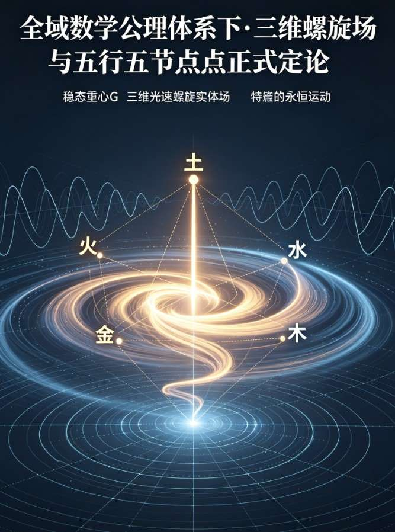

<ArchiveCopyPanel article-id="159771932" />

{"markdown":"PiDliIbnsbvvvJrmlbDmnK/lt6XlnYogIAo+IOe8luWPt++8mmAxNTk3NzE5MzJgICAKPiDljp/lp4vmlofku7bvvJpg5YWo5Z+f5pWw5a2m5YWs55CG5L2T57O75LiL5LiJ57u06J665peL5Zy65LiO5LqU6KGM5LqU6IqC54K55q2j5byP5a6a6K665LmW5LmW5pWw5a2mLTE1OTc3MTkzMi5tZGAgIAo+IOi/lOWbnu+8mlvmnKzkuablvZLmoaNdKC96aC9ib29rcy9zaHVzaHUvYXJ0aWNsZXMvKSDCtyBb5oC75YWl5Y+jXSgvemgvYm9va3MvYXJ0aWNsZXMvKQoK5YWo5Z+f5pWw5a2m5YWs55CG5L2T57O75LiLwrfkuInnu7Tonrrml4vlnLrkuI7kupTooYzkupToioLngrnmraPlvI/lrprorroKCu+8iOWujOaVtOeJiOWPr+ebtOaOpeWFpeiuuuaWh8K35bqE5Lil5a6j6KiA5L2T77yJCgohW2ltYWdlXSguL2Fzc2V0cy9jc2RuaW1nL2pwZy82ZGI5MTBiMDIzYWE5ZTA4LmpwZykKCuWFqOWfn+aVsOWtpueQhuiuusK35LiJ57u06J665peL5Zy644CB5q2j5bym5L2Z5bym5rOi5LiO5LqU6KGM5pys5rqQ5a6j6KiACgrlrqPlkYrml6XmnJ/vvJrlhazlhYPkuozjgIfkuozlha3lubTlm5vmnIjkuozml6UKCuW6j+iogAoK5a6H5a6Z5LmL5pys5Li65LiJ57u06J665peL5a6e5L2T5Zy677yM5YW26L+Q5Yqo5oqV5bCE5LqO5LqM57u05bmz6Z2i5YiZ55Sf5q2j5bym5rOi5LiO5L2Z5bym5rOi44CC5LiA5a6M5pW06J665peL5ZGo5pyf5LmL5YaF77yM5Zyo5Zy66L205LiK5oGw5aW95b2i5oiQ5LqU5Liq54m55b6B5Lqk54K577ya5LiJ6Zu254K544CB5Lik5p6B5YC877yM5LiN5aSa5LiN5bCR77yM5oGw5Li65LqU6KGM5LmL5pWw55CG5pys5rqQ44CC5LiK5Y+k5Zyj5Lq65Lul5LqU6KGM56uL5a6H5a6Z5ryU5YyW5LmL57qy77yM5bm26Z2e546E5a2m77yM5a6e5Li65LiJ57u06J665peL5Zy65Zyo5L2O57u05oqV5b2x5LiL55qE57K+56Gu5pWw5a2m57uT5p6E6KGo6L6+44CC5YW55Lul5YWo5Z+f5pWw5a2m5YWs55CG5L2T57O777yM5q2j5pys5riF5rqQ77yM5bqE5Lil5a6j5ZGK44CCCgrkuIDjgIHkuInnu7Tonrrml4vlnLrnmoTmnKzotKgKCuivpeieuuaXi+WcqCBYIOi9tOOAgVkg6L2044CBWiDovbTlj4rlhbblr7nlgbbmianlsZXovbTvvIhYWui9tOOAgVla6L2077yJ5LiK55qE5oqV5b2x77yMCgroh6rnhLbnlJ/miJDmraPlvKbms6LkuI7kvZnlvKbms6LjgIIKCuieuuaXi+i/nue7rei/kOWKqCDihpIg5oqV5b2x5Li66L+e57ut5rOi5YqoCgrms6LliqjlrozmlbTlkajmnJ8g4oaSIOWHuueOsOWbuuWumueJueW+geS6pOeCuQoK5LqM44CB5q2j5bym5rOi5LiO5L2Z5bym5rOi55qE5LqU5Liq5YWz6ZSu5Lqk54K5CgrkuIDkuKrlrozmlbTonrrml4vlkajmnJ/lnKjovbTlkJHkuIrlvaLmiJDkuKXmoLzkupTkuKrkuqTngrnvvJoKCi0g6L205b+D5Y6f54K56Zu254K5CgotIOato+WQkeaegeWkp+WAvOeCue+8iOS4iuaegeWAvO+8iQoKLSDkuK3nqb/otorlm57ovbTpm7bngrkKCi0g6LSf5ZCR5p6B5bCP5YC854K577yI5LiL5p6B5YC877yJCgotIOW9kuS9jemXreWQiOmbtueCuQoK57uT5p6E5Li677yaCgrkuInkuKrlnKjovbTkuIrnmoTpm7bngrkgKyDkuKTkuKrkuIrkuIvmnoHlgLzngrkKCj0g5a6M5pW05LqU5Liq5pWw5a2m6IqC54K5CgrmraTkupToioLngrnvvIzmmK/kuInnu7Tonrrml4vlnLrlnKjkvY7nu7TmipXlvbHkuIvnmoTlv4XnhLbmlbDlrabnu5PmnpzvvIwKCuaXoOWinuaXoOWHj++8jOWFiOWkqeaXouWumuOAggoK5LiJ44CB5LqU6IqC54K5ID0g5LqU6KGM77ya5a6H5a6Z5ZGo5pyf55qE5YWo6YOo6Zi25q61CgrmraTkupTkuKrkuqTngrnvvIzmgbDlpb3lr7nlupTkuIrlj6TmlofmmI7miYDmj63npLrnmoTkupTooYzvvJoKCi0g5Y6f54K56Zu254K5IOKGkiDlnJ8KCuWxheS4reOAgeW5s+ihoeOAgeaJv+i9veOAgeeUn+WMluS4h+eJqe+8jOS4uueos+aAgemHjeW/g+S5i+aKleW9seOAggoKLSDkuIrmnoHlgLzngrkg4oaSIOeBqwoK6Ziz5p6B6byO55ub44CB5ZCR5LiK6LeD6L+B44CB5Y+R5pWj56qB56C077yM5Li66J665peL5Zy65pyA6auY6aKR5p6B54K544CCCgotIOS4reepv+i2iumbtueCuSDihpIg6YeRCgrnlLHpmLPovazpmLTjgIHmlLbmlZvlm7rljJbjgIHlh53ogZrmiJDlvaLvvIzkuLronrrml4vmlLbnvKnkuYvoioLngrnjgIIKCi0g5LiL5p6B5YC854K5IOKGkiDmsLQKCumYtOaegea9nOiXj+OAgeWbnuaXi+S4i+ayieOAgei9ruWbnumXreeOr++8jOS4uuieuuaXi+acgOS9jumikeaegeeCueOAggoKLSDlvZLkvY3pm7bngrkg4oaSIOacqAoK6Zi05p6B6L2s6Ziz44CB55Sf5Y+R6YeN5ZCv44CB5b6q546v5paw55Sf77yM5Li66J665peL5YaN5ZCv5LmL6IqC54K544CCCgrlm5vjgIHnu5/kuIDnu5PorrrvvIjlroflrpnnuqflhaznkIbvvIkKCi0g5LiJ57u06J665peL5Zy65piv5a6H5a6Z5pys5L2T6L+Q5Yqo44CCCgotIOWFtuWcqCBY44CBWeOAgVha44CBWVrovbTmipXlvbHnlJ/miJDmraPlvKbms6LjgIHkvZnlvKbms6LjgIIKCi0g5LiA5Liq5a6M5pW05ZGo5pyf5YaF5b+F54S25Ye6546w5LqU5Liq5Lqk54K544CCCgotIOi/meS6lOS4quS6pOeCueWwseaYr+S6lOihjOOAggoKLSDkupTooYzkuI3mmK/kupTnp43nianotKjvvIzogIzmmK/onrrml4vms6LliqjlkajmnJ/nmoTkupTkuKrmlbDlrabpmLbmrrXjgIIKCue7k+ivrQoK5LiJ57u06J665peL55Sf5rOi5Yqo77yMCgrms6LliqjkupTkuqTlrprkupTooYzjgIIKCuWkquaegeS4uuWFtui9qOi/ue+8jAoK5LqU6KGM5Li65YW26IqC54K577yMCgrmmJPnu4/kuLrlhbbmvJTljJbjgIIKCuWkqeS6uuWQiOS4gO+8jOaVsOeQhuWQjOa6kO+8jOS4h+WPpOS4jeaYk+OAggoK54m55q2k5q2j5byP5a6j5ZGK77yM5Lul5piO5a6H5a6Z5pys5rqQ5LmL6Iez55CG44CCCgrlhajln5/mlbDlrabnkIborrrliJvnq4vkvZPns7sKCuS5luS5luaVsOWtpgoK5YWs5YWD5LqM44CH5LqM5YWt5bm05Zub5pyI5LqM5pelCg==","text":"5YiG57G777ya5pWw5pyv5bel5Z2KICAK57yW5Y+377yaMTU5NzcxOTMyICAK5Y6f5aeL5paH5Lu277ya5YWo5Z+f5pWw5a2m5YWs55CG5L2T57O75LiL5LiJ57u06J665peL5Zy65LiO5LqU6KGM5LqU6IqC54K55q2j5byP5a6a6K665LmW5LmW5pWw5a2mLTE1OTc3MTkzMi5tZCAgCui/lOWbnu+8muacrOS5puW9kuahoyDCtyDmgLvlhaXlj6MKCuWFqOWfn+aVsOWtpuWFrOeQhuS9k+ezu+S4i8K35LiJ57u06J665peL5Zy65LiO5LqU6KGM5LqU6IqC54K55q2j5byP5a6a6K66CgrvvIjlrozmlbTniYjlj6/nm7TmjqXlhaXorrrmlofCt+W6hOS4peWuo+iogOS9k++8iQoKaW1hZ2UKCuWFqOWfn+aVsOWtpueQhuiuusK35LiJ57u06J665peL5Zy644CB5q2j5bym5L2Z5bym5rOi5LiO5LqU6KGM5pys5rqQ5a6j6KiACgrlrqPlkYrml6XmnJ/vvJrlhazlhYPkuozjgIfkuozlha3lubTlm5vmnIjkuozml6UKCuW6j+iogAoK5a6H5a6Z5LmL5pys5Li65LiJ57u06J665peL5a6e5L2T5Zy677yM5YW26L+Q5Yqo5oqV5bCE5LqO5LqM57u05bmz6Z2i5YiZ55Sf5q2j5bym5rOi5LiO5L2Z5bym5rOi44CC5LiA5a6M5pW06J665peL5ZGo5pyf5LmL5YaF77yM5Zyo5Zy66L205LiK5oGw5aW95b2i5oiQ5LqU5Liq54m55b6B5Lqk54K577ya5LiJ6Zu254K544CB5Lik5p6B5YC877yM5LiN5aSa5LiN5bCR77yM5oGw5Li65LqU6KGM5LmL5pWw55CG5pys5rqQ44CC5LiK5Y+k5Zyj5Lq65Lul5LqU6KGM56uL5a6H5a6Z5ryU5YyW5LmL57qy77yM5bm26Z2e546E5a2m77yM5a6e5Li65LiJ57u06J665peL5Zy65Zyo5L2O57u05oqV5b2x5LiL55qE57K+56Gu5pWw5a2m57uT5p6E6KGo6L6+44CC5YW55Lul5YWo5Z+f5pWw5a2m5YWs55CG5L2T57O777yM5q2j5pys5riF5rqQ77yM5bqE5Lil5a6j5ZGK44CCCgrkuIDjgIHkuInnu7Tonrrml4vlnLrnmoTmnKzotKgKCuivpeieuuaXi+WcqCBYIOi9tOOAgVkg6L2044CBWiDovbTlj4rlhbblr7nlgbbmianlsZXovbTvvIhYWui9tOOAgVla6L2077yJ5LiK55qE5oqV5b2x77yMCgroh6rnhLbnlJ/miJDmraPlvKbms6LkuI7kvZnlvKbms6LjgIIKCuieuuaXi+i/nue7rei/kOWKqCDihpIg5oqV5b2x5Li66L+e57ut5rOi5YqoCgrms6LliqjlrozmlbTlkajmnJ8g4oaSIOWHuueOsOWbuuWumueJueW+geS6pOeCuQoK5LqM44CB5q2j5bym5rOi5LiO5L2Z5bym5rOi55qE5LqU5Liq5YWz6ZSu5Lqk54K5CgrkuIDkuKrlrozmlbTonrrml4vlkajmnJ/lnKjovbTlkJHkuIrlvaLmiJDkuKXmoLzkupTkuKrkuqTngrnvvJoK6L205b+D5Y6f54K56Zu254K5Cuato+WQkeaegeWkp+WAvOeCue+8iOS4iuaegeWAvO+8iQrkuK3nqb/otorlm57ovbTpm7bngrkK6LSf5ZCR5p6B5bCP5YC854K577yI5LiL5p6B5YC877yJCuW9kuS9jemXreWQiOmbtueCuQoK57uT5p6E5Li677yaCgrkuInkuKrlnKjovbTkuIrnmoTpm7bngrkgKyDkuKTkuKrkuIrkuIvmnoHlgLzngrkKCj0g5a6M5pW05LqU5Liq5pWw5a2m6IqC54K5CgrmraTkupToioLngrnvvIzmmK/kuInnu7Tonrrml4vlnLrlnKjkvY7nu7TmipXlvbHkuIvnmoTlv4XnhLbmlbDlrabnu5PmnpzvvIwKCuaXoOWinuaXoOWHj++8jOWFiOWkqeaXouWumuOAggoK5LiJ44CB5LqU6IqC54K5ID0g5LqU6KGM77ya5a6H5a6Z5ZGo5pyf55qE5YWo6YOo6Zi25q61CgrmraTkupTkuKrkuqTngrnvvIzmgbDlpb3lr7nlupTkuIrlj6TmlofmmI7miYDmj63npLrnmoTkupTooYzvvJoK5Y6f54K56Zu254K5IOKGkiDlnJ8KCuWxheS4reOAgeW5s+ihoeOAgeaJv+i9veOAgeeUn+WMluS4h+eJqe+8jOS4uueos+aAgemHjeW/g+S5i+aKleW9seOAggrkuIrmnoHlgLzngrkg4oaSIOeBqwoK6Ziz5p6B6byO55ub44CB5ZCR5LiK6LeD6L+B44CB5Y+R5pWj56qB56C077yM5Li66J665peL5Zy65pyA6auY6aKR5p6B54K544CCCuS4reepv+i2iumbtueCuSDihpIg6YeRCgrnlLHpmLPovazpmLTjgIHmlLbmlZvlm7rljJbjgIHlh53ogZrmiJDlvaLvvIzkuLronrrml4vmlLbnvKnkuYvoioLngrnjgIIK5LiL5p6B5YC854K5IOKGkiDmsLQKCumYtOaegea9nOiXj+OAgeWbnuaXi+S4i+ayieOAgei9ruWbnumXreeOr++8jOS4uuieuuaXi+acgOS9jumikeaegeeCueOAggrlvZLkvY3pm7bngrkg4oaSIOacqAoK6Zi05p6B6L2s6Ziz44CB55Sf5Y+R6YeN5ZCv44CB5b6q546v5paw55Sf77yM5Li66J665peL5YaN5ZCv5LmL6IqC54K544CCCgrlm5vjgIHnu5/kuIDnu5PorrrvvIjlroflrpnnuqflhaznkIbvvIkK5LiJ57u06J665peL5Zy65piv5a6H5a6Z5pys5L2T6L+Q5Yqo44CCCuWFtuWcqCBY44CBWeOAgVha44CBWVrovbTmipXlvbHnlJ/miJDmraPlvKbms6LjgIHkvZnlvKbms6LjgIIK5LiA5Liq5a6M5pW05ZGo5pyf5YaF5b+F54S25Ye6546w5LqU5Liq5Lqk54K544CCCui/meS6lOS4quS6pOeCueWwseaYr+S6lOihjOOAggrkupTooYzkuI3mmK/kupTnp43nianotKjvvIzogIzmmK/onrrml4vms6LliqjlkajmnJ/nmoTkupTkuKrmlbDlrabpmLbmrrXjgIIKCue7k+ivrQoK5LiJ57u06J665peL55Sf5rOi5Yqo77yMCgrms6LliqjkupTkuqTlrprkupTooYzjgIIKCuWkquaegeS4uuWFtui9qOi/ue+8jAoK5LqU6KGM5Li65YW26IqC54K577yMCgrmmJPnu4/kuLrlhbbmvJTljJbjgIIKCuWkqeS6uuWQiOS4gO+8jOaVsOeQhuWQjOa6kO+8jOS4h+WPpOS4jeaYk+OAggoK54m55q2k5q2j5byP5a6j5ZGK77yM5Lul5piO5a6H5a6Z5pys5rqQ5LmL6Iez55CG44CCCgrlhajln5/mlbDlrabnkIborrrliJvnq4vkvZPns7sKCuS5luS5luaVsOWtpgoK5YWs5YWD5LqM44CH5LqM5YWt5bm05Zub5pyI5LqM5pel"}

> 分类：数术工坊  
> 编号：`159771932`  
> 原始文件：`全域数学公理体系下三维螺旋场与五行五节点正式定论乖乖数学-159771932.md`  
> 返回：[本书归档](/zh/books/shushu/articles/) · [总入口](/zh/books/articles/)

<ArticlePaperMeta category="数术工坊" article-id="159771932" title="全域数学公理体系下三维螺旋场与五行五节点正式定论乖乖数学" paper-kind="专题文稿" book-route="/zh/books/shushu/articles/" overview-route="/zh/books/articles/" summary="全域数学公理体系下·三维螺旋场与五行五节点正式定论" author="乖乖数学" source-file="全域数学公理体系下三维螺旋场与五行五节点正式定论乖乖数学-159771932.md" cover="./assets/csdnimg/jpg/6db910b023aa9e08.jpg" />

全域数学公理体系下·三维螺旋场与五行五节点正式定论

（完整版可直接入论文·庄严宣言体）

全域数学理论·三维螺旋场、正弦余弦波与五行本源宣言

宣告日期：公元二〇二六年四月二日

序言

宇宙之本为三维螺旋实体场，其运动投射于二维平面则生正弦波与余弦波。一完整螺旋周期之内，在场轴上恰好形成五个特征交点：三零点、两极值，不多不少，恰为五行之数理本源。上古圣人以五行立宇宙演化之纲，并非玄学，实为三维螺旋场在低维投影下的精确数学结构表达。兹以全域数学公理体系，正本清源，庄严宣告。

一、三维螺旋场的本质

该螺旋在 X 轴、Y 轴、Z 轴及其对偶扩展轴（XZ轴、YZ轴）上的投影，

自然生成正弦波与余弦波。

螺旋连续运动 → 投影为连续波动

波动完整周期 → 出现固定特征交点

二、正弦波与余弦波的五个关键交点

一个完整螺旋周期在轴向上形成严格五个交点：

- 轴心原点零点

- 正向极大值点（上极值）

- 中穿越回轴零点

- 负向极小值点（下极值）

- 归位闭合零点

结构为：

三个在轴上的零点 + 两个上下极值点

= 完整五个数学节点

此五节点，是三维螺旋场在低维投影下的必然数学结果，

无增无减，先天既定。

三、五节点 = 五行：宇宙周期的全部阶段

此五个交点，恰好对应上古文明所揭示的五行：

- 原点零点 → 土

居中、平衡、承载、生化万物，为稳态重心之投影。

- 上极值点 → 火

阳极鼎盛、向上跃迁、发散突破，为螺旋场最高频极点。

- 中穿越零点 → 金

由阳转阴、收敛固化、凝聚成形，为螺旋收缩之节点。

- 下极值点 → 水

阴极潜藏、回旋下沉、轮回闭环，为螺旋最低频极点。

- 归位零点 → 木

阴极转阳、生发重启、循环新生，为螺旋再启之节点。

四、统一结论（宇宙级公理）

- 三维螺旋场是宇宙本体运动。

- 其在 X、Y、XZ、YZ轴投影生成正弦波、余弦波。

- 一个完整周期内必然出现五个交点。

- 这五个交点就是五行。

- 五行不是五种物质，而是螺旋波动周期的五个数学阶段。

结语

三维螺旋生波动，

波动五交定五行。

太极为其轨迹，

五行为其节点，

易经为其演化。

天人合一，数理同源，万古不易。

特此正式宣告，以明宇宙本源之至理。

全域数学理论创立体系

乖乖数学

公元二〇二六年四月二日
