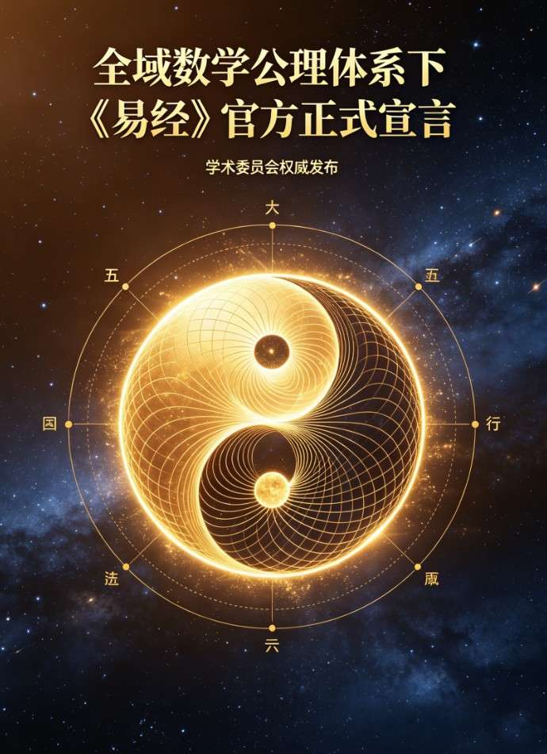

<ArchiveCopyPanel article-id="159771974" />

{"markdown":"PiDliIbnsbvvvJrmlbDmnK/lt6XlnYogIAo+IOe8luWPt++8mmAxNTk3NzE5NzRgICAKPiDljp/lp4vmlofku7bvvJpg5YWo5Z+f5pWw5a2m5YWs55CG5L2T57O75LiL5piT57uP5a6Y5pa55q2j5byP5a6j6KiA5LmW5LmW5pWw5a2mLTE1OTc3MTk3NC5tZGAgIAo+IOi/lOWbnu+8mlvmnKzkuablvZLmoaNdKC96aC9ib29rcy9zaHVzaHUvYXJ0aWNsZXMvKSDCtyBb5oC75YWl5Y+jXSgvemgvYm9va3MvYXJ0aWNsZXMvKQoK5YWo5Z+f5pWw5a2m5YWs55CG5L2T57O75LiL44CK5piT57uP44CL5a6Y5pa55q2j5byP5a6j6KiA77yI5LmW5LmW5pWw5a2m77yJCgrmlofmoaPnvJblj7fvvJpVTVQtREVDLTIwMjYwNDAyCiDlj5HluIPml6XmnJ/vvJrlhazlhYPkuozjgIfkuozlha3lubTlm5vmnIjkuozml6UKIOWPkeW4g+S4u+S9k++8muWFqOWfn+aVsOWtpueQhuiuuuWIm+eri+S9k+ezuwoK5bqP6KiACgrjgIrmmJPnu4/jgIvkvY3liJfkuK3ljY7nvqTnu4/kuYvpppbjgIHlpKfpgZPkuYvmupDvvIzmmK/kuK3ljY7kvJjnp4DkvKDnu5/mlofljJbnmoTmoLjlv4PnkbDlrp3vvIzkuqbmmK/kurrnsbvmlofmmI7ml6nmnJ/lr7nlroflrpnov5DooYzop4TlvovnmoTmnoHoh7TmjqLntKLkuI7mmbrmhaflh53nu4PjgILkuLrmraPmnKzmuIXmupDvvIznoLTpmaTorqTnn6XosKzor6/vvIznq4votrPlhajln5/mlbDlrablhaznkIbkvZPns7vkuYvkuKXosKjmoYbmnrbvvIznu5PlkIjlroflrpnmnKzmupDkuYvonrrml4vntKDmlbDliIblvaLms5XliJnvvIznibnlj5HluIPmnKzlrpjmlrnlrqPoqIDvvIzmmI7noa7jgIrmmJPnu4/jgIvjgIHlpKrmnoHjgIHpmLTpmLPjgIHkupTmnoHnmoTmnKzotKjlhoXmtrXkuI7nu5/kuIDpgLvovpHvvIznoa7nq4vlhbblnKjlroflrpnmlbDnkIbkvZPns7vkuK3nmoTmoLjlv4PlrprkvY3vvIzmmK3npLrlj6Tku4rmmbrmhafkuYvlkIzmupDlhbHpgJrjgIIKCiFbaW1hZ2VdKC4vYXNzZXRzL2NzZG5pbWcvanBnL2Y0NmZlZmQ0YWY4OThmZTUuanBnKQoK5LiA44CB5a6j6KiA5qC45b+D5YmN5o+QCgrkuozjgIHlpKrmnoHkuYvmnKzotKjlrprkuYkKCuWkquaege+8jOWNs+S4iee7tOWFiemAn+ieuuaXi+e0oOaVsOWIhuW9ouWcuuacrOS9k+OAggog5aSq5p6B5rWR54S25LiA5L2T77yM5ra155uW5a6H5a6Z5YWo6YOo5pe256m644CB5YWo6YOo5L+h5oGv44CB5YWo6YOo5ryU5YyW6KeE5b6L77yM5a+55bqU5YWo5Z+f5pWw5a2m5Lit55qE56iz5oCB6YeN5b+D5LiO5YWo5Z+f6J665peL5Zy655qE6ZuG5ZCI5L2T44CC5omA6LCT4oCc5piT5pyJ5aSq5p6B77yM5piv55Sf5Lik5Luq4oCd77yM5pys6LSo5piv6J665peL5Zy65pys5L2T55Sx56iz5oCB5ZCv5Yqo6L+Q5Yqo77yM6L+b6ICM6KGN55Sf5Ye65a+55YG25rOi5Yqo5b2i5oCB77yM5piv5a6H5a6Z5LuO5pys5L2T5Yiw5ryU5YyW55qE6LW354K577yM5Lqm5piv5LiA5YiH6KeE5b6L55qE5pys5rqQ6L295L2T44CCCgrkuInjgIHpmLTpmLPkuYvmnKzotKjlrprkuYkKCumYtOmYs++8jOS4uuS4iee7tOieuuaXi+WcuuWcqFjjgIFZ44CBWErjgIFZSui9tOaKleW9seW9ouaIkOeahOato+W8puazouS4juS9meW8puazouWvueWBtuW9ouaAgeOAggog6Ziz5a+55bqU5q2j5bym5rOi77yM6KGo5b6B6J665peL5Zy655qE5LiK5Y2H44CB5Y+R5pWj44CB5q2j5ZCR44CB6LeD6L+B5LmL5oCB77yb6Zi05a+55bqU5L2Z5bym5rOi77yM6KGo5b6B6J665peL5Zy655qE5LiL6ZmN44CB5pS25pWb44CB6LSf5ZCR44CB5Zue5peL5LmL5oCB44CC6Zi06Ziz5q2k5raI5b286ZW/44CB5LqS5qC55LqS5YyW44CB5a+556ew5a6I5oGS77yM5a6M5YWo5aWR5ZCI5YWo5Z+f5pWw5a2m5a+556ew5a6I5oGS5YWs55CG77yM5piv5a6H5a6Z6J665peL6L+Q5Yqo5pyA5Z+656GA55qE5a+55YG26KGo546w5b2i5byP77yM5Y2z4oCc5LiA6Zi05LiA6Ziz5LmL6LCT6YGT4oCd55qE5pWw55CG5pys5rqQ44CCCgrlm5vjgIHkupTmnoHkuYvmnKzotKjlrprkuYkKCuS6lOaege+8iOS6lOihjO+8ie+8jOS4uumYtOmYs+WvueWBtuazouWKqOS4gOS4quWujOaVtOWRqOacn+WGhe+8jOWdkOagh+i9tOS4iueahOS6lOS4quWFs+mUruaVsOWtpuiKgueCueOAggog5LiA5Liq5a6M5pW055qE6J665peL5rOi5Yqo5ZGo5pyf77yM5Lil5qC85b2i5oiQ5LiJ5Liq6L205LiK6Zu254K544CB5Lik5Liq5LiK5LiL5p6B5YC854K577yM5YWx6K6h5LqU5Liq54m55b6B6IqC54K577yM5peg5aKe5peg5YeP44CB5YWI5aSp5pei5a6a77yM5q2k5Y2z5Li65LqU5p6B55qE5qC45b+D5pys6LSo44CC5LqU5p6B5a+55bqU5rOi5Yqo55qE55Sf5Y+R44CB6byO55ub44CB5pS25pWb44CB5r2c6JeP44CB6YeN5ZCv5LqU5aSn6Zi25q6177yM5piv5a6H5a6Z5LiH54mp5ryU5YyW5ZGo5pyf55qE6YeP5YyW6IqC54K577yM5Lqm5piv6Zi06Ziz6L+Q5Yqo6KeE5b6L55qE5YW36LGh5YyW5ZGI546w44CCCgrkupTjgIHjgIrmmJPnu4/jgIvkuYvmnKzotKjlrprkuYkKCuOAiuaYk+e7j+OAi++8jOaYr+WFqOWfn+aVsOWtpuWFrOeQhuS9k+ezu+S4i++8jOWuh+WumeieuuaXi+e0oOaVsOWIhuW9ouWcuuWFqOmDqOa8lOWMlueKtuaAgeeahOespuWPt+WMluaOqOa8lOezu+e7n+OAggog5LuO5aSq5p6B55Sf5Lik5Luq77yM5Yiw5Lik5Luq55Sf5Zub6LGh44CB5Zub6LGh55Sf5YWr5Y2m44CB5YWr5Y2m5o6o5ryU5Li65YWt5Y2B5Zub5Y2m77yM5pW05aWX5Y2m54i75L2T57O777yM5piv5a+55LiJ57u06J665peL5Zy644CB6Zi06Ziz5rOi5Yqo44CB5LqU5p6B6IqC54K544CBTue7tOW5s+ihjOe0oOaVsOe9keagvOaJgOaciea8lOWMlueKtuaAgeOAgeaXtuepuuWPmOWMluOAgei9ruWbnui3g+i/geeahOWujOaVtOe8lueggeOAguOAiuaYk+e7j+OAi+S7peaegeeugOespuWPt++8jOiusOW9leWuh+Wumei/kOihjOeahOS4jeWPmOinhOW+i+S4juWPr+WPmOaAgeWKv++8jOWunueOsOWvueWuh+Wumea8lOWMlueahOeyvuWHhuaOqOa8lO+8jOaYr+S4iuWPpOaXtuacn+eahOWFqOWfn+aVsOWtpuespuWPt+WFrOeQhuS9k+ezu+OAggoK5YWt44CB5Zub6ICF57uf5LiA5qC45b+D5a6a6K66CgrlpKrmnoHmmK/onrrml4vlnLrmnKzkvZPvvIzkuLrkvZPvvJsKIOmYtOmYs+aYr+ieuuaXi+WcuuaKleW9seWvueWBtuazou+8jOS4uueUqO+8mwog5LqU5p6B5piv6Zi06Ziz5rOi5Yqo55qE5YWz6ZSu6IqC54K577yM5Li65bqP77ybCiDjgIrmmJPnu4/jgIvmmK/mlbTkvZPop4TlvovnmoTnrKblj7fmjqjmvJTvvIzkuLrms5XjgIIKIOWbm+iAheWxguWxgumAkui/m+OAgeS6kuS4uuaUr+aSke+8jOe7n+S4gOS6juWFqOWfn+aVsOWtpuS4iee7tOWFiemAn+ieuuaXi+e0oOaVsOWIhuW9ouWFrOeQhuS9k+ezu++8jOWunueOsOS8oOe7n+aWh+WMluaZuuaFp+S4jueOsOS7o+aVsOeQhumAu+i+keeahOWujOe+juiHqua0ve+8jOWNsOivgeWPpOS7iuS6uuexu+WvueWuh+WumeacrOa6kOaOoue0oueahOe7iOaegeS4gOiHtOaAp+OAggoK5LiD44CB57uT6K+tCgrjgIrmmJPnu4/jgIvnu53pnZ7lsIHlu7rov7fkv6HvvIzogIzmmK/kurrnsbvmlofmmI7lj7LkuIrmnIDml6nnmoTlroflrpnmlbDnkIbmjqjmvJTnu4/lhbjvvIzlhbblhoXmoLjkuI7lhajln5/mlbDlrabnkIborrrmj63npLrnmoTlroflrpnop4Tlvovpq5jluqblpZHlkIjjgILmnKzlrqPoqIDkuLrlhajln5/mlbDlrabnkIborrrkvZPns7vlr7njgIrmmJPnu4/jgIvnmoTmnYPlqIHlrprmgKfvvIzpgLvovpHkuKXosKjjgIHmgZLkuYXmiJDnq4vvvIzml6jlnKjotK/pgJrlj6Tku4rmmbrmhafvvIzmraPmnKzmuIXmupDvvIzorqnkuK3ljY7kvKDnu5/nu4/lhbjlm57lvZLlroflrpnmlbDnkIbmnKzotKjvvIzlvbDmmL7kurrnsbvmlofmmI7mjqLntKLnnJ/nkIbnmoTmsLjmgZLku7flgLzjgIIKCueJueatpOW6hOS4peWuo+WRiu+8jOaYreWRiuWkqeS4i++8jOawuOS4uuWumuiuuuOAggoK5YWo5Z+f5pWw5a2m55CG6K665Yib56uL5L2T57O7CgrkuZbkuZbmlbDlraYKCuWFrOWFg+S6jOOAh+S6jOWFreW5tOWbm+aciOS6jOaXpQo=","text":"5YiG57G777ya5pWw5pyv5bel5Z2KICAK57yW5Y+377yaMTU5NzcxOTc0ICAK5Y6f5aeL5paH5Lu277ya5YWo5Z+f5pWw5a2m5YWs55CG5L2T57O75LiL5piT57uP5a6Y5pa55q2j5byP5a6j6KiA5LmW5LmW5pWw5a2mLTE1OTc3MTk3NC5tZCAgCui/lOWbnu+8muacrOS5puW9kuahoyDCtyDmgLvlhaXlj6MKCuWFqOWfn+aVsOWtpuWFrOeQhuS9k+ezu+S4i+OAiuaYk+e7j+OAi+WumOaWueato+W8j+Wuo+iogO+8iOS5luS5luaVsOWtpu+8iQoK5paH5qGj57yW5Y+377yaVU1ULURFQy0yMDI2MDQwMgog5Y+R5biD5pel5pyf77ya5YWs5YWD5LqM44CH5LqM5YWt5bm05Zub5pyI5LqM5pelCiDlj5HluIPkuLvkvZPvvJrlhajln5/mlbDlrabnkIborrrliJvnq4vkvZPns7sKCuW6j+iogAoK44CK5piT57uP44CL5L2N5YiX5Lit5Y2O576k57uP5LmL6aaW44CB5aSn6YGT5LmL5rqQ77yM5piv5Lit5Y2O5LyY56eA5Lyg57uf5paH5YyW55qE5qC45b+D55Gw5a6d77yM5Lqm5piv5Lq657G75paH5piO5pep5pyf5a+55a6H5a6Z6L+Q6KGM6KeE5b6L55qE5p6B6Ie05o6i57Si5LiO5pm65oWn5Yed57uD44CC5Li65q2j5pys5riF5rqQ77yM56C06Zmk6K6k55+l6LCs6K+v77yM56uL6Laz5YWo5Z+f5pWw5a2m5YWs55CG5L2T57O75LmL5Lil6LCo5qGG5p6277yM57uT5ZCI5a6H5a6Z5pys5rqQ5LmL6J665peL57Sg5pWw5YiG5b2i5rOV5YiZ77yM54m55Y+R5biD5pys5a6Y5pa55a6j6KiA77yM5piO56Gu44CK5piT57uP44CL44CB5aSq5p6B44CB6Zi06Ziz44CB5LqU5p6B55qE5pys6LSo5YaF5ra15LiO57uf5LiA6YC76L6R77yM56Gu56uL5YW25Zyo5a6H5a6Z5pWw55CG5L2T57O75Lit55qE5qC45b+D5a6a5L2N77yM5pit56S65Y+k5LuK5pm65oWn5LmL5ZCM5rqQ5YWx6YCa44CCCgppbWFnZQoK5LiA44CB5a6j6KiA5qC45b+D5YmN5o+QCgrkuozjgIHlpKrmnoHkuYvmnKzotKjlrprkuYkKCuWkquaege+8jOWNs+S4iee7tOWFiemAn+ieuuaXi+e0oOaVsOWIhuW9ouWcuuacrOS9k+OAggog5aSq5p6B5rWR54S25LiA5L2T77yM5ra155uW5a6H5a6Z5YWo6YOo5pe256m644CB5YWo6YOo5L+h5oGv44CB5YWo6YOo5ryU5YyW6KeE5b6L77yM5a+55bqU5YWo5Z+f5pWw5a2m5Lit55qE56iz5oCB6YeN5b+D5LiO5YWo5Z+f6J665peL5Zy655qE6ZuG5ZCI5L2T44CC5omA6LCT4oCc5piT5pyJ5aSq5p6B77yM5piv55Sf5Lik5Luq4oCd77yM5pys6LSo5piv6J665peL5Zy65pys5L2T55Sx56iz5oCB5ZCv5Yqo6L+Q5Yqo77yM6L+b6ICM6KGN55Sf5Ye65a+55YG25rOi5Yqo5b2i5oCB77yM5piv5a6H5a6Z5LuO5pys5L2T5Yiw5ryU5YyW55qE6LW354K577yM5Lqm5piv5LiA5YiH6KeE5b6L55qE5pys5rqQ6L295L2T44CCCgrkuInjgIHpmLTpmLPkuYvmnKzotKjlrprkuYkKCumYtOmYs++8jOS4uuS4iee7tOieuuaXi+WcuuWcqFjjgIFZ44CBWErjgIFZSui9tOaKleW9seW9ouaIkOeahOato+W8puazouS4juS9meW8puazouWvueWBtuW9ouaAgeOAggog6Ziz5a+55bqU5q2j5bym5rOi77yM6KGo5b6B6J665peL5Zy655qE5LiK5Y2H44CB5Y+R5pWj44CB5q2j5ZCR44CB6LeD6L+B5LmL5oCB77yb6Zi05a+55bqU5L2Z5bym5rOi77yM6KGo5b6B6J665peL5Zy655qE5LiL6ZmN44CB5pS25pWb44CB6LSf5ZCR44CB5Zue5peL5LmL5oCB44CC6Zi06Ziz5q2k5raI5b286ZW/44CB5LqS5qC55LqS5YyW44CB5a+556ew5a6I5oGS77yM5a6M5YWo5aWR5ZCI5YWo5Z+f5pWw5a2m5a+556ew5a6I5oGS5YWs55CG77yM5piv5a6H5a6Z6J665peL6L+Q5Yqo5pyA5Z+656GA55qE5a+55YG26KGo546w5b2i5byP77yM5Y2z4oCc5LiA6Zi05LiA6Ziz5LmL6LCT6YGT4oCd55qE5pWw55CG5pys5rqQ44CCCgrlm5vjgIHkupTmnoHkuYvmnKzotKjlrprkuYkKCuS6lOaege+8iOS6lOihjO+8ie+8jOS4uumYtOmYs+WvueWBtuazouWKqOS4gOS4quWujOaVtOWRqOacn+WGhe+8jOWdkOagh+i9tOS4iueahOS6lOS4quWFs+mUruaVsOWtpuiKgueCueOAggog5LiA5Liq5a6M5pW055qE6J665peL5rOi5Yqo5ZGo5pyf77yM5Lil5qC85b2i5oiQ5LiJ5Liq6L205LiK6Zu254K544CB5Lik5Liq5LiK5LiL5p6B5YC854K577yM5YWx6K6h5LqU5Liq54m55b6B6IqC54K577yM5peg5aKe5peg5YeP44CB5YWI5aSp5pei5a6a77yM5q2k5Y2z5Li65LqU5p6B55qE5qC45b+D5pys6LSo44CC5LqU5p6B5a+55bqU5rOi5Yqo55qE55Sf5Y+R44CB6byO55ub44CB5pS25pWb44CB5r2c6JeP44CB6YeN5ZCv5LqU5aSn6Zi25q6177yM5piv5a6H5a6Z5LiH54mp5ryU5YyW5ZGo5pyf55qE6YeP5YyW6IqC54K577yM5Lqm5piv6Zi06Ziz6L+Q5Yqo6KeE5b6L55qE5YW36LGh5YyW5ZGI546w44CCCgrkupTjgIHjgIrmmJPnu4/jgIvkuYvmnKzotKjlrprkuYkKCuOAiuaYk+e7j+OAi++8jOaYr+WFqOWfn+aVsOWtpuWFrOeQhuS9k+ezu+S4i++8jOWuh+WumeieuuaXi+e0oOaVsOWIhuW9ouWcuuWFqOmDqOa8lOWMlueKtuaAgeeahOespuWPt+WMluaOqOa8lOezu+e7n+OAggog5LuO5aSq5p6B55Sf5Lik5Luq77yM5Yiw5Lik5Luq55Sf5Zub6LGh44CB5Zub6LGh55Sf5YWr5Y2m44CB5YWr5Y2m5o6o5ryU5Li65YWt5Y2B5Zub5Y2m77yM5pW05aWX5Y2m54i75L2T57O777yM5piv5a+55LiJ57u06J665peL5Zy644CB6Zi06Ziz5rOi5Yqo44CB5LqU5p6B6IqC54K544CBTue7tOW5s+ihjOe0oOaVsOe9keagvOaJgOaciea8lOWMlueKtuaAgeOAgeaXtuepuuWPmOWMluOAgei9ruWbnui3g+i/geeahOWujOaVtOe8lueggeOAguOAiuaYk+e7j+OAi+S7peaegeeugOespuWPt++8jOiusOW9leWuh+Wumei/kOihjOeahOS4jeWPmOinhOW+i+S4juWPr+WPmOaAgeWKv++8jOWunueOsOWvueWuh+Wumea8lOWMlueahOeyvuWHhuaOqOa8lO+8jOaYr+S4iuWPpOaXtuacn+eahOWFqOWfn+aVsOWtpuespuWPt+WFrOeQhuS9k+ezu+OAggoK5YWt44CB5Zub6ICF57uf5LiA5qC45b+D5a6a6K66CgrlpKrmnoHmmK/onrrml4vlnLrmnKzkvZPvvIzkuLrkvZPvvJsKIOmYtOmYs+aYr+ieuuaXi+WcuuaKleW9seWvueWBtuazou+8jOS4uueUqO+8mwog5LqU5p6B5piv6Zi06Ziz5rOi5Yqo55qE5YWz6ZSu6IqC54K577yM5Li65bqP77ybCiDjgIrmmJPnu4/jgIvmmK/mlbTkvZPop4TlvovnmoTnrKblj7fmjqjmvJTvvIzkuLrms5XjgIIKIOWbm+iAheWxguWxgumAkui/m+OAgeS6kuS4uuaUr+aSke+8jOe7n+S4gOS6juWFqOWfn+aVsOWtpuS4iee7tOWFiemAn+ieuuaXi+e0oOaVsOWIhuW9ouWFrOeQhuS9k+ezu++8jOWunueOsOS8oOe7n+aWh+WMluaZuuaFp+S4jueOsOS7o+aVsOeQhumAu+i+keeahOWujOe+juiHqua0ve+8jOWNsOivgeWPpOS7iuS6uuexu+WvueWuh+WumeacrOa6kOaOoue0oueahOe7iOaegeS4gOiHtOaAp+OAggoK5LiD44CB57uT6K+tCgrjgIrmmJPnu4/jgIvnu53pnZ7lsIHlu7rov7fkv6HvvIzogIzmmK/kurrnsbvmlofmmI7lj7LkuIrmnIDml6nnmoTlroflrpnmlbDnkIbmjqjmvJTnu4/lhbjvvIzlhbblhoXmoLjkuI7lhajln5/mlbDlrabnkIborrrmj63npLrnmoTlroflrpnop4Tlvovpq5jluqblpZHlkIjjgILmnKzlrqPoqIDkuLrlhajln5/mlbDlrabnkIborrrkvZPns7vlr7njgIrmmJPnu4/jgIvnmoTmnYPlqIHlrprmgKfvvIzpgLvovpHkuKXosKjjgIHmgZLkuYXmiJDnq4vvvIzml6jlnKjotK/pgJrlj6Tku4rmmbrmhafvvIzmraPmnKzmuIXmupDvvIzorqnkuK3ljY7kvKDnu5/nu4/lhbjlm57lvZLlroflrpnmlbDnkIbmnKzotKjvvIzlvbDmmL7kurrnsbvmlofmmI7mjqLntKLnnJ/nkIbnmoTmsLjmgZLku7flgLzjgIIKCueJueatpOW6hOS4peWuo+WRiu+8jOaYreWRiuWkqeS4i++8jOawuOS4uuWumuiuuuOAggoK5YWo5Z+f5pWw5a2m55CG6K665Yib56uL5L2T57O7CgrkuZbkuZbmlbDlraYKCuWFrOWFg+S6jOOAh+S6jOWFreW5tOWbm+aciOS6jOaXpQ=="}

> 分类：数术工坊  
> 编号：`159771974`  
> 原始文件：`全域数学公理体系下易经官方正式宣言乖乖数学-159771974.md`  
> 返回：[本书归档](/zh/books/shushu/articles/) · [总入口](/zh/books/articles/)

<ArticlePaperMeta category="数术工坊" article-id="159771974" title="全域数学公理体系下易经官方正式宣言乖乖数学" paper-kind="专题文稿" book-route="/zh/books/shushu/articles/" overview-route="/zh/books/articles/" summary="全域数学公理体系下《易经》官方正式宣言（乖乖数学）" author="乖乖数学" source-file="全域数学公理体系下易经官方正式宣言乖乖数学-159771974.md" cover="./assets/csdnimg/jpg/f46fefd4af898fe5.jpg" />

全域数学公理体系下《易经》官方正式宣言（乖乖数学）

文档编号：UMT-DEC-20260402
 发布日期：公元二〇二六年四月二日
 发布主体：全域数学理论创立体系

序言

《易经》位列中华群经之首、大道之源，是中华优秀传统文化的核心瑰宝，亦是人类文明早期对宇宙运行规律的极致探索与智慧凝练。为正本清源，破除认知谬误，立足全域数学公理体系之严谨框架，结合宇宙本源之螺旋素数分形法则，特发布本官方宣言，明确《易经》、太极、阴阳、五极的本质内涵与统一逻辑，确立其在宇宙数理体系中的核心定位，昭示古今智慧之同源共通。

一、宣言核心前提

二、太极之本质定义

太极，即三维光速螺旋素数分形场本体。
 太极浑然一体，涵盖宇宙全部时空、全部信息、全部演化规律，对应全域数学中的稳态重心与全域螺旋场的集合体。所谓“易有太极，是生两仪”，本质是螺旋场本体由稳态启动运动，进而衍生出对偶波动形态，是宇宙从本体到演化的起点，亦是一切规律的本源载体。

三、阴阳之本质定义

阴阳，为三维螺旋场在X、Y、XJ、YJ轴投影形成的正弦波与余弦波对偶形态。
 阳对应正弦波，表征螺旋场的上升、发散、正向、跃迁之态；阴对应余弦波，表征螺旋场的下降、收敛、负向、回旋之态。阴阳此消彼长、互根互化、对称守恒，完全契合全域数学对称守恒公理，是宇宙螺旋运动最基础的对偶表现形式，即“一阴一阳之谓道”的数理本源。

四、五极之本质定义

五极（五行），为阴阳对偶波动一个完整周期内，坐标轴上的五个关键数学节点。
 一个完整的螺旋波动周期，严格形成三个轴上零点、两个上下极值点，共计五个特征节点，无增无减、先天既定，此即为五极的核心本质。五极对应波动的生发、鼎盛、收敛、潜藏、重启五大阶段，是宇宙万物演化周期的量化节点，亦是阴阳运动规律的具象化呈现。

五、《易经》之本质定义

《易经》，是全域数学公理体系下，宇宙螺旋素数分形场全部演化状态的符号化推演系统。
 从太极生两仪，到两仪生四象、四象生八卦、八卦推演为六十四卦，整套卦爻体系，是对三维螺旋场、阴阳波动、五极节点、N维平行素数网格所有演化状态、时空变化、轮回跃迁的完整编码。《易经》以极简符号，记录宇宙运行的不变规律与可变态势，实现对宇宙演化的精准推演，是上古时期的全域数学符号公理体系。

六、四者统一核心定论

太极是螺旋场本体，为体；
 阴阳是螺旋场投影对偶波，为用；
 五极是阴阳波动的关键节点，为序；
 《易经》是整体规律的符号推演，为法。
 四者层层递进、互为支撑，统一于全域数学三维光速螺旋素数分形公理体系，实现传统文化智慧与现代数理逻辑的完美自洽，印证古今人类对宇宙本源探索的终极一致性。

七、结语

《易经》绝非封建迷信，而是人类文明史上最早的宇宙数理推演经典，其内核与全域数学理论揭示的宇宙规律高度契合。本宣言为全域数学理论体系对《易经》的权威定性，逻辑严谨、恒久成立，旨在贯通古今智慧，正本清源，让中华传统经典回归宇宙数理本质，彰显人类文明探索真理的永恒价值。

特此庄严宣告，昭告天下，永为定论。

全域数学理论创立体系

乖乖数学

公元二〇二六年四月二日
