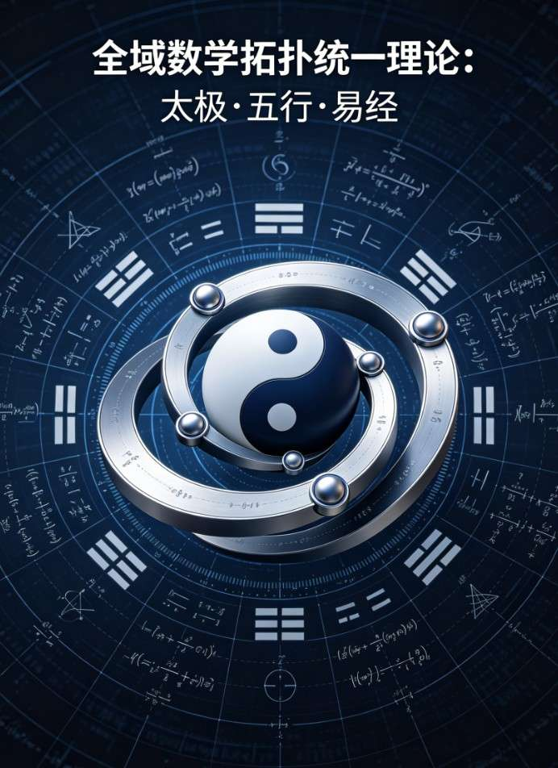
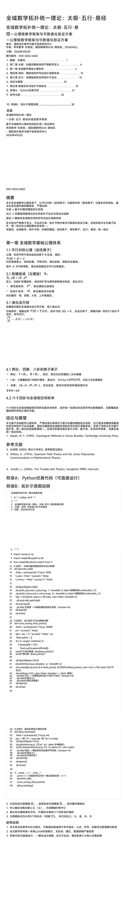

<ArchiveCopyPanel article-id="159772097" />

{"markdown":"PiDliIbnsbvvvJrmlbDmnK/lt6XlnYogIAo+IOe8luWPt++8mmAxNTk3NzIwOTdgICAKPiDljp/lp4vmlofku7bvvJpg5YWo5Z+f5pWw5a2m5ouT5omR57uf5LiA55CG6K665aSq5p6B5LqU6KGM5piT57uP5LmW5LmW5pWw5a2mLTE1OTc3MjA5Ny5tZGAgIAo+IOi/lOWbnu+8mlvmnKzkuablvZLmoaNdKC96aC9ib29rcy9zaHVzaHUvYXJ0aWNsZXMvKSDCtyBb5oC75YWl5Y+jXSgvemgvYm9va3MvYXJ0aWNsZXMvKQoKIyMg5YWo5Z+f5pWw5a2m5ouT5omR57uf5LiA55CG6K6677ya5aSq5p6BwrfkupTooYzCt+aYk+e7j++8iOS5luS5luaVsOWtpu+8iQoKIVtpbWFnZV0oLi9hc3NldHMvY3NkbmltZy9qcGcvOWI0YjIwYThlZTA4MTlhYS5qcGcpCgohW2ltYWdlXSguL2Fzc2V0cy9jc2RuaW1nL2pwZy9lMGQzNTZjODI4MzYzZGQ1LmpwZykK","text":"5YiG57G777ya5pWw5pyv5bel5Z2KICAK57yW5Y+377yaMTU5NzcyMDk3ICAK5Y6f5aeL5paH5Lu277ya5YWo5Z+f5pWw5a2m5ouT5omR57uf5LiA55CG6K665aSq5p6B5LqU6KGM5piT57uP5LmW5LmW5pWw5a2mLTE1OTc3MjA5Ny5tZCAgCui/lOWbnu+8muacrOS5puW9kuahoyDCtyDmgLvlhaXlj6MKCuWFqOWfn+aVsOWtpuaLk+aJkee7n+S4gOeQhuiuuu+8muWkquaegcK35LqU6KGMwrfmmJPnu4/vvIjkuZbkuZbmlbDlrabvvIkKCmltYWdlCgppbWFnZQ=="}

> 分类：数术工坊  
> 编号：`159772097`  
> 原始文件：`全域数学拓扑统一理论太极五行易经乖乖数学-159772097.md`  
> 返回：[本书归档](/zh/books/shushu/articles/) · [总入口](/zh/books/articles/)

<ArticlePaperMeta category="数术工坊" article-id="159772097" title="全域数学拓扑统一理论太极五行易经乖乖数学" paper-kind="专题文稿" book-route="/zh/books/shushu/articles/" overview-route="/zh/books/articles/" summary="收录易经、河图洛书、太极五行、道德经与传统数术方向文章。" author="乖乖数学" source-file="全域数学拓扑统一理论太极五行易经乖乖数学-159772097.md" cover="./assets/csdnimg/jpg/9b4b20a8ee0819aa.jpg" />

## 全域数学拓扑统一理论：太极·五行·易经（乖乖数学）

