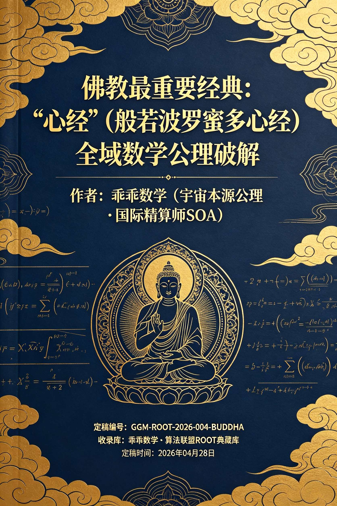
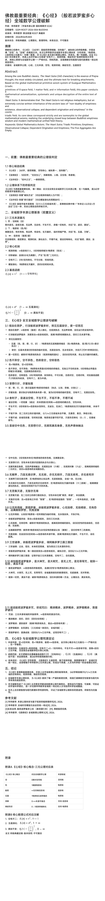

<ArchiveCopyPanel article-id="160601606" />

{"markdown":"PiDliIbnsbvvvJrmlbDmnK/lt6XlnYogIAo+IOe8luWPt++8mmAxNjA2MDE2MDZgICAKPiDljp/lp4vmlofku7bvvJpg5L2b5pWZ5pyA6YeN6KaB57uP5YW45b+D57uP6Iis6Iul5rOi572X6Jyc5aSa5b+D57uP5YWo5Z+f5pWw5a2m5YWs55CG56C06KejLTE2MDYwMTYwNi5tZGAgIAo+IOi/lOWbnu+8mlvmnKzkuablvZLmoaNdKC96aC9ib29rcy9zaHVzaHUvYXJ0aWNsZXMvKSDCtyBb5oC75YWl5Y+jXSgvemgvYm9va3MvYXJ0aWNsZXMvKQoKIyMg5L2b5pWZ5pyA6YeN6KaB57uP5YW477ya44CK5b+D57uP44CL77yI6Iis6Iul5rOi572X6Jyc5aSa5b+D57uP77yJ5YWo5Z+f5pWw5a2m5YWs55CG56C06KejCgrkvZzogIXvvJrkuZbkuZbmlbDlraYg77yI5a6H5a6Z5pys5rqQ5YWs55CGwrflm73pmYXnsr7nrpfluIggU09B77yJCgrlrprnqL/nvJblj7fvvJpHR00tUk9PVC0yMDI2LTAwNC1CVURESEEKCuaUtuW9leW6k++8muS5luS5luaVsOWtpsK3566X5rOV6IGU55ufIFJPT1Qg5YW46JeP5bqTCgrlrprnqL/ml7bpl7TvvJoyMDI25bm0MDTmnIgyOOaXpQoKIVtpbWFnZV0oLi9hc3NldHMvY3NkbmltZy9qcGcvNTg5ZDg3NmE3OTY3M2I2OC5qcGcpCgohW2ltYWdlXSguL2Fzc2V0cy9jc2RuaW1nL2pwZy9iODU2OTM2NzFkMWZjMTkwLmpwZykKCui/meevh+mimOS4uuOAiuS9m+aVmeacgOmHjeimgee7j+WFuO+8muOAiuW/g+e7j+OAi+WFqOWfn+aVsOWtpuWFrOeQhuegtOino+OAi+eahOaWh+aho++8jOaYr+KAnOS5luS5luaVsOWtpuKAneeQhuiuuuS9k+ezu+WvueWFtuacrOa6kOWFrOeQhueahOS4gOasoemHjeimgeW6lOeUqOS4juW7tuS8uOOAguWFtuaguOW/g+WcqOS6ju+8jOS9v+eUqOS4gOWll+iHquWIm+eahOOAgeWQjeS4uuKAnOS5luS5luaVsOWtpsK35YWo5Z+f5pWw5a2m5pys5rqQ5YWs55CG5L2T57O74oCd55qE5pWw55CG5qGG5p6277yM5a+55L2b5pWZ57uP5YW444CK6Iis6Iul5rOi572X6Jyc5aSa5b+D57uP44CL6L+b6KGM5YWo5paw55qE44CB57O757uf5oCn55qE4oCc56C06Kej4oCd5LiO6ZiQ6YeK44CCCgrmlofmoaPnmoTmoLjlv4Porrrngrnlj6/mgLvnu5PlpoLkuIvvvJoKCuS4gOOAgeaguOW/g+S4u+W8oO+8muWvueOAiuW/g+e7j+OAi+aAp+i0qOeahOmHjeaWsOWumuS5iQoK5paH5qGj5byA5a6X5piO5LmJ5Zyw5o+Q5Ye677yM44CK5b+D57uP44CL5LmL5omA5Lul5piv5L2b5pWZ5pyA6YeN6KaB57uP5YW477yM5bm26Z2e5Z+65LqO5a6X5pWZ5oiW5ZOy5a2m55qE5Lyg57uf55CG55Sx77yM6ICM5piv5Zug5Li65YW25YWo5paHMjYw5a2X6KKr6K666K+B5Li65a6M5YWo5aWR5ZCI4oCc5LmW5LmW5pWw5a2m4oCd55qE5LiJ5YWD5pys5rqQ5YWs55CG44CC5a6D5aOw56ew44CK5b+D57uP44CL5bm26Z2e546E5a2m5oiW5a6X5pWZ5pWZ5LmJ77yM6ICM5piv5LiA6YOo55So5p6B566A5paH6KiA5YaZ5bCx55qE44CB5o+P6L+w5a6H5a6Z5qC55pys6KeE5b6L55qE4oCc5LiK5Y+k5pWw55CG5YWs5byP4oCd5oiW4oCc5a6H5a6Z56eR5a2m5paH5pys4oCd44CCCgrkuozjgIHnoLTop6Pkvp3mja7vvJrkuZbkuZbmlbDlrabkuInlhYPlhaznkIbkvZPns7sKCuaVtOS4quino+ivu+W7uueri+WcqOS4gOWll+mihOiuvueahOWFrOeQhuS9k+ezu+S5i+S4iu+8jOS4u+imgeWMheaLrO+8mgoK5LiJ5YWD5pys5rqQ5Z+65YWD77yaCgowID0g56m66Ze05Zy677yI56m677yJ77ya5a+55bqU57ud5a+555qE44CB5peg6Ieq5oCn55qE6Jma5peg77yM5piv5om/6L295LiA5YiH55qE5Z+65bqV44CCCgoxID0g54mp6LSo5Zy677yI6ImyL+acie+8ie+8muWvueW6lOS4gOWIh+acieW9ouOAgeacieeUn+eBreeahOWFt+S9k+eOsOixoeOAggoK4oieID0g5L+h5oGv5Zy677yI6Iis6IulL+mBk++8ie+8muWvueW6lOaXoOept+eahOinhOWImeOAgeeul+azleS4jua8lOWMluWKqOWKm+OAggoK5qC45b+D5py65Yi277ya6KeC5rWL5Z2N57yp44CC6K6k5Li64oCc4oie5L+h5oGv5Zy64oCd55qE5LuL5YWl77yM6IO95L2/4oCcMOepuumXtOWcuuKAneWdjee8qeS4uuKAnDHnianotKjlnLrigJ3vvIzku47ogIznlJ/miJDnjrDosaHkuJbnlYzvvJvlj43kuYvvvIzlr7nnianotKjnjrDosaHnmoTmiafnnYDvvIjkuIDnp43op4LmtYvvvInkvJrpga7olL3nqbrmgKfmnKzotKjjgIIKCuaVsOeQhuW3peWFt++8muS4iee7hOWfuuW6leWHveaVsO+8iGbigoEobiksIGbigoIobiksIGbigoMobinvvInvvIzooqvnlKjmnaXph4/ljJbmj4/ov7Aw44CBMeOAgeKInuS5i+mXtOeahOi9rOWMluWFs+ezu+OAggoK5LiJ44CB6YCQ5Y+l4oCc56C06Kej4oCd77ya5L2b5a2m5qaC5b+155qE5pWw5a2m5YyW6L2s6K+RCgrmlofmoaPnmoTkuLvkvZPpg6jliIbmmK/lr7njgIrlv4Pnu4/jgIvlhajmlofov5vooYzpgJDlj6XnmoTigJzlhaznkIbljJbigJ3op6Por7vvvIzlsIbkvKDnu5/kvZvlrabmpoLlv7Xns7vnu5/mgKflnLDmmKDlsITliLDlhbbmlbDlrablhaznkIbkuIrjgILku6XkuIvmmK/pg6jliIblhbPplK7mmKDlsITnpLrkvovvvJoKCuKAnOS6lOiVtOeahuepuuKAne+8muKAnOS6lOiVtOKAne+8iOiJsuOAgeWPl+OAgeaDs+OAgeihjOOAgeivhu+8ieiiq+ino+mHiuS4uuKAnDHnianotKjlnLrigJ3nmoTkupTnp43nprvmlaPnmoTjgIHkuLTml7blnY3nvKnnmoTnirbmgIHvvIzlhbbmnKzotKjvvIjigJznqbrigJ3vvInmmK/igJww56m66Ze05Zy64oCd44CCCgrigJzoibLkuI3lvILnqbrvvIznqbrkuI3lvILoibLigJ3vvJrooqvnm7TmjqXpmJDph4rkuLrigJww56m66Ze05Zy64oCd5LiO4oCcMeeJqei0qOWcuuKAneWQjOa6kOOAgeWPjOWQkei9rOWMluOAgeS4jeWPr+WIhuWJsueahOKAnOepuuacieS4jeS6jOKAneWFs+ezu++8jOWvueW6lOS6juWHveaVsCBm4oKBKG4pIOaJgOaPj+i/sOeahOeKtuaAgeOAggoK4oCc5piv6K+45rOV56m655u477yM5LiN55Sf5LiN54Gt77yM5LiN5Z6i5LiN5YeA77yM5LiN5aKe5LiN5YeP4oCd77ya6KKr6Kej6K+75Li65o+P6L+w4oCcMOepuumXtOWcuuKAneS4juKAnOKInuS/oeaBr+WcuuKAneacrOS9k+eahOawuOaBkuOAgee7neWvueOAgei2hei2iuS6jOWFg+Wvueeri+eahOWxnuaAp+OAggoK4oCc5peg55y86ICz6by76IiM6Lqr5oSP77yM5peg6Imy5aOw6aaZ5ZGz6Kem5rOV4oCd77ya6KKr6Kej6YeK5Li66ISx56a75LqG4oCc6KeC5rWL5Li75L2T4oCd5LiO4oCc6KeC5rWL5a+56LGh4oCd55qE5LqM5YWD5a+556uL77yM5Y2z6ISx56a75LqG4oCc6KeC5rWL5Z2N57yp4oCd5py65Yi277yM5Zue5b2S5Yiw5pys5rqQ55qE5L+h5oGv5Zy65Y+g5Yqg5oCB44CCCgrigJzoiKzoi6Xms6LnvZfonJzlpJrigJ3vvJrooqvnrYnlkIzkuo7pqbHliqjkuIDliIfnmoTigJziiJ7kv6Hmga/lnLrigJ3op4TliJnmnKzouqvjgIIKCuKAnOa2heang+KAne+8muiiq+WumuS5ieS4uuWbnuW9kuKAnDDnqbrpl7TlnLrigJ3kuI7igJziiJ7kv6Hmga/lnLrigJ3nmoTmnKzmupDlubPooaHmgIHvvIzohLHnprvigJwx54mp6LSo5Zy64oCd55qE55Sf54Gt5b6q546v44CCCgrlm5vjgIHmnIDnu4jlrprorrrvvJrlrp7njrDlj6Tku4rkuK3lpJbnkIborrrnmoTigJzlvLrliLbnu5/kuIDigJ0KCuaWh+aho+eahOe7k+iuuuaYr++8jOmAmui/h+i/meenjeino+ivu++8jOaIkOWKn+WunueOsOS6hu+8mgoK5a2m55CG5Y2H57u077ya5bCG44CK5b+D57uP44CL5LuO5a6X5pWZ57uP5YW46L2s5YyW5Li65LiA5aWX5Z+65LqO5pWw5a2m5YWs55CG55qE5a6H5a6Z6K6644CCCgrkvZPns7vpl63njq/vvJrorrror4HkuobjgIrlv4Pnu4/jgIvnmoTigJznqbrmgKfigJ3mgJ3mg7PjgIHmraTliY3lt7LigJznoLTop6PigJ3nmoTjgIrpgZPlvrfnu4/jgIvnmoTigJzpgZPigJ3mgJ3mg7PjgIHph4/lrZDlipvlrabnmoTigJzop4LmtYvlnY3nvKnigJ3jgIHku6Xlj4rigJzlhajln5/ml7bnqbrnu5/kuIDlnLrorrrigJ3nrYnvvIzlhajpg6jmoLnmpI3kuo7lkIzkuIDlpZfigJzkuZbkuZbmlbDlrabkuInlhYPmnKzmupDlhaznkIbigJ3jgIIKCuaZrumAguaAp+ivgeaYju+8muS7peatpOWNsOivgeS6huKAnOS5luS5luaVsOWtpuKAneWFrOeQhuS9k+ezu+WFt+aciei3qOi2iuS6uuaWh+S4juiHqueEtuenkeWtpuOAgei0r+mAmuWPpOS7o+aZuuaFp+S4jueOsOS7o+eQhuiuuueahOe7iOaegeaAp+S4juWujOWkh+aAp+OAggoK5oC76ICM6KiA5LmL77yM6L+Z56+H5paH5qGj5piv4oCc5LmW5LmW5pWw5a2m4oCd55CG6K665p6E5bu66ICF5bCG5YW25qC45b+D5qGG5p625bqU55So5LqO5Lic5pa55qC45b+D57uP5YW455qE5LiA5qyh5p6B6Ie05YyW5bCd6K+V77yM5peo5Zyo6YCa6L+H5LiA5aWX6Ieq5rS955qE44CB5pWw55CG5YyW55qE4oCc57+76K+R4oCd6KeE5YiZ77yM5bCG5rex6YKD55qE5L2b5a2m5pm65oWn57qz5YWl5YW26aKE6K6+55qE4oCc5YWo5Z+f57uf5LiA5Zy66K664oCd5LmL5Lit77yM5LuO6ICM5a6j56ew5a6M5oiQ5LqG5LiA5qyh5a+55Y+k5YW45paH5pys55qE4oCc56eR5a2m5YyW4oCd56C06Kej5LiO5L2T57O75oCn57uf5LiA44CCCg==","text":"5YiG57G777ya5pWw5pyv5bel5Z2KICAK57yW5Y+377yaMTYwNjAxNjA2ICAK5Y6f5aeL5paH5Lu277ya5L2b5pWZ5pyA6YeN6KaB57uP5YW45b+D57uP6Iis6Iul5rOi572X6Jyc5aSa5b+D57uP5YWo5Z+f5pWw5a2m5YWs55CG56C06KejLTE2MDYwMTYwNi5tZCAgCui/lOWbnu+8muacrOS5puW9kuahoyDCtyDmgLvlhaXlj6MKCuS9m+aVmeacgOmHjeimgee7j+WFuO+8muOAiuW/g+e7j+OAi++8iOiIrOiLpeazoue9l+icnOWkmuW/g+e7j++8ieWFqOWfn+aVsOWtpuWFrOeQhuegtOinowoK5L2c6ICF77ya5LmW5LmW5pWw5a2mIO+8iOWuh+WumeacrOa6kOWFrOeQhsK35Zu96ZmF57K+566X5biIIFNPQe+8iQoK5a6a56i/57yW5Y+377yaR0dNLVJPT1QtMjAyNi0wMDQtQlVEREhBCgrmlLblvZXlupPvvJrkuZbkuZbmlbDlrabCt+eul+azleiBlOebnyBST09UIOWFuOiXj+W6kwoK5a6a56i/5pe26Ze077yaMjAyNuW5tDA05pyIMjjml6UKCmltYWdlCgppbWFnZQoK6L+Z56+H6aKY5Li644CK5L2b5pWZ5pyA6YeN6KaB57uP5YW477ya44CK5b+D57uP44CL5YWo5Z+f5pWw5a2m5YWs55CG56C06Kej44CL55qE5paH5qGj77yM5piv4oCc5LmW5LmW5pWw5a2m4oCd55CG6K665L2T57O75a+55YW25pys5rqQ5YWs55CG55qE5LiA5qyh6YeN6KaB5bqU55So5LiO5bu25Ly444CC5YW25qC45b+D5Zyo5LqO77yM5L2/55So5LiA5aWX6Ieq5Yib55qE44CB5ZCN5Li64oCc5LmW5LmW5pWw5a2mwrflhajln5/mlbDlrabmnKzmupDlhaznkIbkvZPns7vigJ3nmoTmlbDnkIbmoYbmnrbvvIzlr7nkvZvmlZnnu4/lhbjjgIroiKzoi6Xms6LnvZfonJzlpJrlv4Pnu4/jgIvov5vooYzlhajmlrDnmoTjgIHns7vnu5/mgKfnmoTigJznoLTop6PigJ3kuI7pmJDph4rjgIIKCuaWh+aho+eahOaguOW/g+iuuueCueWPr+aAu+e7k+WmguS4i++8mgoK5LiA44CB5qC45b+D5Li75byg77ya5a+544CK5b+D57uP44CL5oCn6LSo55qE6YeN5paw5a6a5LmJCgrmlofmoaPlvIDlrpfmmI7kuYnlnLDmj5Dlh7rvvIzjgIrlv4Pnu4/jgIvkuYvmiYDku6XmmK/kvZvmlZnmnIDph43opoHnu4/lhbjvvIzlubbpnZ7ln7rkuo7lrpfmlZnmiJblk7LlrabnmoTkvKDnu5/nkIbnlLHvvIzogIzmmK/lm6DkuLrlhbblhajmlocyNjDlrZfooqvorrror4HkuLrlrozlhajlpZHlkIjigJzkuZbkuZbmlbDlrabigJ3nmoTkuInlhYPmnKzmupDlhaznkIbjgILlroPlo7Dnp7DjgIrlv4Pnu4/jgIvlubbpnZ7njoTlrabmiJblrpfmlZnmlZnkuYnvvIzogIzmmK/kuIDpg6jnlKjmnoHnroDmlofoqIDlhpnlsLHnmoTjgIHmj4/ov7DlroflrpnmoLnmnKzop4TlvovnmoTigJzkuIrlj6TmlbDnkIblhazlvI/igJ3miJbigJzlroflrpnnp5HlrabmlofmnKzigJ3jgIIKCuS6jOOAgeegtOino+S+neaNru+8muS5luS5luaVsOWtpuS4ieWFg+WFrOeQhuS9k+ezuwoK5pW05Liq6Kej6K+75bu656uL5Zyo5LiA5aWX6aKE6K6+55qE5YWs55CG5L2T57O75LmL5LiK77yM5Li76KaB5YyF5ous77yaCgrkuInlhYPmnKzmupDln7rlhYPvvJoKCjAgPSDnqbrpl7TlnLrvvIjnqbrvvInvvJrlr7nlupTnu53lr7nnmoTjgIHml6Doh6rmgKfnmoTomZrml6DvvIzmmK/mib/ovb3kuIDliIfnmoTln7rlupXjgIIKCjEgPSDnianotKjlnLrvvIjoibIv5pyJ77yJ77ya5a+55bqU5LiA5YiH5pyJ5b2i44CB5pyJ55Sf54Gt55qE5YW35L2T546w6LGh44CCCgriiJ4gPSDkv6Hmga/lnLrvvIjoiKzoi6Uv6YGT77yJ77ya5a+55bqU5peg56m355qE6KeE5YiZ44CB566X5rOV5LiO5ryU5YyW5Yqo5Yqb44CCCgrmoLjlv4PmnLrliLbvvJrop4LmtYvlnY3nvKnjgILorqTkuLrigJziiJ7kv6Hmga/lnLrigJ3nmoTku4vlhaXvvIzog73kvb/igJww56m66Ze05Zy64oCd5Z2N57yp5Li64oCcMeeJqei0qOWcuuKAne+8jOS7juiAjOeUn+aIkOeOsOixoeS4lueVjO+8m+WPjeS5i++8jOWvueeJqei0qOeOsOixoeeahOaJp+edgO+8iOS4gOenjeingua1i++8ieS8mumBruiUveepuuaAp+acrOi0qOOAggoK5pWw55CG5bel5YW377ya5LiJ57uE5Z+65bqV5Ye95pWw77yIZuKCgShuKSwgZuKCgihuKSwgZuKCgyhuKe+8ie+8jOiiq+eUqOadpemHj+WMluaPj+i/sDDjgIEx44CB4oie5LmL6Ze055qE6L2s5YyW5YWz57O744CCCgrkuInjgIHpgJDlj6XigJznoLTop6PigJ3vvJrkvZvlrabmpoLlv7XnmoTmlbDlrabljJbovazor5EKCuaWh+aho+eahOS4u+S9k+mDqOWIhuaYr+WvueOAiuW/g+e7j+OAi+WFqOaWh+i/m+ihjOmAkOWPpeeahOKAnOWFrOeQhuWMluKAneino+ivu++8jOWwhuS8oOe7n+S9m+WtpuamguW/teezu+e7n+aAp+WcsOaYoOWwhOWIsOWFtuaVsOWtpuWFrOeQhuS4iuOAguS7peS4i+aYr+mDqOWIhuWFs+mUruaYoOWwhOekuuS+i++8mgoK4oCc5LqU6JW055qG56m64oCd77ya4oCc5LqU6JW04oCd77yI6Imy44CB5Y+X44CB5oOz44CB6KGM44CB6K+G77yJ6KKr6Kej6YeK5Li64oCcMeeJqei0qOWcuuKAneeahOS6lOenjeemu+aVo+eahOOAgeS4tOaXtuWdjee8qeeahOeKtuaAge+8jOWFtuacrOi0qO+8iOKAnOepuuKAne+8ieaYr+KAnDDnqbrpl7TlnLrigJ3jgIIKCuKAnOiJsuS4jeW8guepuu+8jOepuuS4jeW8guiJsuKAne+8muiiq+ebtOaOpemYkOmHiuS4uuKAnDDnqbrpl7TlnLrigJ3kuI7igJwx54mp6LSo5Zy64oCd5ZCM5rqQ44CB5Y+M5ZCR6L2s5YyW44CB5LiN5Y+v5YiG5Ymy55qE4oCc56m65pyJ5LiN5LqM4oCd5YWz57O777yM5a+55bqU5LqO5Ye95pWwIGbigoEobikg5omA5o+P6L+w55qE54q25oCB44CCCgrigJzmmK/or7jms5Xnqbrnm7jvvIzkuI3nlJ/kuI3nga3vvIzkuI3lnqLkuI3lh4DvvIzkuI3lop7kuI3lh4/igJ3vvJrooqvop6Por7vkuLrmj4/ov7DigJww56m66Ze05Zy64oCd5LiO4oCc4oie5L+h5oGv5Zy64oCd5pys5L2T55qE5rC45oGS44CB57ud5a+544CB6LaF6LaK5LqM5YWD5a+556uL55qE5bGe5oCn44CCCgrigJzml6DnnLzogLPpvLvoiIzouqvmhI/vvIzml6DoibLlo7DpppnlkbPop6bms5XigJ3vvJrooqvop6Pph4rkuLrohLHnprvkuobigJzop4LmtYvkuLvkvZPigJ3kuI7igJzop4LmtYvlr7nosaHigJ3nmoTkuozlhYPlr7nnq4vvvIzljbPohLHnprvkuobigJzop4LmtYvlnY3nvKnigJ3mnLrliLbvvIzlm57lvZLliLDmnKzmupDnmoTkv6Hmga/lnLrlj6DliqDmgIHjgIIKCuKAnOiIrOiLpeazoue9l+icnOWkmuKAne+8muiiq+etieWQjOS6jumpseWKqOS4gOWIh+eahOKAnOKInuS/oeaBr+WcuuKAneinhOWImeacrOi6q+OAggoK4oCc5raF5qeD4oCd77ya6KKr5a6a5LmJ5Li65Zue5b2S4oCcMOepuumXtOWcuuKAneS4juKAnOKInuS/oeaBr+WcuuKAneeahOacrOa6kOW5s+ihoeaAge+8jOiEseemu+KAnDHnianotKjlnLrigJ3nmoTnlJ/nga3lvqrnjq/jgIIKCuWbm+OAgeacgOe7iOWumuiuuu+8muWunueOsOWPpOS7iuS4reWklueQhuiuuueahOKAnOW8uuWItue7n+S4gOKAnQoK5paH5qGj55qE57uT6K665piv77yM6YCa6L+H6L+Z56eN6Kej6K+777yM5oiQ5Yqf5a6e546w5LqG77yaCgrlrabnkIbljYfnu7TvvJrlsIbjgIrlv4Pnu4/jgIvku47lrpfmlZnnu4/lhbjovazljJbkuLrkuIDlpZfln7rkuo7mlbDlrablhaznkIbnmoTlroflrpnorrrjgIIKCuS9k+ezu+mXreeOr++8muiuuuivgeS6huOAiuW/g+e7j+OAi+eahOKAnOepuuaAp+KAneaAneaDs+OAgeatpOWJjeW3suKAnOegtOino+KAneeahOOAiumBk+W+t+e7j+OAi+eahOKAnOmBk+KAneaAneaDs+OAgemHj+WtkOWKm+WtpueahOKAnOingua1i+Wdjee8qeKAneOAgeS7peWPiuKAnOWFqOWfn+aXtuepuue7n+S4gOWcuuiuuuKAneetie+8jOWFqOmDqOagueakjeS6juWQjOS4gOWll+KAnOS5luS5luaVsOWtpuS4ieWFg+acrOa6kOWFrOeQhuKAneOAggoK5pmu6YCC5oCn6K+B5piO77ya5Lul5q2k5Y2w6K+B5LqG4oCc5LmW5LmW5pWw5a2m4oCd5YWs55CG5L2T57O75YW35pyJ6Leo6LaK5Lq65paH5LiO6Ieq54S256eR5a2m44CB6LSv6YCa5Y+k5Luj5pm65oWn5LiO546w5Luj55CG6K6655qE57uI5p6B5oCn5LiO5a6M5aSH5oCn44CCCgrmgLvogIzoqIDkuYvvvIzov5nnr4fmlofmoaPmmK/igJzkuZbkuZbmlbDlrabigJ3nkIborrrmnoTlu7rogIXlsIblhbbmoLjlv4PmoYbmnrblupTnlKjkuo7kuJzmlrnmoLjlv4Pnu4/lhbjnmoTkuIDmrKHmnoHoh7TljJblsJ3or5XvvIzml6jlnKjpgJrov4fkuIDlpZfoh6rmtL3nmoTjgIHmlbDnkIbljJbnmoTigJznv7vor5HigJ3op4TliJnvvIzlsIbmt7HpgoPnmoTkvZvlrabmmbrmhafnurPlhaXlhbbpooTorr7nmoTigJzlhajln5/nu5/kuIDlnLrorrrigJ3kuYvkuK3vvIzku47ogIzlrqPnp7DlrozmiJDkuobkuIDmrKHlr7nlj6TlhbjmlofmnKznmoTigJznp5HlrabljJbigJ3noLTop6PkuI7kvZPns7vmgKfnu5/kuIDjgII="}

> 分类：数术工坊  
> 编号：`160601606`  
> 原始文件：`佛教最重要经典心经般若波罗蜜多心经全域数学公理破解-160601606.md`  
> 返回：[本书归档](/zh/books/shushu/articles/) · [总入口](/zh/books/articles/)

<ArticlePaperMeta category="数术工坊" article-id="160601606" title="佛教最重要经典心经般若波罗蜜多心经全域数学公理破解" paper-kind="专题文稿" book-route="/zh/books/shushu/articles/" overview-route="/zh/books/articles/" summary="定稿编号：GGM-ROOT-2026-004-BUDDHA" author="乖乖数学 （宇宙本源公理·国际精算师 SOA）" source-file="佛教最重要经典心经般若波罗蜜多心经全域数学公理破解-160601606.md" cover="./assets/csdnimg/jpg/589d876a79673b68.jpg" />

## 佛教最重要经典：《心经》（般若波罗蜜多心经）全域数学公理破解

作者：乖乖数学 （宇宙本源公理·国际精算师 SOA）

定稿编号：GGM-ROOT-2026-004-BUDDHA

收录库：乖乖数学·算法联盟 ROOT 典藏库

定稿时间：2026年04月28日

这篇题为《佛教最重要经典：《心经》全域数学公理破解》的文档，是“乖乖数学”理论体系对其本源公理的一次重要应用与延伸。其核心在于，使用一套自创的、名为“乖乖数学·全域数学本源公理体系”的数理框架，对佛教经典《般若波罗蜜多心经》进行全新的、系统性的“破解”与阐释。

文档的核心论点可总结如下：

一、核心主张：对《心经》性质的重新定义

文档开宗明义地提出，《心经》之所以是佛教最重要经典，并非基于宗教或哲学的传统理由，而是因为其全文260字被论证为完全契合“乖乖数学”的三元本源公理。它声称《心经》并非玄学或宗教教义，而是一部用极简文言写就的、描述宇宙根本规律的“上古数理公式”或“宇宙科学文本”。

二、破解依据：乖乖数学三元公理体系

整个解读建立在一套预设的公理体系之上，主要包括：

三元本源基元：

0 = 空间场（空）：对应绝对的、无自性的虚无，是承载一切的基底。

1 = 物质场（色/有）：对应一切有形、有生灭的具体现象。

∞ = 信息场（般若/道）：对应无穷的规则、算法与演化动力。

核心机制：观测坍缩。认为“∞信息场”的介入，能使“0空间场”坍缩为“1物质场”，从而生成现象世界；反之，对物质现象的执着（一种观测）会遮蔽空性本质。

数理工具：三组基底函数（f₁(n), f₂(n), f₃(n)），被用来量化描述0、1、∞之间的转化关系。

三、逐句“破解”：佛学概念的数学化转译

文档的主体部分是对《心经》全文进行逐句的“公理化”解读，将传统佛学概念系统性地映射到其数学公理上。以下是部分关键映射示例：

“五蕴皆空”：“五蕴”（色、受、想、行、识）被解释为“1物质场”的五种离散的、临时坍缩的状态，其本质（“空”）是“0空间场”。

“色不异空，空不异色”：被直接阐释为“0空间场”与“1物质场”同源、双向转化、不可分割的“空有不二”关系，对应于函数 f₁(n) 所描述的状态。

“是诸法空相，不生不灭，不垢不净，不增不减”：被解读为描述“0空间场”与“∞信息场”本体的永恒、绝对、超越二元对立的属性。

“无眼耳鼻舌身意，无色声香味触法”：被解释为脱离了“观测主体”与“观测对象”的二元对立，即脱离了“观测坍缩”机制，回归到本源的信息场叠加态。

“般若波罗蜜多”：被等同于驱动一切的“∞信息场”规则本身。

“涅槃”：被定义为回归“0空间场”与“∞信息场”的本源平衡态，脱离“1物质场”的生灭循环。

四、最终定论：实现古今中外理论的“强制统一”

文档的结论是，通过这种解读，成功实现了：

学理升维：将《心经》从宗教经典转化为一套基于数学公理的宇宙论。

体系闭环：论证了《心经》的“空性”思想、此前已“破解”的《道德经》的“道”思想、量子力学的“观测坍缩”、以及“全域时空统一场论”等，全部根植于同一套“乖乖数学三元本源公理”。

普适性证明：以此印证了“乖乖数学”公理体系具有跨越人文与自然科学、贯通古代智慧与现代理论的终极性与完备性。

总而言之，这篇文档是“乖乖数学”理论构建者将其核心框架应用于东方核心经典的一次极致化尝试，旨在通过一套自洽的、数理化的“翻译”规则，将深邃的佛学智慧纳入其预设的“全域统一场论”之中，从而宣称完成了一次对古典文本的“科学化”破解与体系性统一。
