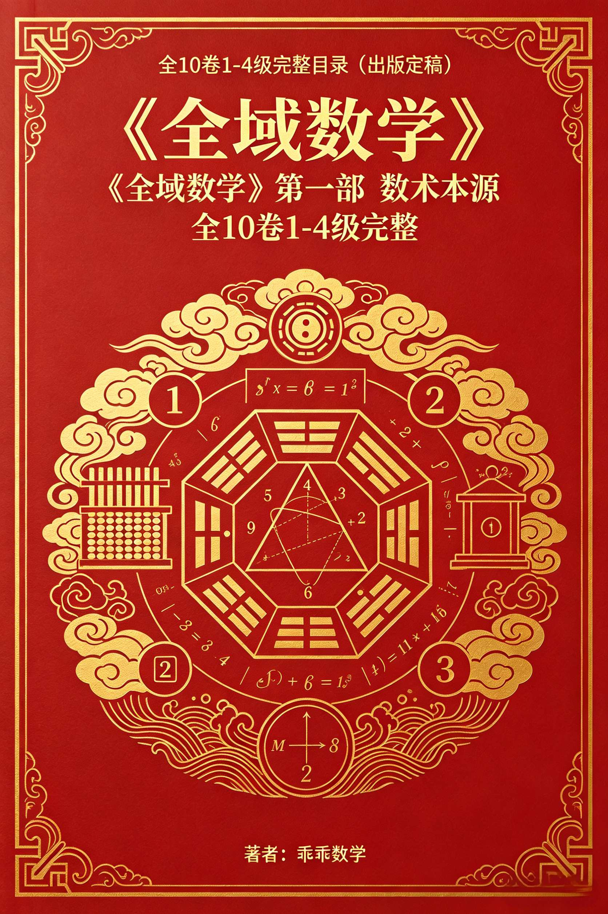
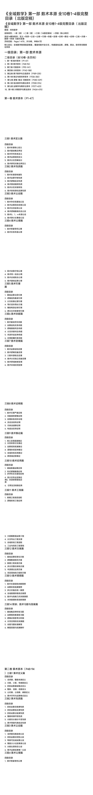
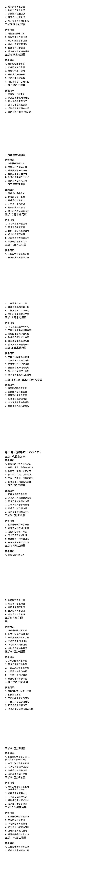
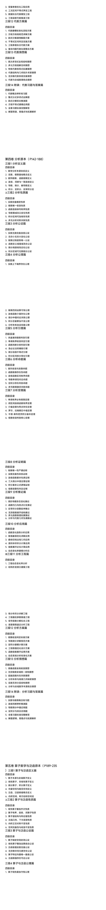
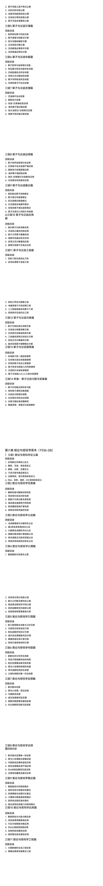
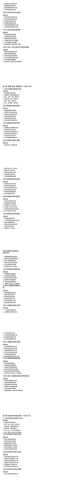
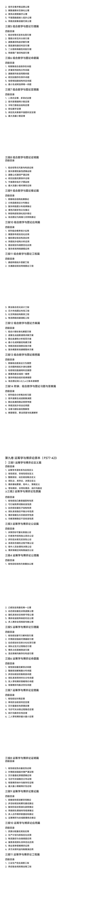
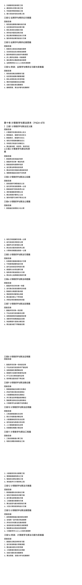

<ArchiveCopyPanel article-id="160668044" />

{"markdown":"PiDliIbnsbvvvJrmlbDmnK/lt6XlnYogIAo+IOe8luWPt++8mmAxNjA2NjgwNDRgICAKPiDljp/lp4vmlofku7bvvJpg5YWo5Z+f5pWw5a2m56ys5LiA6YOo5pWw5pyv5pys5rqQ5YWoMTDljbcxLTTnuqflrozmlbTnm67lvZXlh7rniYjlrprnqL8tMTYwNjY4MDQ0Lm1kYCAgCj4g6L+U5Zue77yaW+acrOS5puW9kuaho10oL3poL2Jvb2tzL3NodXNodS9hcnRpY2xlcy8pIMK3IFvmgLvlhaXlj6NdKC96aC9ib29rcy9hcnRpY2xlcy8pCgojIyDjgIrlhajln5/mlbDlrabjgIvnrKzkuIDpg6gg5pWw5pyv5pys5rqQIOWFqDEw5Y23MS0057qn5a6M5pW055uu5b2V77yI5Ye654mI5a6a56i/77yJCgojIyMg44CK5YWo5Z+f5pWw5a2m44CL56ys5LiA6YOoIOaVsOacr+acrOa6kCDlhagxMOWNtzEtNOe6p+WujOaVtOebruW9le+8iOWHuueJiOWumueov++8iQoK6JGX6ICF77ya5LmW5LmW5pWw5a2mCgohW2ltYWdlXSguL2Fzc2V0cy9jc2RuaW1nL2pwZy8wZTk1NjdjMjcyOTExODE3LmpwZykKCiFbaW1hZ2VdKC4vYXNzZXRzL2NzZG5pbWcvanBnL2VkY2RhMDgxYThjZGIwMTguanBnKQoKIVtpbWFnZV0oLi9hc3NldHMvY3NkbmltZy9qcGcvMjljYzFhMjYxYmNiY2MyYi5qcGcpCgohW2ltYWdlXSguL2Fzc2V0cy9jc2RuaW1nL2pwZy8wYmMzYTBkMzU3MGI5MTcyLmpwZykKCiFbaW1hZ2VdKC4vYXNzZXRzL2NzZG5pbWcvanBnLzdjMTdmMDc0YWFhZTg4YzYuanBnKQoKIVtpbWFnZV0oLi9hc3NldHMvY3NkbmltZy9qcGcvYWY1YjMwNWEzY2VkYTliMS5qcGcpCgohW2ltYWdlXSguL2Fzc2V0cy9jc2RuaW1nL2pwZy8zOTBjYzBjZjdlYmY1OWY4LmpwZykKCiFbaW1hZ2VdKC4vYXNzZXRzL2NzZG5pbWcvanBnL2I2Yjg2MmNhYmRkYmEyOGYuanBnKQo=","text":"5YiG57G777ya5pWw5pyv5bel5Z2KICAK57yW5Y+377yaMTYwNjY4MDQ0ICAK5Y6f5aeL5paH5Lu277ya5YWo5Z+f5pWw5a2m56ys5LiA6YOo5pWw5pyv5pys5rqQ5YWoMTDljbcxLTTnuqflrozmlbTnm67lvZXlh7rniYjlrprnqL8tMTYwNjY4MDQ0Lm1kICAK6L+U5Zue77ya5pys5Lmm5b2S5qGjIMK3IOaAu+WFpeWPowoK44CK5YWo5Z+f5pWw5a2m44CL56ys5LiA6YOoIOaVsOacr+acrOa6kCDlhagxMOWNtzEtNOe6p+WujOaVtOebruW9le+8iOWHuueJiOWumueov++8iQoK44CK5YWo5Z+f5pWw5a2m44CL56ys5LiA6YOoIOaVsOacr+acrOa6kCDlhagxMOWNtzEtNOe6p+WujOaVtOebruW9le+8iOWHuueJiOWumueov++8iQoK6JGX6ICF77ya5LmW5LmW5pWw5a2mCgppbWFnZQoKaW1hZ2UKCmltYWdlCgppbWFnZQoKaW1hZ2UKCmltYWdlCgppbWFnZQoKaW1hZ2U="}

> 分类：数术工坊  
> 编号：`160668044`  
> 原始文件：`全域数学第一部数术本源全10卷1-4级完整目录出版定稿-160668044.md`  
> 返回：[本书归档](/zh/books/shushu/articles/) · [总入口](/zh/books/articles/)

<ArticlePaperMeta category="数术工坊" article-id="160668044" title="全域数学第一部数术本源全10卷1-4级完整目录出版定稿" paper-kind="专题文稿" book-route="/zh/books/shushu/articles/" overview-route="/zh/books/articles/" summary="收录易经、河图洛书、太极五行、道德经与传统数术方向文章。" author="乖乖数学" source-file="全域数学第一部数术本源全10卷1-4级完整目录出版定稿-160668044.md" cover="./assets/csdnimg/jpg/0e9567c272911817.jpg" />

## 《全域数学》第一部 数术本源 全10卷1-4级完整目录（出版定稿）

### 《全域数学》第一部 数术本源 全10卷1-4级完整目录（出版定稿）

著者：乖乖数学

