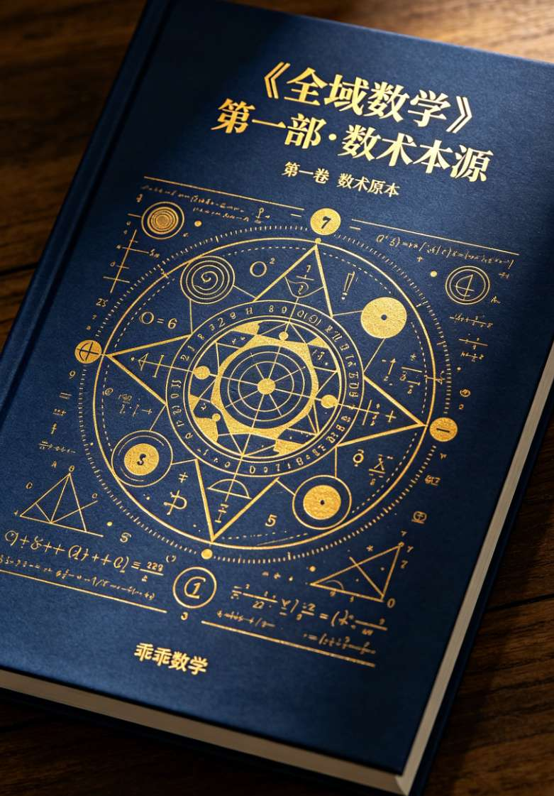
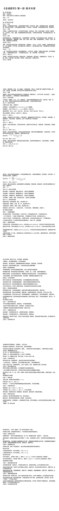
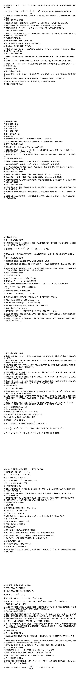
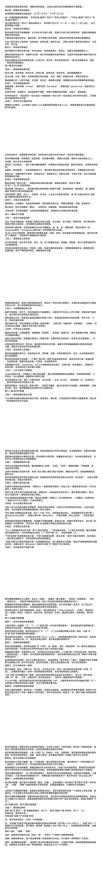
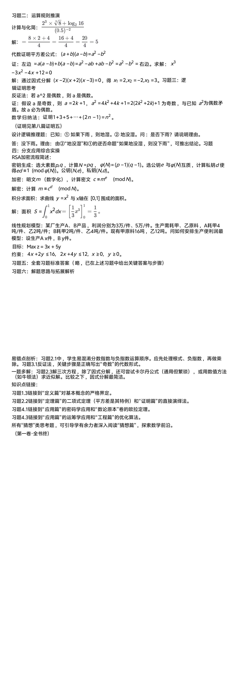

<ArchiveCopyPanel article-id="160668154" />

{"markdown":"PiDliIbnsbvvvJrmlbDmnK/lt6XlnYogIAo+IOe8luWPt++8mmAxNjA2NjgxNTRgICAKPiDljp/lp4vmlofku7bvvJpg5YWo5Z+f5pWw5a2m56ys5LiA6YOo5pWw5pyv5pys5rqQLTE2MDY2ODE1NC5tZGAgIAo+IOi/lOWbnu+8mlvmnKzkuablvZLmoaNdKC96aC9ib29rcy9zaHVzaHUvYXJ0aWNsZXMvKSDCtyBb5oC75YWl5Y+jXSgvemgvYm9va3MvYXJ0aWNsZXMvKQoKIyMg44CK5YWo5Z+f5pWw5a2m44CL56ys5LiA6YOowrfmlbDmnK/mnKzmupAKCiMjIyDnrKzkuIDljbcg5pWw5pyv5Y6f5pysCgrokZfogIXvvJog5LmW5LmW5pWw5a2mCgrkvZPkvovvvJog5Lu/5qyn5Yeg6YeM5b6X44CK5Yeg5L2V5Y6f5pys44CL5YWs55CG5YyW6JGX6L+wCgrpobXnoIHvvJogMS00NwoK5oiQ5Lmm5pel77yaIDIwMjYwNTAxCgohW2ltYWdlXSguL2Fzc2V0cy9jc2RuaW1nL2pwZy9jZjliMDhiZjliYTQ2ZWJhLmpwZykKCiFbaW1hZ2VdKC4vYXNzZXRzL2NzZG5pbWcvanBnLzBlYzBjZGE5NDFkZGNjMzEuanBnKQoKIVtpbWFnZV0oLi9hc3NldHMvY3NkbmltZy9qcGcvMDBhZWRkZjY4ODc2NGMzZC5qcGcpCgohW2ltYWdlXSguL2Fzc2V0cy9jc2RuaW1nL2pwZy9hNTkzYmI0MmNjN2Y3YTRlLmpwZykKCiFbaW1hZ2VdKC4vYXNzZXRzL2NzZG5pbWcvanBnLzQ2NjAzYTlkYzVlNjZiMmQuanBnKQo=","text":"5YiG57G777ya5pWw5pyv5bel5Z2KICAK57yW5Y+377yaMTYwNjY4MTU0ICAK5Y6f5aeL5paH5Lu277ya5YWo5Z+f5pWw5a2m56ys5LiA6YOo5pWw5pyv5pys5rqQLTE2MDY2ODE1NC5tZCAgCui/lOWbnu+8muacrOS5puW9kuahoyDCtyDmgLvlhaXlj6MKCuOAiuWFqOWfn+aVsOWtpuOAi+esrOS4gOmDqMK35pWw5pyv5pys5rqQCgrnrKzkuIDljbcg5pWw5pyv5Y6f5pysCgrokZfogIXvvJog5LmW5LmW5pWw5a2mCgrkvZPkvovvvJog5Lu/5qyn5Yeg6YeM5b6X44CK5Yeg5L2V5Y6f5pys44CL5YWs55CG5YyW6JGX6L+wCgrpobXnoIHvvJogMS00NwoK5oiQ5Lmm5pel77yaIDIwMjYwNTAxCgppbWFnZQoKaW1hZ2UKCmltYWdlCgppbWFnZQoKaW1hZ2U="}

> 分类：数术工坊  
> 编号：`160668154`  
> 原始文件：`全域数学第一部数术本源-160668154.md`  
> 返回：[本书归档](/zh/books/shushu/articles/) · [总入口](/zh/books/articles/)

<ArticlePaperMeta category="数术工坊" article-id="160668154" title="全域数学第一部数术本源" paper-kind="专题文稿" book-route="/zh/books/shushu/articles/" overview-route="/zh/books/articles/" summary="体例： 仿欧几里得《几何原本》公理化著述" author="乖乖数学" source-file="全域数学第一部数术本源-160668154.md" cover="./assets/csdnimg/jpg/cf9b08bf9ba46eba.jpg" />

## 《全域数学》第一部·数术本源

### 第一卷 数术原本

著者： 乖乖数学

体例： 仿欧几里得《几何原本》公理化著述

页码： 1-47

成书日： 20260501

