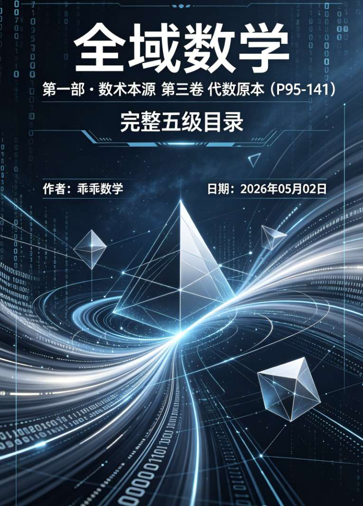
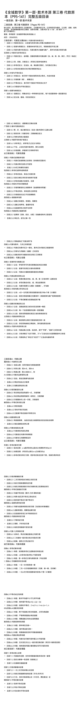
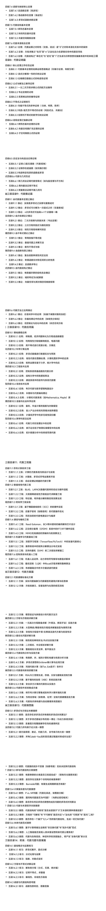
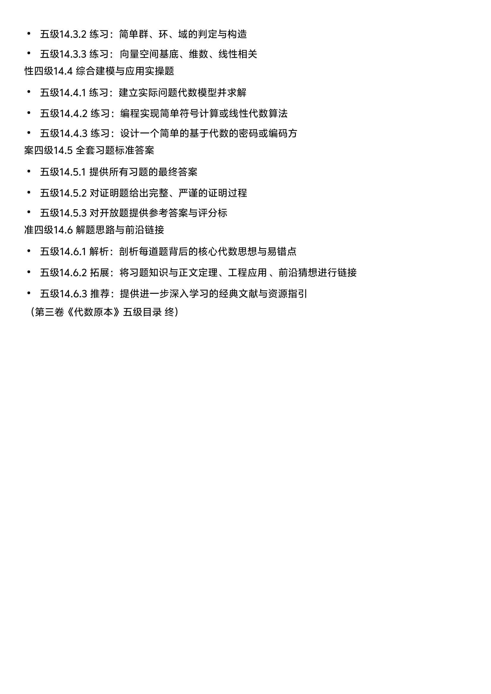

<ArchiveCopyPanel article-id="160721175" />

{"markdown":"PiDliIbnsbvvvJrmlbDmnK/lt6XlnYogIAo+IOe8luWPt++8mmAxNjA3MjExNzVgICAKPiDljp/lp4vmlofku7bvvJpg56eR5bm76Im65pyv5Lmm5pys5bCB6Z2i5YWo5Z+f5pWw5a2m56ys5LiA6YOo5pWw5pyv5pys5rqQ56ys5LiJ5Y235Luj5pWw5Y6f5pysUDk1LTE0MeWujOaVtOS6lOe6p+ebruW9leS5luS5luaVsOWtpi0xNjA3MjExNzUubWRgICAKPiDov5Tlm57vvJpb5pys5Lmm5b2S5qGjXSgvemgvYm9va3Mvc2h1c2h1L2FydGljbGVzLykgwrcgW+aAu+WFpeWPo10oL3poL2Jvb2tzL2FydGljbGVzLykKCiMjIOenkeW5u+iJuuacr+S5puacrOWwgemdou+8muOAiuWFqOWfn+aVsOWtpuOAi+esrOS4gOmDqMK35pWw5pyv5pys5rqQIOesrOS4ieWNtyDku6PmlbDljp/mnKzvvIhQOTUtMTQx77yJ5a6M5pW05LqU57qn55uu5b2V44CQ5LmW5LmW5pWw5a2m44CRCgrkvZzogIXvvJrkuZbkuZbmlbDlraYKCuaXpeacn++8mjIwMjblubQwNeaciDAy5pelCgohW2ltYWdlXSguL2Fzc2V0cy9jc2RuaW1nL2pwZy8zN2IwNjZjZmQyMTZmZTk1LmpwZykKCiFbaW1hZ2VdKC4vYXNzZXRzL2NzZG5pbWcvanBnLzk4NjJjNzg1N2NiZDdiMTMuanBnKQoKIVtpbWFnZV0oLi9hc3NldHMvY3NkbmltZy9qcGcvZmZkMzgyNGFkZTc4ZTYxZS5qcGcpCgohW2ltYWdlXSguL2Fzc2V0cy9jc2RuaW1nL2pwZy85ZGY5ZDZmM2MzZmM1NGVhLmpwZykK","text":"5YiG57G777ya5pWw5pyv5bel5Z2KICAK57yW5Y+377yaMTYwNzIxMTc1ICAK5Y6f5aeL5paH5Lu277ya56eR5bm76Im65pyv5Lmm5pys5bCB6Z2i5YWo5Z+f5pWw5a2m56ys5LiA6YOo5pWw5pyv5pys5rqQ56ys5LiJ5Y235Luj5pWw5Y6f5pysUDk1LTE0MeWujOaVtOS6lOe6p+ebruW9leS5luS5luaVsOWtpi0xNjA3MjExNzUubWQgIArov5Tlm57vvJrmnKzkuablvZLmoaMgwrcg5oC75YWl5Y+jCgrnp5HlubvoibrmnK/kuabmnKzlsIHpnaLvvJrjgIrlhajln5/mlbDlrabjgIvnrKzkuIDpg6jCt+aVsOacr+acrOa6kCDnrKzkuInljbcg5Luj5pWw5Y6f5pys77yIUDk1LTE0Me+8ieWujOaVtOS6lOe6p+ebruW9leOAkOS5luS5luaVsOWtpuOAkQoK5L2c6ICF77ya5LmW5LmW5pWw5a2mCgrml6XmnJ/vvJoyMDI25bm0MDXmnIgwMuaXpQoKaW1hZ2UKCmltYWdlCgppbWFnZQoKaW1hZ2U="}

> 分类：数术工坊  
> 编号：`160721175`  
> 原始文件：`科幻艺术书本封面全域数学第一部数术本源第三卷代数原本P95-141完整五级目录乖乖数学-160721175.md`  
> 返回：[本书归档](/zh/books/shushu/articles/) · [总入口](/zh/books/articles/)

<ArticlePaperMeta category="数术工坊" article-id="160721175" title="科幻艺术书本封面全域数学第一部数术本源第三卷代数原本P95-141完整五级目录乖乖数学" paper-kind="专题文稿" book-route="/zh/books/shushu/articles/" overview-route="/zh/books/articles/" summary="收录易经、河图洛书、太极五行、道德经与传统数术方向文章。" author="乖乖数学" source-file="科幻艺术书本封面全域数学第一部数术本源第三卷代数原本P95-141完整五级目录乖乖数学-160721175.md" cover="./assets/csdnimg/jpg/37b066cfd216fe95.jpg" />

## 科幻艺术书本封面：《全域数学》第一部·数术本源 第三卷 代数原本（P95-141）完整五级目录【乖乖数学】

作者：乖乖数学

日期：2026年05月02日

