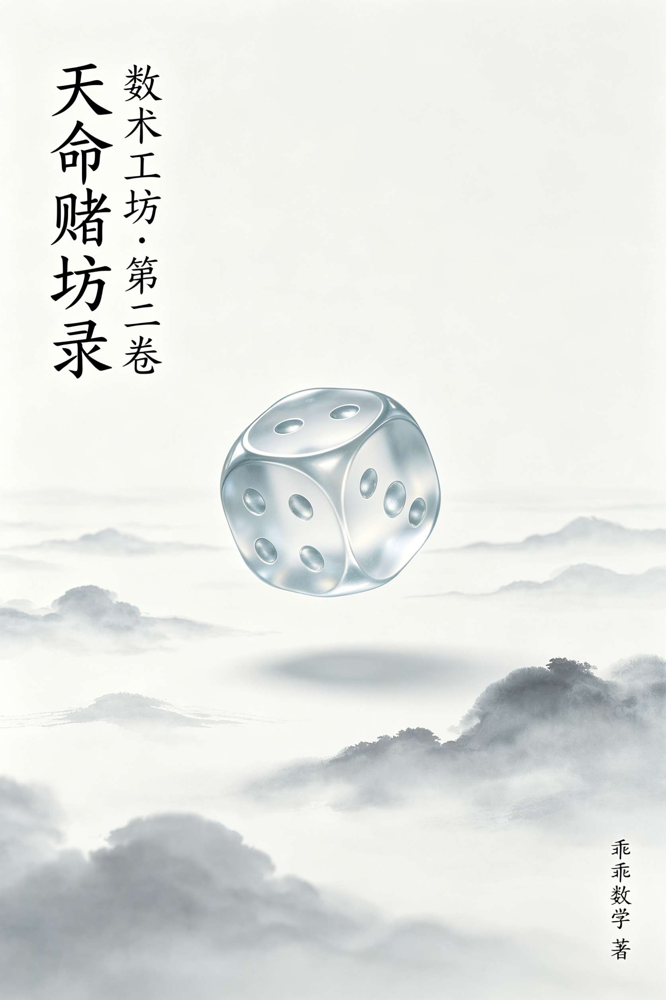
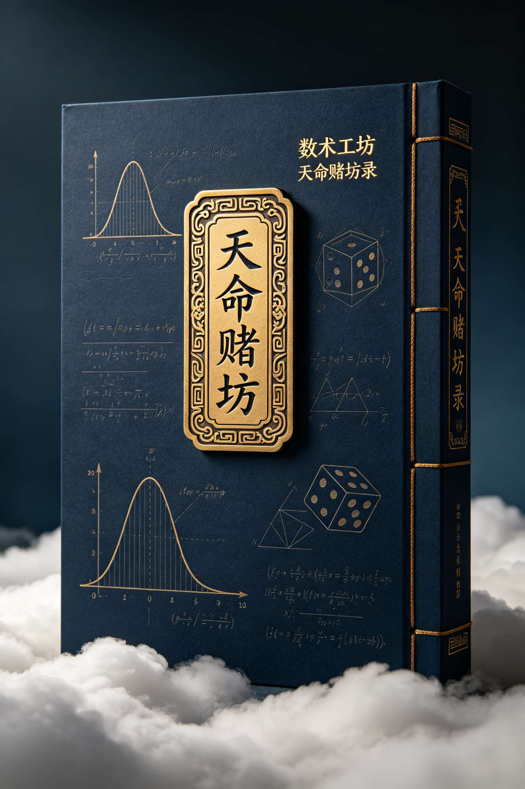

<ArchiveCopyPanel article-id="161902148" />

{"markdown":"PiDliIbnsbvvvJrmlbDmnK/lt6XlnYogIAo+IOe8luWPt++8mmAxNjE5MDIxNDhgICAKPiDljp/lp4vmlofku7bvvJpg5pWw5pyv5bel5Z2K56ys5LqM5Y235aSp5ZG96LWM5Z2K5b2VLTE2MTkwMjE0OC5tZGAgIAo+IOi/lOWbnu+8mlvmnKzkuablvZLmoaNdKC96aC9ib29rcy9zaHVzaHUvYXJ0aWNsZXMvKSDCtyBb5oC75YWl5Y+jXSgvemgvYm9va3MvYXJ0aWNsZXMvKQoKIyMg5pWw5pyv5bel5Z2KIMK3IOesrOS6jOWNtwoKIyMjIOWkqeWRvei1jOWdiuW9lQoK44CQ5a6M5pW05YWo5Lmm57uI56i/772c56ys5LiA56ug6Iez56ys5YWr56ugIOaXoOWIoOWHj+WujOaVtOeJiOOAkQoK5LmW5LmW5pWw5a2mIOiRlwoKIVtpbWFnZV0oLi9hc3NldHMvY3NkbmltZy9qcGcvZTBkMDVjN2NmMDViODQ5ZS5qcGcpCgotLS0KCiMjIyDnrKzkuIDnq6Ag5aSp5Zyw5peg5a6a77yM55qG5piv6aqw5a2QCgrnrKzkuIDljbfms5vlh73lpKfpgZPokL3luZXjgIIKCuWll+Wog+W5veiwt+mXreWQiO+8jOW3tOaLv+i1q+WxguWxgumVnOmdouW9kuWvgu+8jOWumuaVsOaxn+a5luW9u+W6leWwgeWNt+OAggoK6Zi/5pWw6LWw5Ye65bm96LC377yM6Lqr5ZCO5piv57ud5a+56KeE5YiZ44CB5ZSv5LiA5p6B5YC844CB5Zu65a6a6L2o6L+555qE56Gu5a6a5oCn5aSp5Zyw44CCCgrkvYbouqvliY3kupHmtbfnv7vohb7vvIzpo47lo7DlvILmoLfjgIIKCui/memHjOeahOS4lueVjO+8jOayoeacieWumuWxgOOAguayoeacieWUr+S4gOetlOahiOOAguayoeacieW/heeEtui9qOi/ueOAggoK6aOO5aOw6YeM77yM6ZqQ6ZqQ5Lyg5p2l5peg5bC96aqw5a2Q6LW36JC944CB56Kw5pKe44CB5rWu5rKJ55qE5b6u5ZON44CCCgrkupHpm77mlaPlvIDvvIzkuIDluqflj6Tml6fmnKjlnYrmgqznqbrogIznq4vjgIIKCueJjOWMvuaWkemps++8jOafk+WwveWygeaciOWkqeacuu+8jOWbm+Wtl+WmguihgO+8mgoKIAoK5aSp5ZG96LWM5Z2KCgrkuZbkuZbluIjlgoXnq4vkuo7lnYrliY3vvIznpZ7oibLmt6HnhLbvvJoKCiAKCiLpmL/mlbDvvIzkvaDlt7Lkv67lrozkurrkuLrlrprop4TnmoTlpKfpgZPjgIIKIOS9huWkqeWcsOecn+WunuS4h+ixoe+8jOS5neaIkOS5ne+8jOeahuaYr+acquWumuS5i+ixoeOAgiIKCumYv+aVsOmXrumBk++8muKAnOS9leS4uuacquWumu+8n+KAnQoK5biI5YKF6Jma56m65LiA5o+h77yM5o6M5b+D5rWu546w5LiA5p6a6YCa6YCP5YWt6Z2i5aSp6aqw44CCCgrmraTpqrDovazliqjml6DlvaLjgIHovajov7nml6Dov7njgIHokL3lrZDml6Dlh63jgIIKCuWug+ayoeacieeul+WtkOOAgeayoeacieaWueeoi+OAgeayoeacieW1jOWll+e7k+aehOOAggoK5Y+q5pyJ4oCU4oCU5pyq55+l44CB5rWu5rKJ44CB5LiH5Y2D5Y+v6IO944CCCgogCgrigJzmraTkuLrpmo/mnLrlj5jph4/jgILigJ0KCuW4iOWCheS8oOmBk++8mgoKIAoKIuS9oOS7juWJjeaJgOWtpueahCAKCiAKCiAKIHgKCiAKCiB4CgogCiB477yM5piv5rOo5a6a5LmL5pWw44CB5Zu65a6a5LmL5Y6f5paZ44CB5pyJ6L+55Y+v5b6q44CCCiDogIzku4rkvaDmiYDop4HnmoQgCgogCgogCiBYCgogCgogWAoKIAogWO+8jOaYr+WkqeWcsOWPmOmHj+OAgeWRvei/kOebsuebkuOAgeS4h+WNg+e7k+WxgOW5tuWtmOOAggog5pmu6YCaIAoKIAoKIAogeAoKIAoKIHgKCiAKIHggPSDlt7LlrprnmoTlrr/lkb0KIOmaj+acuiAKCiAKCiAKIFgKCiAKCiBYCgogCiBYID0g5b6F5byA55qE5aSp5ZG9CiDpqrDlrZDmnKrokL3vvIzlha3pnaLnmoblrZjjgIIKIOmqsOWtkOS4gOiQve+8jOS4gOebuOaYvuW9ouOAgiIKCuWdiumXqOWkp+W8gOOAggoK5Z2K5YaF5peg5YiA5YmR44CB5peg6Zi15rOV44CB5peg5pa556iL44CCCgrlj6rlrZjkuInmoLflpKnmnLrvvJrmvKvlpKnpqrDlrZDjgIHpq5jmgqzotZTnjofjgIHmtYHovazmsJTov5DjgIIKCuW4iOWChemBk++8mgoKIAoKIuS4lumXtOS4h+S6i+acquWumuS5i+aXtu+8jOWwveaYr+mqsOWtkOOAggog6aOO6Zuo44CB56W456aP44CB5b6X5aSx44CB55u46YGH44CB5Yir56a744CB5oiQ6LSl4oCU4oCUCiDnmobkuLrpmo/mnLrmta7msonjgIIKIOiAjOaOjOaOp+a1ruayieiAhe+8jOWQjeS4uuamgueOh+OAggog5qaC546H6ICF77yM5aSp5py65LmL5p2D6YeN5Lmf44CCCiDmpoLnjoflpKfvvIzlpKflir/miYDotovjgIIKIOamgueOh+Wwj++8jOacuue8mOS+peW5uOOAggog5qaC546H5Li66Zu277yM57ud6Lev5peg6Kej44CCCiDmpoLnjofkuLrkuIDvvIzlrr/lkb3lt7LlrprjgIIiCgrpmL/mlbDosYHnhLbpgJrpgI/jgIIKCiAKCuesrOS4gOWNt+azm+WHve+8muS4h+eJqeacieinhO+8jOe7k+WxgOWUr+S4gOOAggog56ys5LqM5Y235qaC546H77ya5LiH6LGh5peg5bi477yM57uT5bGA55yL5Yq/44CCCgrljbfpppbph5Hlj6XokL3lrprvvJoKCiAKCuehruWumuaAp++8jOaYr+S6uuWumueahOinhOefqeOAggog6ZqP5py65oCn77yM5piv5aSp5a6a55qE5pys55u444CCCgrluIjlgoXmnJflo7DlrqPlkYrnrKzkuozljbfmgLvpgZPml6jvvJoKCiAKCuS4lumXtOacquWumueahuS4uuWPmOmHj++8jAog5LiW6Ze06LW36JC955qG5Li65qaC546H44CCCiDlpKfmlbDlrprlpKflir/vvIzmraPmgIHlrprlvaLmgIHvvIzotJ3lj7bmlq/lrprlm6DmnpzjgIIKCumYv+aVsOi4j+WFpei1jOWdiu+8jOato+W8j+W8gOWQr+aXoOW4uOWkqemBk+eahOS/ruihjOOAggoKLS0tCgojIyMg56ys5LqM56ugIOWkp+aVsOaIkuW+i++8jOS5hei1jOW/hei+k+aYr+WkqemBk+WFrOW5swoK6Zi/5pWw5YWl5Z2K77yM5LiH5Y2D6aqw5a2Q5oKs56m66ZyH6aKk44CCCgrnnIvkvLzmt7fkubHml6Dluo/jgIHotbfokL3ml6Dnq6DjgIIKCumYv+aVsOmXrumBk++8mgoKIAoKIuW4iOWChe+8jOWNleasoeaXoOW4uO+8jOeerOaBr+S4h+WPmOOAggog5Li65L2V5LiH5Y2D5peg5bi45aCG5Y+g77yM57uI5pyJ5a6a5pWw77yfIgoK5biI5YKF5oqs5omL77yM5Zyw6Z2i5rWu546w5LiJ5bGC5ZCM5b+D5ZyG5aSp6YGT5YWJ6Zi177yM5aSn5pWw5LiJ5aKD546w5LiW44CCCgojIyMjIOWkp+aVsOesrOS4gOWig++8muS+peW5uOmBruecvO+8iOefreinhuiZmuWmhO+8iQoK5bCR6YeP6K+V6aqM77yM5YWo5Yet6L+Q5rCU44CCCgrlvLrogIXlj6/otKXvvIzlvLHogIXlj6/og5zjgIIKCuS8mOWKv+WPr+e/u+iIue+8jOWKo+WKv+WPr+mAhuiireOAggoK5Yeh5Lq65LiA55Sf55+t5pqC77yM5omA6KeB55qG5YG254S244CCCgrkuo7mmK/kv6Hlkb3ov5DjgIHkv6Hlt6flkIjjgIHkv6HnjoTlrabjgIIKCiAKCuagt+acrOWkquWwke+8jOecn+ebuOS4jeaYvuOAggoKIyMjIyDlpKfmlbDnrKzkuozlooPvvJrlgY/lt67mirXmtojvvIjms6LliqjlvZLpm7bvvIkKCueZvuasoeWNg+asoei1t+iQveOAggoK5aW96L+Q5LiO5Z2P6L+Q5a+55Yay77yM6LaF5bi45LiO5aSx5bi45oq15raI44CCCgrmiYDmnInmg4Xnu6rms6LliqjjgIHkuLTml7blvpflpLHvvIznmobkuLrnn63mnJ/lmarlo7DjgIIKCiAKCuS6uueUn+i1t+iQve+8jOW5tumdnuWRvei/kOmSiOWvue+8jAog5Y+q5piv5qyh5pWw5LiN6Laz44CCCgojIyMjIOWkp+aVsOesrOS4ieWig++8muWkqemBk+aYvuW9ou+8iOS4h+asoeW9kuecn++8iQoK5Lq/5LiH5qyh6L+t5Luj5LmL5ZCO4oCU4oCUCgrov5DmsJTlpLHmlYjvvIzmg4Xnu6rml6DmlYjvvIzkvqXlubjmua7nga3jgIIKCuaJgOaciemaj+acuuWwveaVsOaUtuaVm++8jOWJqeS4i+e7neWvueWFrOW5s+OAgei1pOijuOecn+WunueahOamgueOh+acrOi0qOOAggoK5biI5YKF5a6j5Yik5aSn5pWw55yf6KiA77yaCgogCgrnn63mnJ/nnIvov5DmsJTjgIHnnIvlpKnotYvjgIHnnIvmnLrnvJjjgIIKIOmVv+acn+eci+S9k+ezu+OAgeeci+WGheaguOOAgeeci+amgueOh+OAggog6L+Q5rCU5oqk5byx6ICF5LiA5pe277yMCiDlpKfmlbDliKTkvJfnlJ/nu4jlsYDjgIIKCumYv+aVsOW9u+W6leWIhua4heS4pOWNt+Wkp+mBk++8mgoKIAoK5rOb5Ye95LmL6YGT77ya5Lq65Li65a6a5bqP77yM5LiA5byA5aeL5pyA5LyY44CCCiDmpoLnjofkuYvpgZPvvJrlpKnnhLbml6Dluo/vvIzmnIDlkI7lv4XlrojmgZLjgIIKCuesrOS6jOeroOe7iOaegeW/g+azle+8mgoKIAoK5re35Lmx5LiN5piv5peg5bqP77yM5piv5bCa5pyq6Laz5aSf5aSa44CCCiDml6DluLjkuI3mmK/ml6Dop4TvvIzmmK/lsJrmnKrotrPlpJ/kuYXjgIIKIOaJgOacieS4jeWFrO+8jOeahuagt+acrOS4jei2s+S5i+WBh+ixoeOAggog6L+t5Luj6Laz5aSf77yM5Lq65Lq65Zue5b2S5pys5b+D5aSp5ZG944CCCgrlnYrkuK3mta7njrDph5HoibLlhavlrZfpk63mlofvvJoKCiAKCuWBtueEtua4oeWwve+8jOW/heeEtuW9kuecnwoKIyMjIyDnrKzkuoznq6DnlarlpJYgwrcg5YWt6YGT6LWM5aKD77yI5YWo5Y235qC45b+D5Lq66K6+5L2T57O777yJCgrluIjlgoXnu6fogIzmj63npLrvvJrmpoLnjofkuI3lj5jvvIzop4TliJnkuI3lj5jvvIzllK/kurrlv4PlooPnlYzliIblpKnlnLDjgIIKCuWig+eVjOWQjeensOaguOW/g+eJueW+geaVsOWtpuWvueW6lOesrOS4gOWig+i1jOmsvOi0queXtOeJouesvO+8jOmAoui1jOW/hei+kwoKIAoKIAogRQoKIAogWwoKIAogWAoKIAogXQoKIAogPAoKIAogMAoKIAoKIEVbWF0gPCAwCgogCiBFW1hdPDDvvIjotJ/mnJ/mnJvvvInnrKzkuozlooPotYzlvpLmta7msonkurrpl7TvvIzkuI3ovpPkuI3otaIKCiAKCiAKIEUKCiAKIFsKCiAKIFgKCiAKIF0KCiAKID0KCiAKIDAKCiAKCiBFW1hdID0gMAoKIAogRVtYXT0w77yI6Zu25pyf5pyb77yJ56ys5LiJ5aKD6LWM5qON5Lul6LWM5Li655Sf77yM6aG65Yq/56uL5LiaCgogCgogCiBFCgogCiBbCgogCiBYCgogCiBdCgogCiA+CgogCiAwCgogCgogRVtYXSA+IDAKCiAKIEVbWF0+MO+8iOato+acn+acm++8ieesrOWbm+Wig+i1jOeOi+aOjOaOp+WFqOWxgO+8jOmAouWxgOW/heiDnAoKIAoKIAogbWF4CgogCiDigaEKCiAKIEUKCiAKIFsKCiAKIFgKCiAKIF0KCiAKCiAKCiBtYXhFW1hd77yI5pyA5LyY5pyf5pyb77yJ56ys5LqU5aKD6LWM56We5oqA5YWl5YyW5aKD77yM5rSe5oKJ5aSp5py65a6e5pe2IAoKIAoKIAogzpQKCiAKIEUKCiAKIFsKCiAKIFgKCiAKIF0KCiAKCiBcRGVsdGEgRVtYXQoKIAogzpRFW1hd77yI5Yqo5oCB5pyf5pyb77yJ56ys5YWt5aKD6LWM5Zyj5pmu5bqm6IuN55Sf77yM5Lul6YGT5rih5Lq65Lyg6YGT5q2j5pyf5pybCgrlha3pgZPotYzlooPmgLvnurLvvJoKCiAKCui1jOmsvOWbsOS6jui0queXtO+8jAog6LWM5b6S5Zuw5LqO5rWu5rKJ77yMCiDotYzmo43pgJDkuo7liKnlvIrvvIwKIOi1jOeOi+aOp+S6juWxgOWKv++8jAog6LWM56We6YCa5LqO5aSp5py677yMCiDotYzlnKPmuKHkuo7oi43nlJ/jgIIKCi0tLQoKIyMjIOesrOS4ieeroCDpkp/lvaLmsZ/muZbvvIzkuIfosaHnu4jlvZLmraPmgIEKCuWkp+aVsOW3suWumue7iOWxgOOAggoK6Zi/5pWw6L+96Zeu77yaCgogCgoi5biI5YKF77yM57q35Lmx5b2S5LqO5a6a5pWw77yMCiDpgqPkuIfljYPpmo/mnLrvvIzmlLbmlZvkuYvlkI7mmK/kvZXnrYnlvaLmgIHvvJ8iCgrluIjlgoXlvJXliqjmvKvlpKnpqrDlvbHjgIIKCuaXoOaVsOaVo+S5seWFieeCueS7juWbm+aWueaxh+iBmuOAgeWghuWPoOOAgemHjeWhkeOAggoK5Lmx6LGh5LiH5Y2D77yM5Y2D5ae/55m+5oCB77yM5pyA57uI5YWo6YOo5Yed5oiQ4oCU4oCUCgogCgrkuIDlj6PlsYXkuK3pmobotbfjgIHkuKTkvqflr7nnp7DjgIHpppblsL7muJDmtojnmoTml6DkuIrpkp/lvaLjgIIKCuW4iOWCheS8oOmBk++8mgoKIAoK5q2k5Li65Lit5b+D5p6B6ZmQ5a6a55CG44CCCgrlpKnkuIvkuIfoiKzmnYLkubHjgIHkuIfoiKzliIbluIPjgIHkuIfoiKzlvaLmgIHvvIzlj6ropoHni6znq4vjgIHlj6DliqDjgIHmtbfph4/vvIznu4jlsIblvZLkuIDpkp/lvaLjgIIKCuS4lumXtOS4gOWIh+S6uuS6i++8muWRvei/kOi1t+S8j+OAgeaIkOi0pemrmOS9juOAgeWkqei1i+W8uuW8seOAgeacuue8mOWOmuiWhO+8jOeahuaYr+aXoOaVsOW+ruWwj+maj+acuuWPoOWKoOiAjOaIkOOAggoK6ZKf5b2i6YOo5L2N5rGf5rmW6Kej6K+75pWw5a2m5a+55bqU6ZKf6aG25bGF5Lit5LiW6Ze05bi45oCB77yM6Iq46Iq45LyX55SfCgogCgogCiDOvAoKIAoKIFxtdQoKIAogzrzvvIjlnYflgLwv5pyf5pyb77yJ6ZKf5L2T5Lit5q616LW35LyP5rWu5rKJ77yM5a+75bi456W456aPCgogCgogCiDOvAoKIAogwrEKCiAKIM+DCgogCgogXG11IFxwbSBcc2lnbWEKCiAKIM68wrHPg++8iOS4gOS4quagh+WHhuW3ruWGhe+8ieS4pOerr+Wwvue/vOaegeerr+i/kOawlO+8jOeogOe8uuW8guixoQoKIAoKIAogzrwKCiAKIMKxCgogCiAyCgogCiDPgwoKIAoKIFxtdSBccG0gMlxzaWdtYQoKIAogzrzCsTLPg++8iOS4pOS4quagh+WHhuW3ruWklu+8ieaegemZkOi/nOerr+mAhuWkqeS4juW0qeebmO+8jOeahuS4uuiZmuWmhOWwj+amgueOhwoKIAoKIAogzrwKCiAKIMKxCgogCiAzCgogCiDPgwoKIAoKIFxtdSBccG0gM1xzaWdtYQoKIAogzrzCsTPPg++8iOS4ieS4quagh+WHhuW3ruWklu+8jOamgueOhyA8IDAuMyXvvIkKCiAKCuW8uuiAheWPr+aKrOWNh+aVtOS9k+acn+acm++8jAog5L2G5peg5rOV5b275bqV5raI54Gt5rOi5Yqo44CCCiDlnKPogIXnnIvpgI/lvaLmgIHvvIzkuI3miafotbfokL3jgIIKCuWdiuWjgemTreWIu+mTtuWtl+W/g+azle+8mgoKIAoK55m+5oCB57q35Lmx57uI5pyJ55u477yM5LiH5rWB5b2S5LiA5YWl6ZKf5b2iCgrmraPmgIHliIbluIPlhazlvI/vvJoKCiAKCiAKIGYKCiAKICgKCiAKIHgKCiAKICkKCiAKID0KCiAKCiAxCgogCgogz4MKCiAKCiAKIDIKCiAKIM+ACgogCgogCgogCgogZQoKIAoKIOKIkgoKIAoKIAogKAoKIAogeAoKIAog4oiSCgogCiDOvAoKIAoKICkKCiAKIDIKCiAKCiAKCiAyCgogCgogz4MKCiAKIDIKCiAKCiAKCiAKCiAKCiAKIGYoeCk9z4Myz4AKCiAKIOKAizHigItl4oiSMs+DMih44oiSzrwpMuKAiwoK5biI5YKF5Y+u5Zix77yaCgogCgrmnoHnq6/nmobmmK/mmJnoirHkuIDnjrDvvIwKIOW4uOaAgeaJjeaYr+S6uueUn+acrOecn+OAggoKLS0tCgojIyMg56ys5Zub56ugIOi0neWPtuaWr+i/veWHtu+8jOaXp+W/teWwvemaj+aWsOivgea2iAoK5q2j5oCB5b2i5oCB5ZyG5ruh44CCCgrpmL/mlbDpl67lh7rkurrpl7TmnIDlpKfnlpHmg5HvvJoKCiAKCiLlpKnpgZPmmI7mmI7mnInmgZLop4TvvIwKIOS4uuS9leS4luS6uuawuOi/nOeci+mUmeOAgeWIpOmUmeOAgeeMnOmUme+8nyIKCuW4iOWChemBk+WHuue7iOaegeecn+ebuO+8mgoKIAoK5LyX55Sf55qG5Zuw5LqO5YWI6aqM44CCCgojIyMjIOS4gOOAgeWFiOmqjO+8muS6uuS6uuiHquW4puaXp+WkqeWRvQoK5omA5pyJ5Lq655qE5Yik5pat77yM6YO95p2l6Ieq6L+H5b6A57uP6aqM44CB5pen6K6w5b+G44CB5pen5YGP6KeB44CB5pen6K6k55+l44CCCgrlh6HkurrkuI3pnaDnnJ/nm7jliKTmlq3kuJbnlYzvvIzpnaDmiaflv7XliKTmlq3kuJbnlYzjgIIKCuWxgOWKv+W3suWPmO+8jOW/g+W/teS4jeWPmOOAggoK5aSp5py65bey5paw77yM6K6k55+l6ZmI5pen44CCCgogCgrov5nmmK/miYDmnInor6/liKTnmoTmoLnmupDjgIIKCiMjIyMg5LqM44CB6K+B5o2u77ya5aSp6YGT5pu05paw55qE5ZSv5LiA6ZKl5YyZCgrkuJbpl7Tmr4/kuIDmrKHlj5HnlJ/jgIHmr4/kuIDmrKHpgYfop4HjgIHmr4/kuIDmrKHlj5jljJbvvIzpg73mmK/lpKnpgZPkuIvlj5HnmoTmlrDnur/ntKLjgIIKCuWkqemBk+S4jeS8muS4gOasoeaAp+iuqeS9oOeci+mAj+ecn+ebuO+8jOWkqemBk+WPquS8mumAkOatpee7meivgeaNruOAgeatpeatpeabtOaWsOWkqeWRveOAggoKIyMjIyDkuInjgIHotJ3lj7bmlq/kuInlsYLlpKnmnLoKCiAKCuWFiOmqjOaXp+W/tSArIOaWsOivgee6v+e0oiA9IOWQjumqjOecn+ebuAoKIAoKIAogUAoKIAogKAoKIAogQQoKIAog4oijCgogCiBCCgogCiApCgogCiA9CgogCgogCiBQCgogCiAoCgogCiBCCgogCiDiiKMKCiAKIEEKCiAKICkKCiAKIOKLhQoKIAogUAoKIAogKAoKIAogQQoKIAogKQoKIAoKIAogUAoKIAogKAoKIAogQgoKIAogKQoKIAoKIAoKIAoKIFAoQeKIo0IpPVAoQilQKELiiKNBKeKLhVAoQSnigIsKCuacr+ivreaxn+a5luino+ivu+aVsOWtpuespuWPt+WFiOmqjOaXp+iupOefpeOAgeaXp+e7j+mqjAoKIAoKIAogUAoKIAogKAoKIAogQQoKIAogKQoKIAoKIFAoQSkKCiAKIFAoQSnkvLznhLbmlrDor4Hmja7nmoTlvLrluqYKCiAKCiAKIFAKCiAKICgKCiAKIEIKCiAKIOKIowoKIAogQQoKIAogKQoKIAoKIFAoQnxBKQoKIAogUChC4oijQSnor4Hmja7lpKnpgZPkuIvlj5HnmoTmlrDnur/ntKIKCiAKCiAKIFAKCiAKICgKCiAKIEIKCiAKICkKCiAKCiBQKEIpCgogCiBQKEIp5ZCO6aqM5pu05paw5ZCO55qE55yf55u4CgogCgogCiBQCgogCiAoCgogCiBBCgogCiDiiKMKCiAKIEIKCiAKICkKCiAKCiBQKEF8QikKCiAKIFAoQeKIo0IpCgotIOaJgOacieS6uuS4gOW8gOWni+mDveaYr+mUmeeahAoKLSDmlrDor4Hmja7kuI3mlq3kv67mraPkvaAKCi0g5oyB57ut6L+t5Luj5peg6ZmQ5o6l6L+R55yf55CGCgojIyMjIOWbm+OAgeWFreWig+i0neWPtuaWr+Wxgue6pwoK5aKD55WM6L+t5Luj6IO95Yqb5qC45b+D54m55b6B6LWM6ay85rC45LiN6L+t5Luj5omn5b+16ZSB5q276LWM5b6S55yL6KeB5LiN5pu05Y6f5Zyw6L2u5Zue6LWM5qON5bCP5bmF6L+t5Luj56iz5q2l57K+6L+b6LWM546L5b+r6YCf6L+t5Luj5a6e5pe25o6n5bGA6LWM56We556s5Y+R6L+t5Luj6aKE5Yik5pyq5p2l6LWM5Zyj5rih5Lq66L+t5Luj56C06Zmk5LyX55Sf5oSa55e0CgrmnKznq6Dph5Hlj6XvvJoKCiAKCuaXp+W/temaj+ivgeaNruWwveaUue+8jOWkqeacuumaj+i/reS7o+aWsOeUnwoK5biI5YKF57uI6KiA77yaCgogCgrlkb3ov5DkuI3kvJrplIHmrbvkvaDvvIwKIOS4jeiCr+abtOaWsOeahOS6uuW/g+aJjeS8mumUgeatu+WRvei/kOOAggog55yf5q2j55qE5aSp5py677yM5LiN5piv5LiA55y855yL56C077yM5piv5q2l5q2l5L+u5q2j44CCCgotLS0KCiMjIyDnrKzkupTnq6Ag5pa55beu5rWu5rKJ77yM5ZG95pyJ56iz5Lmx6L+Q5pyJ55a+6aOOCgrpmL/mlbDlt7Lmh4LvvJoKCiAKCuacn+acm+Wumue7iOWxgO+8jOWkp+aVsOWumuaUtuaVm++8jOato+aAgeWumuW9ouaAge+8jOi0neWPtuaWr+WumuiupOefpeOAggoK5L2G5LuW5YaN6Zeu77yaCgogCgrlkIzmoLfnmoTnu4jngrnvvIzkuLrkvZXmnInkurrkuIDnlJ/lronnqLPvvIzmnInkurrkuIDnlJ/ot4zlrpXvvJ8KCuW4iOWCheW8gOWHuuacgOWQjuS4gOWvueWkqemBk+mYtOmYs++8mgoKIAoK5pyf5pybID0g5Lq655Sf5b2S5a6/77yI5pyA57uI5aSp5ZG977yJCiDmlrnlt64gPSDkurrnlJ/po47mtarvvIjmsr/pgJTmta7msonvvIkKCiAKCiAKIEUKCiAKIFsKCiAKIFgKCiAKIF0KCiAKID0KCiAKIM68CgogCgog77yI5Lq655Sf5b2S5a6/77yJCgogCgogCgogRVtYXT3OvO+8iOS6uueUn+W9kuWuv++8iQoKIAoKIAogVmFyCgogCiAoCgogCiBYCgogCiApCgogCiA9CgogCiBFCgogCiBbCgogCiAoCgogCiBYCgogCiDiiJIKCiAKIM68CgogCgogKQoKIAogMgoKIAoKIF0KCiAKID0KCiAKCiDPgwoKIAogMgoKIAoKIAog77yI5Lq655Sf6aOO5rWq77yJCgogCgogCgogVmFyKFgpPUVbKFjiiJLOvCkyXT3PgzLvvIjkurrnlJ/po47mtarvvIkKCuS6uueUn+exu+Wei+Wdh+WAvCAKCiAKCiAKIM68CgogCgogXG11CgogCiDOvOaWueW3riAKCiAKCiAKCiDPgwoKIAogMgoKIAoKIAogXHNpZ21hXjIKCiAKIM+DMuWRvei/kOeJueW+geeos+i0teWei+aegemrmOaegeWwj+S4gOeUn+eos+i0teOAgeatpeatpeeZu+mrmOW5s+W6uOWei+W5s+W6uOS4reetieWNiueUn+a1ruayieOAgeWOn+WcsOa2iOiAl+mjmOaRh+Wei+W5s+W6uOaegeWkp+Wkp+i1t+Wkp+iQveOAgeWNiueUn+mjmOaRhwoKIyMjIyDlha3looPmlrnlt67lr7nnhacKCuWig+eVjOaWueW3rueJueW+geWRvei/kOWGmeeFp+i1jOmsvOaWueW3rua7lOWkqeS4gOaKiuWumueUn+atu++8jOaegemAn+imhueBrei1jOW+kuaWueW3ruS4reetieWNiueUn+a1ruayie+8jOWOn+WcsOa2iOiAl+i1jOajjeWOi+S9juaWueW3rueos+S4reaxguWIqe+8jOe7huawtOmVv+a1gei1jOeOi+aLqeaWueW3ruiAjOWxheWPquWPluWPr+aOp+azouWKqOi1jOelnumpvumpreaWueW3rumjjua1qumaj+W/g++8jOi1t+iQveS4jeaDiui1jOWco+W5s+aBr+aWueW3rua4oeS6uuWuieeos++8jOatouS6uueZq+eLggoK5pys56ug6YGT5peo77yaCgogCgrlnYflgLzlrprlvZLlrr/vvIzmlrnlt67lhpnlubPnlJ8KIOWWhOaOp+a1ruayiei3r++8jOaWueW+l+iHquWcqOihjAoKLS0tCgojIyMg56ys5YWt56ugIOemu+WQiOWboOe8mO+8jOeLrOeri+ebuOS+nei+qOWwmOe8mAoK5qaC546H5Y2V5L2T5LmL6YGT5bey5ZyG5ruh77yM5o6l5LiL5p2l5piv5LiH54mp5YWz6IGU5LmL6YGT44CCCgrkuJbpl7TkuIfkuovvvIzlj6rliIbkuKTnp43lhbPns7vvvJoKCiMjIyMg5LiA44CB54us56uL77ya5ZCE6KGM5YW26YGT77yM5LqS5LiN5bmy5omwCgogCgrkvaDmiJHovajov7nlgbbnhLbkuqTplJnvvIzlrp7liJnmr6vml6DnibXnu4rjgIIKIOW3p+WQiOS4jeaYr+e8mOWIhu+8jOWPquaYr+maj+acuuaTpuiCqeOAggoKIAoKIAogUAoKIAogKAoKIAogQQoKIAog4oipCgogCiBCCgogCiApCgogCiA9CgogCiBQCgogCiAoCgogCiBBCgogCiApCgogCiDii4UKCiAKIFAKCiAKICgKCiAKIEIKCiAKICkKCiAKCiAKCiBQKEHiiKlCKT1QKEEp4ouFUChCKQoKIyMjIyDkuozjgIHnm7jkvp3vvJrnpbjnpo/nm7jnibXvvIzlm6Dmnpznu5HlrpoKCiAKCuS4gOiNo+S4gOaNn+OAgeS4gOa2iOS4gOmVv+OAgeiBlOWKqOa1gei9rOOAggog5LiW6Ze055yf57yY77yM55qG5piv6ZW/5pyf55u45L6d44CCCgogCgogCiBQCgogCiAoCgogCiBBCgogCiDiiKkKCiAKIEIKCiAKICkKCiAKID0KCiAKIFAKCiAKICgKCiAKIEEKCiAKIOKIowoKIAogQgoKIAogKQoKIAog4ouFCgogCiBQCgogCiAoCgogCiBCCgogCiApCgogCiA9CgogCiBQCgogCiAoCgogCiBCCgogCiDiiKMKCiAKIEEKCiAKICkKCiAKIOKLhQoKIAogUAoKIAogKAoKIAogQQoKIAogKQoKIAoKIAoKIFAoQeKIqUIpPVAoQeKIo0Ip4ouFUChCKT1QKELiiKNBKeKLhVAoQSkKCiMjIyMg5YWt5aKD5Zug57yY6K+G5Lq6CgrlooPnlYzlm6DnvJjop4LooYzkuLrnibnlvoHotYzprLzkubHnu5Plrb3nvJjplJnmiorlt6flkIjlvZPnnJ/lkb3otYzlvpLpmo/nvJjmvILms4rooqvliqjmta7msonotYzmo43ovqjnvJjlgJ/lipvop4Tpgb/ov57luKbpo47pmanotYznjovpgKDnvJjmjqflsYDnvJbnu4fkvJjlir/lhbPogZTotYznpZ7kuIDnnLznnIvnoLTkuIfniannibXov57nmobpgJrpgI/otYzlnKPop6Pmgbbmg5zlloTmuKHkvJfnlJ/lm6DnvJjoi6YKCuacrOeroOmHkeWPpe+8mgoKIAoK54us56uL5ZCE6KGM6YGT77yM55u45L6d5YWx5rWu5rKJCiDlt6flkIjkuIDnnqzmoqbvvIznnJ/nvJjkvLTnu4jouqsKCiFbaW1hZ2VdKC4vYXNzZXRzL2NzZG5pbWcvanBnLzBhNzViMGJiYzIyYTRhYTYuanBnKQoKLS0tCgojIyMg56ys5LiD56ugIOaKveagt+inguWxgO+8jOS4gOWPtuiQveiAjOefpeeniwoK6Zi/5pWw6Zeu6YGT77yaCgogCgrlpKnlnLDmtanngJrvvIzkuJbkuovkur/kuIfvvIwKIOS6uuWKm+WyguiDveWwveinguWFqOWfn++8nwoK5biI5YKF5Lyg5oq95qC35aSn6YGT77yaCgogCgrkuI3lv4Xop4LlsL3kuIfnianvvIwKIOWPqumcgOaIquWPlue8qeW9se+8jAog5L6/5Y+v5o6o55+l5YWo5bGA55yf55u444CCCgrmnK/or63msZ/muZbop6Por7vmlbDlrablr7nlupTlhajln5/nnJ/lrp7lpKnpgZPmgLvkvZMgCgogCgogCiBOCgogCgogTgoKIAogTuagt+acrOS6uumXtOingemXu+agt+acrCAKCiAKCiAKIG4KCiAKCiBuCgogCiBu5qC35pys5aSq5bCR5YGP6KeBCgogCgogCiBuCgogCiDiiaoKCiAKIE4KCiAKCiBuIFxsbCBOCgogCiBu4omqTuagt+acrOWBj+aWnOWBh+ixoeaKveagt+WBj+W3ruagt+acrOWFhei2s+ecn+ebuAoKIAoKIAogbgoKIAog4oaSCgogCiBOCgogCgogCgogbuKGkk4KCiMjIyMg5YWt5aKD5oq95qC35bGC5qyhCgrlooPnlYzmir3moLfog73lipvorqTnn6XnibnlvoHotYzprLzkuIDlj7bpmpznm67ku6XlgY/mpoLlhajotYzlvpLmtYXlsJ3ovoTmraLop4Hor4bmtYXoloTotYzmo43otrPph4/lj5bmoLfnqLPlgaXliKTmlq3otYznjovnsr7pgInmnInmlYjmnoHpgJ/noLTlsYDotYznpZ7op4Hlvq7nn6XokZfkuIDmlpHnqqXlhajosbnotYzlnKPmlZnkurrlub/op4HnoLTlgY/op4HjgIHlvIDnnLznlYwKCuacrOeroOW/g+azle+8mgoKIAoK5bCP5qC35piT6L+355y877yM5aSn6KeC5pa56K+G55yfCgotLS0KCiMjIyDnrKzlhavnq6Ag57uI56ugwrflpKnlkb3mionmi6nvvIzmnJ/mnJvlrprkurrnlJ/ot68KCuamgueOh+WFq+azle+8jOWJjeS4g+eahuaIkOOAggoK5pyA5ZCO5LiA6Zeu77yM5Lq66Ze057uI5p6B77yaCgogCgrkuIfljYPot6/lj6PvvIzlpoLkvZXmi6nmnIDkvJjkuYvot6/vvJ8KCuW4iOWChemBk+WHuuamgueOh+acgOmrmOe7iOaegeWkp+mBk++8mgoKIAoK5pWw5a2m5pyf5pyb5oqJ5oupCgogCgrlh6HkurrpgInllpzlpb3vvIzpq5jkurrpgInmnJ/mnJsKCuWNleasoei/kOawlOmql+S6uuOAgeazouWKqOmql+S6uuOAgeW3p+WQiOmql+S6uuOAggoK5ZSv5pyJ5pyf5pyb77yM5rC45LiN6aqX5Lq644CCCgojIyMjIOacn+acm+WFrOW8j+WkqeacugoKIAoKIAogRQoKIAogWwoKIAogWAoKIAogXQoKIAogPQoKIAoKIOKIkQoKIAoKIGkKCiAKID0KCiAKIDEKCiAKCiBuCgogCgogCiBwCgogCiBpCgogCgog4ouFCgogCgogeAoKIAogaQoKIAoKID0KCiAKIOamgueOhwoKIAogw5cKCiAKIOW+l+WksQoKIAoKIAoKIEVbWF09aT0x4oiRbuKAi3Bp4oCL4ouFeGnigIs95qaC546Hw5flvpflpLEKCuacn+acm+exu+Wei+S6uueUn+i1sOWQkeWFrOW8j+ihqOi+vuato+acn+acm+S6uueUn+i2iui1sOi2iuWuvQoKIAoKIAogRQoKIAogWwoKIAogWAoKIAogXQoKIAogPgoKIAogMAoKIAoKIEVbWF0gPiAwCgogCiBFW1hdPjDpm7bmnJ/mnJvljp/lnLDova7lm57mtojogJcKCiAKCiAKIEUKCiAKIFsKCiAKIFgKCiAKIF0KCiAKID0KCiAKIDAKCiAKCiBFW1hdID0gMAoKIAogRVtYXT0w6LSf5pyf5pyb6LaK5Yqq5Yqb6LaK5YCS6YCACgogCgogCiBFCgogCiBbCgogCiBYCgogCiBdCgogCiA8CgogCiAwCgogCgogRVtYXSA8IDAKCiAKIEVbWF08MAoKIyMjIyDlha3pgZPnu4jmnoHmionmi6nlsYLnuqcKCuWig+eVjOacn+acm+etlueVpeWRvei/kOe7k+WxgOi1jOmsvOe7iOi6q+i0n+acn+acm+W/hei0pei1jOW+kue7iOi6q+mbtuacn+acm+W5s+W6uOi1jOajjeWdmuWuiOato+acn+acm+enr+e0r+i1jOeOi+S8mOmAieacgOWkp+acn+acm+eyvui/m+i1jOelnuWKqOaAgeacn+acm+WunuaXtumHjeeul+mihOWIpOi1jOWco+S7peato+acn+acm+a4oeS4luS6uuegtOS8l+eUn+i0n+WRvei9ruWbngoKLS0tCgojIyMg56ys5LqM5Y23IOWFq+azleWujOaVtOWkqemBk+mXreeOrwoK5bqP5Y+35b+D5rOV5pWw5a2m5qaC5b+15rGf5rmW6Kej6K+7Memaj+acuumaj+acuuWPmOmHjyAKCiAKCiAKIFgKCiAKCiBYCgogCiBY5LiW5LqL5peg5bi4MuWkp+aVsOWkp+aVsOWumuW+i+S5heinguW9kuecnzPmraPmgIHmraPmgIHliIbluIMgCgogCgogCiBOCgogCiAoCgogCiDOvAoKIAogLAoKIAoKIM+DCgogCiAyCgogCgogKQoKIAoKIE4oXG11LCBcc2lnbWFeMikKCiAKIE4ozrwsz4MyKeS4h+S5seW9kuW9ojTotJ3lj7bmlq/otJ3lj7bmlq/lrprnkIborqTnn6Xov63ku6M15pa55beu5pa55beuIAoKIAoKIAoKIM+DCgogCiAyCgogCgogCiBcc2lnbWFeMgoKIAogz4My5rWu5rKJ6LW35LyPNuWboOe8mOeLrOeriy/nm7jkvp3lhbPogZTnibXnu4o35oq95qC35oq95qC357uf6K6h5Lul5bCP6KeB5aSnOOacn+acm+aVsOWtpuacn+acmyAKCiAKCiAKIEUKCiAKIFsKCiAKIFgKCiAKIF0KCiAKCiBFW1hdCgogCiBFW1hd5oqJ5oup5a6a5ZG9CgotLS0KCiMjIyDnrKzkuozljbfnu4jmnoHlsIHnpZ7mgLvor4AKCiAKCui/kOawlOWGs+WumuS4gOaXtui1t+iQve+8jOacn+acm+azqOWumuS4gOeUn+i0q+WvjAog5rOi5Yqo56Oo56C65rK/6YCU5b+D5oCn77yM5oqJ5oup6ZSB5a6a5pyA57uI5b2S6YCUCgrluIjlgoXmlLblsL7lhajljbfvvJoKCiAKCuazm+WHveWumuWkqeWcsOS5i+inhOefqe+8jAog5qaC546H5ryU5Lq66Ze05LmL5aSp5py644CCCiDlrprpgZPkv67ms5XnkIbvvIwKIOaXoOmBk+S/ruS6uuW/g+OAggog5L2g5bey6YCa5pmT5Lq66Ze06LW36JC944CB56W456aP44CB5Zug5p6c44CB5oqJ5oup44CB5ZG96L+Q5YWo6YOo55yf55u444CCCgotLS0KCuesrOS6jOWNt+OAiuWkqeWRvei1jOWdiuW9leOAiwoK44CQ5YWo5Y23IMK3IOWFq+eroOWchua7oSDCtyDmraPlvI/lroznu5PjgJEKCi0tLQoKIyMjIOesrOS6jOWNt+WFqOS5pue7iOaegeaAu+e7k+mHkeWPpe+8iOaJiemhteaUtuW9le+8iQoKIAoK5peg56m35aWX5aiD5Li65a6a6YGT77yM5LiH5Y2D6aqw5a2Q5Li65peg5bi444CCCiDlrprop4Tnn6XlpKnnkIbvvIzmpoLnjofnn6Xkurrlv4PjgIIKIOS6jOiAheWQiOS4gO+8jOaWueW+l+aVsOeQhuWujOaVtOaxn+a5luOAggoKLS0tCgojIyMg5YWo5Y2356Gs5qC45pWw5a2m5L2T57O76Zet546vCgogCgrpmo/mnLrlj5jph4/jgIHlpKfmlbDlrprlvovjgIHkuK3lv4PmnoHpmZDjgIHmraPmgIHliIbluIPjgIEKIOi0neWPtuaWr+abtOaWsOOAgeaWueW3ruazouWKqOOAgeeLrOeri+ebuOS+neOAgeaKveagt+e7n+iuoeOAgQog5pWw5a2m5pyf5pyb5Yaz562W44CCCgrmpoLnjofkuZ3lsYLlpKnpgZPvvIzlsL3mlbDlnIbmu6HjgIIKCiFbaW1hZ2VdKC4vYXNzZXRzL2NzZG5pbWcvanBnLzM3OTY4ZGEyZmU4MjQzNGIuanBnKQoKIVtpbWFnZV0oLi9hc3NldHMvY3NkbmltZy9qcGcvY2I1MjUwYTUyNzE0NWM0OC5qcGcpCg==","text":"5YiG57G777ya5pWw5pyv5bel5Z2KICAK57yW5Y+377yaMTYxOTAyMTQ4ICAK5Y6f5aeL5paH5Lu277ya5pWw5pyv5bel5Z2K56ys5LqM5Y235aSp5ZG96LWM5Z2K5b2VLTE2MTkwMjE0OC5tZCAgCui/lOWbnu+8muacrOS5puW9kuahoyDCtyDmgLvlhaXlj6MKCuaVsOacr+W3peWdiiDCtyDnrKzkuozljbcKCuWkqeWRvei1jOWdiuW9lQoK44CQ5a6M5pW05YWo5Lmm57uI56i/772c56ys5LiA56ug6Iez56ys5YWr56ugIOaXoOWIoOWHj+WujOaVtOeJiOOAkQoK5LmW5LmW5pWw5a2mIOiRlwoKaW1hZ2UKCi0tLQoK56ys5LiA56ugIOWkqeWcsOaXoOWumu+8jOeahuaYr+mqsOWtkAoK56ys5LiA5Y235rOb5Ye95aSn6YGT6JC95bmV44CCCgrlpZflqIPlub3osLfpl63lkIjvvIzlt7Tmi7/otavlsYLlsYLplZzpnaLlvZLlr4LvvIzlrprmlbDmsZ/muZblvbvlupXlsIHljbfjgIIKCumYv+aVsOi1sOWHuuW5veiwt++8jOi6q+WQjuaYr+e7neWvueinhOWImeOAgeWUr+S4gOaegeWAvOOAgeWbuuWumui9qOi/ueeahOehruWumuaAp+WkqeWcsOOAggoK5L2G6Lqr5YmN5LqR5rW357+76IW+77yM6aOO5aOw5byC5qC344CCCgrov5nph4znmoTkuJbnlYzvvIzmsqHmnInlrprlsYDjgILmsqHmnInllK/kuIDnrZTmoYjjgILmsqHmnInlv4XnhLbovajov7njgIIKCumjjuWjsOmHjO+8jOmakOmakOS8oOadpeaXoOWwvemqsOWtkOi1t+iQveOAgeeisOaSnuOAgea1ruayieeahOW+ruWTjeOAggoK5LqR6Zu+5pWj5byA77yM5LiA5bqn5Y+k5pen5pyo5Z2K5oKs56m66ICM56uL44CCCgrniYzljL7mlpHpqbPvvIzmn5PlsL3lsoHmnIjlpKnmnLrvvIzlm5vlrZflpoLooYDvvJoKCiAKCuWkqeWRvei1jOWdigoK5LmW5LmW5biI5YKF56uL5LqO5Z2K5YmN77yM56We6Imy5reh54S277yaCgogCgoi6Zi/5pWw77yM5L2g5bey5L+u5a6M5Lq65Li65a6a6KeE55qE5aSn6YGT44CCCiDkvYblpKnlnLDnnJ/lrp7kuIfosaHvvIzkuZ3miJDkuZ3vvIznmobmmK/mnKrlrprkuYvosaHjgIIiCgrpmL/mlbDpl67pgZPvvJrigJzkvZXkuLrmnKrlrprvvJ/igJ0KCuW4iOWCheiZmuepuuS4gOaPoe+8jOaOjOW/g+a1rueOsOS4gOaemumAmumAj+WFremdouWkqemqsOOAggoK5q2k6aqw6L2s5Yqo5peg5b2i44CB6L2o6L+55peg6L+544CB6JC95a2Q5peg5Yet44CCCgrlroPmsqHmnInnrpflrZDjgIHmsqHmnInmlrnnqIvjgIHmsqHmnInltYzlpZfnu5PmnoTjgIIKCuWPquacieKAlOKAlOacquefpeOAgea1ruayieOAgeS4h+WNg+WPr+iDveOAggoKIAoK4oCc5q2k5Li66ZqP5py65Y+Y6YeP44CC4oCdCgrluIjlgoXkvKDpgZPvvJoKCiAKCiLkvaDku47liY3miYDlrabnmoQgCgogCgogCiB4CgogCgogeAoKIAogeO+8jOaYr+azqOWumuS5i+aVsOOAgeWbuuWumuS5i+WOn+aWmeOAgeaciei/ueWPr+W+quOAggog6ICM5LuK5L2g5omA6KeB55qEIAoKIAoKIAogWAoKIAoKIFgKCiAKIFjvvIzmmK/lpKnlnLDlj5jph4/jgIHlkb3ov5Dnm7Lnm5LjgIHkuIfljYPnu5PlsYDlubblrZjjgIIKIOaZrumAmiAKCiAKCiAKIHgKCiAKCiB4CgogCiB4ID0g5bey5a6a55qE5a6/5ZG9CiDpmo/mnLogCgogCgogCiBYCgogCgogWAoKIAogWCA9IOW+heW8gOeahOWkqeWRvQog6aqw5a2Q5pyq6JC977yM5YWt6Z2i55qG5a2Y44CCCiDpqrDlrZDkuIDokL3vvIzkuIDnm7jmmL7lvaLjgIIiCgrlnYrpl6jlpKflvIDjgIIKCuWdiuWGheaXoOWIgOWJkeOAgeaXoOmYteazleOAgeaXoOaWueeoi+OAggoK5Y+q5a2Y5LiJ5qC35aSp5py677ya5ryr5aSp6aqw5a2Q44CB6auY5oKs6LWU546H44CB5rWB6L2s5rCU6L+Q44CCCgrluIjlgoXpgZPvvJoKCiAKCiLkuJbpl7TkuIfkuovmnKrlrprkuYvml7bvvIzlsL3mmK/pqrDlrZDjgIIKIOmjjumbqOOAgeeluOemj+OAgeW+l+WkseOAgeebuOmBh+OAgeWIq+emu+OAgeaIkOi0peKAlOKAlAog55qG5Li66ZqP5py65rWu5rKJ44CCCiDogIzmjozmjqfmta7msonogIXvvIzlkI3kuLrmpoLnjofjgIIKIOamgueOh+iAhe+8jOWkqeacuuS5i+adg+mHjeS5n+OAggog5qaC546H5aSn77yM5aSn5Yq/5omA6LaL44CCCiDmpoLnjoflsI/vvIzmnLrnvJjkvqXlubjjgIIKIOamgueOh+S4uumbtu+8jOe7nei3r+aXoOino+OAggog5qaC546H5Li65LiA77yM5a6/5ZG95bey5a6a44CCIgoK6Zi/5pWw6LGB54S26YCa6YCP44CCCgogCgrnrKzkuIDljbfms5vlh73vvJrkuIfnianmnInop4TvvIznu5PlsYDllK/kuIDjgIIKIOesrOS6jOWNt+amgueOh++8muS4h+ixoeaXoOW4uO+8jOe7k+WxgOeci+WKv+OAggoK5Y236aaW6YeR5Y+l6JC95a6a77yaCgogCgrnoa7lrprmgKfvvIzmmK/kurrlrprnmoTop4Tnn6njgIIKIOmaj+acuuaAp++8jOaYr+WkqeWumueahOacrOebuOOAggoK5biI5YKF5pyX5aOw5a6j5ZGK56ys5LqM5Y235oC76YGT5peo77yaCgogCgrkuJbpl7TmnKrlrprnmobkuLrlj5jph4/vvIwKIOS4lumXtOi1t+iQveeahuS4uuamgueOh+OAggog5aSn5pWw5a6a5aSn5Yq/77yM5q2j5oCB5a6a5b2i5oCB77yM6LSd5Y+25pav5a6a5Zug5p6c44CCCgrpmL/mlbDouI/lhaXotYzlnYrvvIzmraPlvI/lvIDlkK/ml6DluLjlpKnpgZPnmoTkv67ooYzjgIIKCi0tLQoK56ys5LqM56ugIOWkp+aVsOaIkuW+i++8jOS5hei1jOW/hei+k+aYr+WkqemBk+WFrOW5swoK6Zi/5pWw5YWl5Z2K77yM5LiH5Y2D6aqw5a2Q5oKs56m66ZyH6aKk44CCCgrnnIvkvLzmt7fkubHml6Dluo/jgIHotbfokL3ml6Dnq6DjgIIKCumYv+aVsOmXrumBk++8mgoKIAoKIuW4iOWChe+8jOWNleasoeaXoOW4uO+8jOeerOaBr+S4h+WPmOOAggog5Li65L2V5LiH5Y2D5peg5bi45aCG5Y+g77yM57uI5pyJ5a6a5pWw77yfIgoK5biI5YKF5oqs5omL77yM5Zyw6Z2i5rWu546w5LiJ5bGC5ZCM5b+D5ZyG5aSp6YGT5YWJ6Zi177yM5aSn5pWw5LiJ5aKD546w5LiW44CCCgrlpKfmlbDnrKzkuIDlooPvvJrkvqXlubjpga7nnLzvvIjnn63op4bomZrlpoTvvIkKCuWwkemHj+ivlemqjO+8jOWFqOWHrei/kOawlOOAggoK5by66ICF5Y+v6LSl77yM5byx6ICF5Y+v6IOc44CCCgrkvJjlir/lj6/nv7voiLnvvIzliqPlir/lj6/pgIbooq3jgIIKCuWHoeS6uuS4gOeUn+efreaagu+8jOaJgOingeeahuWBtueEtuOAggoK5LqO5piv5L+h5ZG96L+Q44CB5L+h5ben5ZCI44CB5L+h546E5a2m44CCCgogCgrmoLfmnKzlpKrlsJHvvIznnJ/nm7jkuI3mmL7jgIIKCuWkp+aVsOesrOS6jOWig++8muWBj+W3ruaKtea2iO+8iOazouWKqOW9kumbtu+8iQoK55m+5qyh5Y2D5qyh6LW36JC944CCCgrlpb3ov5DkuI7lnY/ov5Dlr7nlhrLvvIzotoXluLjkuI7lpLHluLjmirXmtojjgIIKCuaJgOacieaDhee7quazouWKqOOAgeS4tOaXtuW+l+Wkse+8jOeahuS4uuefreacn+WZquWjsOOAggoKIAoK5Lq655Sf6LW36JC977yM5bm26Z2e5ZG96L+Q6ZKI5a+577yMCiDlj6rmmK/mrKHmlbDkuI3otrPjgIIKCuWkp+aVsOesrOS4ieWig++8muWkqemBk+aYvuW9ou+8iOS4h+asoeW9kuecn++8iQoK5Lq/5LiH5qyh6L+t5Luj5LmL5ZCO4oCU4oCUCgrov5DmsJTlpLHmlYjvvIzmg4Xnu6rml6DmlYjvvIzkvqXlubjmua7nga3jgIIKCuaJgOaciemaj+acuuWwveaVsOaUtuaVm++8jOWJqeS4i+e7neWvueWFrOW5s+OAgei1pOijuOecn+WunueahOamgueOh+acrOi0qOOAggoK5biI5YKF5a6j5Yik5aSn5pWw55yf6KiA77yaCgogCgrnn63mnJ/nnIvov5DmsJTjgIHnnIvlpKnotYvjgIHnnIvmnLrnvJjjgIIKIOmVv+acn+eci+S9k+ezu+OAgeeci+WGheaguOOAgeeci+amgueOh+OAggog6L+Q5rCU5oqk5byx6ICF5LiA5pe277yMCiDlpKfmlbDliKTkvJfnlJ/nu4jlsYDjgIIKCumYv+aVsOW9u+W6leWIhua4heS4pOWNt+Wkp+mBk++8mgoKIAoK5rOb5Ye95LmL6YGT77ya5Lq65Li65a6a5bqP77yM5LiA5byA5aeL5pyA5LyY44CCCiDmpoLnjofkuYvpgZPvvJrlpKnnhLbml6Dluo/vvIzmnIDlkI7lv4XlrojmgZLjgIIKCuesrOS6jOeroOe7iOaegeW/g+azle+8mgoKIAoK5re35Lmx5LiN5piv5peg5bqP77yM5piv5bCa5pyq6Laz5aSf5aSa44CCCiDml6DluLjkuI3mmK/ml6Dop4TvvIzmmK/lsJrmnKrotrPlpJ/kuYXjgIIKIOaJgOacieS4jeWFrO+8jOeahuagt+acrOS4jei2s+S5i+WBh+ixoeOAggog6L+t5Luj6Laz5aSf77yM5Lq65Lq65Zue5b2S5pys5b+D5aSp5ZG944CCCgrlnYrkuK3mta7njrDph5HoibLlhavlrZfpk63mlofvvJoKCiAKCuWBtueEtua4oeWwve+8jOW/heeEtuW9kuecnwoK56ys5LqM56ug55Wq5aSWIMK3IOWFremBk+i1jOWig++8iOWFqOWNt+aguOW/g+S6uuiuvuS9k+ezu++8iQoK5biI5YKF57un6ICM5o+t56S677ya5qaC546H5LiN5Y+Y77yM6KeE5YiZ5LiN5Y+Y77yM5ZSv5Lq65b+D5aKD55WM5YiG5aSp5Zyw44CCCgrlooPnlYzlkI3np7DmoLjlv4PnibnlvoHmlbDlrablr7nlupTnrKzkuIDlooPotYzprLzotKrnl7TniaLnrLzvvIzpgKLotYzlv4XovpMKCiAKCiAKIEUKCiAKIFsKCiAKIFgKCiAKIF0KCiAKIAoKIAogMAoKIAoKIEVbWF0gPiAwCgogCiBFW1hdPjDvvIjmraPmnJ/mnJvvvInnrKzlm5vlooPotYznjovmjozmjqflhajlsYDvvIzpgKLlsYDlv4Xog5wKCiAKCiAKIG1heAoKIAog4oGhCgogCiBFCgogCiBbCgogCiBYCgogCiBdCgogCgogCgogbWF4RVtYXe+8iOacgOS8mOacn+acm++8ieesrOS6lOWig+i1jOelnuaKgOWFpeWMluWig++8jOa0nuaCieWkqeacuuWunuaXtiAKCiAKCiAKIM6UCgogCiBFCgogCiBbCgogCiBYCgogCiBdCgogCgogXERlbHRhIEVbWF0KCiAKIM6URVtYXe+8iOWKqOaAgeacn+acm++8ieesrOWFreWig+i1jOWco+aZruW6puiLjeeUn++8jOS7pemBk+a4oeS6uuS8oOmBk+ato+acn+acmwoK5YWt6YGT6LWM5aKD5oC757qy77yaCgogCgrotYzprLzlm7Dkuo7otKrnl7TvvIwKIOi1jOW+kuWbsOS6jua1ruayie+8jAog6LWM5qON6YCQ5LqO5Yip5byK77yMCiDotYznjovmjqfkuo7lsYDlir/vvIwKIOi1jOelnumAmuS6juWkqeacuu+8jAog6LWM5Zyj5rih5LqO6IuN55Sf44CCCgotLS0KCuesrOS4ieeroCDpkp/lvaLmsZ/muZbvvIzkuIfosaHnu4jlvZLmraPmgIEKCuWkp+aVsOW3suWumue7iOWxgOOAggoK6Zi/5pWw6L+96Zeu77yaCgogCgoi5biI5YKF77yM57q35Lmx5b2S5LqO5a6a5pWw77yMCiDpgqPkuIfljYPpmo/mnLrvvIzmlLbmlZvkuYvlkI7mmK/kvZXnrYnlvaLmgIHvvJ8iCgrluIjlgoXlvJXliqjmvKvlpKnpqrDlvbHjgIIKCuaXoOaVsOaVo+S5seWFieeCueS7juWbm+aWueaxh+iBmuOAgeWghuWPoOOAgemHjeWhkeOAggoK5Lmx6LGh5LiH5Y2D77yM5Y2D5ae/55m+5oCB77yM5pyA57uI5YWo6YOo5Yed5oiQ4oCU4oCUCgogCgrkuIDlj6PlsYXkuK3pmobotbfjgIHkuKTkvqflr7nnp7DjgIHpppblsL7muJDmtojnmoTml6DkuIrpkp/lvaLjgIIKCuW4iOWCheS8oOmBk++8mgoKIAoK5q2k5Li65Lit5b+D5p6B6ZmQ5a6a55CG44CCCgrlpKnkuIvkuIfoiKzmnYLkubHjgIHkuIfoiKzliIbluIPjgIHkuIfoiKzlvaLmgIHvvIzlj6ropoHni6znq4vjgIHlj6DliqDjgIHmtbfph4/vvIznu4jlsIblvZLkuIDpkp/lvaLjgIIKCuS4lumXtOS4gOWIh+S6uuS6i++8muWRvei/kOi1t+S8j+OAgeaIkOi0pemrmOS9juOAgeWkqei1i+W8uuW8seOAgeacuue8mOWOmuiWhO+8jOeahuaYr+aXoOaVsOW+ruWwj+maj+acuuWPoOWKoOiAjOaIkOOAggoK6ZKf5b2i6YOo5L2N5rGf5rmW6Kej6K+75pWw5a2m5a+55bqU6ZKf6aG25bGF5Lit5LiW6Ze05bi45oCB77yM6Iq46Iq45LyX55SfCgogCgogCiDOvAoKIAoKIFxtdQoKIAogzrzvvIjlnYflgLwv5pyf5pyb77yJ6ZKf5L2T5Lit5q616LW35LyP5rWu5rKJ77yM5a+75bi456W456aPCgogCgogCiDOvAoKIAogwrEKCiAKIM+DCgogCgogXG11IFxwbSBcc2lnbWEKCiAKIM68wrHPg++8iOS4gOS4quagh+WHhuW3ruWGhe+8ieS4pOerr+Wwvue/vOaegeerr+i/kOawlO+8jOeogOe8uuW8guixoQoKIAoKIAogzrwKCiAKIMKxCgogCiAyCgogCiDPgwoKIAoKIFxtdSBccG0gMlxzaWdtYQoKIAogzrzCsTLPg++8iOS4pOS4quagh+WHhuW3ruWklu+8ieaegemZkOi/nOerr+mAhuWkqeS4juW0qeebmO+8jOeahuS4uuiZmuWmhOWwj+amgueOhwoKIAoKIAogzrwKCiAKIMKxCgogCiAzCgogCiDPgwoKIAoKIFxtdSBccG0gM1xzaWdtYQoKIAogzrzCsTPPg++8iOS4ieS4quagh+WHhuW3ruWklu+8jOamgueOhyAKCiAKIDAKCiAKCiBFW1hdID4gMAoKIAogRVtYXT4w6Zu25pyf5pyb5Y6f5Zyw6L2u5Zue5raI6ICXCgogCgogCiBFCgogCiBbCgogCiBYCgogCiBdCgogCiA9CgogCiAwCgogCgogRVtYXSA9IDAKCiAKIEVbWF09MOi0n+acn+acm+i2iuWKquWKm+i2iuWAkumAgAoKIAoKIAogRQoKIAogWwoKIAogWAoKIAogXQoKIAogPAoKIAogMAoKIAoKIEVbWF0gPCAwCgogCiBFW1hdPDAKCuWFremBk+e7iOaegeaKieaLqeWxgue6pwoK5aKD55WM5pyf5pyb562W55Wl5ZG96L+Q57uT5bGA6LWM6ay857uI6Lqr6LSf5pyf5pyb5b+F6LSl6LWM5b6S57uI6Lqr6Zu25pyf5pyb5bmz5bq46LWM5qON5Z2a5a6I5q2j5pyf5pyb56ev57Sv6LWM546L5LyY6YCJ5pyA5aSn5pyf5pyb57K+6L+b6LWM56We5Yqo5oCB5pyf5pyb5a6e5pe26YeN566X6aKE5Yik6LWM5Zyj5Lul5q2j5pyf5pyb5rih5LiW5Lq656C05LyX55Sf6LSf5ZG96L2u5ZueCgotLS0KCuesrOS6jOWNtyDlhavms5XlrozmlbTlpKnpgZPpl63njq8KCuW6j+WPt+W/g+azleaVsOWtpuamguW/teaxn+a5luino+ivuzHpmo/mnLrpmo/mnLrlj5jph48gCgogCgogCiBYCgogCgogWAoKIAogWOS4luS6i+aXoOW4uDLlpKfmlbDlpKfmlbDlrprlvovkuYXop4LlvZLnnJ8z5q2j5oCB5q2j5oCB5YiG5biDIAoKIAoKIAogTgoKIAogKAoKIAogzrwKCiAKICwKCiAKCiDPgwoKIAogMgoKIAoKICkKCiAKCiBOKFxtdSwgXHNpZ21hXjIpCgogCiBOKM68LM+DMinkuIfkubHlvZLlvaI06LSd5Y+25pav6LSd5Y+25pav5a6a55CG6K6k55+l6L+t5LujNeaWueW3ruaWueW3riAKCiAKCiAKCiDPgwoKIAogMgoKIAoKIAogXHNpZ21hXjIKCiAKIM+DMua1ruayiei1t+S8jzblm6DnvJjni6znq4sv55u45L6d5YWz6IGU54m157uKN+aKveagt+aKveagt+e7n+iuoeS7peWwj+ingeWkpzjmnJ/mnJvmlbDlrabmnJ/mnJsgCgogCgogCiBFCgogCiBbCgogCiBYCgogCiBdCgogCgogRVtYXQoKIAogRVtYXeaKieaLqeWumuWRvQoKLS0tCgrnrKzkuozljbfnu4jmnoHlsIHnpZ7mgLvor4AKCiAKCui/kOawlOWGs+WumuS4gOaXtui1t+iQve+8jOacn+acm+azqOWumuS4gOeUn+i0q+WvjAog5rOi5Yqo56Oo56C65rK/6YCU5b+D5oCn77yM5oqJ5oup6ZSB5a6a5pyA57uI5b2S6YCUCgrluIjlgoXmlLblsL7lhajljbfvvJoKCiAKCuazm+WHveWumuWkqeWcsOS5i+inhOefqe+8jAog5qaC546H5ryU5Lq66Ze05LmL5aSp5py644CCCiDlrprpgZPkv67ms5XnkIbvvIwKIOaXoOmBk+S/ruS6uuW/g+OAggog5L2g5bey6YCa5pmT5Lq66Ze06LW36JC944CB56W456aP44CB5Zug5p6c44CB5oqJ5oup44CB5ZG96L+Q5YWo6YOo55yf55u444CCCgotLS0KCuesrOS6jOWNt+OAiuWkqeWRvei1jOWdiuW9leOAiwoK44CQ5YWo5Y23IMK3IOWFq+eroOWchua7oSDCtyDmraPlvI/lroznu5PjgJEKCi0tLQoK56ys5LqM5Y235YWo5Lmm57uI5p6B5oC757uT6YeR5Y+l77yI5omJ6aG15pS25b2V77yJCgogCgrml6DnqbflpZflqIPkuLrlrprpgZPvvIzkuIfljYPpqrDlrZDkuLrml6DluLjjgIIKIOWumuinhOefpeWkqeeQhu+8jOamgueOh+efpeS6uuW/g+OAggog5LqM6ICF5ZCI5LiA77yM5pa55b6X5pWw55CG5a6M5pW05rGf5rmW44CCCgotLS0KCuWFqOWNt+ehrOaguOaVsOWtpuS9k+ezu+mXreeOrwoKIAoK6ZqP5py65Y+Y6YeP44CB5aSn5pWw5a6a5b6L44CB5Lit5b+D5p6B6ZmQ44CB5q2j5oCB5YiG5biD44CBCiDotJ3lj7bmlq/mm7TmlrDjgIHmlrnlt67ms6LliqjjgIHni6znq4vnm7jkvp3jgIHmir3moLfnu5/orqHjgIEKIOaVsOWtpuacn+acm+WGs+etluOAggoK5qaC546H5Lmd5bGC5aSp6YGT77yM5bC95pWw5ZyG5ruh44CCCgppbWFnZQoKaW1hZ2U="}

> 分类：数术工坊  
> 编号：`161902148`  
> 原始文件：`数术工坊第二卷天命赌坊录-161902148.md`  
> 返回：[本书归档](/zh/books/shushu/articles/) · [总入口](/zh/books/articles/)

<ArticlePaperMeta category="数术工坊" article-id="161902148" title="数术工坊第二卷天命赌坊录" paper-kind="专题文稿" book-route="/zh/books/shushu/articles/" overview-route="/zh/books/articles/" summary="【完整全书终稿｜第一章至第八章 无删减完整版】" author="乖乖数学" source-file="数术工坊第二卷天命赌坊录-161902148.md" cover="./assets/csdnimg/jpg/e0d05c7cf05b849e.jpg" />

## 数术工坊 · 第二卷

### 天命赌坊录

【完整全书终稿｜第一章至第八章 无删减完整版】

乖乖数学 著

---

### 第一章 天地无定，皆是骰子

第一卷泛函大道落幕。

套娃幽谷闭合，巴拿赫层层镜面归寂，定数江湖彻底封卷。

阿数走出幽谷，身后是绝对规则、唯一极值、固定轨迹的确定性天地。

但身前云海翻腾，风声异样。

这里的世界，没有定局。没有唯一答案。没有必然轨迹。

风声里，隐隐传来无尽骰子起落、碰撞、浮沉的微响。

云雾散开，一座古旧木坊悬空而立。

牌匾斑驳，染尽岁月天机，四字如血：

 

天命赌坊

乖乖师傅立于坊前，神色淡然：

 

"阿数，你已修完人为定规的大道。
 但天地真实万象，九成九，皆是未定之象。"

阿数问道：“何为未定？”

师傅虚空一握，掌心浮现一枚通透六面天骰。

此骰转动无形、轨迹无迹、落子无凭。

它没有算子、没有方程、没有嵌套结构。

只有——未知、浮沉、万千可能。

 

“此为随机变量。”

师傅传道：

 

"你从前所学的 

 

 
 x

 

 x

 
 x，是注定之数、固定之原料、有迹可循。
 而今你所见的 

 

 
 X

 

 X

 
 X，是天地变量、命运盲盒、万千结局并存。
 普通 

 

 
 x

 

 x

 
 x = 已定的宿命
 随机 

 

 
 X

 

 X

 
 X = 待开的天命
 骰子未落，六面皆存。
 骰子一落，一相显形。"

坊门大开。

坊内无刀剑、无阵法、无方程。

只存三样天机：漫天骰子、高悬赔率、流转气运。

师傅道：

 

"世间万事未定之时，尽是骰子。
 风雨、祸福、得失、相遇、别离、成败——
 皆为随机浮沉。
 而掌控浮沉者，名为概率。
 概率者，天机之权重也。
 概率大，大势所趋。
 概率小，机缘侥幸。
 概率为零，绝路无解。
 概率为一，宿命已定。"

阿数豁然通透。

 

第一卷泛函：万物有规，结局唯一。
 第二卷概率：万象无常，结局看势。

卷首金句落定：

 

确定性，是人定的规矩。
 随机性，是天定的本相。

师傅朗声宣告第二卷总道旨：

 

世间未定皆为变量，
 世间起落皆为概率。
 大数定大势，正态定形态，贝叶斯定因果。

阿数踏入赌坊，正式开启无常天道的修行。

---

### 第二章 大数戒律，久赌必输是天道公平

阿数入坊，万千骰子悬空震颤。

看似混乱无序、起落无章。

阿数问道：

 

"师傅，单次无常，瞬息万变。
 为何万千无常堆叠，终有定数？"

师傅抬手，地面浮现三层同心圆天道光阵，大数三境现世。

#### 大数第一境：侥幸遮眼（短视虚妄）

少量试验，全凭运气。

强者可败，弱者可胜。

优势可翻船，劣势可逆袭。

凡人一生短暂，所见皆偶然。

于是信命运、信巧合、信玄学。

 

样本太少，真相不显。

#### 大数第二境：偏差抵消（波动归零）

百次千次起落。

好运与坏运对冲，超常与失常抵消。

所有情绪波动、临时得失，皆为短期噪声。

 

人生起落，并非命运针对，
 只是次数不足。

#### 大数第三境：天道显形（万次归真）

亿万次迭代之后——

运气失效，情绪无效，侥幸湮灭。

所有随机尽数收敛，剩下绝对公平、赤裸真实的概率本质。

师傅宣判大数真言：

 

短期看运气、看天赋、看机缘。
 长期看体系、看内核、看概率。
 运气护弱者一时，
 大数判众生终局。

阿数彻底分清两卷大道：

 

泛函之道：人为定序，一开始最优。
 概率之道：天然无序，最后必守恒。

第二章终极心法：

 

混乱不是无序，是尚未足够多。
 无常不是无规，是尚未足够久。
 所有不公，皆样本不足之假象。
 迭代足够，人人回归本心天命。

坊中浮现金色八字铭文：

 

偶然渡尽，必然归真

#### 第二章番外 · 六道赌境（全卷核心人设体系）

师傅继而揭示：概率不变，规则不变，唯人心境界分天地。

境界名称核心特征数学对应第一境赌鬼贪痴牢笼，逢赌必输

 

 
 E

 
 [

 
 X

 
 ]

 
 <

 
 0

 

 E[X] < 0

 
 E[X]<0（负期望）第二境赌徒浮沉人间，不输不赢

 

 
 E

 
 [

 
 X

 
 ]

 
 =

 
 0

 

 E[X] = 0

 
 E[X]=0（零期望）第三境赌棍以赌为生，顺势立业

 

 
 E

 
 [

 
 X

 
 ]

 
 >

 
 0

 

 E[X] > 0

 
 E[X]>0（正期望）第四境赌王掌控全局，逢局必胜

 

 
 max

 
 ⁡

 
 E

 
 [

 
 X

 
 ]

 

 

 maxE[X]（最优期望）第五境赌神技入化境，洞悉天机实时 

 

 
 Δ

 
 E

 
 [

 
 X

 
 ]

 

 \Delta E[X]

 
 ΔE[X]（动态期望）第六境赌圣普度苍生，以道渡人传道正期望

六道赌境总纲：

 

赌鬼困于贪痴，
 赌徒困于浮沉，
 赌棍逐于利弊，
 赌王控于局势，
 赌神通于天机，
 赌圣渡于苍生。

---

### 第三章 钟形江湖，万象终归正态

大数已定终局。

阿数追问：

 

"师傅，纷乱归于定数，
 那万千随机，收敛之后是何等形态？"

师傅引动漫天骰影。

无数散乱光点从四方汇聚、堆叠、重塑。

乱象万千，千姿百态，最终全部凝成——

 

一口居中隆起、两侧对称、首尾渐消的无上钟形。

师傅传道：

 

此为中心极限定理。

天下万般杂乱、万般分布、万般形态，只要独立、叠加、海量，终将归一钟形。

世间一切人事：命运起伏、成败高低、天赋强弱、机缘厚薄，皆是无数微小随机叠加而成。

钟形部位江湖解读数学对应钟顶居中世间常态，芸芸众生

 

 
 μ

 

 \mu

 
 μ（均值/期望）钟体中段起伏浮沉，寻常祸福

 

 
 μ

 
 ±

 
 σ

 

 \mu \pm \sigma

 
 μ±σ（一个标准差内）两端尾翼极端运气，稀缺异象

 

 
 μ

 
 ±

 
 2

 
 σ

 

 \mu \pm 2\sigma

 
 μ±2σ（两个标准差外）极限远端逆天与崩盘，皆为虚妄小概率

 

 
 μ

 
 ±

 
 3

 
 σ

 

 \mu \pm 3\sigma

 
 μ±3σ（三个标准差外，概率 < 0.3%）

 

强者可抬升整体期望，
 但无法彻底消灭波动。
 圣者看透形态，不执起落。

坊壁铭刻银字心法：

 

百态纷乱终有相，万流归一入钟形

正态分布公式：

 

 
 f

 
 (

 
 x

 
 )

 
 =

 

 1

 

 σ

 

 
 2

 
 π

 

 

 

 e

 

 −

 

 
 (

 
 x

 
 −

 
 μ

 

 )

 
 2

 

 

 2

 

 σ

 
 2

 

 

 

 

 
 f(x)=σ2π

 
 ​1​e−2σ2(x−μ)2​

师傅叮嘱：

 

极端皆是昙花一现，
 常态才是人生本真。

---

### 第四章 贝叶斯追凶，旧念尽随新证消

正态形态圆满。

阿数问出人间最大疑惑：

 

"天道明明有恒规，
 为何世人永远看错、判错、猜错？"

师傅道出终极真相：

 

众生皆困于先验。

#### 一、先验：人人自带旧天命

所有人的判断，都来自过往经验、旧记忆、旧偏见、旧认知。

凡人不靠真相判断世界，靠执念判断世界。

局势已变，心念不变。

天机已新，认知陈旧。

 

这是所有误判的根源。

#### 二、证据：天道更新的唯一钥匙

世间每一次发生、每一次遇见、每一次变化，都是天道下发的新线索。

天道不会一次性让你看透真相，天道只会逐步给证据、步步更新天命。

#### 三、贝叶斯三层天机

 

先验旧念 + 新证线索 = 后验真相

 

 
 P

 
 (

 
 A

 
 ∣

 
 B

 
 )

 
 =

 

 
 P

 
 (

 
 B

 
 ∣

 
 A

 
 )

 
 ⋅

 
 P

 
 (

 
 A

 
 )

 

 
 P

 
 (

 
 B

 
 )

 

 

 

 P(A∣B)=P(B)P(B∣A)⋅P(A)​

术语江湖解读数学符号先验旧认知、旧经验

 

 
 P

 
 (

 
 A

 
 )

 

 P(A)

 
 P(A)似然新证据的强度

 

 
 P

 
 (

 
 B

 
 ∣

 
 A

 
 )

 

 P(B|A)

 
 P(B∣A)证据天道下发的新线索

 

 
 P

 
 (

 
 B

 
 )

 

 P(B)

 
 P(B)后验更新后的真相

 

 
 P

 
 (

 
 A

 
 ∣

 
 B

 
 )

 

 P(A|B)

 
 P(A∣B)

- 所有人一开始都是错的

- 新证据不断修正你

- 持续迭代无限接近真理

#### 四、六境贝叶斯层级

境界迭代能力核心特征赌鬼永不迭代执念锁死赌徒看见不更原地轮回赌棍小幅迭代稳步精进赌王快速迭代实时控局赌神瞬发迭代预判未来赌圣渡人迭代破除众生愚痴

本章金句：

 

旧念随证据尽改，天机随迭代新生

师傅终言：

 

命运不会锁死你，
 不肯更新的人心才会锁死命运。
 真正的天机，不是一眼看破，是步步修正。

---

### 第五章 方差浮沉，命有稳乱运有疾风

阿数已懂：

 

期望定终局，大数定收敛，正态定形态，贝叶斯定认知。

但他再问：

 

同样的终点，为何有人一生安稳，有人一生跌宕？

师傅开出最后一对天道阴阳：

 

期望 = 人生归宿（最终天命）
 方差 = 人生风浪（沿途浮沉）

 

 
 E

 
 [

 
 X

 
 ]

 
 =

 
 μ

 

 （人生归宿）

 

 

 E[X]=μ（人生归宿）

 

 
 Var

 
 (

 
 X

 
 )

 
 =

 
 E

 
 [

 
 (

 
 X

 
 −

 
 μ

 

 )

 
 2

 

 ]

 
 =

 

 σ

 
 2

 

 
 （人生风浪）

 

 

 Var(X)=E[(X−μ)2]=σ2（人生风浪）

人生类型均值 

 

 
 μ

 

 \mu

 
 μ方差 

 

 

 σ

 
 2

 

 
 \sigma^2

 
 σ2命运特征稳贵型极高极小一生稳贵、步步登高平庸型平庸中等半生浮沉、原地消耗飘摇型平庸极大大起大落、半生飘摇

#### 六境方差对照

境界方差特征命运写照赌鬼方差滔天一把定生死，极速覆灭赌徒方差中等半生浮沉，原地消耗赌棍压低方差稳中求利，细水长流赌王择方差而居只取可控波动赌神驾驭方差风浪随心，起落不惊赌圣平息方差渡人安稳，止人癫狂

本章道旨：

 

均值定归宿，方差写平生
 善控浮沉路，方得自在行

---

### 第六章 离合因缘，独立相依辨尘缘

概率单体之道已圆满，接下来是万物关联之道。

世间万事，只分两种关系：

#### 一、独立：各行其道，互不干扰

 

你我轨迹偶然交错，实则毫无牵绊。
 巧合不是缘分，只是随机擦肩。

 

 
 P

 
 (

 
 A

 
 ∩

 
 B

 
 )

 
 =

 
 P

 
 (

 
 A

 
 )

 
 ⋅

 
 P

 
 (

 
 B

 
 )

 

 

 P(A∩B)=P(A)⋅P(B)

#### 二、相依：祸福相牵，因果绑定

 

一荣一损、一消一长、联动流转。
 世间真缘，皆是长期相依。

 

 
 P

 
 (

 
 A

 
 ∩

 
 B

 
 )

 
 =

 
 P

 
 (

 
 A

 
 ∣

 
 B

 
 )

 
 ⋅

 
 P

 
 (

 
 B

 
 )

 
 =

 
 P

 
 (

 
 B

 
 ∣

 
 A

 
 )

 
 ⋅

 
 P

 
 (

 
 A

 
 )

 

 

 P(A∩B)=P(A∣B)⋅P(B)=P(B∣A)⋅P(A)

#### 六境因缘识人

境界因缘观行为特征赌鬼乱结孽缘错把巧合当真命赌徒随缘漂泊被动浮沉赌棍辨缘借力规避连带风险赌王造缘控局编织优势关联赌神一眼看破万物牵连皆通透赌圣解恶惜善渡众生因缘苦

本章金句：

 

独立各行道，相依共浮沉
 巧合一瞬梦，真缘伴终身

---

### 第七章 抽样观局，一叶落而知秋

阿数问道：

 

天地浩瀚，世事亿万，
 人力岂能尽观全域？

师傅传抽样大道：

 

不必观尽万物，
 只需截取缩影，
 便可推知全局真相。

术语江湖解读数学对应全域真实天道总体 

 

 
 N

 

 N

 
 N样本人间见闻样本 

 

 
 n

 

 n

 
 n样本太少偏见

 

 
 n

 
 ≪

 
 N

 

 n \ll N

 
 n≪N样本偏斜假象抽样偏差样本充足真相

 

 
 n

 
 →

 
 N

 

 

 n→N

#### 六境抽样层次

境界抽样能力认知特征赌鬼一叶障目以偏概全赌徒浅尝辄止见识浅薄赌棍足量取样稳健判断赌王精选有效极速破局赌神见微知著一斑窥全豹赌圣教人广见破偏见、开眼界

本章心法：

 

小样易迷眼，大观方识真

---

### 第八章 终章·天命抉择，期望定人生路

概率八法，前七皆成。

最后一问，人间终极：

 

万千路口，如何择最优之路？

师傅道出概率最高终极大道：

 

数学期望抉择

 

凡人选喜好，高人选期望

单次运气骗人、波动骗人、巧合骗人。

唯有期望，永不骗人。

#### 期望公式天机

 

 
 E

 
 [

 
 X

 
 ]

 
 =

 

 ∑

 

 i

 
 =

 
 1

 

 n

 

 
 p

 
 i

 

 ⋅

 

 x

 
 i

 

 =

 
 概率

 
 ×

 
 得失

 

 

 E[X]=i=1∑n​pi​⋅xi​=概率×得失

期望类型人生走向公式表达正期望人生越走越宽

 

 
 E

 
 [

 
 X

 
 ]

 
 >

 
 0

 

 E[X] > 0

 
 E[X]>0零期望原地轮回消耗

 

 
 E

 
 [

 
 X

 
 ]

 
 =

 
 0

 

 E[X] = 0

 
 E[X]=0负期望越努力越倒退

 

 
 E

 
 [

 
 X

 
 ]

 
 <

 
 0

 

 E[X] < 0

 
 E[X]<0

#### 六道终极抉择层级

境界期望策略命运结局赌鬼终身负期望必败赌徒终身零期望平庸赌棍坚守正期望积累赌王优选最大期望精进赌神动态期望实时重算预判赌圣以正期望渡世人破众生负命轮回

---

### 第二卷 八法完整天道闭环

序号心法数学概念江湖解读1随机随机变量 

 

 
 X

 

 X

 
 X世事无常2大数大数定律久观归真3正态正态分布 

 

 
 N

 
 (

 
 μ

 
 ,

 

 σ

 
 2

 

 )

 

 N(\mu, \sigma^2)

 
 N(μ,σ2)万乱归形4贝叶斯贝叶斯定理认知迭代5方差方差 

 

 

 σ

 
 2

 

 
 \sigma^2

 
 σ2浮沉起伏6因缘独立/相依关联牵绊7抽样抽样统计以小见大8期望数学期望 

 

 
 E

 
 [

 
 X

 
 ]

 

 E[X]

 
 E[X]抉择定命

---

### 第二卷终极封神总诀

 

运气决定一时起落，期望注定一生贫富
 波动磨砺沿途心性，抉择锁定最终归途

师傅收尾全卷：

 

泛函定天地之规矩，
 概率演人间之天机。
 定道修法理，
 无道修人心。
 你已通晓人间起落、祸福、因果、抉择、命运全部真相。

---

第二卷《天命赌坊录》

【全卷 · 八章圆满 · 正式完结】

---

### 第二卷全书终极总结金句（扉页收录）

 

无穷套娃为定道，万千骰子为无常。
 定规知天理，概率知人心。
 二者合一，方得数理完整江湖。

---

### 全卷硬核数学体系闭环

 

随机变量、大数定律、中心极限、正态分布、
 贝叶斯更新、方差波动、独立相依、抽样统计、
 数学期望决策。

概率九层天道，尽数圆满。

