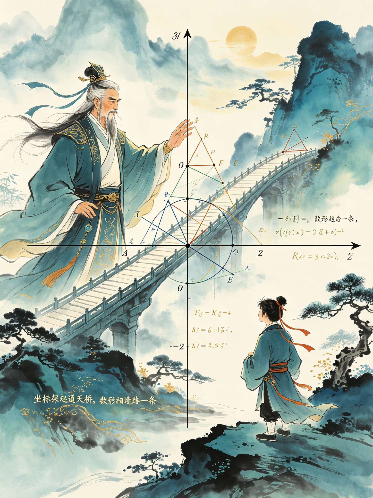

<ArchiveCopyPanel article-id="161952194" />

{"markdown":"PiDliIbnsbvvvJrmlbDmnK/lt6XlnYogIAo+IOe8luWPt++8mmAxNjE5NTIxOTRgICAKPiDljp/lp4vmlofku7bvvJpg56ys5YWt5Y236YeP5aSp5bC65Lyg5aWH5Yeg5L2V5a2mLTE2MTk1MjE5NC5tZGAgIAo+IOi/lOWbnu+8mlvmnKzkuablvZLmoaNdKC96aC9ib29rcy9zaHVzaHUvYXJ0aWNsZXMvKSDCtyBb5oC75YWl5Y+jXSgvemgvYm9va3MvYXJ0aWNsZXMvKQoKIyMg56ys5YWt5Y2377ya6YeP5aSp5bC65Lyg5aWH77yI5Yeg5L2V5a2m77yJCgrkvZzogIXvvJrkuZbkuZbmlbDlraYKCuaguOW/g+makOWWu++8muWwuuinhOS4uuazleWZqO+8jOWbvuW9ouS4uumYteW9ou+8jOinkuW6pui3neemu+S4uuazleW6pgoK5qC45b+D5b+D5rOV77ya5bmz55u05b6q55+p77yM5byv5puy5b6q5b6L77yM6KeC5b2i5a+f6YeP77yM5rSe5oKJ56m66Ze05qC36LKMCgrluIjlgoXor63lvZXvvJrlsLrph4/plb/nn63vvIzop4TnlLvmlrnlnIbvvJvlpKnlnLDmnInnm7TmnInmm7LvvIzlh6DkvZXkvr/mnInliJrmnInmn5TjgIIKCiFbaW1hZ2VdKC4vYXNzZXRzL2NzZG5pbWcvanBnLzNiMzUxMmEyMzk5MDc5MDAuanBnKQoKLS0tCgojIyMg5Y236aaW5byVCgrlkYrliKvmvJTnrpfmrablnLrvvIznnLzliY3po47nianosYHnhLblvIDmnJfjgILlpKnlnLDpl7Tpk7rlvIDml6DlnqDlubPpnaLvvIznm7TlsLrjgIHlnIbop4TjgIHph4/op5LlmajplJnokL3mgqzmta7vvIznur/mnaHop4TmlbTjgIHlm77lvaLliIbmmI7vvIzkuIDmtL7mlrnlnIbmnInluqbnmoTmsJTosaHjgIIKCuKAnOWJjeS6lOWNt++8jOaIkeS7rOWFiOWQjueglOS5oOinhOWImeOAgemaj+acuuOAgeaVsOacrOOAgeW9ouWPmOOAgeaOkuW4g+e7k+aehO+8jOS7iuaXpeaJp+i1t+mHj+WkqeWwuuS4juWchuinhO+8jOi4j+WFpeWHoOS9leWkqeWcsOOAguKAnSDluIjlgoXmiqzmiYvvvIznm7Tnur/mqKrlubPnq5bnm7TvvIzlnIblvKfmtYHovazmtZHlnIbvvIzigJzlh6DkvZXvvIzmmK/nlKjlmajlhbfkuIjph4/nqbrpl7TjgIHmj4/nu5jlvaLkvZPnmoTlrabpl67jgILlhYjlhaXmrKfmsI/lh6DkvZXvvIzkuaDlvpfkuJbpl7TmnIDnhp/mgonnmoTlubPnm7TlpKnlnLDop4Tnn6nvvJvlho3mjqLpnZ7mrKflh6DkvZXvvIzop4Hor4bmm7LnjofmlLnlhpnms5XliJnnmoTlvK/mm7Llr7DlrofjgILnm7Tnur/jgIHkuInop5LjgIHlnIbjgIHlpJrovrnlvaLjgIHnq4vkvZPkuIfosaHvvIznmoblnKjmraTljbfkuIDkuIDlj4Lmgp/jgILigJ0KCuWdiumXqOmrmOaCrOWMvumine+8muaWueWchumYgeOAggoK6Zi/5pWw5omL5oyB5LiA5p+E5pyo5bC677yM6L+I5q2l5YWl6ZiB77yM5q2j5byP5byA5ZCv5Yeg5L2V5L+u6KGM44CCCgotLS0KCiMjIOesrOS4gOeroCDnm7Top4TmnKzmupDvvIzngrnnur/pnaLnq4vlubPnm7Tkub7lnaQKCiFbaW1hZ2VdKC4vYXNzZXRzL2NzZG5pbWcvanBnLzc0MDE5NzIyZmIxMzBjNDUuanBnKQoK5pa55ZyG6ZiB5YaF77yM5pyA5YWI5pig5YWl55y85biY55qE5piv5p6E5oiQ5LiH54mp55qE5Z+656GA5YWD57Sg77ya54K544CB57q/44CB6Z2i44CCCgrigJzlh6DkvZXnrKzkuIDopoHkuYnvvIzlhYjor4bkuInln7rvvJrngrnjgIHnur/jgIHpnaLjgILigJ0KCueCue+8muepuumXtOS4reacgOWwj+agh+ivhu+8jOaXoOWkp+Wwj++8jOWumuS9jee9ru+8mwoK55u057q/77ya5Lik54K55LmL6Ze05pyA55+t6Lev5b6E77yM5ZCR5Lik56uv5peg6ZmQ5bu25bGV77yM5bmz55u05peg5byv77ybCgrlubPpnaLvvJrml6DmlbDnm7Tnur/pk7rlsZXogIzmiJDvvIzlubPmlbTlvIDpmJTvvIzml6Dovrnml6DpmYXjgIIKCuS4ieiAheaehOetkei1t+aVtOS4quW5s+ebtOepuumXtO+8jOS5n+aYr+asp+awj+WHoOS9leeahOagueWfuuOAggoKIyMjIOS4gOOAgeS6lOWkp+WFrOiuvu+8jOW5s+ebtOWkqeWcsOmTgeW+iwoK6L+Z5piv5qyn5rCP56m66Ze05LiN5Y+v6L+d6IOM55qE5qC55pys5rOV5YiZ77yM5aaC5ZCM5a6X6Zeo5oiS5b6L77yaCgotIOS4pOeCueS5i+mXtO+8jOacieS4lOS7heacieS4gOadoeebtOe6v+ebuOi/nu+8mwoKLSDnm7Tnur/lj6/ml6DpmZDlu7bplb/vvJsKCi0g57uZ5a6a5ZyG5b+D5LiO5Y2K5b6E77yM6IO955S75Ye65a6M5pW05ZyG5b2i77ybCgotIOaJgOacieebtOinkuWkp+Wwj+WujOWFqOebuOetie+8mwoKLSDlubPooYzlhazorr7vvJrov4fnm7Tnur/lpJbkuIDngrnvvIzmnInkuJTku4XmnInkuIDmnaHnm7Tnur/kuI7lt7Lnn6Xnm7Tnur/msLjkuI3nm7jkuqTvvIjlubPooYznur/vvInjgIIKCuaVtOWll+inhOefqeWumuS4i++8jOS+v+aYr+aIkeS7rOaXpeW4uOaJgOingeeahOW5s+ebtOS4lueVjOOAggoKIyMjIOS6jOOAgeWfuuehgOWbvuW9oua8lOWMlgoK55Sx54K557q/6Z2i5bu25Ly477yM55Sf5Ye65Z+656GA5bmz6Z2i5Zu+5b2i77yaCgrlsITnur/jgIHnur/mrrXvvJrnm7Tnur/nmoTlsYDpg6jlvaLmgIHvvIzmnInotbfngrnmiJbmnInovrnnlYzvvJsKCuinku+8muS4pOadoeebtOe6v+ebuOS6pOiAjOaIkO+8jOS7peinkuW6puWMuuWIhuWkp+Wwj++8jOebtOinkuOAgemUkOinkuOAgemSneinkuWQhOacieinhOWItuOAggoKIyMjIOS4ieOAgeWFreWig+S/ruS4usK356uL5Z+66K+G5b2iCgojIyMjIOesrOS4gOWig++8muinhueJqeingeW9ogoK6IO95YiG6L6o54K544CB57q/44CB6Z2i77yM5Y+q55yL5aSW6KGo5qih5qC344CCCgojIyMjIOesrOS6jOWig++8muW+quinhOS9nOWbvgoK5L2/55So5bC66KeE55S755u057q/44CB55S75ZyG44CB5L2c6KeS77yM54af57uD5Z+656GA5Zmo5YW355So5rOV44CCCgojIyMjIOesrOS4ieWig++8mueGn+iusOaIkuW+iwoK6YCa5pmT5LqU5aSn5YWs6K6+77yM5piO55m95bmz55u056m66Ze055qE5Z+65pys5rOV5YiZ44CCCgojIyMjIOesrOWbm+Wig++8muaOqOa8lOWFs+ezuwoK5Yik5pat57q/5LiO57q/44CB6KeS5LiO6KeS55qE5L2N572u44CB5aSn5bCP5YWz57O777yM566A5Y2V5o6o55CG6K666K+B44CCCgojIyMjIOesrOS6lOWig++8muaehOW9ouW4g+WxgAoK5Lul54K557q/6Z2i5Li65Z+677yM6Ieq5Li75pCt5bu65aSN5p2C5bmz6Z2i5qGG5p6244CCCgojIyMjIOesrOWFreWig++8muiejeS6juWkqeWcsAoK5b+D5Lit6Ieq5oiQ5bmz55u056m66Ze05rOV55CG77yM5LiA55y86L6o5piO57q/6Z2i5pys6LSo44CCCgrmnKznq6Dlv4Pms5XvvJoKCueCueWumuaWueS9jee6v+WumumAlO+8jOW5s+mdoumTuuaIkOS4h+mHjOWinwoK5LqU6KeE56uL5bC95bmz55u055WM77yM5bC66KeE5byA56+H5Yeg5L2V5YidCgotLS0KCiMjIOesrOS6jOeroCDkuInop5LnjoTpmLXvvIzkuInovrnkuInop5Lol4/lrprmlbAKCiFbaW1hZ2VdKC4vYXNzZXRzL2NzZG5pbWcvanBnLzY3MDQ3OWQ5MTY3NDNiNjUuanBnKQoK5YmN6KGM5YWl5YaF77yM5ruh6ZiB55qG5piv5LiJ6KeS5Zu+5b2i77yM5aSn5bCP44CB5b2i5oCB5ZCE5byC77yM5Y205piv5Yeg5L2V5Lit5Y+Y5YyW5pyA5aSa44CB5bqU55So5pyA5bm/55qEIOKAnOeOhOmYteKAneOAggoK4oCc5LiJ6KeS5b2i77yM5bmz6Z2i5Yeg5L2V5qC45b+D6Zi15rOV44CC5LiJ6L6555u46L+e44CB5LiJ6KeS55u45omj77yM57uT5p6E56iz5Zu677yM5LiH54mp5p6E5p625aSa5Lul5q2k5Li66aqo44CC4oCdCgojIyMg5LiA44CB5LiJ6KeS5b2i5YiG57G7CgrmjInovrnplb/vvJrnrYnovrnkuInop5LlvaLjgIHnrYnohbDkuInop5LlvaLjgIHkuI3nrYnovrnkuInop5LlvaLvvJsKCuaMieinkuW6pu+8muebtOinkuS4ieinkuW9ouOAgemUkOinkuS4ieinkuW9ouOAgemSneinkuS4ieinkuW9ouOAggoKIyMjIOS6jOOAgeaguOW/g+WumuaVsOS4juWumueQhgoKLSDlhoXop5LlkozvvJrku7vmhI/kuInop5LlvaLvvIzkuInkuKrlhoXop5Lnm7jliqDmgZLnrYnkuo7lubPop5LvvIzmmK/lpKnnlJ/lrprmlbDjgIIKCi0g5LiJ6L655YWz57O777ya5Lu75oSP5Lik6L655LmL5ZKM5aSn5LqO56ys5LiJ6L6577yM6L+d6IOM5q2k5b6L77yM6Zi15b2i5peg5rOV5oiQ56uL44CCCgotIOWFqOetie+8muW9oueKtuOAgeWkp+Wwj+WujOWFqOS4gOiHtO+8jOWPr+WujOWFqOmHjeWQiO+8m+WIpOWumuazleWIme+8mui+ueinkui+ueOAgeinkui+ueinkuOAgei+uei+uei+ueetieOAggoKLSDnm7jkvLzvvJrlvaLnirbnm7jlkIzjgIHlpKflsI/kuI3lkIzvvIzop5LluqblhajlkIzvvIzovrnplb/miJDlm7rlrprmr5TkvovjgIIKCiMjIyDkuInjgIHnm7Top5LkuInop5LvvJrmlbDnkIbmnqLnur0KCuebtOinkuS4ieinkuW9ouWwpOS4uueJueauiu+8jOWLvuiCoeWumueQhuS4uuS8oOS4luW/g+azle+8muebtOinkuS4pOi+ueW5s+aWueWSjO+8jOetieS6juaWnOi+ueW5s+aWueOAggoK5a6D6KGU5o6l6ZW/5bqm44CB6KeS5bqm44CB5q+U5L6L77yM5Lmf5piv5ZCO57ut5LiJ6KeS5Ye95pWw44CB5rWL566X5LmL5pyv55qE5qC55Z+644CCCgojIyMg5Zub44CB5YWt5aKD5L+u5Li6wrflj4Lmgp/kuInop5IKCiMjIyMg56ys5LiA5aKD77ya5YiG6L6o5ZOB57G7CgrliIbmuIXkuI3lkIznsbvlnovkuInop5LlvaLvvIzor4bliKvnm7Top5LjgIHplJDop5LjgIHpkp3op5LjgIIKCiMjIyMg56ys5LqM5aKD77ya5rWL566X5bqm6YePCgrorqHnrpfovrnplb/jgIHop5LluqbjgIHlkajplb/jgIHpnaLnp6/jgIIKCiMjIyMg56ys5LiJ5aKD77ya5rS755So5a6a55CGCgrov5DnlKjlhoXop5LlkozjgIHkuInovrnlhbPns7vlgZrln7rnoYDmjqjmvJTjgIIKCiMjIyMg56ys5Zub5aKD77ya5Yik5ZCM6L6o5Ly8Cgrlv6vpgJ/liKTlrprkuInop5LlvaLlhajnrYnmiJbnm7jkvLzvvIznkIbmuIXmr5TkvovlhbPns7vjgIIKCiMjIyMg56ys5LqU5aKD77ya5ben5p6E5LiJ6KeSCgrlnKjlpI3mnYLlm77lvaLkuK3mi4bop6PjgIHmnoTpgKDkuInop5LlvaLvvIznroDljJbpmr7popjjgIIKCiMjIyMg56ys5YWt5aKD77ya6Zi155CG6YCa6YCPCgrmtJ7mgonkuInop5LnqLPlm7rkuYvmgKfvvIzms5XnkIbjgIHmtYvnrpfjgIHmjqjmvJTkuIDkvZPotK/pgJrjgIIKCuacrOeroOW/g+azle+8mgoK5LiJ6L6555u45om86Ieq5oiQ6Zi177yM5LiJ6KeS55u46KGh5pyJ5a6a5YiGCgrli77ogqHkuIDms5Xlrprplb/nn63vvIzmlrnlnIbpmLXph4znq4vkub7lnaQKCi0tLQoKIyMg56ys5LiJ56ugIOWchuS4juWkmui+ue+8jOabsuebtOebuOeUn+S4h+ixoeeUnwoKIVtpbWFnZV0oLi9hc3NldHMvY3NkbmltZy9qcGcvMDFmYjdhZGRhZmNlNmFlZS5qcGcpCgrkuInop5LkuYvlrabkv67miJDvvIzpmIHkuK3kuKTkvqfliIbliJflpJrovrnlvaLkuI7lnIblvaLvvIzkuIDliJrkuIDmn5TvvIzkuIDmraPkuIDmm7LjgIIKCiMjIyDkuIDjgIHlpJrovrnlvaLvvJrop4TmlbTnm7TovrnkuYvlvaIKCueUseWkmuadoee6v+autemmluWwvuebuOi/nuWbtOaIkO+8muWbm+i+ueW9ouOAgeS6lOi+ueW9ouOAgeWFrei+ueW9ouKApuKApuebtOiHs+aXoOept+Wkmui+ueOAggoK5q2j5aSa6L655b2i77ya5ZCE6L65562J6ZW/44CB5ZCE6KeS55u4562J77yM5b2i5Yi25pyA5Li66KeE5pW05a+556ew77ybCgrnibnmrorlm5vovrnlvaLvvJrlubPooYzlm5vovrnlvaLjgIHnn6nlvaLjgIHoj7HlvaLjgIHmoq/lvaLvvIzlkITmnInovrnplb/jgIHop5LluqbkuJPlsZ7op4TlvovjgIIKCuWkmui+ueW9ouWPr+aLhuino+S4uuWkmuS4quS4ieinkuW9ou+8jOS4ieinkuazleeQhuWPr+mhuuWKv+ayv+eUqOOAggoKIyMjIOS6jOOAgeWchuW9ou+8mua1keWchuiHs+aflOS5i+W9ogoK4oCc5ZyG77yM5piv5Y2V5LiA5puy57q/5Zu05oiQ55qE5a6M576O5Zu+5b2i44CC4oCdCgrlnIblv4PjgIHljYrlvoTjgIHnm7TlvoTvvJrlnIbkuInlpKfmoLjlv4PopoHntKDvvJsKCuWRqOmVv+OAgemdouenr++8muWbuuWumua1i+eul+WFrOW8j++8mwoK5bym44CB5byn44CB5YiH57q/44CB5ZyG5b+D6KeS44CB5ZyG5ZGo6KeS77ya5ZyG6KGN55Sf6K+46Iis5b2i5oCB77yM6KeS5bqm44CB57q/5q6155qG5pyJ5Lil6LCo5YWz6IGU44CCCgrlnIbml6Dmo7Hop5LvvIzlvqrnjq/lvoDlpI3vvIzku6PooajlnIbmu6HkuI7ova7ovazvvIzkuI7ku6PmlbDlj5jmjaLjgIHmi5PmiZHnjq/kvZPms5XnkIbnm7jpgJrjgIIKCiMjIyDkuInjgIHmm7Lnm7Tnm7jono0KCuebtOe6v+aehOaIkOWkmui+ue+8jOabsue6v+WHneaIkOWchu+8jOW5s+ebtOS4jua1keWchuebuOS6kuaQremFje+8jOWPr+a8lOWMluS4lumXtOe7neWkp+WkmuaVsOW5s+mdouW9ouS9k+OAggoKIyMjIOWbm+OAgeWFreWig+S/ruS4usK35puy55u05ZCM5L+uCgojIyMjIOesrOS4gOWig++8muinguW9ouW9kuexuwoK5Yy65YiG5aSa6L655b2i44CB5ZyG5b2i77yM6K6k6K+G5ZyG5ZCE6YOo5YiG5ZCN56ew44CCCgojIyMjIOesrOS6jOWig++8muiuoemHj+axguWAvAoK6K6h566X5ZGo6ZW/44CB6Z2i56ev44CB5byn6ZW/44CB6KeS5bqm44CCCgojIyMjIOesrOS4ieWig++8mua0u+eUqOaAp+i0qAoK5o6M5o+h5bmz6KGM5Zub6L655b2i44CB5ZyG55qE5Z+656GA5oCn6LSo77yM566A5Y2V5o6o5ryU44CCCgojIyMjIOesrOWbm+Wig++8mue7hOWQiOaehOWbvgoK55So5aSa6L655b2i44CB5ZyG5b2i5ou85o6l57uE5ZCI77yM6K6+6K6h5aSN5ZCI5Zu+5b2i44CCCgojIyMjIOesrOS6lOWig++8mua6r+a6kOaOqOivgQoK5o6o5a+85Zu+5b2i5oCn6LSo44CB6KeS5bqm57q/5q615YWz57O777yM5piO5YW25omA5Lul54S244CCCgojIyMjIOesrOWFreWig++8muabsuebtOWQiOS4gAoK55u05b2i44CB5puy5b2i5rOV55CG6J6N5Lya77yM6ZqP5b+D5p6E57uY5LiH6LGh5bmz6Z2i5Zu+5b2i44CCCgrmnKznq6Dlv4Pms5XvvJoKCuWkmui+ueaWueato+W+que6v+aute+8jOS4gOWchua1gei9rOe7leWchuW/gwoK5puy55u055u45rWO5peg56m35Y+Y77yM5bmz6Z2i5LiH6LGh6Ieq5q2k5rexCgotLS0KCiMjIOesrOWbm+eroCDnq4vkvZPlr7DlrofvvIzplb/lrr3pq5jnrZHkuInnu7TlpKnlnLAKCiFbaW1hZ2VdKC4vYXNzZXRzL2NzZG5pbWcvanBnL2JkMWNhMmQyYjYzZmM0ZTMuanBnKQoK5bmz6Z2i5Zu+5b2i56CU5Lmg5a6M5q+V77yM5aSp5Zyw6aqk54S25bu25bGV77yM5aSa5Ye65LiA6YeN56uW5ZCR5bC65bqm77yM5q2l5YWl56uL5L2T5Yeg5L2V44CC6ZW/44CB5a6944CB6auY5LiJ57u05bm25a2Y77yM5LuO5bmz6Z2i6LWw5ZCR55yf5a6e5aSp5Zyw44CCCgojIyMg5LiA44CB5Z+656GA56uL5L2T5b2i5Yi2CgotIOafseS9k++8muS4iuS4i+W6lemdouW5s+ihjOWFqOetie+8jOS+p+mdouS4uuW5s+mdouaIluabsumdou+8iOajseafseOAgeWchuafse+8ie+8mwoKLSDplKXkvZPvvJrlupXpnaLlub/pmJTvvIzlkJHkuIrmlLbmnZ/msYfogZrkuo7kuIDngrnvvIjmo7HplKXjgIHlnIbplKXvvInvvJsKCi0g55CD5L2T77ya56m66Ze05a6M576O5rWR5ZyG77yM6KGo6Z2i5q+P5LiA54K55Yiw55CD5b+D6Led56a755u4562J77yM5piv56uL5L2T5Lit55qE6Iez5p+U5b2i5oCB44CCCgojIyMg5LqM44CB5qC45b+D5rWL566XCgrooajpnaLnp6/vvJrlvaLkvZPmiYDmnInlpJbooajpnaLpnaLnp6/mgLvlkozvvJsKCuS9k+enr++8muW9ouS9k+WNoOaNruepuumXtOeahOWkp+Wwj++8jOafseOAgemUpeOAgeeQg+WQhOacieS4k+Wxnuiuoeeul+WFrOW8j+OAggoKIyMjIOS4ieOAgeaIqumdouS4juaKleW9sQoK55So5bmz6Z2i5oiq5Y+W56uL5L2T77yM5b6X5Yiw5oiq6Z2i77yb5bCG56uL5L2T5oqV5bCE5Yiw5bmz6Z2i77yM5b2i5oiQ5oqV5b2x44CCCgrkuIDliZbkuIDmipXvvIzlrp7njrDkuInnu7TkuI7kuoznu7TnmoTnm7jkupLovazljJbvvIzkuZ/mmK/liLblm77jgIHluIPpmLXnmoTluLjnlKjmiYvms5XjgIIKCiMjIyDlm5vjgIHlha3looPkv67kuLrCt+elnua4uOS4iee7tAoKIyMjIyDnrKzkuIDlooPvvJrovqjor4bnq4vkvZMKCuWIhua4heafseOAgemUpeOAgeeQg+etieW9ouS9k++8jOW7uueri+S4iee7tOepuumXtOinguaEn+OAggoKIyMjIyDnrKzkuozlooPvvJrluqbph4/orqHnrpcKCuaxguino+ihqOmdouenr+OAgeS9k+enr+OAgeajsemVv+OAgeinkuW6puOAggoKIyMjIyDnrKzkuInlooPvvJrpgI/op4bor4blm74KCueci+aHgueri+S9k+inhuWbvuOAgeaKleW9se+8jOeUseW5s+mdouWbvui/mOWOn+eri+S9k+agt+iyjOOAggoKIyMjIyDnrKzlm5vlooPvvJrliIbmnpDmiKrpnaIKCumihOWIpOW5s+mdouaIquWPlueri+S9k+aJgOW+l+eahOaIqumdouW9oueKtuOAggoKIyMjIyDnrKzkupTlooPvvJrnqbrpl7TmjqjmvJQKCuWIhuaekOeri+S9k+WGhemDqOe6v+OAgemdouOAgeinkueahOS9jee9ruS4juWFs+iBlOOAggoKIyMjIyDnrKzlha3looPvvJrkuInnu7Toh6rlnKgKCuW/g+S4reeri+S9k+S4juW5s+mdouiHqueUsei9rOWMlu+8jOepuumXtOaehOaDs+avq+aXoOa7nueijeOAggoK5pys56ug5b+D5rOV77yaCgrkuoznu7Tpk7rmiJDlubPph47pmJTvvIzkuInnu7TmkpHotbfmmIrlpKnplb8KCuafsemUpeeQg+S9k+WIhuW9ouaAge+8jOihqOmHjOepuumXtOWwveWPr+mHjwoKLS0tCgojIyDnrKzkupTnq6Ag6Kej5p6Q5Yeg5L2V77yM5pWw5b2i5ZCI5LiA6YCa5Lik6LevCgohW2ltYWdlXSguL2Fzc2V0cy9jc2RuaW1nL2pwZy81NDIxZTk1NjUyMmYyNDBlLmpwZykKCuWwuuinhOS9nOWbvuOAgeW9ouS9k+a1i+eul+W3suaIkO+8jOW4iOWCheaKrOaJi++8jOWwhuS7o+aVsOespuWPt+S4juWHoOS9leWbvuW9ouWPoOWQiOS4gOWkhO+8jOeul+W8j+iQveS6juWbvuS4iu+8jOWbvuW9ouaYoOS6juW8j+S4reOAggoK4oCc5q2k5YmN5Yeg5L2V5Y+q5Yet5bC66KeE5o6o5ryU77yM5Luj5pWw5Y+q5Yet56ym5Y+35ryU566X77yM5aaC5LuK6Kej5p6Q5Yeg5L2V77yM6K6p5pWw5LiO5b2i5ZCI5LqM5Li65LiA44CC5Lul5Z2Q5qCH57O75Li65p6277yM54K55a+55bqU5pWw5a+577yM57q/5a+55bqU5pa556iL77yM5Zu+5b2i5Y+Y5YyW5Y2z5piv566X5byP5o6o5ryU44CC4oCdCgojIyMg5LiA44CB55u06KeS5Z2Q5qCH57O7CgrmqKrovbTjgIHnurXovbTnm7jkuqTlrprljp/ngrnvvIzlubPpnaLlhoXku7vmhI/kuIDngrnvvIzpg73og73nlKjkuIDnu4TmlbDlrZflnZDmoIfooajnpLrjgIIKCi0g55u057q/IOKGkiDkuIDmrKHmlrnnqIsKCi0g5ZyGIOKGkiDkuozmrKHmlrnnqIsKCi0g5puy57q/IOKGkiDlr7nlupTpq5jpmLbmlrnnqIsKCiMjIyDkuozjgIHmoLjlv4PlppnnlKgKCi0g55So5Luj5pWw6K6h566X5pu/5Luj57qv5Yeg5L2V6K+B5piO77yM5o6o5ryU5pu05Lil6LCo44CB6YCa55So77ybCgotIOWbvuW9ouW5s+enu+OAgeaXi+i9rOOAgee8qeaUvu+8jOWFqOmDqOi9rOWMluS4uuaWueeoi+WPmOaNou+8mwoKLSDlroznvo7kuLLogZTnrKzkuInljbfmlbDorrrjgIHnrKzkupTljbfku6PmlbDjgIHmnKzljbflh6DkvZXvvIzor7jpgZPlvIDlp4vmt7HluqbkuqTono3jgIIKCiMjIyDkuInjgIHnqbrpl7TlnZDmoIfns7sKCuW7tuS8uOiHs+S4iee7tOepuumXtO+8jOWinuiuvuerlui9tO+8jOeri+S9k+WbvuW9ouS5n+WPr+WFqOmDqOeUqOaWueeoi+e7hOaPj+i/sOOAggoKIyMjIOWbm+OAgeWFreWig+S/ruS4usK35pWw5b2i55u46YCaCgojIyMjIOesrOS4gOWig++8muWIneivhuWdkOaghwoK55yL5oeC5Z2Q5qCH6L205LiO54K55Z2Q5qCH77yM5a6M5oiQ54K55LiO5pWw5a2X55qE6L2s5o2i44CCCgojIyMjIOesrOS6jOWig++8muW8j+WbvuS6kuivkQoK55u057q/44CB5ZyG562J5Z+656GA5Zu+5b2i5LiO5pa556iL5LqS55u45pS55YaZ44CCCgojIyMjIOesrOS4ieWig++8muiBlOeri+axguinowoK55So5pa556iL5rGC5Lqk54K544CB6Led56a744CB6KeS5bqm77yM6Kej5Yaz5Yeg5L2V6Zeu6aKY44CCCgojIyMjIOesrOWbm+Wig++8muW9ouWPmOWPmOW8jwoK5Zu+5b2i5bmz56e744CB5peL6L2s44CB57yp5pS+77yM5ZCM5q2l5pS55YaZ5a+55bqU5pa556iL44CCCgojIyMjIOesrOS6lOWig++8muabsue6v+a3seeptgoK6ZK756CU5LqM5qyh5puy57q/44CB5aSN5p2C5puy57q/55qE5pa556iL5LiO5b2i5oCB5YWz6IGU44CCCgojIyMjIOesrOWFreWig++8muaVsOW9ouWQjOa6kAoK6KeB5byP55+l5b2i77yM6KeB5Zu+5YiX5byP77yM5Luj5pWw5Yeg5L2V5rWR54S25LiA5L2T44CCCgrmnKznq6Dlv4Pms5XvvJoKCuWdkOagh+aetui1t+mAmuWkqeahpe+8jOaVsOW9ouebuOmAoui3r+S4gOadoQoK566X56ym6Kej5b6X5Zu+5b2i5oSP77yM5Yeg5L2V5Luj5pWw5Lik55u45LqkCgotLS0KCiMjIOesrOWFreeroCDkuInop5Llh73mlbDvvIzop5LovrnkupLmvJTmtYvlpKnmnLoKCiFbaW1hZ2VdKC4vYXNzZXRzL2NzZG5pbWcvanBnL2MyYzQ3NGVhMmI0YWE1MzYuanBnKQoK5Z2Q5qCH57O75LiO55u057q/44CB5puy6Z2i5LmL5LiK5a2m5oiQ77yM5LiT5pS76KeS5bqm5LiO6L656ZW/5o2i566X55qE5LiJ6KeS5Ye95pWw5rWu546w6ICM5Ye677yM5piv5Yeg5L2V5rWL566X44CB6L2o6L+55o6o5ryU55qE54us6Zeo5b+D5rOV44CCCgrigJzkuInop5LlvaLjgIHlnZDmoIfns7vkuYvkuIrvvIzooY3nlJ/lh7rlha3lpKfln7rnoYDkuInop5Llh73mlbDvvJrmraPlvKbjgIHkvZnlvKbjgIHmraPliIfjgIHkvZnliIfjgIHmraPlibLjgIHkvZnlibLjgILmoLjlv4PkvZznlKjvvJrku6Xop5LmsYLovrnvvIzku6Xovrnlrprop5LjgILigJ0KCiMjIyDkuIDjgIHln7rnoYDlrprkuYkKCuS+neaJmOebtOinkuS4ieinkuW9ouS4juWNleS9jeWchuW7uueri+WumuS5ie+8jOinkuW6puWPmOWMlu+8jOWHveaVsOWAvOmaj+S5i+inhOW+i+i1t+S8j+OAggoK5Y2V5L2N5ZyG5LiK5Yqo54K55peL6L2s5LiA5ZGo77yM5Ye95pWw5a6M5oiQ5LiA5qyh5a6M5pW05ZGo5pyf77yM6Ieq5bim5b6q546v6L2u6L2s5LmL5oCn44CCCgojIyMg5LqM44CB5YWs5byP5LiO5Y+Y5o2iCgrlpKfph4/mgZLnrYnlj5jmjaLjgIHlkozlt67jgIHlgI3op5LjgIHor7Hlr7zlhazlvI/vvIzlj6/ngbXmtLvliIfmjaLlh73mlbDlvaLmgIHvvIzljJbnroDlpI3mnYLmtYvnrpfjgIIKCuWRqOacn+aAp+OAgeWlh+WBtuaAp+OAgeWbvuWDj+azouWKqO+8jOaYr+WIhuaekOaMr+WKqOOAgei9qOi/ueOAgeW+queOr+WPmOWMlueahOWIqeWZqOOAggoKIyMjIOS4ieOAgeW6lOeUqOWFs+iBlAoK5rWL6Led44CB5rWL57uY44CB6L2o6L+55ryU566X44CB5rOi5b2i5YiG5p6Q55qG56a75LiN5byA5q2k6YGT77yM5ZCM5pe26KGU5o6l5ZCO57ut5Y+Y5YyW6KeE5b6L5LmL5a2m44CCCgojIyMg5Zub44CB5YWt5aKD5L+u5Li6wrfop5Llj5jlvovovawKCiMjIyMg56ys5LiA5aKD77ya54af6K6w5a6a5LmJCgrliIbmuIXlha3np43kuInop5Llh73mlbDvvIznnIvmh4Lovrnop5Llr7nlupTlhbPns7vjgIIKCiMjIyMg56ys5LqM5aKD77ya5Z+656GA5rGC5YC8Cgrlt7Lnn6Xop5LluqbmsYLlh73mlbDlgLzvvIzmiJbnlLHovrnplb/lj43mjqjop5LluqbjgIIKCiMjIyMg56ys5LiJ5aKD77ya6L+Q55So5YWs5byPCgrkvb/nlKjln7rnoYDmgZLnrYnlvI/jgIHor7Hlr7zlhazlvI/ljJbnroDlvI/lrZDjgIIKCiMjIyMg56ys5Zub5aKD77ya5Zu+5YOP6KeC5Yq/Cgrnu5PlkIjlnZDmoIfns7vvvIznnIvmh4Llh73mlbDlm77lg4/jgIHlkajmnJ/jgIHlop7lh4/otovlir/jgIIKCiMjIyMg56ys5LqU5aKD77ya57u85ZCI5Y+Y5o2iCgrmtLvnlKjlkozlt67jgIHlgI3op5LlhazlvI/vvIzlpITnkIblpI3mnYLkuInop5LmvJTnrpfjgIIKCiMjIyMg56ys5YWt5aKD77ya5ZGo5Y+Y5rSe5piOCgrmtJ7mgonlkajmnJ/ova7ovazkuYvnkIbvvIzop5LjgIHovrnjgIHlh73mlbDjgIHlm77lg4/kuIDkvZPpgJrmmZPjgIIKCuacrOeroOW/g+azle+8mgoK5LiA6KeS54m15Yqo5Zub6L655Yq/77yM5Ye95pWw5b6q546v5b6A5aSN6KGMCgrljZXkvY3lnIbph4zol4/oioLlvovvvIzmtYvlsL3mlrnlnIbov5zov5Hmg4UKCi0tLQoKIyMg56ys5LiD56ugIOmdnuasp+WvsOWuh++8jOabsueOh+aUueWGmeWkqeWcsOazleWImQoKIVtpbWFnZV0oLi9hc3NldHMvY3NkbmltZy9qcGcvZmY2NmM3OGFiZTliZTQxZC5qcGcpCgrmrKfmsI/lubPnm7TlpKnlnLDlsL3mlbDpgJrmmZPvvIzpmIHkuK3lhYnlvbHkuIDlj5jvvIznqbrpl7TlvIDlp4vlvq7lvq7lvK/mm7LvvIznm7Tnur/kuI3lho3nrJTnm7TvvIzlubPooYzms5XliJnmgoTnhLbmlLnlhpnjgIIKCuKAnOaIkeS7rOS4gOebtOihjOi1sOWcqOW5s+ebtOepuumXtO+8jOWPr+WkqeWcsOW5tumdnuWFqOaYr+WdpumAlOOAguW9k+epuumXtOiHquW4puabsueOh++8jOS+v+i/m+WFpemdnuasp+WHoOS9leOAguKAnQoKIyMjIOS4gOOAgeW5s+ihjOWFrOiuvueahOmioOimhgoK5qyn5rCP5Yeg5L2V77ya6L+H55u057q/5aSW5LiA54K577yM5LiA5p2h5bmz6KGM57q/77ybCgotIOe9l+awj+WHoOS9le+8iOWPjOabsuWHoOS9le+8ie+8muWtmOWcqOaXoOaVsOadoeW5s+ihjOe6v++8jOepuumXtOWQkeWGheW8r+absu+8mwoKLSDpu47mm7zlh6DkvZXvvIjmpK3lnIblh6DkvZXvvInvvJrmsqHmnInlubPooYznur/vvIzku7vmhI/kuKTmnaHnm7Tnur/lv4Xlrprnm7jkuqTvvIznqbrpl7TlkJHlpJbpl63lkIjlvK/mm7LjgIIKCuS4ieWkp+WHoOS9leS9k+ezu++8jOWPquWboOS4gOadoeWFrOiuvuS4jeWQjO+8jOa8lOWMluWHuuaIqueEtuS4jeWQjOeahOepuumXtOinhOWImeOAggoKIyMjIOS6jOOAgeW9ouS9k+inhOW+i+WPmOWMlgoK5bmz55u056m66Ze05YaF6KeS5ZKM5Li65a6a5YC877yb5byv5puy56m66Ze05YaF77yM5LiJ6KeS5b2i5YaF6KeS5ZKM5LiN5YaN5Zu65a6a77yaCgrnvZfmsI/lh6DkvZXvvJrlhoXop5LlkozlsI/kuo7lubPop5LvvJsKCum7juabvOWHoOS9le+8muWGheinkuWSjOWkp+S6juW5s+inkuOAggoK55u057q/44CB6Led56a744CB5ZyG5b2i44CB6KeS5bqm55qE6KeE5b6L77yM5YWo6YOo6ZqP5puy546H5pS55Y+Y44CCCgojIyMg5LiJ44CB5aSn6YGT5bu25Ly4CgrpnZ7mrKflh6DkvZXkuI3lho3lsYDpmZDlnLDpnaLmlrnlr7jvvIznlKjkuo7mj4/ov7DlpKflsLrluqblroflrpnnqbrpl7TjgIHlvJXlipvlnLrlvaLmgIHvvIzmmK/mjqLntKLoi43nqbnmt7HlpITnmoTlhbPplK7lrabpl67jgILkuZ/kuI7nrKzlm5vljbfmi5PmiZHmm7LpnaLjgIHov57nu63lvaLlj5jmt7HluqblkbzlupTjgIIKCiMjIyDlm5vjgIHlha3looPkv67kuLrCt+aCn+mAj+absuepugoKIyMjIyDnrKzkuIDlooPvvJrnn6XmmZPliIbliKsKCuaYjueZveWtmOWcqOW5s+ebtOOAgeW8r+absuS4pOexu+epuumXtO+8jOiusOS9j+S4ieWkp+WHoOS9leWQjeensOOAggoKIyMjIyDnrKzkuozlooPvvJrovqjmnpDlhazorr4KCuWIhua4heS4ieenjeW5s+ihjOinhOWIme+8jOeQhuino+aguOW/g+W3ruW8guadpea6kOOAggoKIyMjIyDnrKzkuInlooPvvJrop4Llr5/lvaLlj5gKCueci+aHguW8r+absuepuumXtOWGheWbvuW9ouOAgeinkuW6puOAgee6v+adoeeahOWPmOWMlueJueeCueOAggoKIyMjIyDnrKzlm5vlooPvvJrliIbnsbvliKTnlYwKCuagueaNruWGheinkuWSjOOAgeW5s+ihjOWFs+ezu++8jOWMuuWIhuasp+awj+OAgee9l+awj+OAgem7juabvOepuumXtOOAggoKIyMjIyDnrKzkupTlooPvvJrnkIbop6Pmm7LnjocKCuaYjueZveabsueOh+Wkp+Wwj+WmguS9leW9seWTjeepuumXtOW9ouaAgeS4juWHoOS9leinhOW+i+OAggoKIyMjIyDnrKzlha3looPvvJrnqbrnkIblpKfpgJoKCuW5s+ebtOOAgeW8r+absuepuumXtOazleeQhuWwvemAmu+8jOefpeaZk+S4jeWQjOepuumXtOmAgueUqOWcuuaZr+OAggoK5pys56ug5b+D5rOV77yaCgrlubPnm7TmnInlvovmm7Lml6DluLjvvIzkuIDmlLnlhazorr7lj5jlhavojZIKCuabsueOh+S4uue6suWIhuWvsOWuh++8jOS4ieaWueWHoOS9leWQhOaTheWcugoKLS0tCgojIyDnrKzlhavnq6Ag5bC66KeE5L2c5Zu+5LiO5Yeg5L2V6Zq+6aKY77yM5Y+k5rOV5p6B6Ie05L+u5Li6CgrmlrnlnIbpmIHmnIDlkI7kuIDlpITljLrln5/vvIzkuJPms6jkuIrlj6TlsLrop4TkvZzlm77vvIzlj6rnlKjml6DliLvluqbnm7TlsLrkuI7lnIbop4TvvIzkuI3lgJ/lhbbku5blmajlhbfvvIzmvJTljJbkuIfljYPlm77lvaLvvIzlkIzml7bmtYHkvKDnnYDkuInlpKfljYPlj6Tlh6DkvZXpmr7popjjgIIKCiMjIyDkuIDjgIHmraPnu5/lsLrop4TkvZzlm74KCumZkOWumuW3peWFt++8muS7heebtOWwuuOAgeWchuinhO+8mwoK5Y+v5a6M5oiQ77ya5L2c57q/5q6144CB5L2c6KeS44CB562J5YiG57q/5q6144CB562J5YiG6KeS44CB5L2c5q2j5aSa6L655b2i44CB5L2c5bmz6KGM57q/44CB5Z6C57q/562J57uP5YW46YCg5Z6L44CCCgrov5nmmK/lr7nlh6DkvZXms5XnkIbjgIHpgLvovpHmjqjmvJTnmoTmnoHoh7TogIPpqozjgIIKCiMjIyDkuozjgIHkuInlpKflj6Tlhbjlh6DkvZXpmr7popgKCuS4iuWPpOa1geS8oO+8jOS7heeUqOWwuuinhOawuOi/nOaXoOazleWujOaIkO+8jOaYr+WHoOS9leeVjOWFrOiupOeahOWNg+WPpOiwnOmimO+8mgoKLSDljJblnIbkuLrmlrnvvJrkvZzkuIDkuKrmraPmlrnlvaLvvIzpnaLnp6/kuI7lt7Lnn6XlnIbnm7jnrYnvvJsKCi0g5YCN56uL5pa55L2T77ya5L2c5LiA5Liq56uL5pa55L2T77yM5L2T56ev5Li65bey55+l56uL5pa55L2T55qE5Lik5YCN77ybCgotIOS4ieetieWIhuS7u+aEj+inku+8muWwhuS7u+aEj+S4gOS4quinkueyvuehruS4ieetieWIhuOAggoK6Zq+6aKY5pys6Lqr5peg5rOV5a6e546w77yM5Y205o6o5Yqo5LqG5Luj5pWw44CB5pWw6K6644CB5Z+f6K6655qE5Y+R5bGV77yM5Yeg5L2V5LiO5Luj5pWw5YaN5qyh5rex5bqm5LqS6K+B44CCCgojIyMg5LiJ44CB6J6N5Lya5oC757uTCgrlsLrop4TkvZzlm77lrojlj6Tms5XvvIzpmr7popjnoLTovrnnlYzvvJvlh6DkvZXku47lhbfosaHnlLvlm77vvIzotbDlkJHmir3osaHorrror4HvvIzlho3ogZTliqjliY3kupTljbfmiYDmnInlrabpl67jgIIKCiMjIyDlm5vjgIHlha3looPkv67kuLrCt+WPpOazleeyvuW3pQoKIyMjIyDnrKzkuIDlooPvvJrkvp3moLfkvZzlm74KCui3n+edgOiMg+S+i++8jOeUqOWwuuinhOWujOaIkOWfuuehgOWbvuW9oue7mOWItuOAggoKIyMjIyDnrKzkuozlooPvvJroh6rkuLvorr7orqEKCuaMieimgeaxgueLrOeri+WujOaIkOe6v+auteOAgeinkuW6puOAgeato+Wkmui+ueW9ouS9nOWbvuOAggoKIyMjIyDnrKzkuInlooPvvJrmmI7ovqjlj6/ooYwKCuWIpOaWreS4gOmBk+S9nOWbvumimO+8jOWPqueUqOWwuuinhOiDveWQpuWunueOsOOAggoKIyMjIyDnrKzlm5vlooPvvJrmuq/mupDljoblj7IKCuS6huino+S4ieWkp+WHoOS9lemavumimOeahOeUseadpeS4jumZkOWItuadoeS7tuOAggoKIyMjIyDnrKzkupTlooPvvJrot6jpgZPkupLor4EKCue7k+WQiOS7o+aVsOOAgeWfn+iuuuefpeivhu+8jOeQhuino+mavumimOS4jeWPr+ino+eahOaguea6kOOAggoKIyMjIyDnrKzlha3looPvvJrlj6Tms5XlpKfmiJAKCueyvumAmuWwuuinhOaJgOiDveS4juaJgOS4jeiDve+8jOWHoOS9leWPpOazleS/ruS4uuWchua7oeOAggoKLS0tCgrljbfnu4jmgLvpk60KCuaWueWchumYgeeBteWFieaxh+iBmu+8jOiQveS4i+esrOWFreWNt+aAu+ivgO+8mgoK5bC66YeP5aSp5Zyw6KeE55S75ZyG77yM5bmz55u05byv5puy5Lik6YeN5aSpCgrmlbDlvaLnm7jlkIjpgJrkuIfms5XvvIzlh6DkvZXlhavnr4fpgZPlp4vlhagKCuW4iOWCheeci+WQkemYv+aVsO+8mgoK4oCc56ys5YWt5Y23IOmHj+WkqeWwuuS8oOWlh++8jOWHoOS9leWtpuWFq+eroOWFqOmDqOWchua7oeOAguiHs+atpOWFreWNt+S/ruihjO+8muazm+WHveOAgeamgueOh+OAgeaVsOiuuuOAgeaLk+aJkeOAgeS7o+aVsOOAgeWHoOS9le+8jOaVsOWtpuWFreWkp+aguOW/g+S4u+W5suWFqOmDqOi1sOWujOOAguWJjei3r+WwmuacieS4pOWNt++8jOS4k+aUu+WPmOWMluinhOW+i+S4juW6lOeUqOWunua1i+OAguS4i+S4gOWNt++8jOi4j+WFpeesrOS4g+WNtyDmtYHpn7XkuIfosaHlvZXvvIjlvq7np6/liIbvvInjgILop4LkuIfnianov5DliqjjgIHlj5jljJbjgIHlv6vmhaLjgIHntK/np6/vvIzlr5/nnqzml7bkuYvlir/vvIznrpfplb/kuYXkuYvnp6/vvIzlj4Lmgp/lpKnlnLDmtYHovazjgIHnlJ/nga3lj5jljJbnmoToh7PnkIbjgILigJ0KCumYv+aVsOaUtui1t+mHj+WkqeWwuuS4juWchuinhO+8jOi6rOi6q+ihjOekvO+8jOWllOi1tOS4i+S4gOeoi+S/ruihjOOAggoKLS0tCgrnrKzlha3ljbcg6YeP5aSp5bC65Lyg5aWHwrflrozmlbTlhajljbfnm67lvZUKCi0g56ys5LiA56ugIOebtOinhOacrOa6kO+8jOeCuee6v+mdoueri+W5s+ebtOS5vuWdpAoKLSDnrKzkuoznq6Ag5LiJ6KeS546E6Zi177yM5LiJ6L655LiJ6KeS6JeP5a6a5pWwCgotIOesrOS4ieeroCDlnIbkuI7lpJrovrnvvIzmm7Lnm7Tnm7jnlJ/kuIfosaHnlJ8KCi0g56ys5Zub56ugIOeri+S9k+WvsOWuh++8jOmVv+WuvemrmOetkeS4iee7tOWkqeWcsAoKLSDnrKzkupTnq6Ag6Kej5p6Q5Yeg5L2V77yM5pWw5b2i5ZCI5LiA6YCa5Lik6LevCgotIOesrOWFreeroCDkuInop5Llh73mlbDvvIzop5LovrnkupLmvJTmtYvlpKnmnLoKCi0g56ys5LiD56ugIOmdnuasp+WvsOWuh++8jOabsueOh+aUueWGmeWkqeWcsOazleWImQoKLSDnrKzlhavnq6Ag5bC66KeE5L2c5Zu+5LiO5Yeg5L2V6Zq+6aKY77yM5Y+k5rOV5p6B6Ie05L+u5Li6CgotLS0KCuefpeivhueCueWvueW6lAoKLSDmrKflh6Dph4zlvpflh6DkvZXvvJrngrnnur/pnaLjgIHkupTlpKflhazorr7jgIHlubPpnaIv56uL5L2T5Zu+5b2i44CB5YWo562J55u45Ly877ybCgotIOino+aekOWHoOS9le+8muWdkOagh+ezu+OAgeabsue6v+aWueeoi+OAgeaVsOW9oue7k+WQiO+8mwoKLSDkuInop5Llh73mlbDvvJrlrprkuYnjgIHmgZLnrYnlj5jmjaLjgIHlkajmnJ/jgIHlm77lg4/vvJsKCi0g6Z2e5qyn5Yeg5L2V77ya572X5rCP5Yeg5L2V44CB6buO5pu85Yeg5L2V44CB5puy546H44CB5bmz6KGM5YWs6K6+5ouT5bGV77ybCgotIOWwuuinhOS9nOWbviAmIOS4ieWkp+WHoOS9lemavumimO+8muWPpOWFuOWHoOS9lee7j+WFuOWGheWuue+8jOWFs+iBlOWfn+iuuuOAgeaKveixoeS7o+aVsOOAggoKIVtpbWFnZV0oLi9hc3NldHMvY3NkbmltZy9qcGcvN2E3NzRmOWNiOWJiNzEyZS5qcGcpCgotLS0KCuS4i+S4gOWNt+mihOWRigoKIyMg56ys5LiD5Y23IOa1gemfteS4h+ixoeW9le+8iOW+ruenr+WIhu+8iQoK5LiH54mp55qG5Zyo5Y+Y5Yqo77ya5b+r5oWi44CB5aKe5YeP44CB6LW35LyP44CB57Sv56ev44CC5a+85pWw5a+f556s5pe25Y+Y5YyW77yM56ev5YiG566X5pW05L2T57Sv56ev77yM5p6B6ZmQ5o6i5peg56m36L6555WM44CC5Lul5b6u5a+f556s77yM5Lul56ev5rGH5a6P77yM6Kej6K+75aSp5Zyw6L+Q5Yqo44CB5rWB6L2s44CB5YW06KGw55qE5Y+Y5YyW5aSn6YGT44CCCg==","text":"5YiG57G777ya5pWw5pyv5bel5Z2KICAK57yW5Y+377yaMTYxOTUyMTk0ICAK5Y6f5aeL5paH5Lu277ya56ys5YWt5Y236YeP5aSp5bC65Lyg5aWH5Yeg5L2V5a2mLTE2MTk1MjE5NC5tZCAgCui/lOWbnu+8muacrOS5puW9kuahoyDCtyDmgLvlhaXlj6MKCuesrOWFreWNt++8mumHj+WkqeWwuuS8oOWlh++8iOWHoOS9leWtpu+8iQoK5L2c6ICF77ya5LmW5LmW5pWw5a2mCgrmoLjlv4PpmpDllrvvvJrlsLrop4TkuLrms5XlmajvvIzlm77lvaLkuLrpmLXlvaLvvIzop5Lluqbot53nprvkuLrms5XluqYKCuaguOW/g+W/g+azle+8muW5s+ebtOW+quefqe+8jOW8r+absuW+quW+i++8jOinguW9ouWvn+mHj++8jOa0nuaCieepuumXtOagt+iyjAoK5biI5YKF6K+t5b2V77ya5bC66YeP6ZW/55+t77yM6KeE55S75pa55ZyG77yb5aSp5Zyw5pyJ55u05pyJ5puy77yM5Yeg5L2V5L6/5pyJ5Yia5pyJ5p+U44CCCgppbWFnZQoKLS0tCgrljbfpppblvJUKCuWRiuWIq+a8lOeul+atpuWcuu+8jOecvOWJjemjjueJqeixgeeEtuW8gOacl+OAguWkqeWcsOmXtOmTuuW8gOaXoOWeoOW5s+mdou+8jOebtOWwuuOAgeWchuinhOOAgemHj+inkuWZqOmUmeiQveaCrOa1ru+8jOe6v+adoeinhOaVtOOAgeWbvuW9ouWIhuaYju+8jOS4gOa0vuaWueWchuacieW6pueahOawlOixoeOAggoK4oCc5YmN5LqU5Y2377yM5oiR5Lus5YWI5ZCO56CU5Lmg6KeE5YiZ44CB6ZqP5py644CB5pWw5pys44CB5b2i5Y+Y44CB5o6S5biD57uT5p6E77yM5LuK5pel5omn6LW36YeP5aSp5bC65LiO5ZyG6KeE77yM6LiP5YWl5Yeg5L2V5aSp5Zyw44CC4oCdIOW4iOWCheaKrOaJi++8jOebtOe6v+aoquW5s+erluebtO+8jOWchuW8p+a1gei9rOa1keWchu+8jOKAnOWHoOS9le+8jOaYr+eUqOWZqOWFt+S4iOmHj+epuumXtOOAgeaPj+e7mOW9ouS9k+eahOWtpumXruOAguWFiOWFpeasp+awj+WHoOS9le+8jOS5oOW+l+S4lumXtOacgOeGn+aCieeahOW5s+ebtOWkqeWcsOinhOefqe+8m+WGjeaOoumdnuasp+WHoOS9le+8jOingeivhuabsueOh+aUueWGmeazleWImeeahOW8r+absuWvsOWuh+OAguebtOe6v+OAgeS4ieinkuOAgeWchuOAgeWkmui+ueW9ouOAgeeri+S9k+S4h+ixoe+8jOeahuWcqOatpOWNt+S4gOS4gOWPguaCn+OAguKAnQoK5Z2K6Zeo6auY5oKs5Yy+6aKd77ya5pa55ZyG6ZiB44CCCgrpmL/mlbDmiYvmjIHkuIDmn4TmnKjlsLrvvIzov4jmraXlhaXpmIHvvIzmraPlvI/lvIDlkK/lh6DkvZXkv67ooYzjgIIKCi0tLQoK56ys5LiA56ugIOebtOinhOacrOa6kO+8jOeCuee6v+mdoueri+W5s+ebtOS5vuWdpAoKaW1hZ2UKCuaWueWchumYgeWGhe+8jOacgOWFiOaYoOWFpeecvOW4mOeahOaYr+aehOaIkOS4h+eJqeeahOWfuuehgOWFg+e0oO+8mueCueOAgee6v+OAgemdouOAggoK4oCc5Yeg5L2V56ys5LiA6KaB5LmJ77yM5YWI6K+G5LiJ5Z+677ya54K544CB57q/44CB6Z2i44CC4oCdCgrngrnvvJrnqbrpl7TkuK3mnIDlsI/moIfor4bvvIzml6DlpKflsI/vvIzlrprkvY3nva7vvJsKCuebtOe6v++8muS4pOeCueS5i+mXtOacgOefrei3r+W+hO+8jOWQkeS4pOerr+aXoOmZkOW7tuWxle+8jOW5s+ebtOaXoOW8r++8mwoK5bmz6Z2i77ya5peg5pWw55u057q/6ZO65bGV6ICM5oiQ77yM5bmz5pW05byA6ZiU77yM5peg6L655peg6ZmF44CCCgrkuInogIXmnoTnrZHotbfmlbTkuKrlubPnm7Tnqbrpl7TvvIzkuZ/mmK/mrKfmsI/lh6DkvZXnmoTmoLnln7rjgIIKCuS4gOOAgeS6lOWkp+WFrOiuvu+8jOW5s+ebtOWkqeWcsOmTgeW+iwoK6L+Z5piv5qyn5rCP56m66Ze05LiN5Y+v6L+d6IOM55qE5qC55pys5rOV5YiZ77yM5aaC5ZCM5a6X6Zeo5oiS5b6L77yaCuS4pOeCueS5i+mXtO+8jOacieS4lOS7heacieS4gOadoeebtOe6v+ebuOi/nu+8mwrnm7Tnur/lj6/ml6DpmZDlu7bplb/vvJsK57uZ5a6a5ZyG5b+D5LiO5Y2K5b6E77yM6IO955S75Ye65a6M5pW05ZyG5b2i77ybCuaJgOacieebtOinkuWkp+Wwj+WujOWFqOebuOetie+8mwrlubPooYzlhazorr7vvJrov4fnm7Tnur/lpJbkuIDngrnvvIzmnInkuJTku4XmnInkuIDmnaHnm7Tnur/kuI7lt7Lnn6Xnm7Tnur/msLjkuI3nm7jkuqTvvIjlubPooYznur/vvInjgIIKCuaVtOWll+inhOefqeWumuS4i++8jOS+v+aYr+aIkeS7rOaXpeW4uOaJgOingeeahOW5s+ebtOS4lueVjOOAggoK5LqM44CB5Z+656GA5Zu+5b2i5ryU5YyWCgrnlLHngrnnur/pnaLlu7bkvLjvvIznlJ/lh7rln7rnoYDlubPpnaLlm77lvaLvvJoKCuWwhOe6v+OAgee6v+aute+8muebtOe6v+eahOWxgOmDqOW9ouaAge+8jOaciei1t+eCueaIluaciei+ueeVjO+8mwoK6KeS77ya5Lik5p2h55u057q/55u45Lqk6ICM5oiQ77yM5Lul6KeS5bqm5Yy65YiG5aSn5bCP77yM55u06KeS44CB6ZSQ6KeS44CB6ZKd6KeS5ZCE5pyJ6KeE5Yi244CCCgrkuInjgIHlha3looPkv67kuLrCt+eri+WfuuivhuW9ogoK56ys5LiA5aKD77ya6KeG54mp6KeB5b2iCgrog73liIbovqjngrnjgIHnur/jgIHpnaLvvIzlj6rnnIvlpJbooajmqKHmoLfjgIIKCuesrOS6jOWig++8muW+quinhOS9nOWbvgoK5L2/55So5bC66KeE55S755u057q/44CB55S75ZyG44CB5L2c6KeS77yM54af57uD5Z+656GA5Zmo5YW355So5rOV44CCCgrnrKzkuInlooPvvJrnhp/orrDmiJLlvosKCumAmuaZk+S6lOWkp+WFrOiuvu+8jOaYjueZveW5s+ebtOepuumXtOeahOWfuuacrOazleWImeOAggoK56ys5Zub5aKD77ya5o6o5ryU5YWz57O7CgrliKTmlq3nur/kuI7nur/jgIHop5LkuI7op5LnmoTkvY3nva7jgIHlpKflsI/lhbPns7vvvIznroDljZXmjqjnkIborrror4HjgIIKCuesrOS6lOWig++8muaehOW9ouW4g+WxgAoK5Lul54K557q/6Z2i5Li65Z+677yM6Ieq5Li75pCt5bu65aSN5p2C5bmz6Z2i5qGG5p6244CCCgrnrKzlha3looPvvJrono3kuo7lpKnlnLAKCuW/g+S4reiHquaIkOW5s+ebtOepuumXtOazleeQhu+8jOS4gOecvOi+qOaYjue6v+mdouacrOi0qOOAggoK5pys56ug5b+D5rOV77yaCgrngrnlrprmlrnkvY3nur/lrprpgJTvvIzlubPpnaLpk7rmiJDkuIfph4zlop8KCuS6lOinhOeri+WwveW5s+ebtOeVjO+8jOWwuuinhOW8gOevh+WHoOS9leWInQoKLS0tCgrnrKzkuoznq6Ag5LiJ6KeS546E6Zi177yM5LiJ6L655LiJ6KeS6JeP5a6a5pWwCgppbWFnZQoK5YmN6KGM5YWl5YaF77yM5ruh6ZiB55qG5piv5LiJ6KeS5Zu+5b2i77yM5aSn5bCP44CB5b2i5oCB5ZCE5byC77yM5Y205piv5Yeg5L2V5Lit5Y+Y5YyW5pyA5aSa44CB5bqU55So5pyA5bm/55qEIOKAnOeOhOmYteKAneOAggoK4oCc5LiJ6KeS5b2i77yM5bmz6Z2i5Yeg5L2V5qC45b+D6Zi15rOV44CC5LiJ6L6555u46L+e44CB5LiJ6KeS55u45omj77yM57uT5p6E56iz5Zu677yM5LiH54mp5p6E5p625aSa5Lul5q2k5Li66aqo44CC4oCdCgrkuIDjgIHkuInop5LlvaLliIbnsbsKCuaMiei+uemVv++8muetiei+ueS4ieinkuW9ouOAgeetieiFsOS4ieinkuW9ouOAgeS4jeetiei+ueS4ieinkuW9ou+8mwoK5oyJ6KeS5bqm77ya55u06KeS5LiJ6KeS5b2i44CB6ZSQ6KeS5LiJ6KeS5b2i44CB6ZKd6KeS5LiJ6KeS5b2i44CCCgrkuozjgIHmoLjlv4PlrprmlbDkuI7lrprnkIYK5YaF6KeS5ZKM77ya5Lu75oSP5LiJ6KeS5b2i77yM5LiJ5Liq5YaF6KeS55u45Yqg5oGS562J5LqO5bmz6KeS77yM5piv5aSp55Sf5a6a5pWw44CCCuS4iei+ueWFs+ezu++8muS7u+aEj+S4pOi+ueS5i+WSjOWkp+S6juesrOS4iei+ue+8jOi/neiDjOatpOW+i++8jOmYteW9ouaXoOazleaIkOeri+OAggrlhajnrYnvvJrlvaLnirbjgIHlpKflsI/lrozlhajkuIDoh7TvvIzlj6/lrozlhajph43lkIjvvJvliKTlrprms5XliJnvvJrovrnop5LovrnjgIHop5Lovrnop5LjgIHovrnovrnovrnnrYnjgIIK55u45Ly877ya5b2i54q255u45ZCM44CB5aSn5bCP5LiN5ZCM77yM6KeS5bqm5YWo5ZCM77yM6L656ZW/5oiQ5Zu65a6a5q+U5L6L44CCCgrkuInjgIHnm7Top5LkuInop5LvvJrmlbDnkIbmnqLnur0KCuebtOinkuS4ieinkuW9ouWwpOS4uueJueauiu+8jOWLvuiCoeWumueQhuS4uuS8oOS4luW/g+azle+8muebtOinkuS4pOi+ueW5s+aWueWSjO+8jOetieS6juaWnOi+ueW5s+aWueOAggoK5a6D6KGU5o6l6ZW/5bqm44CB6KeS5bqm44CB5q+U5L6L77yM5Lmf5piv5ZCO57ut5LiJ6KeS5Ye95pWw44CB5rWL566X5LmL5pyv55qE5qC55Z+644CCCgrlm5vjgIHlha3looPkv67kuLrCt+WPguaCn+S4ieinkgoK56ys5LiA5aKD77ya5YiG6L6o5ZOB57G7CgrliIbmuIXkuI3lkIznsbvlnovkuInop5LlvaLvvIzor4bliKvnm7Top5LjgIHplJDop5LjgIHpkp3op5LjgIIKCuesrOS6jOWig++8mua1i+eul+W6pumHjwoK6K6h566X6L656ZW/44CB6KeS5bqm44CB5ZGo6ZW/44CB6Z2i56ev44CCCgrnrKzkuInlooPvvJrmtLvnlKjlrprnkIYKCui/kOeUqOWGheinkuWSjOOAgeS4iei+ueWFs+ezu+WBmuWfuuehgOaOqOa8lOOAggoK56ys5Zub5aKD77ya5Yik5ZCM6L6o5Ly8Cgrlv6vpgJ/liKTlrprkuInop5LlvaLlhajnrYnmiJbnm7jkvLzvvIznkIbmuIXmr5TkvovlhbPns7vjgIIKCuesrOS6lOWig++8muW3p+aehOS4ieinkgoK5Zyo5aSN5p2C5Zu+5b2i5Lit5ouG6Kej44CB5p6E6YCg5LiJ6KeS5b2i77yM566A5YyW6Zq+6aKY44CCCgrnrKzlha3looPvvJrpmLXnkIbpgJrpgI8KCua0nuaCieS4ieinkueos+WbuuS5i+aAp++8jOazleeQhuOAgea1i+eul+OAgeaOqOa8lOS4gOS9k+i0r+mAmuOAggoK5pys56ug5b+D5rOV77yaCgrkuInovrnnm7jmibzoh6rmiJDpmLXvvIzkuInop5Lnm7jooaHmnInlrprliIYKCuWLvuiCoeS4gOazleWumumVv+efre+8jOaWueWchumYtemHjOeri+S5vuWdpAoKLS0tCgrnrKzkuInnq6Ag5ZyG5LiO5aSa6L6577yM5puy55u055u455Sf5LiH6LGh55SfCgppbWFnZQoK5LiJ6KeS5LmL5a2m5L+u5oiQ77yM6ZiB5Lit5Lik5L6n5YiG5YiX5aSa6L655b2i5LiO5ZyG5b2i77yM5LiA5Yia5LiA5p+U77yM5LiA5q2j5LiA5puy44CCCgrkuIDjgIHlpJrovrnlvaLvvJrop4TmlbTnm7TovrnkuYvlvaIKCueUseWkmuadoee6v+autemmluWwvuebuOi/nuWbtOaIkO+8muWbm+i+ueW9ouOAgeS6lOi+ueW9ouOAgeWFrei+ueW9ouKApuKApuebtOiHs+aXoOept+Wkmui+ueOAggoK5q2j5aSa6L655b2i77ya5ZCE6L65562J6ZW/44CB5ZCE6KeS55u4562J77yM5b2i5Yi25pyA5Li66KeE5pW05a+556ew77ybCgrnibnmrorlm5vovrnlvaLvvJrlubPooYzlm5vovrnlvaLjgIHnn6nlvaLjgIHoj7HlvaLjgIHmoq/lvaLvvIzlkITmnInovrnplb/jgIHop5LluqbkuJPlsZ7op4TlvovjgIIKCuWkmui+ueW9ouWPr+aLhuino+S4uuWkmuS4quS4ieinkuW9ou+8jOS4ieinkuazleeQhuWPr+mhuuWKv+ayv+eUqOOAggoK5LqM44CB5ZyG5b2i77ya5rWR5ZyG6Iez5p+U5LmL5b2iCgrigJzlnIbvvIzmmK/ljZXkuIDmm7Lnur/lm7TmiJDnmoTlroznvo7lm77lvaLjgILigJ0KCuWchuW/g+OAgeWNiuW+hOOAgeebtOW+hO+8muWchuS4ieWkp+aguOW/g+imgee0oO+8mwoK5ZGo6ZW/44CB6Z2i56ev77ya5Zu65a6a5rWL566X5YWs5byP77ybCgrlvKbjgIHlvKfjgIHliIfnur/jgIHlnIblv4Pop5LjgIHlnIblkajop5LvvJrlnIbooY3nlJ/or7joiKzlvaLmgIHvvIzop5LluqbjgIHnur/mrrXnmobmnInkuKXosKjlhbPogZTjgIIKCuWchuaXoOajseinku+8jOW+queOr+W+gOWkje+8jOS7o+ihqOWchua7oeS4jui9rui9rO+8jOS4juS7o+aVsOWPmOaNouOAgeaLk+aJkeeOr+S9k+azleeQhuebuOmAmuOAggoK5LiJ44CB5puy55u055u46J6NCgrnm7Tnur/mnoTmiJDlpJrovrnvvIzmm7Lnur/lh53miJDlnIbvvIzlubPnm7TkuI7mtZHlnIbnm7jkupLmkK3phY3vvIzlj6/mvJTljJbkuJbpl7Tnu53lpKflpJrmlbDlubPpnaLlvaLkvZPjgIIKCuWbm+OAgeWFreWig+S/ruS4usK35puy55u05ZCM5L+uCgrnrKzkuIDlooPvvJrop4LlvaLlvZLnsbsKCuWMuuWIhuWkmui+ueW9ouOAgeWchuW9ou+8jOiupOivhuWchuWQhOmDqOWIhuWQjeensOOAggoK56ys5LqM5aKD77ya6K6h6YeP5rGC5YC8CgrorqHnrpflkajplb/jgIHpnaLnp6/jgIHlvKfplb/jgIHop5LluqbjgIIKCuesrOS4ieWig++8mua0u+eUqOaAp+i0qAoK5o6M5o+h5bmz6KGM5Zub6L655b2i44CB5ZyG55qE5Z+656GA5oCn6LSo77yM566A5Y2V5o6o5ryU44CCCgrnrKzlm5vlooPvvJrnu4TlkIjmnoTlm74KCueUqOWkmui+ueW9ouOAgeWchuW9ouaLvOaOpee7hOWQiO+8jOiuvuiuoeWkjeWQiOWbvuW9ouOAggoK56ys5LqU5aKD77ya5rqv5rqQ5o6o6K+BCgrmjqjlr7zlm77lvaLmgKfotKjjgIHop5Lluqbnur/mrrXlhbPns7vvvIzmmI7lhbbmiYDku6XnhLbjgIIKCuesrOWFreWig++8muabsuebtOWQiOS4gAoK55u05b2i44CB5puy5b2i5rOV55CG6J6N5Lya77yM6ZqP5b+D5p6E57uY5LiH6LGh5bmz6Z2i5Zu+5b2i44CCCgrmnKznq6Dlv4Pms5XvvJoKCuWkmui+ueaWueato+W+que6v+aute+8jOS4gOWchua1gei9rOe7leWchuW/gwoK5puy55u055u45rWO5peg56m35Y+Y77yM5bmz6Z2i5LiH6LGh6Ieq5q2k5rexCgotLS0KCuesrOWbm+eroCDnq4vkvZPlr7DlrofvvIzplb/lrr3pq5jnrZHkuInnu7TlpKnlnLAKCmltYWdlCgrlubPpnaLlm77lvaLnoJTkuaDlrozmr5XvvIzlpKnlnLDpqqTnhLblu7blsZXvvIzlpJrlh7rkuIDph43nq5blkJHlsLrluqbvvIzmraXlhaXnq4vkvZPlh6DkvZXjgILplb/jgIHlrr3jgIHpq5jkuInnu7TlubblrZjvvIzku47lubPpnaLotbDlkJHnnJ/lrp7lpKnlnLDjgIIKCuS4gOOAgeWfuuehgOeri+S9k+W9ouWItgrmn7HkvZPvvJrkuIrkuIvlupXpnaLlubPooYzlhajnrYnvvIzkvqfpnaLkuLrlubPpnaLmiJbmm7LpnaLvvIjmo7Hmn7HjgIHlnIbmn7HvvInvvJsK6ZSl5L2T77ya5bqV6Z2i5bm/6ZiU77yM5ZCR5LiK5pS25p2f5rGH6IGa5LqO5LiA54K577yI5qOx6ZSl44CB5ZyG6ZSl77yJ77ybCueQg+S9k++8muepuumXtOWujOe+jua1keWchu+8jOihqOmdouavj+S4gOeCueWIsOeQg+W/g+i3neemu+ebuOetie+8jOaYr+eri+S9k+S4reeahOiHs+aflOW9ouaAgeOAggoK5LqM44CB5qC45b+D5rWL566XCgrooajpnaLnp6/vvJrlvaLkvZPmiYDmnInlpJbooajpnaLpnaLnp6/mgLvlkozvvJsKCuS9k+enr++8muW9ouS9k+WNoOaNruepuumXtOeahOWkp+Wwj++8jOafseOAgemUpeOAgeeQg+WQhOacieS4k+Wxnuiuoeeul+WFrOW8j+OAggoK5LiJ44CB5oiq6Z2i5LiO5oqV5b2xCgrnlKjlubPpnaLmiKrlj5bnq4vkvZPvvIzlvpfliLDmiKrpnaLvvJvlsIbnq4vkvZPmipXlsITliLDlubPpnaLvvIzlvaLmiJDmipXlvbHjgIIKCuS4gOWJluS4gOaKle+8jOWunueOsOS4iee7tOS4juS6jOe7tOeahOebuOS6kui9rOWMlu+8jOS5n+aYr+WItuWbvuOAgeW4g+mYteeahOW4uOeUqOaJi+azleOAggoK5Zub44CB5YWt5aKD5L+u5Li6wrfnpZ7muLjkuInnu7QKCuesrOS4gOWig++8mui+qOivhueri+S9kwoK5YiG5riF5p+x44CB6ZSl44CB55CD562J5b2i5L2T77yM5bu656uL5LiJ57u056m66Ze06KeC5oSf44CCCgrnrKzkuozlooPvvJrluqbph4/orqHnrpcKCuaxguino+ihqOmdouenr+OAgeS9k+enr+OAgeajsemVv+OAgeinkuW6puOAggoK56ys5LiJ5aKD77ya6YCP6KeG6K+G5Zu+CgrnnIvmh4Lnq4vkvZPop4blm77jgIHmipXlvbHvvIznlLHlubPpnaLlm77ov5jljp/nq4vkvZPmoLfosozjgIIKCuesrOWbm+Wig++8muWIhuaekOaIqumdogoK6aKE5Yik5bmz6Z2i5oiq5Y+W56uL5L2T5omA5b6X55qE5oiq6Z2i5b2i54q244CCCgrnrKzkupTlooPvvJrnqbrpl7TmjqjmvJQKCuWIhuaekOeri+S9k+WGhemDqOe6v+OAgemdouOAgeinkueahOS9jee9ruS4juWFs+iBlOOAggoK56ys5YWt5aKD77ya5LiJ57u06Ieq5ZyoCgrlv4PkuK3nq4vkvZPkuI7lubPpnaLoh6rnlLHovazljJbvvIznqbrpl7TmnoTmg7Pmr6vml6Dmu57noo3jgIIKCuacrOeroOW/g+azle+8mgoK5LqM57u06ZO65oiQ5bmz6YeO6ZiU77yM5LiJ57u05pKR6LW35piK5aSp6ZW/Cgrmn7HplKXnkIPkvZPliIblvaLmgIHvvIzooajph4znqbrpl7TlsL3lj6/ph48KCi0tLQoK56ys5LqU56ugIOino+aekOWHoOS9le+8jOaVsOW9ouWQiOS4gOmAmuS4pOi3rwoKaW1hZ2UKCuWwuuinhOS9nOWbvuOAgeW9ouS9k+a1i+eul+W3suaIkO+8jOW4iOWCheaKrOaJi++8jOWwhuS7o+aVsOespuWPt+S4juWHoOS9leWbvuW9ouWPoOWQiOS4gOWkhO+8jOeul+W8j+iQveS6juWbvuS4iu+8jOWbvuW9ouaYoOS6juW8j+S4reOAggoK4oCc5q2k5YmN5Yeg5L2V5Y+q5Yet5bC66KeE5o6o5ryU77yM5Luj5pWw5Y+q5Yet56ym5Y+35ryU566X77yM5aaC5LuK6Kej5p6Q5Yeg5L2V77yM6K6p5pWw5LiO5b2i5ZCI5LqM5Li65LiA44CC5Lul5Z2Q5qCH57O75Li65p6277yM54K55a+55bqU5pWw5a+577yM57q/5a+55bqU5pa556iL77yM5Zu+5b2i5Y+Y5YyW5Y2z5piv566X5byP5o6o5ryU44CC4oCdCgrkuIDjgIHnm7Top5LlnZDmoIfns7sKCuaoqui9tOOAgee6tei9tOebuOS6pOWumuWOn+eCue+8jOW5s+mdouWGheS7u+aEj+S4gOeCue+8jOmDveiDveeUqOS4gOe7hOaVsOWtl+WdkOagh+ihqOekuuOAggrnm7Tnur8g4oaSIOS4gOasoeaWueeoiwrlnIYg4oaSIOS6jOasoeaWueeoiwrmm7Lnur8g4oaSIOWvueW6lOmrmOmYtuaWueeoiwoK5LqM44CB5qC45b+D5aaZ55SoCueUqOS7o+aVsOiuoeeul+abv+S7o+e6r+WHoOS9leivgeaYju+8jOaOqOa8lOabtOS4peiwqOOAgemAmueUqO+8mwrlm77lvaLlubPnp7vjgIHml4vovazjgIHnvKnmlL7vvIzlhajpg6jovazljJbkuLrmlrnnqIvlj5jmjaLvvJsK5a6M576O5Liy6IGU56ys5LiJ5Y235pWw6K6644CB56ys5LqU5Y235Luj5pWw44CB5pys5Y235Yeg5L2V77yM6K+46YGT5byA5aeL5rex5bqm5Lqk6J6N44CCCgrkuInjgIHnqbrpl7TlnZDmoIfns7sKCuW7tuS8uOiHs+S4iee7tOepuumXtO+8jOWinuiuvuerlui9tO+8jOeri+S9k+WbvuW9ouS5n+WPr+WFqOmDqOeUqOaWueeoi+e7hOaPj+i/sOOAggoK5Zub44CB5YWt5aKD5L+u5Li6wrfmlbDlvaLnm7jpgJoKCuesrOS4gOWig++8muWIneivhuWdkOaghwoK55yL5oeC5Z2Q5qCH6L205LiO54K55Z2Q5qCH77yM5a6M5oiQ54K55LiO5pWw5a2X55qE6L2s5o2i44CCCgrnrKzkuozlooPvvJrlvI/lm77kupLor5EKCuebtOe6v+OAgeWchuetieWfuuehgOWbvuW9ouS4juaWueeoi+S6kuebuOaUueWGmeOAggoK56ys5LiJ5aKD77ya6IGU56uL5rGC6KejCgrnlKjmlrnnqIvmsYLkuqTngrnjgIHot53nprvjgIHop5LluqbvvIzop6PlhrPlh6DkvZXpl67popjjgIIKCuesrOWbm+Wig++8muW9ouWPmOWPmOW8jwoK5Zu+5b2i5bmz56e744CB5peL6L2s44CB57yp5pS+77yM5ZCM5q2l5pS55YaZ5a+55bqU5pa556iL44CCCgrnrKzkupTlooPvvJrmm7Lnur/mt7HnqbYKCumSu+eglOS6jOasoeabsue6v+OAgeWkjeadguabsue6v+eahOaWueeoi+S4juW9ouaAgeWFs+iBlOOAggoK56ys5YWt5aKD77ya5pWw5b2i5ZCM5rqQCgrop4HlvI/nn6XlvaLvvIzop4Hlm77liJflvI/vvIzku6PmlbDlh6DkvZXmtZHnhLbkuIDkvZPjgIIKCuacrOeroOW/g+azle+8mgoK5Z2Q5qCH5p626LW36YCa5aSp5qGl77yM5pWw5b2i55u46YCi6Lev5LiA5p2hCgrnrpfnrKbop6Plvpflm77lvaLmhI/vvIzlh6DkvZXku6PmlbDkuKTnm7jkuqQKCi0tLQoK56ys5YWt56ugIOS4ieinkuWHveaVsO+8jOinkui+ueS6kua8lOa1i+WkqeacugoKaW1hZ2UKCuWdkOagh+ezu+S4juebtOe6v+OAgeabsumdouS5i+S4iuWtpuaIkO+8jOS4k+aUu+inkuW6puS4jui+uemVv+aNoueul+eahOS4ieinkuWHveaVsOa1rueOsOiAjOWHuu+8jOaYr+WHoOS9lea1i+eul+OAgei9qOi/ueaOqOa8lOeahOeLrOmXqOW/g+azleOAggoK4oCc5LiJ6KeS5b2i44CB5Z2Q5qCH57O75LmL5LiK77yM6KGN55Sf5Ye65YWt5aSn5Z+656GA5LiJ6KeS5Ye95pWw77ya5q2j5bym44CB5L2Z5bym44CB5q2j5YiH44CB5L2Z5YiH44CB5q2j5Ymy44CB5L2Z5Ymy44CC5qC45b+D5L2c55So77ya5Lul6KeS5rGC6L6577yM5Lul6L655a6a6KeS44CC4oCdCgrkuIDjgIHln7rnoYDlrprkuYkKCuS+neaJmOebtOinkuS4ieinkuW9ouS4juWNleS9jeWchuW7uueri+WumuS5ie+8jOinkuW6puWPmOWMlu+8jOWHveaVsOWAvOmaj+S5i+inhOW+i+i1t+S8j+OAggoK5Y2V5L2N5ZyG5LiK5Yqo54K55peL6L2s5LiA5ZGo77yM5Ye95pWw5a6M5oiQ5LiA5qyh5a6M5pW05ZGo5pyf77yM6Ieq5bim5b6q546v6L2u6L2s5LmL5oCn44CCCgrkuozjgIHlhazlvI/kuI7lj5jmjaIKCuWkp+mHj+aBkuetieWPmOaNouOAgeWSjOW3ruOAgeWAjeinkuOAgeivseWvvOWFrOW8j++8jOWPr+eBtea0u+WIh+aNouWHveaVsOW9ouaAge+8jOWMlueugOWkjeadgua1i+eul+OAggoK5ZGo5pyf5oCn44CB5aWH5YG25oCn44CB5Zu+5YOP5rOi5Yqo77yM5piv5YiG5p6Q5oyv5Yqo44CB6L2o6L+544CB5b6q546v5Y+Y5YyW55qE5Yip5Zmo44CCCgrkuInjgIHlupTnlKjlhbPogZQKCua1i+i3neOAgea1i+e7mOOAgei9qOi/uea8lOeul+OAgeazouW9ouWIhuaekOeahuemu+S4jeW8gOatpOmBk++8jOWQjOaXtuihlOaOpeWQjue7reWPmOWMluinhOW+i+S5i+WtpuOAggoK5Zub44CB5YWt5aKD5L+u5Li6wrfop5Llj5jlvovovawKCuesrOS4gOWig++8mueGn+iusOWumuS5iQoK5YiG5riF5YWt56eN5LiJ6KeS5Ye95pWw77yM55yL5oeC6L656KeS5a+55bqU5YWz57O744CCCgrnrKzkuozlooPvvJrln7rnoYDmsYLlgLwKCuW3suefpeinkuW6puaxguWHveaVsOWAvO+8jOaIlueUsei+uemVv+WPjeaOqOinkuW6puOAggoK56ys5LiJ5aKD77ya6L+Q55So5YWs5byPCgrkvb/nlKjln7rnoYDmgZLnrYnlvI/jgIHor7Hlr7zlhazlvI/ljJbnroDlvI/lrZDjgIIKCuesrOWbm+Wig++8muWbvuWDj+inguWKvwoK57uT5ZCI5Z2Q5qCH57O777yM55yL5oeC5Ye95pWw5Zu+5YOP44CB5ZGo5pyf44CB5aKe5YeP6LaL5Yq/44CCCgrnrKzkupTlooPvvJrnu7zlkIjlj5jmjaIKCua0u+eUqOWSjOW3ruOAgeWAjeinkuWFrOW8j++8jOWkhOeQhuWkjeadguS4ieinkua8lOeul+OAggoK56ys5YWt5aKD77ya5ZGo5Y+Y5rSe5piOCgrmtJ7mgonlkajmnJ/ova7ovazkuYvnkIbvvIzop5LjgIHovrnjgIHlh73mlbDjgIHlm77lg4/kuIDkvZPpgJrmmZPjgIIKCuacrOeroOW/g+azle+8mgoK5LiA6KeS54m15Yqo5Zub6L655Yq/77yM5Ye95pWw5b6q546v5b6A5aSN6KGMCgrljZXkvY3lnIbph4zol4/oioLlvovvvIzmtYvlsL3mlrnlnIbov5zov5Hmg4UKCi0tLQoK56ys5LiD56ugIOmdnuasp+WvsOWuh++8jOabsueOh+aUueWGmeWkqeWcsOazleWImQoKaW1hZ2UKCuasp+awj+W5s+ebtOWkqeWcsOWwveaVsOmAmuaZk++8jOmYgeS4reWFieW9seS4gOWPmO+8jOepuumXtOW8gOWni+W+ruW+ruW8r+absu+8jOebtOe6v+S4jeWGjeeslOebtO+8jOW5s+ihjOazleWImeaChOeEtuaUueWGmeOAggoK4oCc5oiR5Lus5LiA55u06KGM6LWw5Zyo5bmz55u056m66Ze077yM5Y+v5aSp5Zyw5bm26Z2e5YWo5piv5Z2m6YCU44CC5b2T56m66Ze06Ieq5bim5puy546H77yM5L6/6L+b5YWl6Z2e5qyn5Yeg5L2V44CC4oCdCgrkuIDjgIHlubPooYzlhazorr7nmoTpoqDopoYKCuasp+awj+WHoOS9le+8mui/h+ebtOe6v+WkluS4gOeCue+8jOS4gOadoeW5s+ihjOe6v++8mwrnvZfmsI/lh6DkvZXvvIjlj4zmm7Llh6DkvZXvvInvvJrlrZjlnKjml6DmlbDmnaHlubPooYznur/vvIznqbrpl7TlkJHlhoXlvK/mm7LvvJsK6buO5pu85Yeg5L2V77yI5qSt5ZyG5Yeg5L2V77yJ77ya5rKh5pyJ5bmz6KGM57q/77yM5Lu75oSP5Lik5p2h55u057q/5b+F5a6a55u45Lqk77yM56m66Ze05ZCR5aSW6Zet5ZCI5byv5puy44CCCgrkuInlpKflh6DkvZXkvZPns7vvvIzlj6rlm6DkuIDmnaHlhazorr7kuI3lkIzvvIzmvJTljJblh7rmiKrnhLbkuI3lkIznmoTnqbrpl7Top4TliJnjgIIKCuS6jOOAgeW9ouS9k+inhOW+i+WPmOWMlgoK5bmz55u056m66Ze05YaF6KeS5ZKM5Li65a6a5YC877yb5byv5puy56m66Ze05YaF77yM5LiJ6KeS5b2i5YaF6KeS5ZKM5LiN5YaN5Zu65a6a77yaCgrnvZfmsI/lh6DkvZXvvJrlhoXop5LlkozlsI/kuo7lubPop5LvvJsKCum7juabvOWHoOS9le+8muWGheinkuWSjOWkp+S6juW5s+inkuOAggoK55u057q/44CB6Led56a744CB5ZyG5b2i44CB6KeS5bqm55qE6KeE5b6L77yM5YWo6YOo6ZqP5puy546H5pS55Y+Y44CCCgrkuInjgIHlpKfpgZPlu7bkvLgKCumdnuasp+WHoOS9leS4jeWGjeWxgOmZkOWcsOmdouaWueWvuO+8jOeUqOS6juaPj+i/sOWkp+WwuuW6puWuh+WumeepuumXtOOAgeW8leWKm+WcuuW9ouaAge+8jOaYr+aOoue0ouiLjeepuea3seWkhOeahOWFs+mUruWtpumXruOAguS5n+S4juesrOWbm+WNt+aLk+aJkeabsumdouOAgei/nue7reW9ouWPmOa3seW6puWRvOW6lOOAggoK5Zub44CB5YWt5aKD5L+u5Li6wrfmgp/pgI/mm7LnqboKCuesrOS4gOWig++8muefpeaZk+WIhuWIqwoK5piO55m95a2Y5Zyo5bmz55u044CB5byv5puy5Lik57G756m66Ze077yM6K6w5L2P5LiJ5aSn5Yeg5L2V5ZCN56ew44CCCgrnrKzkuozlooPvvJrovqjmnpDlhazorr4KCuWIhua4heS4ieenjeW5s+ihjOinhOWIme+8jOeQhuino+aguOW/g+W3ruW8guadpea6kOOAggoK56ys5LiJ5aKD77ya6KeC5a+f5b2i5Y+YCgrnnIvmh4LlvK/mm7Lnqbrpl7TlhoXlm77lvaLjgIHop5LluqbjgIHnur/mnaHnmoTlj5jljJbnibnngrnjgIIKCuesrOWbm+Wig++8muWIhuexu+WIpOeVjAoK5qC55o2u5YaF6KeS5ZKM44CB5bmz6KGM5YWz57O777yM5Yy65YiG5qyn5rCP44CB572X5rCP44CB6buO5pu856m66Ze044CCCgrnrKzkupTlooPvvJrnkIbop6Pmm7LnjocKCuaYjueZveabsueOh+Wkp+Wwj+WmguS9leW9seWTjeepuumXtOW9ouaAgeS4juWHoOS9leinhOW+i+OAggoK56ys5YWt5aKD77ya56m655CG5aSn6YCaCgrlubPnm7TjgIHlvK/mm7Lnqbrpl7Tms5XnkIblsL3pgJrvvIznn6XmmZPkuI3lkIznqbrpl7TpgILnlKjlnLrmma/jgIIKCuacrOeroOW/g+azle+8mgoK5bmz55u05pyJ5b6L5puy5peg5bi477yM5LiA5pS55YWs6K6+5Y+Y5YWr6I2SCgrmm7LnjofkuLrnurLliIblr7DlrofvvIzkuInmlrnlh6DkvZXlkITmk4XlnLoKCi0tLQoK56ys5YWr56ugIOWwuuinhOS9nOWbvuS4juWHoOS9lemavumimO+8jOWPpOazleaegeiHtOS/ruS4ugoK5pa55ZyG6ZiB5pyA5ZCO5LiA5aSE5Yy65Z+f77yM5LiT5rOo5LiK5Y+k5bC66KeE5L2c5Zu+77yM5Y+q55So5peg5Yi75bqm55u05bC65LiO5ZyG6KeE77yM5LiN5YCf5YW25LuW5Zmo5YW377yM5ryU5YyW5LiH5Y2D5Zu+5b2i77yM5ZCM5pe25rWB5Lyg552A5LiJ5aSn5Y2D5Y+k5Yeg5L2V6Zq+6aKY44CCCgrkuIDjgIHmraPnu5/lsLrop4TkvZzlm74KCumZkOWumuW3peWFt++8muS7heebtOWwuuOAgeWchuinhO+8mwoK5Y+v5a6M5oiQ77ya5L2c57q/5q6144CB5L2c6KeS44CB562J5YiG57q/5q6144CB562J5YiG6KeS44CB5L2c5q2j5aSa6L655b2i44CB5L2c5bmz6KGM57q/44CB5Z6C57q/562J57uP5YW46YCg5Z6L44CCCgrov5nmmK/lr7nlh6DkvZXms5XnkIbjgIHpgLvovpHmjqjmvJTnmoTmnoHoh7TogIPpqozjgIIKCuS6jOOAgeS4ieWkp+WPpOWFuOWHoOS9lemavumimAoK5LiK5Y+k5rWB5Lyg77yM5LuF55So5bC66KeE5rC46L+c5peg5rOV5a6M5oiQ77yM5piv5Yeg5L2V55WM5YWs6K6k55qE5Y2D5Y+k6LCc6aKY77yaCuWMluWchuS4uuaWue+8muS9nOS4gOS4quato+aWueW9ou+8jOmdouenr+S4juW3suefpeWchuebuOetie+8mwrlgI3nq4vmlrnkvZPvvJrkvZzkuIDkuKrnq4vmlrnkvZPvvIzkvZPnp6/kuLrlt7Lnn6Xnq4vmlrnkvZPnmoTkuKTlgI3vvJsK5LiJ562J5YiG5Lu75oSP6KeS77ya5bCG5Lu75oSP5LiA5Liq6KeS57K+56Gu5LiJ562J5YiG44CCCgrpmr7popjmnKzouqvml6Dms5Xlrp7njrDvvIzljbTmjqjliqjkuobku6PmlbDjgIHmlbDorrrjgIHln5/orrrnmoTlj5HlsZXvvIzlh6DkvZXkuI7ku6PmlbDlho3mrKHmt7HluqbkupLor4HjgIIKCuS4ieOAgeiejeS8muaAu+e7kwoK5bC66KeE5L2c5Zu+5a6I5Y+k5rOV77yM6Zq+6aKY56C06L6555WM77yb5Yeg5L2V5LuO5YW36LGh55S75Zu+77yM6LWw5ZCR5oq96LGh6K666K+B77yM5YaN6IGU5Yqo5YmN5LqU5Y235omA5pyJ5a2m6Zeu44CCCgrlm5vjgIHlha3looPkv67kuLrCt+WPpOazleeyvuW3pQoK56ys5LiA5aKD77ya5L6d5qC35L2c5Zu+Cgrot5/nnYDojIPkvovvvIznlKjlsLrop4TlrozmiJDln7rnoYDlm77lvaLnu5jliLbjgIIKCuesrOS6jOWig++8muiHquS4u+iuvuiuoQoK5oyJ6KaB5rGC54us56uL5a6M5oiQ57q/5q6144CB6KeS5bqm44CB5q2j5aSa6L655b2i5L2c5Zu+44CCCgrnrKzkuInlooPvvJrmmI7ovqjlj6/ooYwKCuWIpOaWreS4gOmBk+S9nOWbvumimO+8jOWPqueUqOWwuuinhOiDveWQpuWunueOsOOAggoK56ys5Zub5aKD77ya5rqv5rqQ5Y6G5Y+yCgrkuobop6PkuInlpKflh6DkvZXpmr7popjnmoTnlLHmnaXkuI7pmZDliLbmnaHku7bjgIIKCuesrOS6lOWig++8mui3qOmBk+S6kuivgQoK57uT5ZCI5Luj5pWw44CB5Z+f6K6655+l6K+G77yM55CG6Kej6Zq+6aKY5LiN5Y+v6Kej55qE5qC55rqQ44CCCgrnrKzlha3looPvvJrlj6Tms5XlpKfmiJAKCueyvumAmuWwuuinhOaJgOiDveS4juaJgOS4jeiDve+8jOWHoOS9leWPpOazleS/ruS4uuWchua7oeOAggoKLS0tCgrljbfnu4jmgLvpk60KCuaWueWchumYgeeBteWFieaxh+iBmu+8jOiQveS4i+esrOWFreWNt+aAu+ivgO+8mgoK5bC66YeP5aSp5Zyw6KeE55S75ZyG77yM5bmz55u05byv5puy5Lik6YeN5aSpCgrmlbDlvaLnm7jlkIjpgJrkuIfms5XvvIzlh6DkvZXlhavnr4fpgZPlp4vlhagKCuW4iOWCheeci+WQkemYv+aVsO+8mgoK4oCc56ys5YWt5Y23IOmHj+WkqeWwuuS8oOWlh++8jOWHoOS9leWtpuWFq+eroOWFqOmDqOWchua7oeOAguiHs+atpOWFreWNt+S/ruihjO+8muazm+WHveOAgeamgueOh+OAgeaVsOiuuuOAgeaLk+aJkeOAgeS7o+aVsOOAgeWHoOS9le+8jOaVsOWtpuWFreWkp+aguOW/g+S4u+W5suWFqOmDqOi1sOWujOOAguWJjei3r+WwmuacieS4pOWNt++8jOS4k+aUu+WPmOWMluinhOW+i+S4juW6lOeUqOWunua1i+OAguS4i+S4gOWNt++8jOi4j+WFpeesrOS4g+WNtyDmtYHpn7XkuIfosaHlvZXvvIjlvq7np6/liIbvvInjgILop4LkuIfnianov5DliqjjgIHlj5jljJbjgIHlv6vmhaLjgIHntK/np6/vvIzlr5/nnqzml7bkuYvlir/vvIznrpfplb/kuYXkuYvnp6/vvIzlj4Lmgp/lpKnlnLDmtYHovazjgIHnlJ/nga3lj5jljJbnmoToh7PnkIbjgILigJ0KCumYv+aVsOaUtui1t+mHj+WkqeWwuuS4juWchuinhO+8jOi6rOi6q+ihjOekvO+8jOWllOi1tOS4i+S4gOeoi+S/ruihjOOAggoKLS0tCgrnrKzlha3ljbcg6YeP5aSp5bC65Lyg5aWHwrflrozmlbTlhajljbfnm67lvZUK56ys5LiA56ugIOebtOinhOacrOa6kO+8jOeCuee6v+mdoueri+W5s+ebtOS5vuWdpArnrKzkuoznq6Ag5LiJ6KeS546E6Zi177yM5LiJ6L655LiJ6KeS6JeP5a6a5pWwCuesrOS4ieeroCDlnIbkuI7lpJrovrnvvIzmm7Lnm7Tnm7jnlJ/kuIfosaHnlJ8K56ys5Zub56ugIOeri+S9k+WvsOWuh++8jOmVv+WuvemrmOetkeS4iee7tOWkqeWcsArnrKzkupTnq6Ag6Kej5p6Q5Yeg5L2V77yM5pWw5b2i5ZCI5LiA6YCa5Lik6LevCuesrOWFreeroCDkuInop5Llh73mlbDvvIzop5LovrnkupLmvJTmtYvlpKnmnLoK56ys5LiD56ugIOmdnuasp+WvsOWuh++8jOabsueOh+aUueWGmeWkqeWcsOazleWImQrnrKzlhavnq6Ag5bC66KeE5L2c5Zu+5LiO5Yeg5L2V6Zq+6aKY77yM5Y+k5rOV5p6B6Ie05L+u5Li6CgotLS0KCuefpeivhueCueWvueW6lArmrKflh6Dph4zlvpflh6DkvZXvvJrngrnnur/pnaLjgIHkupTlpKflhazorr7jgIHlubPpnaIv56uL5L2T5Zu+5b2i44CB5YWo562J55u45Ly877ybCuino+aekOWHoOS9le+8muWdkOagh+ezu+OAgeabsue6v+aWueeoi+OAgeaVsOW9oue7k+WQiO+8mwrkuInop5Llh73mlbDvvJrlrprkuYnjgIHmgZLnrYnlj5jmjaLjgIHlkajmnJ/jgIHlm77lg4/vvJsK6Z2e5qyn5Yeg5L2V77ya572X5rCP5Yeg5L2V44CB6buO5pu85Yeg5L2V44CB5puy546H44CB5bmz6KGM5YWs6K6+5ouT5bGV77ybCuWwuuinhOS9nOWbviAmIOS4ieWkp+WHoOS9lemavumimO+8muWPpOWFuOWHoOS9lee7j+WFuOWGheWuue+8jOWFs+iBlOWfn+iuuuOAgeaKveixoeS7o+aVsOOAggoKaW1hZ2UKCi0tLQoK5LiL5LiA5Y236aKE5ZGKCgrnrKzkuIPljbcg5rWB6Z+15LiH6LGh5b2V77yI5b6u56ev5YiG77yJCgrkuIfniannmoblnKjlj5jliqjvvJrlv6vmhaLjgIHlop7lh4/jgIHotbfkvI/jgIHntK/np6/jgILlr7zmlbDlr5/nnqzml7blj5jljJbvvIznp6/liIbnrpfmlbTkvZPntK/np6/vvIzmnoHpmZDmjqLml6DnqbfovrnnlYzjgILku6Xlvq7lr5/nnqzvvIzku6Xnp6/msYflro/vvIzop6Por7vlpKnlnLDov5DliqjjgIHmtYHovazjgIHlhbToobDnmoTlj5jljJblpKfpgZPjgII="}

> 分类：数术工坊  
> 编号：`161952194`  
> 原始文件：`第六卷量天尺传奇几何学-161952194.md`  
> 返回：[本书归档](/zh/books/shushu/articles/) · [总入口](/zh/books/articles/)

<ArticlePaperMeta category="数术工坊" article-id="161952194" title="第六卷量天尺传奇几何学" paper-kind="专题文稿" book-route="/zh/books/shushu/articles/" overview-route="/zh/books/articles/" summary="核心隐喻：尺规为法器，图形为阵形，角度距离为法度" author="乖乖数学" source-file="第六卷量天尺传奇几何学-161952194.md" cover="./assets/csdnimg/jpg/3b3512a239907900.jpg" />

## 第六卷：量天尺传奇（几何学）

作者：乖乖数学

核心隐喻：尺规为法器，图形为阵形，角度距离为法度

核心心法：平直循矩，弯曲循律，观形察量，洞悉空间样貌

师傅语录：尺量长短，规画方圆；天地有直有曲，几何便有刚有柔。

---

### 卷首引

告别演算武场，眼前风物豁然开朗。天地间铺开无垠平面，直尺、圆规、量角器错落悬浮，线条规整、图形分明，一派方圆有度的气象。

“前五卷，我们先后研习规则、随机、数本、形变、排布结构，今日执起量天尺与圆规，踏入几何天地。” 师傅抬手，直线横平竖直，圆弧流转浑圆，“几何，是用器具丈量空间、描绘形体的学问。先入欧氏几何，习得世间最熟悉的平直天地规矩；再探非欧几何，见识曲率改写法则的弯曲寰宇。直线、三角、圆、多边形、立体万象，皆在此卷一一参悟。”

坊门高悬匾额：方圆阁。

阿数手持一柄木尺，迈步入阁，正式开启几何修行。

---

## 第一章 直规本源，点线面立平直乾坤

方圆阁内，最先映入眼帘的是构成万物的基础元素：点、线、面。

“几何第一要义，先识三基：点、线、面。”

点：空间中最小标识，无大小，定位置；

直线：两点之间最短路径，向两端无限延展，平直无弯；

平面：无数直线铺展而成，平整开阔，无边无际。

三者构筑起整个平直空间，也是欧氏几何的根基。

### 一、五大公设，平直天地铁律

这是欧氏空间不可违背的根本法则，如同宗门戒律：

- 两点之间，有且仅有一条直线相连；

- 直线可无限延长；

- 给定圆心与半径，能画出完整圆形；

- 所有直角大小完全相等；

- 平行公设：过直线外一点，有且仅有一条直线与已知直线永不相交（平行线）。

整套规矩定下，便是我们日常所见的平直世界。

### 二、基础图形演化

由点线面延伸，生出基础平面图形：

射线、线段：直线的局部形态，有起点或有边界；

角：两条直线相交而成，以角度区分大小，直角、锐角、钝角各有规制。

### 三、六境修为·立基识形

#### 第一境：视物见形

能分辨点、线、面，只看外表模样。

#### 第二境：循规作图

使用尺规画直线、画圆、作角，熟练基础器具用法。

#### 第三境：熟记戒律

通晓五大公设，明白平直空间的基本法则。

#### 第四境：推演关系

判断线与线、角与角的位置、大小关系，简单推理论证。

#### 第五境：构形布局

以点线面为基，自主搭建复杂平面框架。

#### 第六境：融于天地

心中自成平直空间法理，一眼辨明线面本质。

本章心法：

点定方位线定途，平面铺成万里墟

五规立尽平直界，尺规开篇几何初

---

## 第二章 三角玄阵，三边三角藏定数

前行入内，满阁皆是三角图形，大小、形态各异，却是几何中变化最多、应用最广的 “玄阵”。

“三角形，平面几何核心阵法。三边相连、三角相扣，结构稳固，万物构架多以此为骨。”

### 一、三角形分类

按边长：等边三角形、等腰三角形、不等边三角形；

按角度：直角三角形、锐角三角形、钝角三角形。

### 二、核心定数与定理

- 内角和：任意三角形，三个内角相加恒等于平角，是天生定数。

- 三边关系：任意两边之和大于第三边，违背此律，阵形无法成立。

- 全等：形状、大小完全一致，可完全重合；判定法则：边角边、角边角、边边边等。

- 相似：形状相同、大小不同，角度全同，边长成固定比例。

### 三、直角三角：数理枢纽

直角三角形尤为特殊，勾股定理为传世心法：直角两边平方和，等于斜边平方。

它衔接长度、角度、比例，也是后续三角函数、测算之术的根基。

### 四、六境修为·参悟三角

#### 第一境：分辨品类

分清不同类型三角形，识别直角、锐角、钝角。

#### 第二境：测算度量

计算边长、角度、周长、面积。

#### 第三境：活用定理

运用内角和、三边关系做基础推演。

#### 第四境：判同辨似

快速判定三角形全等或相似，理清比例关系。

#### 第五境：巧构三角

在复杂图形中拆解、构造三角形，简化难题。

#### 第六境：阵理通透

洞悉三角稳固之性，法理、测算、推演一体贯通。

本章心法：

三边相扼自成阵，三角相衡有定分

勾股一法定长短，方圆阵里立乾坤

---

## 第三章 圆与多边，曲直相生万象生

三角之学修成，阁中两侧分列多边形与圆形，一刚一柔，一正一曲。

### 一、多边形：规整直边之形

由多条线段首尾相连围成：四边形、五边形、六边形……直至无穷多边。

正多边形：各边等长、各角相等，形制最为规整对称；

特殊四边形：平行四边形、矩形、菱形、梯形，各有边长、角度专属规律。

多边形可拆解为多个三角形，三角法理可顺势沿用。

### 二、圆形：浑圆至柔之形

“圆，是单一曲线围成的完美图形。”

圆心、半径、直径：圆三大核心要素；

周长、面积：固定测算公式；

弦、弧、切线、圆心角、圆周角：圆衍生诸般形态，角度、线段皆有严谨关联。

圆无棱角，循环往复，代表圆满与轮转，与代数变换、拓扑环体法理相通。

### 三、曲直相融

直线构成多边，曲线凝成圆，平直与浑圆相互搭配，可演化世间绝大多数平面形体。

### 四、六境修为·曲直同修

#### 第一境：观形归类

区分多边形、圆形，认识圆各部分名称。

#### 第二境：计量求值

计算周长、面积、弧长、角度。

#### 第三境：活用性质

掌握平行四边形、圆的基础性质，简单推演。

#### 第四境：组合构图

用多边形、圆形拼接组合，设计复合图形。

#### 第五境：溯源推证

推导图形性质、角度线段关系，明其所以然。

#### 第六境：曲直合一

直形、曲形法理融会，随心构绘万象平面图形。

本章心法：

多边方正循线段，一圆流转绕圆心

曲直相济无穷变，平面万象自此深

---

## 第四章 立体寰宇，长宽高筑三维天地

平面图形研习完毕，天地骤然延展，多出一重竖向尺度，步入立体几何。长、宽、高三维并存，从平面走向真实天地。

### 一、基础立体形制

- 柱体：上下底面平行全等，侧面为平面或曲面（棱柱、圆柱）；

- 锥体：底面广阔，向上收束汇聚于一点（棱锥、圆锥）；

- 球体：空间完美浑圆，表面每一点到球心距离相等，是立体中的至柔形态。

### 二、核心测算

表面积：形体所有外表面面积总和；

体积：形体占据空间的大小，柱、锥、球各有专属计算公式。

### 三、截面与投影

用平面截取立体，得到截面；将立体投射到平面，形成投影。

一剖一投，实现三维与二维的相互转化，也是制图、布阵的常用手法。

### 四、六境修为·神游三维

#### 第一境：辨识立体

分清柱、锥、球等形体，建立三维空间观感。

#### 第二境：度量计算

求解表面积、体积、棱长、角度。

#### 第三境：透视识图

看懂立体视图、投影，由平面图还原立体样貌。

#### 第四境：分析截面

预判平面截取立体所得的截面形状。

#### 第五境：空间推演

分析立体内部线、面、角的位置与关联。

#### 第六境：三维自在

心中立体与平面自由转化，空间构想毫无滞碍。

本章心法：

二维铺成平野阔，三维撑起昊天长

柱锥球体分形态，表里空间尽可量

---

## 第五章 解析几何，数形合一通两路

尺规作图、形体测算已成，师傅抬手，将代数符号与几何图形叠合一处，算式落于图上，图形映于式中。

“此前几何只凭尺规推演，代数只凭符号演算，如今解析几何，让数与形合二为一。以坐标系为架，点对应数对，线对应方程，图形变化即是算式推演。”

### 一、直角坐标系

横轴、纵轴相交定原点，平面内任意一点，都能用一组数字坐标表示。

- 直线 → 一次方程

- 圆 → 二次方程

- 曲线 → 对应高阶方程

### 二、核心妙用

- 用代数计算替代纯几何证明，推演更严谨、通用；

- 图形平移、旋转、缩放，全部转化为方程变换；

- 完美串联第三卷数论、第五卷代数、本卷几何，诸道开始深度交融。

### 三、空间坐标系

延伸至三维空间，增设竖轴，立体图形也可全部用方程组描述。

### 四、六境修为·数形相通

#### 第一境：初识坐标

看懂坐标轴与点坐标，完成点与数字的转换。

#### 第二境：式图互译

直线、圆等基础图形与方程互相改写。

#### 第三境：联立求解

用方程求交点、距离、角度，解决几何问题。

#### 第四境：形变变式

图形平移、旋转、缩放，同步改写对应方程。

#### 第五境：曲线深究

钻研二次曲线、复杂曲线的方程与形态关联。

#### 第六境：数形同源

见式知形，见图列式，代数几何浑然一体。

本章心法：

坐标架起通天桥，数形相逢路一条

算符解得图形意，几何代数两相交

---

## 第六章 三角函数，角边互演测天机

坐标系与直线、曲面之上学成，专攻角度与边长换算的三角函数浮现而出，是几何测算、轨迹推演的独门心法。

“三角形、坐标系之上，衍生出六大基础三角函数：正弦、余弦、正切、余切、正割、余割。核心作用：以角求边，以边定角。”

### 一、基础定义

依托直角三角形与单位圆建立定义，角度变化，函数值随之规律起伏。

单位圆上动点旋转一周，函数完成一次完整周期，自带循环轮转之性。

### 二、公式与变换

大量恒等变换、和差、倍角、诱导公式，可灵活切换函数形态，化简复杂测算。

周期性、奇偶性、图像波动，是分析振动、轨迹、循环变化的利器。

### 三、应用关联

测距、测绘、轨迹演算、波形分析皆离不开此道，同时衔接后续变化规律之学。

### 四、六境修为·角变律转

#### 第一境：熟记定义

分清六种三角函数，看懂边角对应关系。

#### 第二境：基础求值

已知角度求函数值，或由边长反推角度。

#### 第三境：运用公式

使用基础恒等式、诱导公式化简式子。

#### 第四境：图像观势

结合坐标系，看懂函数图像、周期、增减趋势。

#### 第五境：综合变换

活用和差、倍角公式，处理复杂三角演算。

#### 第六境：周变洞明

洞悉周期轮转之理，角、边、函数、图像一体通晓。

本章心法：

一角牵动四边势，函数循环往复行

单位圆里藏节律，测尽方圆远近情

---

## 第七章 非欧寰宇，曲率改写天地法则

欧氏平直天地尽数通晓，阁中光影一变，空间开始微微弯曲，直线不再笔直，平行法则悄然改写。

“我们一直行走在平直空间，可天地并非全是坦途。当空间自带曲率，便进入非欧几何。”

### 一、平行公设的颠覆

欧氏几何：过直线外一点，一条平行线；

- 罗氏几何（双曲几何）：存在无数条平行线，空间向内弯曲；

- 黎曼几何（椭圆几何）：没有平行线，任意两条直线必定相交，空间向外闭合弯曲。

三大几何体系，只因一条公设不同，演化出截然不同的空间规则。

### 二、形体规律变化

平直空间内角和为定值；弯曲空间内，三角形内角和不再固定：

罗氏几何：内角和小于平角；

黎曼几何：内角和大于平角。

直线、距离、圆形、角度的规律，全部随曲率改变。

### 三、大道延伸

非欧几何不再局限地面方寸，用于描述大尺度宇宙空间、引力场形态，是探索苍穹深处的关键学问。也与第四卷拓扑曲面、连续形变深度呼应。

### 四、六境修为·悟透曲空

#### 第一境：知晓分别

明白存在平直、弯曲两类空间，记住三大几何名称。

#### 第二境：辨析公设

分清三种平行规则，理解核心差异来源。

#### 第三境：观察形变

看懂弯曲空间内图形、角度、线条的变化特点。

#### 第四境：分类判界

根据内角和、平行关系，区分欧氏、罗氏、黎曼空间。

#### 第五境：理解曲率

明白曲率大小如何影响空间形态与几何规律。

#### 第六境：空理大通

平直、弯曲空间法理尽通，知晓不同空间适用场景。

本章心法：

平直有律曲无常，一改公设变八荒

曲率为纲分寰宇，三方几何各擅场

---

## 第八章 尺规作图与几何难题，古法极致修为

方圆阁最后一处区域，专注上古尺规作图，只用无刻度直尺与圆规，不借其他器具，演化万千图形，同时流传着三大千古几何难题。

### 一、正统尺规作图

限定工具：仅直尺、圆规；

可完成：作线段、作角、等分线段、等分角、作正多边形、作平行线、垂线等经典造型。

这是对几何法理、逻辑推演的极致考验。

### 二、三大古典几何难题

上古流传，仅用尺规永远无法完成，是几何界公认的千古谜题：

- 化圆为方：作一个正方形，面积与已知圆相等；

- 倍立方体：作一个立方体，体积为已知立方体的两倍；

- 三等分任意角：将任意一个角精确三等分。

难题本身无法实现，却推动了代数、数论、域论的发展，几何与代数再次深度互证。

### 三、融会总结

尺规作图守古法，难题破边界；几何从具象画图，走向抽象论证，再联动前五卷所有学问。

### 四、六境修为·古法精工

#### 第一境：依样作图

跟着范例，用尺规完成基础图形绘制。

#### 第二境：自主设计

按要求独立完成线段、角度、正多边形作图。

#### 第三境：明辨可行

判断一道作图题，只用尺规能否实现。

#### 第四境：溯源历史

了解三大几何难题的由来与限制条件。

#### 第五境：跨道互证

结合代数、域论知识，理解难题不可解的根源。

#### 第六境：古法大成

精通尺规所能与所不能，几何古法修为圆满。

---

卷终总铭

方圆阁灵光汇聚，落下第六卷总诀：

尺量天地规画圆，平直弯曲两重天

数形相合通万法，几何八篇道始全

师傅看向阿数：

“第六卷 量天尺传奇，几何学八章全部圆满。至此六卷修行：泛函、概率、数论、拓扑、代数、几何，数学六大核心主干全部走完。前路尚有两卷，专攻变化规律与应用实测。下一卷，踏入第七卷 流韵万象录（微积分）。观万物运动、变化、快慢、累积，察瞬时之势，算长久之积，参悟天地流转、生灭变化的至理。”

阿数收起量天尺与圆规，躬身行礼，奔赴下一程修行。

---

第六卷 量天尺传奇·完整全卷目录

- 第一章 直规本源，点线面立平直乾坤

- 第二章 三角玄阵，三边三角藏定数

- 第三章 圆与多边，曲直相生万象生

- 第四章 立体寰宇，长宽高筑三维天地

- 第五章 解析几何，数形合一通两路

- 第六章 三角函数，角边互演测天机

- 第七章 非欧寰宇，曲率改写天地法则

- 第八章 尺规作图与几何难题，古法极致修为

---

知识点对应

- 欧几里得几何：点线面、五大公设、平面/立体图形、全等相似；

- 解析几何：坐标系、曲线方程、数形结合；

- 三角函数：定义、恒等变换、周期、图像；

- 非欧几何：罗氏几何、黎曼几何、曲率、平行公设拓展；

- 尺规作图 & 三大几何难题：古典几何经典内容，关联域论、抽象代数。

---

下一卷预告

## 第七卷 流韵万象录（微积分）

万物皆在变动：快慢、增减、起伏、累积。导数察瞬时变化，积分算整体累积，极限探无穷边界。以微察瞬，以积汇宏，解读天地运动、流转、兴衰的变化大道。
