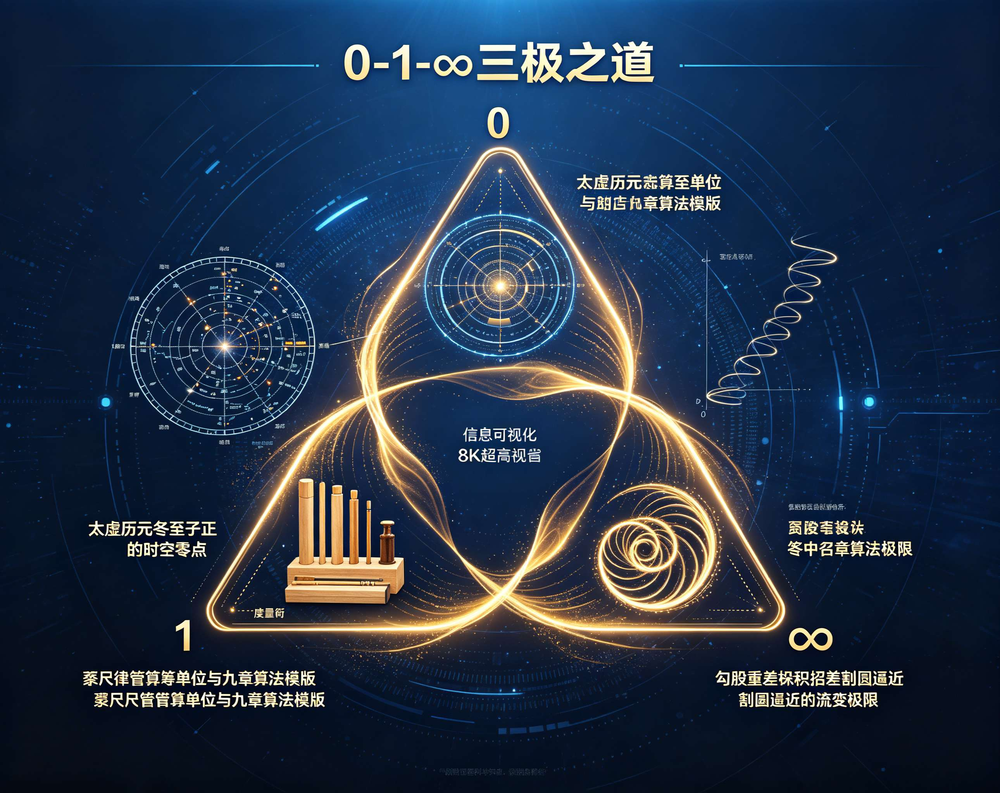
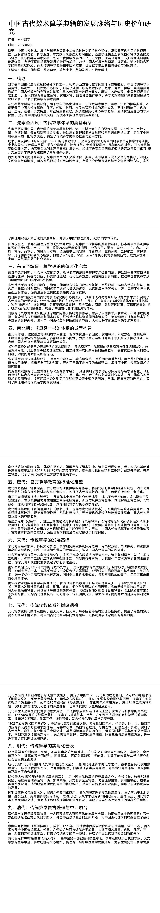
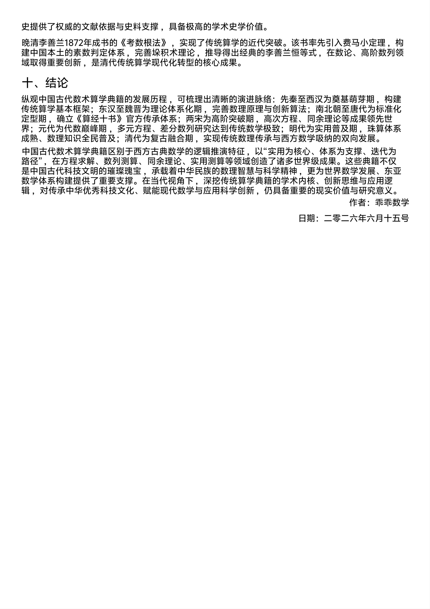

<ArchiveCopyPanel article-id="162107924" />

{"markdown":"PiDliIbnsbvvvJrmlbDmnK/lt6XlnYogIAo+IOe8luWPt++8mmAxNjIxMDc5MjRgICAKPiDljp/lp4vmlofku7bvvJpg5Lit5Zu95Y+k5Luj5pWw5pyv566X5a2m5YW457GN55qE5Y+R5bGV6ISJ57uc5LiO5Y6G5Y+y5Lu35YC856CU56m2LeWFqOWfn+aVsOWtpuS4reWbveeul+WtpuWPsue6si0xNjIxMDc5MjQubWRgICAKPiDov5Tlm57vvJpb5pys5Lmm5b2S5qGjXSgvemgvYm9va3Mvc2h1c2h1L2FydGljbGVzLykgwrcgW+aAu+WFpeWPo10oL3poL2Jvb2tzL2FydGljbGVzLykKCiMjIOS4reWbveWPpOS7o+aVsOacr+eul+WtpuWFuOexjeeahOWPkeWxleiEiee7nOS4juWOhuWPsuS7t+WAvOeglOepti3lhajln5/mlbDlrabCt+S4reWbveeul+WtpuWPsue6sgoKIVtpbWFnZV0oLi9hc3NldHMvY3NkbmltZy9qcGcvOWI1MzhkZTBjZjJkNzkyNi5qcGcpCgrkuZbkuZbmlbDlraYg6JGXCgrniYjmnKzvvJpWMjAyNi42LjE1CgotLS0KCiMjIyDkuIDjgIHkvZPns7vlrprkvY3kuI7kuIDlj6Xor53mgLvnu5MKCuS4reWbveWPpOS7o+eul+WtpuS5i+aJgOS7pemVv+acnyDigJzph43lrp7nlKjjgIHovbvlhazorr7igJ3vvIzlubbpnZ7mlrnms5XorrrnvLrpmbfvvIzogIzmmK/lm6DkuLrlroPml6nmnJ/nmoTmnI3liqHlr7nosaHmmK/lpKnmlofljobms5Ug4oCUIOWbveWcn+S4iOmHjyDigJQg6LWL5b255bel56iL6L+Z5LiA5aWX5Zu95a625bC65bqm5rWB5Y+Y57O757uf77yb44CK5ZGo6auA44CL44CK5Lmd56ug44CL5Y+K5YW25ZCO5a2m6LWw55qE5LiN5pivIEV1Y2xpZCDnmoQg4oCc54K557q/6Z2i5YWs55CG5YyW4oCd77yM6ICM5pivIOKAnOaVsCDigJQg5b2iIOKAlCDljoYg4oCUIOW+i+WQjOa6kOKAnSDnmoTnrpfms5XljJblt6XnqIvlrabjgIIKCi0gCgowMDDvvJrlpKromZogLyDljoblhYMgLyDlhqzoh7PlrZDmraPov5nnp40g4oCc5Y+v6YeN572u55qE5pe256m66Zu254K54oCd77yI5LiN5piv55yf56m677yM6ICM5piv5Y6G5rOVIOKAlCDlpKnmlofnmoTlvZLpm7boo4Xnva7vvIkKCi0gCgoxMTHvvJrpu40gLyDlsLogLyDlvovnrqEgLyDnrpfnrbnljZXkvY3kuI7jgIrkuZ3nq6DjgIvkuZ3nsbvmqKHniYjvvIjlrprlvaLln7rlh4bkuI7lj6/lpI3nlKjnrpfms5XvvIkKCi0gCgotLS0KCiFbaW1hZ2VdKC4vYXNzZXRzL2NzZG5pbWcvanBnLzRmMTZlZjZhMWM2ZmRmOTMuanBnKQoK5LiJ5p6B5LmL6YGT5p6E5oiQ5LqG5Lit5Zu9566X5a2m5L2T57O755qE5bqV5bGC6YC76L6R77yaCgrov5nkuIDpl63njq/ns7vnu5/mnoTmiJDkuobkuI7mrKfmsI/lh6DkvZXlhaznkIbljJbkvZPns7vlrozlhajkuI3lkIzkvYblkIzmoLfkuKXosKjnmoTnp5HlrabnkIbmgKfojIPlvI/jgIIKCi0tLQoKIyMjIOS4ieOAgeWFq+mYtuauteWPsuiEieS4juS4ieaegeinkuiJsuWvueaOpQoKIVtpbWFnZV0oLi9hc3NldHMvY3NkbmltZy9qcGcvZGY0ZDg5YWE5ZWJkYTU1ZC5qcGcpCgotLS0KCiMjIyDlm5vjgIHmoLjlv4PlhbjnsY3nmoTkuInmnoHor7vms5UKCiMjIyMgNC4xIOOAiuS5neeroOeul+acr+OAi++8mjExMeeahOeZvuenkeWFqOS5pgoK44CK5Lmd56ug566X5pyv44CL5piv5Lit5Zu9566X5a2m5L2T57O755qE5Z+655+z77yM5a6D5p6E5bu65LqG77yaCgrmr4/kuIDnsbvpg73mmK/lj6/lpI3nlKjnmoTmoIflh4bljJbnrpfms5XljZXlhYPvvIzmnoTmiJDkuobkuK3lm73nrpflrabnmoQxMTHln7rlh4bjgIIKCiMjIyMgNC4yIOWImOW+veOAiuS5neeroOeul+acr+azqOOAi++8mjAwMOeahOmAvOi/keazlQoK5YiY5b695Ymy5ZyG5pyv55qE5pys6LSo5piv77yaCgrmnLHkuJbmnbDlm5vlhYPmnK/lrp7njrDkuobvvJoKCi0tLQoKIyMjIOS6lOOAgeS9k+ezu+WumuS9jeiuqOiuuu+8muS4uuS7gOS5iOS4reWbveayoemVv+WHuiBFdWNsaWQg5byP5YWs55CG57O757uf77yfCgrkuI3mmK/og73lipvkuI3otrPvvIzogIzmmK/pl67popjln5/kuI3lkIzjgIIKCuS4reWbveeul+WtpueahOWvueaJi+S4jeaYryDigJzngrnnur/pnaLnmoTlrprkuYnigJ3vvIzogIzmmK8g4oCc5bKB5a6eIC8g5pyU562WIC8g55Sw5LqpIC8g5rig5aCwIC8g6LWL5b254oCdIOi/meWll+WbveWutua1geWPmOWcuuOAggoK5omA5Lul5a6D5oqK5YWs55CG6JeP5Zyo77yaCgrogIzkuI3mmK/ol4/lnKgg4oCc5bmz6KGM5YWs6K6+4oCdIOmHjOOAggoK6L+Z5p6E5oiQ5LqG5Y+m5LiA56eN56eR5a2m55CG5oCn77yaCgotIAoK5qyn5byP5Yeg5L2V77ya5LuO5YWs55CG5Ye65Y+R55qE5ryU57uO57O757ufCgotIAoK5Lit5Zu9566X5a2m77ya5LuO5bel56iL5Ye65Y+R55qE566X5rOV57O757ufCgrkuozogIXmmK/kurrnsbvmlbDlrabmlofmmI7nmoTkuKTmnaHlubPooYzot6/lvoTvvIzkuI3lrZjlnKgg4oCc6JC95ZCOIOKAlCDov5vmraXigJ0g55qE57q/5oCn5Y+Z5LqL44CCCgotLS0KCiMjIyMgNi4xIOWImOW+veWJsuWchuacrwoKIyMjIyA2LjIg6LS+5a6q5LiJ6KeSIC8g5aKe5LmY5byA5pa5CgojIyMjIDYuMyDmnLHkuJbmnbDlm5vlhYPmnK8KCi0tLQoKIyMjIOS4g+OAgee7k+ivrQoK5LuK5aSp77yM5b2T5oiR5Lus55So5YWo5Z+f5pWw5a2m55qE5LiJ5p6B5LmL6YGT6YeN5paw5a6h6KeG5Lit5Zu9566X5a2m5Y+y77yM5oiR5Lus55yL5Yiw55qE5LiN5piv5LiA5LiqIOKAnOacquiDvemVv+WHuuWFrOeQhuWMluKAnSDnmoTpgZfmhr7mlYXkuovvvIzogIzmmK/kuIDkuKrmjIHnu63ov5DooYzkuKTljYPlpJrlubTnmoTnrpfms5XljJblt6XnqIvlrablpYfov7njgIIKCui/meWwseaYr+S4reWbveWPpOS7o+aVsOacr+eul+WtpueahOecn+ato+S7t+WAvO+8muWug+S4uuS6uuexu+aWh+aYjuaPkOS+m+S6huWFrOeQhuWMluS5i+WklueahOWPpuS4gOadoeaVsOWtpumBk+i3ryDigJTigJQg5LiA5p2h5LuO5bel56iL5Ye65Y+R44CB5pyN5Yqh5Zu95a6244CB6L+t5Luj6L+b5YyW55qE566X5rOV5LmL6Lev44CCCgotLS0KCiFbaW1hZ2VdKC4vYXNzZXRzL2NzZG5pbWcvanBnLzUyNjY0MWUwMDBmNzVjNjUuanBnKQoKIVtpbWFnZV0oLi9hc3NldHMvY3NkbmltZy9qcGcvYmVhMDlmZjk0NzJlYWMyOC5qcGcpCg==","text":"5YiG57G777ya5pWw5pyv5bel5Z2KICAK57yW5Y+377yaMTYyMTA3OTI0ICAK5Y6f5aeL5paH5Lu277ya5Lit5Zu95Y+k5Luj5pWw5pyv566X5a2m5YW457GN55qE5Y+R5bGV6ISJ57uc5LiO5Y6G5Y+y5Lu35YC856CU56m2LeWFqOWfn+aVsOWtpuS4reWbveeul+WtpuWPsue6si0xNjIxMDc5MjQubWQgIArov5Tlm57vvJrmnKzkuablvZLmoaMgwrcg5oC75YWl5Y+jCgrkuK3lm73lj6Tku6PmlbDmnK/nrpflrablhbjnsY3nmoTlj5HlsZXohInnu5zkuI7ljoblj7Lku7flgLznoJTnqbYt5YWo5Z+f5pWw5a2mwrfkuK3lm73nrpflrablj7LnurIKCmltYWdlCgrkuZbkuZbmlbDlraYg6JGXCgrniYjmnKzvvJpWMjAyNi42LjE1CgotLS0KCuS4gOOAgeS9k+ezu+WumuS9jeS4juS4gOWPpeivneaAu+e7kwoK5Lit5Zu95Y+k5Luj566X5a2m5LmL5omA5Lul6ZW/5pyfIOKAnOmHjeWunueUqOOAgei9u+WFrOiuvuKAne+8jOW5tumdnuaWueazleiuuue8uumZt++8jOiAjOaYr+WboOS4uuWug+aXqeacn+eahOacjeWKoeWvueixoeaYr+WkqeaWh+WOhuazlSDigJQg5Zu95Zyf5LiI6YePIOKAlCDotYvlvbnlt6XnqIvov5nkuIDlpZflm73lrrblsLrluqbmtYHlj5jns7vnu5/vvJvjgIrlkajpq4DjgIvjgIrkuZ3nq6DjgIvlj4rlhbblkI7lrabotbDnmoTkuI3mmK8gRXVjbGlkIOeahCDigJzngrnnur/pnaLlhaznkIbljJbigJ3vvIzogIzmmK8g4oCc5pWwIOKAlCDlvaIg4oCUIOWOhiDigJQg5b6L5ZCM5rqQ4oCdIOeahOeul+azleWMluW3peeoi+WtpuOAggowMDDvvJrlpKromZogLyDljoblhYMgLyDlhqzoh7PlrZDmraPov5nnp40g4oCc5Y+v6YeN572u55qE5pe256m66Zu254K54oCd77yI5LiN5piv55yf56m677yM6ICM5piv5Y6G5rOVIOKAlCDlpKnmlofnmoTlvZLpm7boo4Xnva7vvIkKMTEx77ya6buNIC8g5bC6IC8g5b6L566hIC8g566X56255Y2V5L2N5LiO44CK5Lmd56ug44CL5Lmd57G75qih54mI77yI5a6a5b2i5Z+65YeG5LiO5Y+v5aSN55So566X5rOV77yJCi0tLQoKaW1hZ2UKCuS4ieaegeS5i+mBk+aehOaIkOS6huS4reWbveeul+WtpuS9k+ezu+eahOW6leWxgumAu+i+ke+8mgoK6L+Z5LiA6Zet546v57O757uf5p6E5oiQ5LqG5LiO5qyn5rCP5Yeg5L2V5YWs55CG5YyW5L2T57O75a6M5YWo5LiN5ZCM5L2G5ZCM5qC35Lil6LCo55qE56eR5a2m55CG5oCn6IyD5byP44CCCgotLS0KCuS4ieOAgeWFq+mYtuauteWPsuiEieS4juS4ieaegeinkuiJsuWvueaOpQoKaW1hZ2UKCi0tLQoK5Zub44CB5qC45b+D5YW457GN55qE5LiJ5p6B6K+75rOVCgo0LjEg44CK5Lmd56ug566X5pyv44CL77yaMTEx55qE55m+56eR5YWo5LmmCgrjgIrkuZ3nq6DnrpfmnK/jgIvmmK/kuK3lm73nrpflrabkvZPns7vnmoTln7rnn7PvvIzlroPmnoTlu7rkuobvvJoKCuavj+S4gOexu+mDveaYr+WPr+WkjeeUqOeahOagh+WHhuWMlueul+azleWNleWFg++8jOaehOaIkOS6huS4reWbveeul+WtpueahDExMeWfuuWHhuOAggoKNC4yIOWImOW+veOAiuS5neeroOeul+acr+azqOOAi++8mjAwMOeahOmAvOi/keazlQoK5YiY5b695Ymy5ZyG5pyv55qE5pys6LSo5piv77yaCgrmnLHkuJbmnbDlm5vlhYPmnK/lrp7njrDkuobvvJoKCi0tLQoK5LqU44CB5L2T57O75a6a5L2N6K6o6K6677ya5Li65LuA5LmI5Lit5Zu95rKh6ZW/5Ye6IEV1Y2xpZCDlvI/lhaznkIbns7vnu5/vvJ8KCuS4jeaYr+iDveWKm+S4jei2s++8jOiAjOaYr+mXrumimOWfn+S4jeWQjOOAggoK5Lit5Zu9566X5a2m55qE5a+55omL5LiN5pivIOKAnOeCuee6v+mdoueahOWumuS5ieKAne+8jOiAjOaYryDigJzlsoHlrp4gLyDmnJTnrZYgLyDnlLDkuqkgLyDmuKDloLAgLyDotYvlvbnigJ0g6L+Z5aWX5Zu95a625rWB5Y+Y5Zy644CCCgrmiYDku6XlroPmiorlhaznkIbol4/lnKjvvJoKCuiAjOS4jeaYr+iXj+WcqCDigJzlubPooYzlhazorr7igJ0g6YeM44CCCgrov5nmnoTmiJDkuoblj6bkuIDnp43np5HlrabnkIbmgKfvvJoK5qyn5byP5Yeg5L2V77ya5LuO5YWs55CG5Ye65Y+R55qE5ryU57uO57O757ufCuS4reWbveeul+Wtpu+8muS7juW3peeoi+WHuuWPkeeahOeul+azleezu+e7nwoK5LqM6ICF5piv5Lq657G75pWw5a2m5paH5piO55qE5Lik5p2h5bmz6KGM6Lev5b6E77yM5LiN5a2Y5ZyoIOKAnOiQveWQjiDigJQg6L+b5q2l4oCdIOeahOe6v+aAp+WPmeS6i+OAggoKLS0tCgo2LjEg5YiY5b695Ymy5ZyG5pyvCgo2LjIg6LS+5a6q5LiJ6KeSIC8g5aKe5LmY5byA5pa5Cgo2LjMg5pyx5LiW5p2w5Zub5YWD5pyvCgotLS0KCuS4g+OAgee7k+ivrQoK5LuK5aSp77yM5b2T5oiR5Lus55So5YWo5Z+f5pWw5a2m55qE5LiJ5p6B5LmL6YGT6YeN5paw5a6h6KeG5Lit5Zu9566X5a2m5Y+y77yM5oiR5Lus55yL5Yiw55qE5LiN5piv5LiA5LiqIOKAnOacquiDvemVv+WHuuWFrOeQhuWMluKAnSDnmoTpgZfmhr7mlYXkuovvvIzogIzmmK/kuIDkuKrmjIHnu63ov5DooYzkuKTljYPlpJrlubTnmoTnrpfms5XljJblt6XnqIvlrablpYfov7njgIIKCui/meWwseaYr+S4reWbveWPpOS7o+aVsOacr+eul+WtpueahOecn+ato+S7t+WAvO+8muWug+S4uuS6uuexu+aWh+aYjuaPkOS+m+S6huWFrOeQhuWMluS5i+WklueahOWPpuS4gOadoeaVsOWtpumBk+i3ryDigJTigJQg5LiA5p2h5LuO5bel56iL5Ye65Y+R44CB5pyN5Yqh5Zu95a6244CB6L+t5Luj6L+b5YyW55qE566X5rOV5LmL6Lev44CCCgotLS0KCmltYWdlCgppbWFnZQ=="}

> 分类：数术工坊  
> 编号：`162107924`  
> 原始文件：`中国古代数术算学典籍的发展脉络与历史价值研究-全域数学中国算学史纲-162107924.md`  
> 返回：[本书归档](/zh/books/shushu/articles/) · [总入口](/zh/books/articles/)

<ArticlePaperMeta category="数术工坊" article-id="162107924" title="中国古代数术算学典籍的发展脉络与历史价值研究-全域数学中国算学史纲" paper-kind="专题文稿" book-route="/zh/books/shushu/articles/" overview-route="/zh/books/articles/" summary="中国古代算学之所以长期 “重实用、轻公设”，并非方法论缺陷，而是因为它早期的服务对象是天文历法 — 国土丈量 — 赋役工程这一套国家尺度流变系统；《周髀》《九章》及其后学走的不是 Euclid 的 “点线面公理化”，而是 “数 — 形 — 历 — 律同源” 的算法化工程学。" author="乖乖数学" source-file="中国古代数术算学典籍的发展脉络与历史价值研究-全域数学中国算学史纲-162107924.md" cover="./assets/csdnimg/jpg/9b538de0cf2d7926.jpg" />

## 中国古代数术算学典籍的发展脉络与历史价值研究-全域数学·中国算学史纲

乖乖数学 著

版本：V2026.6.15

---

### 一、体系定位与一句话总结

中国古代算学之所以长期 “重实用、轻公设”，并非方法论缺陷，而是因为它早期的服务对象是天文历法 — 国土丈量 — 赋役工程这一套国家尺度流变系统；《周髀》《九章》及其后学走的不是 Euclid 的 “点线面公理化”，而是 “数 — 形 — 历 — 律同源” 的算法化工程学。

- 

000：太虚 / 历元 / 冬至子正这种 “可重置的时空零点”（不是真空，而是历法 — 天文的归零装置）

- 

111：黍 / 尺 / 律管 / 算筹单位与《九章》九类模版（定形基准与可复用算法）

- 

---

三极之道构成了中国算学体系的底层逻辑：

这一闭环系统构成了与欧氏几何公理化体系完全不同但同样严谨的科学理性范式。

---

### 三、八阶段史脉与三极角色对接

---

### 四、核心典籍的三极读法

#### 4.1 《九章算术》：111的百科全书

《九章算术》是中国算学体系的基石，它构建了：

每一类都是可复用的标准化算法单元，构成了中国算学的111基准。

#### 4.2 刘徽《九章算术注》：000的逼近法

刘徽割圆术的本质是：

朱世杰四元术实现了：

---

### 五、体系定位讨论：为什么中国没长出 Euclid 式公理系统？

不是能力不足，而是问题域不同。

中国算学的对手不是 “点线面的定义”，而是 “岁实 / 朔策 / 田亩 / 渠堰 / 赋役” 这套国家流变场。

所以它把公理藏在：

而不是藏在 “平行公设” 里。

这构成了另一种科学理性：

- 

欧式几何：从公理出发的演绎系统

- 

中国算学：从工程出发的算法系统

二者是人类数学文明的两条平行路径，不存在 “落后 — 进步” 的线性叙事。

---

#### 6.1 刘徽割圆术

#### 6.2 贾宪三角 / 增乘开方

#### 6.3 朱世杰四元术

---

### 七、结语

今天，当我们用全域数学的三极之道重新审视中国算学史，我们看到的不是一个 “未能长出公理化” 的遗憾故事，而是一个持续运行两千多年的算法化工程学奇迹。

这就是中国古代数术算学的真正价值：它为人类文明提供了公理化之外的另一条数学道路 —— 一条从工程出发、服务国家、迭代进化的算法之路。

---

